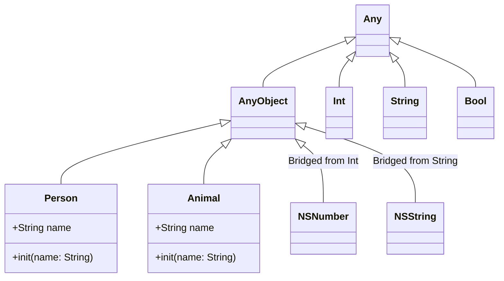
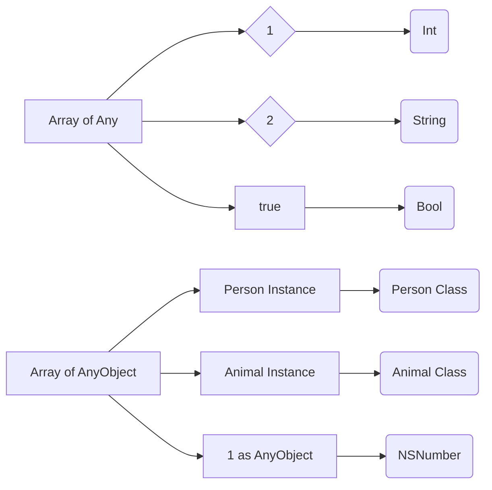
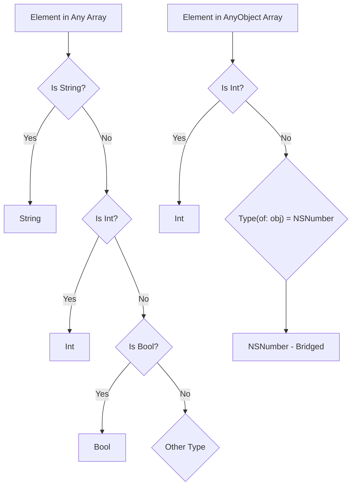
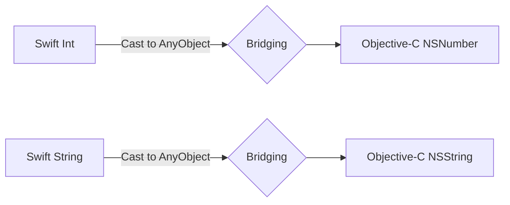

# Any or AnyObject in Swift
> This content is dual-licensed under your choice of the following licenses:
> 1.  **MIT License:** For the code implementations in Swift and Mermaid provided in this document.
> 2.  **Creative Commons Attribution 4.0 International License (CC BY 4.0):** For all other content, including the text, explanations, and the Mermaid diagrams and illustrations.

---

Below is a set of Mermaid diagrams to visually explain `Any` and `AnyObject` in Swift.

## Diagram 1: Type Hierarchy

This diagram illustrates the relationship between `Any`, `AnyObject`, concrete types (like `Person`, `Animal`, `Int`, `String`, `Bool`), and bridged Objective-C types (like `NSNumber` and `NSString`).

## Diagram 2: Array Storage

This diagram shows how different types can be stored in arrays of `Any` and `AnyObject`, highlighting the bridging behavior.

## Diagram 3:  Type Casting and Identification

This diagram demonstrates how to use `is` to check types within an `Any` array and the bridging that occurs when value types are cast to `AnyObject`.

## Diagram 4:  Bridging in Detail

This diagram specifically focuses on the bridging process from Swift value types to Objective-C reference types.

---
