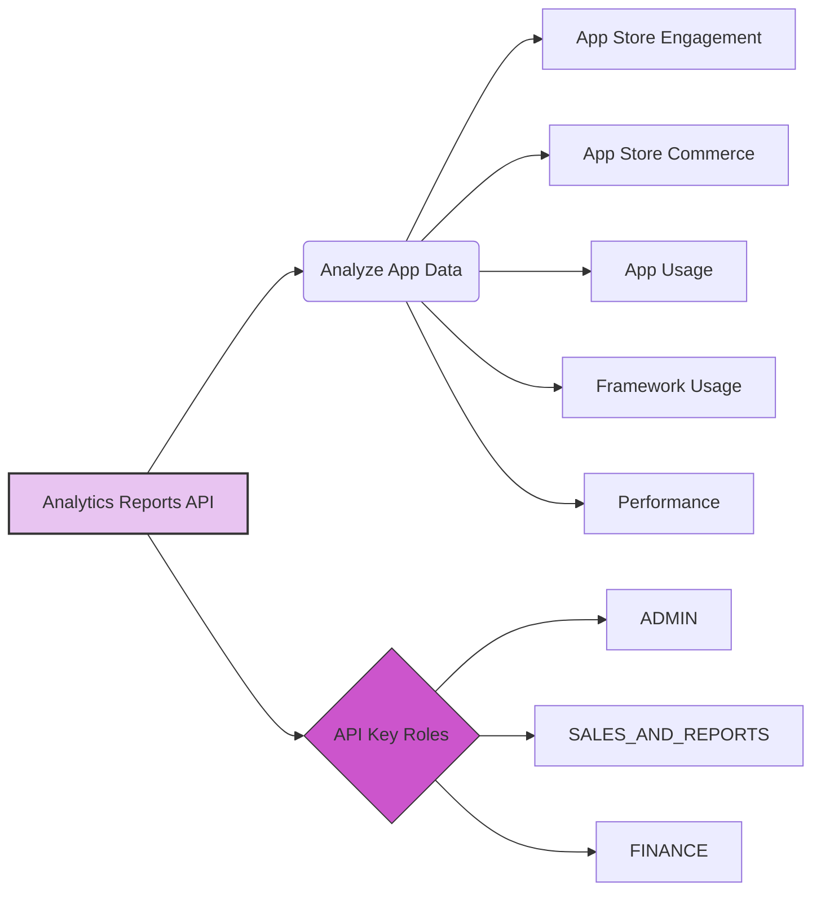
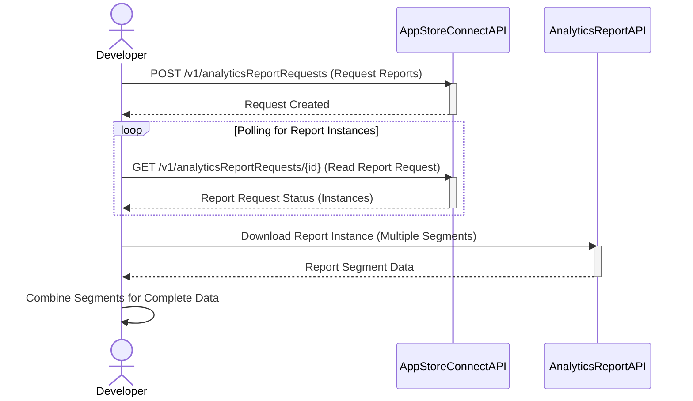
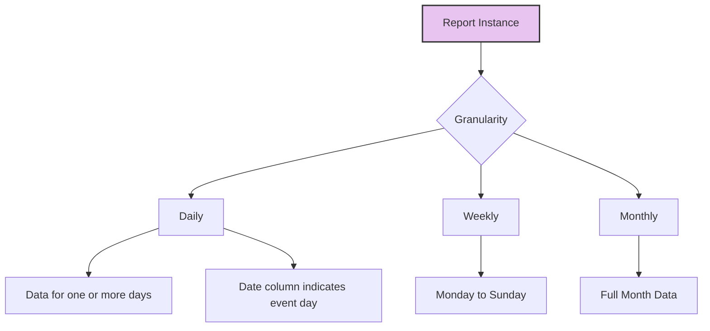
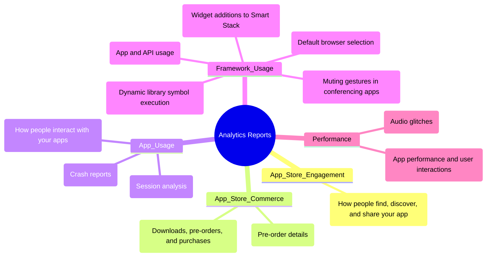
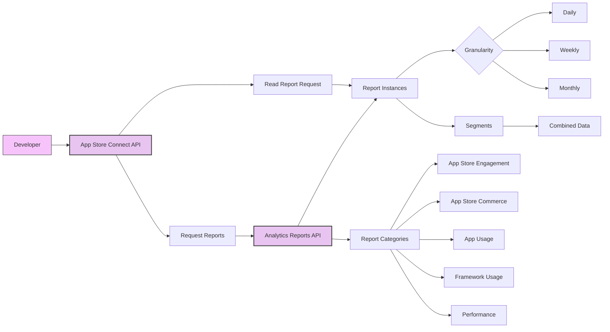
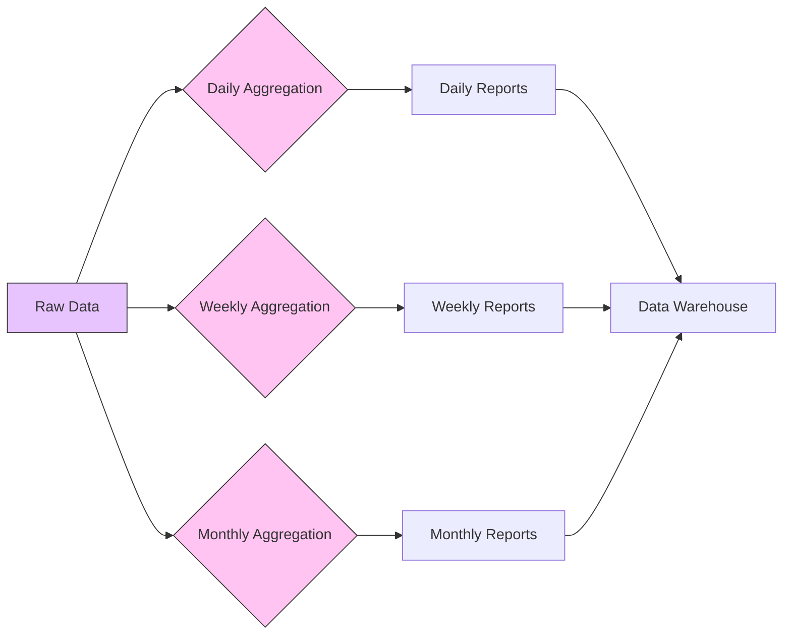

# Analytics Reports - A Diagrammatical Summary
> **Disclaimer:**
>
> This document contains my personal notes on the topic,
> compiled from publicly available documentation and various cited sources.
> The materials are intended for educational purposes, personal study, and reference.
> The content is dual-licensed:
> 1. **MIT License:** Applies to all code implementations (Swift, Mermaid, and other programming languages).
> 2. **Creative Commons Attribution 4.0 International License (CC BY 4.0):** Applies to all non-code content, including text, explanations, diagrams, and illustrations.
---

## 1. Overview and Access Control

This diagram illustrates the core purpose of the API and the roles that have access to it.

**Explanation:**

*   The **Analytics Reports API** (A) allows analysis of app data (B) across various categories.
*   Access is controlled through API Key Roles (C), specifically `ADMIN`, `SALES_AND_REPORTS`, and `FINANCE`.

----

## 2. Report Downloading and Processing

This sequence diagram depicts the steps involved in requesting, downloading, and processing reports.

**Explanation:**

1.  The **Developer** initiates a report request via the App Store Connect API (`POST /v1/analyticsReportRequests`).
2.  The developer then *polls* the API (`GET /v1/analyticsReportRequests/{id}`) to check for the availability of report *instances*.  This is a crucial step; reports aren't generated until requested.
3.  Once an instance is available, the **Developer** downloads it from the Analytics Report API.  Crucially, each instance might be split into *segments*, requiring multiple downloads.
4.  The **Developer** combines the segments to get the complete data set for that instance.

----

## 3. Report Granularity and Data Completeness

This diagram shows how report instances are grouped by time.

**Explanation:**

*   Each **Report Instance** (A) has a specific **Granularity** (B):
    *   **Daily** (B1):  May contain data for one *or more* days.  The "Date" column in the report specifies the day of the events.
    *   **Weekly** (B2): Always covers Monday to Sunday.
    *   **Monthly** (B3): Covers a complete calendar month.

----

## 4. Report Structure and Schema Changes

This section uses a simple table and a note to emphasize key points about report structure and future changes.

| Column Name | Description                                        | Data Type    |
| :---------- | :------------------------------------------------- | :----------- |
| Date        | Date of the event                                  | Date         |
| Metric1     | Description of the first metric...                  | Numeric/Text |
| Metric2     | Description of the second metric...                 | Numeric/Text |
| ...         | ...                                                | ...          |

**Important Note:**  The documentation emphasizes relying on *column names* rather than *column positions* because the positions might change in future updates.  Report values are *not* case-sensitive. This is crucial for robust data processing.

----

## 5. Report Categories and Specific Reports

This mind map provides a hierarchical view of the different report categories and some example specific reports.

**Explanation:**

This mind map organizes the reports into five main categories:

*   **App Store Engagement:**  Discovery and sharing.
*   **App Store Commerce:**  Purchases and downloads.
*   **App Usage:**  User interaction (sessions, crashes).
*   **Framework Usage:**  How the app interacts with system APIs and frameworks.
*   **Performance:**  Metrics related to app performance (e.g., audio glitches).

Within each category, specific reports are listed (e.g., "App Crashes" under "App Usage").

----

## 6. Combined Conceptual Diagram

This combines some of the previous concepts into a single, more comprehensive diagram:

This diagram shows the flow from the developer requesting reports, through the APIs, to the final combined data, and also includes the report categories.

---

## 7. Data Flow Visualization

This diagram illustrates the data flow with different granularities in a data pipeline-like visualization:

**Explanation:**
This diagram visually explains how the API handles different time frames, and uses a conceptual "Data Warehouse" to represent where the aggregated data is stored for further analysis.

---
**Licenses:**

- **MIT License:**   - Full text in [LICENSE](LICENSE) file.
- **Creative Commons Attribution 4.0 International:**  - Legal details in [LICENSE-CC-BY](LICENSE-CC-BY) and at [Creative Commons official site](http://creativecommons.org/licenses/by/4.0/).

---