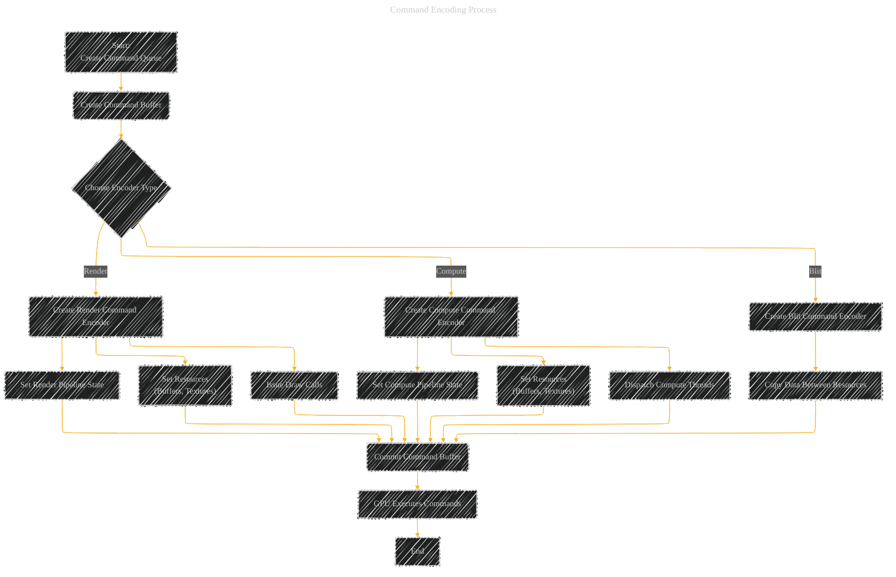

# Metal Framework - A Diagrammatical Summary
> **Disclaimer:**
>
> This document contains my personal notes on the topic,
> compiled from publicly available documentation and various cited sources.
> The materials are intended for educational purposes, personal study, and reference.
> The content is dual-licensed:
> 1. **MIT License:** Applies to all code implementations (Swift, Mermaid, and other programming languages).
> 2. **Creative Commons Attribution 4.0 International License (CC BY 4.0):** Applies to all non-code content, including text, explanations, diagrams, and illustrations.
---


## 1. High-Level Overview (Mind Map)

This mind map provides a top-down view of the Metal framework and its relationship with other Apple technologies.


**Key Takeaways from Mind Map:**

*   **Direct GPU Control:**  Metal's core purpose is highlighted.
*   **Performance Focus:**  The emphasis on speed and efficiency.
*   **Framework Ecosystem:** Shows how Metal interacts with other frameworks.
*   **High-Level vs. Low-Level:**  Illustrates the option of using higher-level frameworks *or* diving into custom Metal code.
*   **Comprehensive Topics:**  Breaks down the major areas within the Metal documentation.

----

## 2. Command Encoding Process (Flowchart)

This flowchart visualizes the typical flow of sending work to the GPU using Metal's command encoding mechanism.



**Key Takeaways from Flowchart:**

*   **Command Queue and Buffer:**  The fundamental objects for managing GPU work.
*   **Encoder Types:**  The choice between render, compute, and blit operations.
*   **Pipeline State:**  Setting up the GPU's configuration before issuing commands.
*   **Resource Binding:**  Providing the data (buffers, textures) that the GPU will operate on.
*   **Draw/Dispatch/Copy Commands:** The actual instructions sent to the GPU.
*   **Commit and Execution:**  The process of finalizing the command buffer and sending it to the GPU for execution.

----

## 3. Resource Management (Conceptual Illustration)

This section uses a combination of text and a conceptual diagram to explain Metal's resource management.

**Conceptual Diagram (Illustrative - Not Mermaid):**

```
+-------------------------------------+
|         CPU (Application)          |
+-------------------------------------+
|   |  Swift/Objective-C Code    |   |
|   +---------------------------+   |
|   |  Metal API Calls          |   |
|   +---------------------------+   |
|         |                       |
|         v                       |
+-------------------------------------+
|       GPU (Metal Framework)        |
+-------------------------------------+
|   +-----------+   +-----------+   |
|   |  Buffers  |   | Textures  |   |  <-- Data stored in GPU memory
|   +-----------+   +-----------+   |
|         ^                       |
|         |                       |
|   +---------------------------+   |
|   |  Command Encoders         |   |  <-- Instructions to operate on data
|   +---------------------------+   |
|         |                       |
|         v                       |
|   +---------------------------+   |
|   |  Shader Execution Units   |   |  <--  Metal Shading Language code runs here
|   +---------------------------+   |
+-------------------------------------+
```

**Explanation:**

*   **CPU (Application):**  Your application code, written in Swift or Objective-C, uses the Metal API to interact with the GPU.
*   **GPU (Metal Framework):** The GPU's memory stores data in **buffers** (untyped) and **textures** (typed).
*   **Command Encoders:**  These objects (created on the CPU) define the operations the GPU will perform on the resources.
*   **Shader Execution Units:**  This is where your **Metal Shading Language (MSL)** code runs.  MSL is a C++-based language specifically designed for GPU programming. This is a crucial point where different programming languages come into play.

**Mixed-Language Aspect:**

The interaction between your CPU code (Swift/Objective-C) and GPU code (MSL) is a key aspect of Metal development.  You define the data structures and overall control flow on the CPU, but the highly parallel computations and rendering happen in MSL on the GPU.

---

## 4.  Shader Interaction (Sequence Diagram)

This sequence diagram shows how the CPU interacts with a shader on the GPU.


**Key Takeaways from Sequence Diagram:**

*   **CPU Orchestration:** The CPU sets up everything, but the GPU does the heavy lifting.
*   **Shader as a Function:**  The shader (written in MSL) acts like a function called by the GPU.
*   **Resource Access:** The shader reads from and writes to the resources provided by the CPU.
*   **Asynchronous Execution:**  The GPU execution is often asynchronous; the CPU can continue working while the GPU is processing.

---

## 5. Apple Silicon Considerations (Conceptual Text)

The documentation mentions "Apple Silicon."  This is important because Apple Silicon GPUs have a *unified memory architecture*.

**Conceptual Explanation:**

*   **Traditional GPUs:**  Have their own dedicated memory (VRAM). Data needs to be explicitly copied between CPU memory and GPU memory.
*   **Apple Silicon GPUs:**  Share memory with the CPU. This eliminates the need for explicit data copies, potentially leading to significant performance improvements.  However, it also requires careful resource management to avoid conflicts between CPU and GPU access.

**Illustrative (Not Mermaid):**

```
Traditional:
+-------+      +-------+
|  CPU  |------|  GPU  |
| Memory|      | VRAM  |
+-------+      +-------+
   |             ^
   |  Data Copy  |
   v             |

Apple Silicon:
+---------------------+
|     CPU & GPU      |
|   Shared Memory    |
+---------------------+
   <-- No Data Copy -->
```

-----

## 6.  Metal Debugger (Conceptual Text)

The "Developer Tools" section highlights the Metal Debugger.  This is a crucial tool for understanding and optimizing Metal code.

**Conceptual Explanation:**

*   **API Call Inspection:**  See exactly which Metal API calls your application is making.
*   **Shader Debugging:**  Step through your MSL code, inspect variables, and identify errors.
*   **Resource Inspection:**  Examine the contents of buffers and textures at different points in time.
*   **Performance Analysis:**  Identify bottlenecks and areas for optimization.

This is similar in concept to using Xcode's debugger for Swift/Objective-C, but it's specifically tailored for GPU-related code and data.

---

## 7.  HDR Content (Conceptual Text)

This section emphasizes Metal's ability to handle High Dynamic Range (HDR) content.

**Conceptual Explanation:**

*   **Wider Color Gamut:**  HDR allows for a much broader range of colors than standard dynamic range (SDR).
*   **Increased Brightness and Contrast:**  HDR images can have brighter highlights and darker shadows, leading to a more realistic and visually striking appearance.
*   **Metal Support:** Metal provides the necessary APIs to work with HDR pixel formats and color spaces.

This is about leveraging the capabilities of modern displays to create more visually impressive graphics.


---
**Licenses:**

- **MIT License:**  [](LICENSE) - Full text in [LICENSE](LICENSE) file.
- **Creative Commons Attribution 4.0 International:** [](LICENSE-CC-BY) - Legal details in [LICENSE-CC-BY](LICENSE-CC-BY) and at [Creative Commons official site](http://creativecommons.org/licenses/by/4.0/).

---