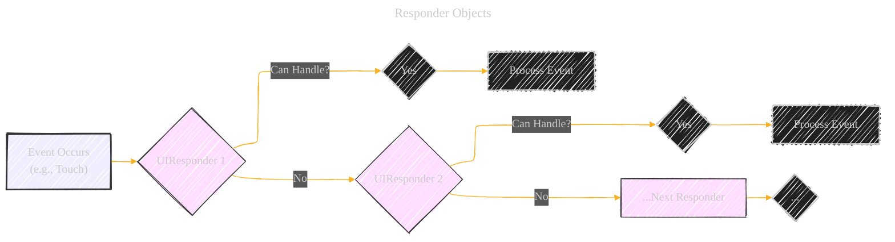
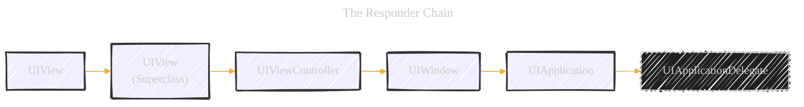
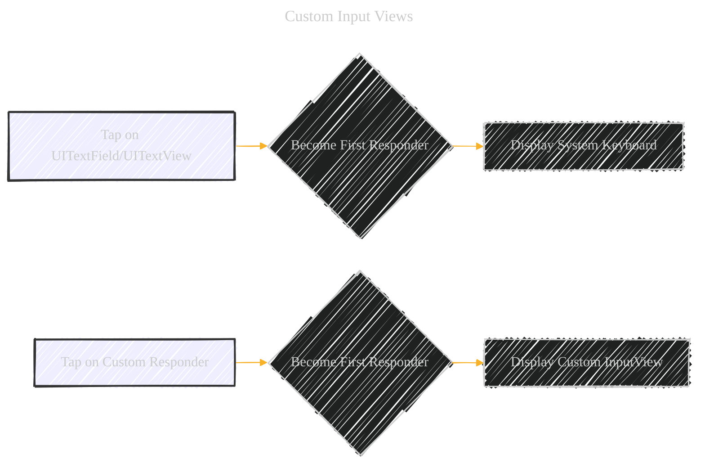

# UIResponder - A Diagrammatical Summary
> **Disclaimer:**
>
> This document contains my personal notes on the topic,
> compiled from publicly available documentation and various cited sources.
> The materials are intended for educational purposes, personal study, and reference.
> The content is dual-licensed:
> 1. **MIT License:** Applies to all code implementations (Swift, Mermaid, and other programming languages).
> 2. **Creative Commons Attribution 4.0 International License (CC BY 4.0):** Applies to all non-code content, including text, explanations, diagrams, and illustrations.
---


## 1. Core Concept: Responder Objects

**Conceptual Illustration:**

Imagine a relay race.  Each runner (a `UIResponder` instance) is responsible for carrying the baton (an event) for a certain distance.  If they can handle the baton (process the event), they do so. If not, they pass it to the next runner in line (the next responder in the chain).

**Mermaid Diagram (Flowchart):**




**Explanation:**

*   **Event Occurs:**  The starting point. This could be a touch, a motion, a remote control press, etc.
*   **UIResponder 1, 2, ...:**  Instances of `UIResponder` (e.g., `UIView`, `UIViewController`, `UIApplication`).
*   **Can Handle?:**  Each responder checks if it has the methods implemented to handle the specific event type.
*   **Process Event:** If the responder can handle the event, it executes its corresponding methods (e.g., `touchesBegan`, `touchesMoved`).
*   **...Next Responder:** If a responder cannot handle the event, it passes it along the responder chain.

---

## 2. Types of Events

**Conceptual Illustration:**

Think of different types of mail:  letters (touch events), packages (motion events), special delivery notices (remote-control events), and certified mail (press events). Each requires a different way of handling.

**Mermaid Diagram (Mind Map):**


**Explanation:**

*   The mind map visually categorizes the different types of events that `UIResponder` can handle.
*   Each branch represents a category, and sub-branches list the specific methods associated with that event type.

---

## 3. The Responder Chain

**Conceptual Illustration:**

Imagine a chain of command in an organization.  A request (event) comes in.  If the first person can't handle it, it goes to their supervisor, and so on, up the chain until someone can deal with it.

**Mermaid Diagram (Graph - Directional):**



**Explanation:**

*   This diagram illustrates the typical flow of events up the responder chain in a UIKit application.
*   **UIView (Subclass):**  A custom view within your application.
*   **UIView (Superclass):** The parent view of the subclass.
*   **UIViewController:** The view controller managing the view hierarchy.
*   **UIWindow:** The main window of the application.
*   **UIApplication:** The singleton application object.
*  **UIApplicationDelegate:** The delegate of the `UIApplication`.

----

## 4. Handling Events: Method Overrides

**Conceptual Illustration:**

Think of a set of specialized tools.  To handle a screw (a touch event), you need a screwdriver (the `touchesBegan`, `touchesMoved`, etc., methods).  To handle a nail (a motion event), you need a hammer (different methods).

**Code Snippet (Swift - Illustrative):**

```swift
class MyCustomView: UIView {

    override func touchesBegan(_ touches: Set<UITouch>, with event: UIEvent?) {
        // Handle the beginning of a touch
        print("Touch began")
    }

    override func touchesMoved(_ touches: Set<UITouch>, with event: UIEvent?) {
        // Handle touch movement
        print("Touch moved")
    }

    override func touchesEnded(_ touches: Set<UITouch>, with event: UIEvent?) {
        // Handle the end of a touch
        print("Touch ended")
    }

    override func touchesCancelled(_ touches: Set<UITouch>, with event: UIEvent?) {
        // Handle touch cancellation (e.g., due to a system interruption)
        print("Touch cancelled")
    }
}
```
**Illustrative Table**

| Method             | Description                                     |
| ------------------- | ----------------------------------------------- |
| `touchesBegan`      | Called when one or more fingers touch the view. |
| `touchesMoved`      | Called when one or more fingers move on the view.|
| `touchesEnded`      | Called when one or more fingers are lifted.     |
| `touchesCancelled`  | Called when the system cancels the touch (e.g., phone call).|

**Explanation:**

*   The code snippet demonstrates how to override the touch event handling methods in a custom `UIView` subclass.
*   The table summarizes what each of the methods does.
*   By implementing these methods, the `MyCustomView` class becomes capable of responding to touch events.

----

## 5. Custom Input Views

**Conceptual Illustration:**

Imagine having a custom keyboard for a specific task, like a musical keyboard for a music app or a specialized keypad for a calculator.  This is analogous to a custom input view.

**Mermaid Diagram (Flowchart):**



**Explanation:**

*   This flowchart contrasts the default behavior (system keyboard for text fields) with the custom input view scenario.
*   `inputView` Property: The key is setting the `inputView` property of your custom responder to your custom view.

```swift
//Example
let myCustomInputView = MyCustomInputView() // Your custom view
myCustomResponder.inputView = myCustomInputView
```

----

## 6. First Responder

**Conceptual Illustration:**

The "first responder" is like the person currently holding the microphone at a meeting. They are the primary recipient of input.

**Mermaid Diagram (Simple Node):**


**Explanation:**

*   The `firstResponder` class emphasizes the importance of this concept.  Only one object can be the first responder at a time.
* The becomeFirstResponder() and resignFirstResponder() methods control this.

----

## 7. Putting it all Together: Example Scenario

**Scenario:** A user taps a button (a `UIButton`, a subclass of `UIView`) inside a view controller.

**Mermaid Diagram (Sequence Diagram):**


**Explanation:**

1.  **User Interaction:** The user taps the `UIButton`.
2.  **Event Dispatch:** UIKit sends the `touchesBegan` event to the `UIButton`.
3.  **Responder Chain:**
    *   The `UIButton` might handle the event directly (e.g., change its appearance).
    *   If not handled, the event travels up the responder chain: `UIView` (the button's superview) -> `UIViewController` -> `UIWindow` -> `UIApplication`.
4.  **Event Handling:** At some point, a responder in the chain (likely the `UIViewController` in this case) will have implemented the `touchesBegan` (or related) method and handle the tap, perhaps triggering an action.

----

## 8. Key Takeaways (Bulleted List)

*   **Event-Driven Architecture:** UIKit is fundamentally event-driven. `UIResponder` is the core of this architecture.
*   **Responder Chain:** Events flow through a predefined chain of responders until one handles them.
*   **Method Overriding:**  Responders handle events by overriding specific methods (`touchesBegan`, etc.).
*   **Custom Input:** `inputView` allows for customized input mechanisms beyond the system keyboard.
*   **First Responder:** The currently active object receiving input.
* **UIApplication and UIApplicationDelegate:** Events can go to the singleton `UIApplication` and its delegate as a last resort.


---
**Licenses:**

- **MIT License:**  [](LICENSE) - Full text in [LICENSE](LICENSE) file.
- **Creative Commons Attribution 4.0 International:** [](LICENSE-CC-BY) - Legal details in [LICENSE-CC-BY](LICENSE-CC-BY) and at [Creative Commons official site](http://creativecommons.org/licenses/by/4.0/).

---