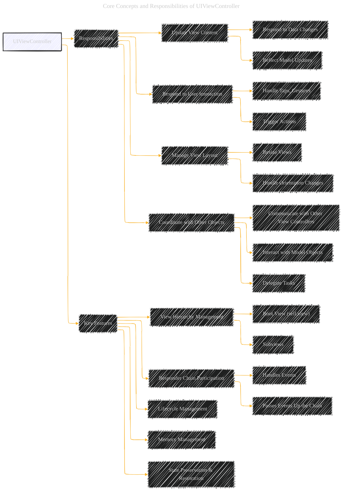
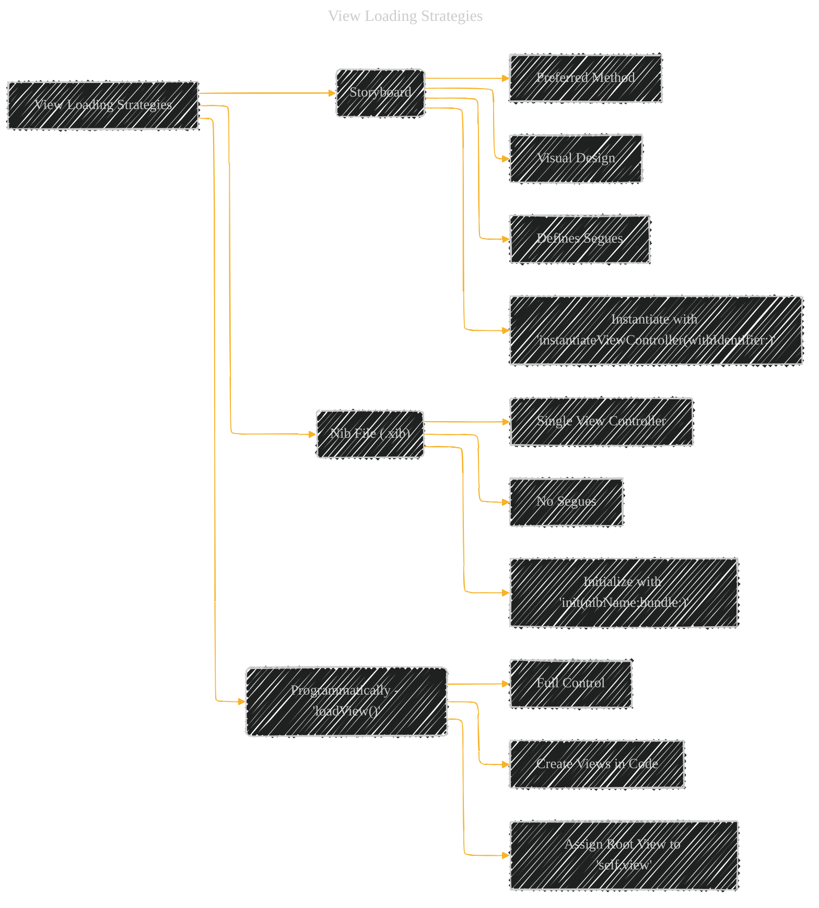
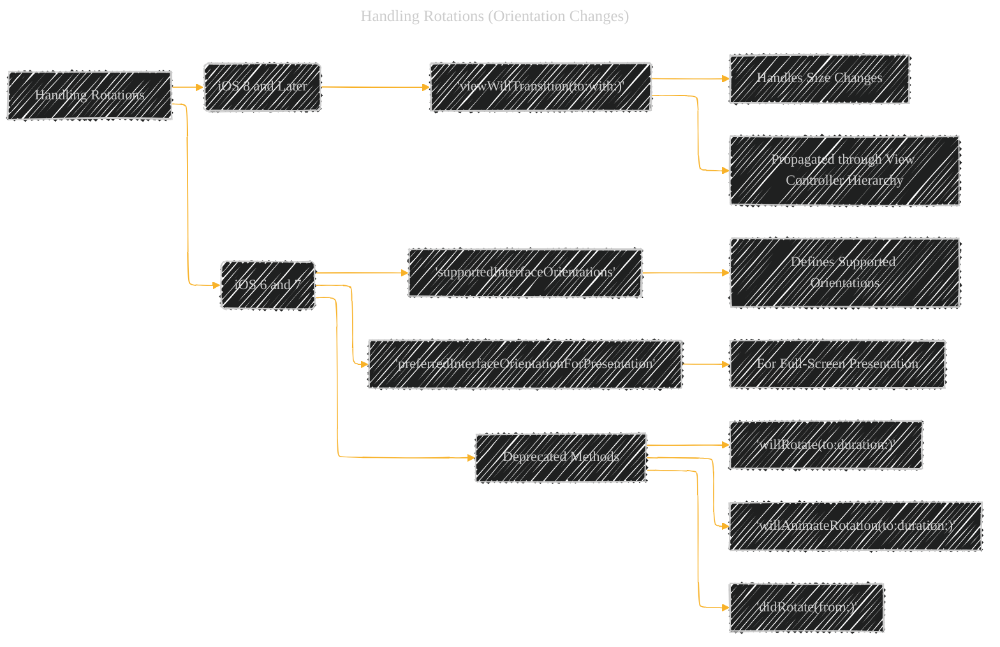
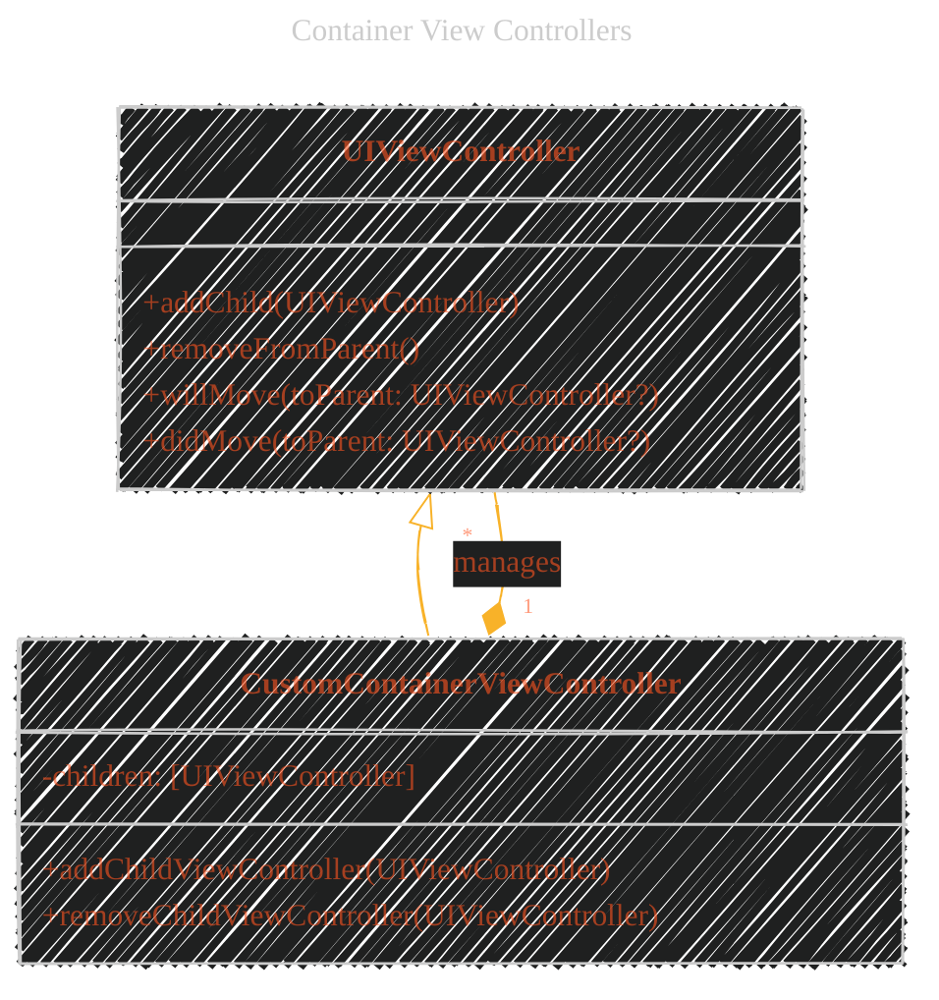
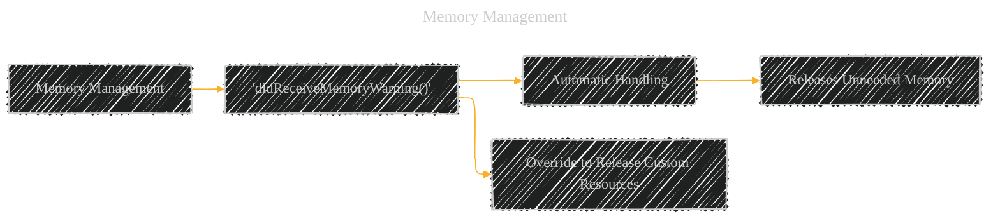
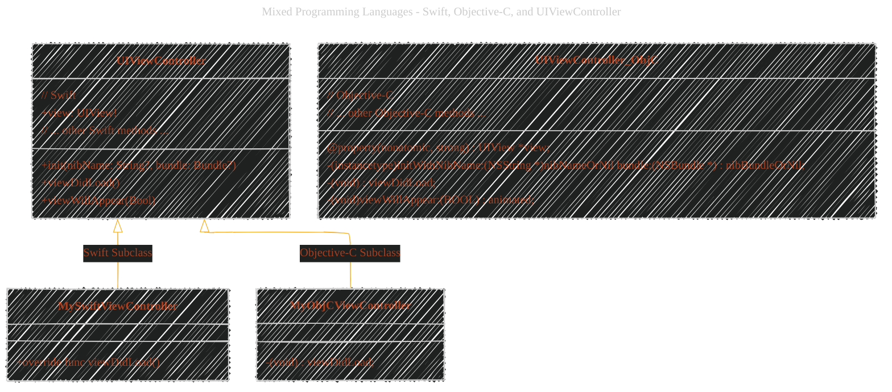

# UIViewController - A Diagrammatical Summary
> This content is dual-licensed under your choice of the following licenses:
> 1.  **MIT License:** For the code implementations in Swift, Mermaid, and any other programming languages provided in this document.
> 2.  **Creative Commons Attribution 4.0 International License (CC BY 4.0):** For all other content, including the text, explanations, and the Mermaid diagrams and illustrations.

---

This document aims to visually explain the [`UIViewController`](https://developer.apple.com/documentation/uikit/uiviewcontroller) in iOS development, including its lifecycle, responsibilities, and how to use it effectively.  It leverages Mermaid diagrams and other visual aids for clarity.

---

## 1. Core Concepts and Responsibilities

The `UIViewController` is a fundamental building block in iOS apps.  It manages a view hierarchy and handles user interactions within that view.  It's *not* usually instantiated directly; instead, you create *subclasses* to implement specific app features.

**Key Takeaways from the Diagram:**

*   **Responsibilities:** The core duties of a `UIViewController` are clearly outlined.
*   **Features:**  Highlights the important capabilities provided by the class.
*   **View Hierarchy:** Emphasizes the `view` property as the root of the managed view hierarchy.
*   **Responder Chain:** Shows how the view controller participates in event handling.

---

## 2. View Loading Strategies

A `UIViewController` loads its views lazily (only when needed).  There are three main ways to define these views:

**Explanation:**

*   **Storyboard:** The recommended approach, allowing for visual design and defining transitions (segues) between view controllers.
*   **Nib File (.xib):**  Suitable for single view controllers, but doesn't support segues.
*   **Programmatically (`loadView()`):** Provides maximum control, requiring you to create and manage all views in code.  This is less common but useful in specific scenarios.

---

## 3. View Lifecycle and Notifications

Understanding the view lifecycle is *crucial* for managing your app's state and behavior. The diagram from the Apple documentation is excellent, but let's represent it in text and then augment it with a state diagram:

**Textual Representation of the Lifecycle:**

1.  **View Not Visible (Initial State)**
2.  **View Is Appearing:**
    *   `viewWillAppear(_:)` - Called *before* the view becomes visible.  Good for initial setup.
    *   `viewIsAppearing(_:)`
3.  **View Appeared:**
    *   `viewDidAppear(_:)` - Called *after* the view is visible.  Good for starting animations or tasks that require the view to be onscreen.
4.  **View Is Disappearing:**
    *   `viewWillDisappear(_:)` - Called *before* the view goes offscreen.  Good for saving data or stopping ongoing tasks.
5.  **View Disappeared:**
    *   `viewDidDisappear(_:)` - Called *after* the view is no longer visible.  Good for cleanup.
6. **View Removed**
    *`viewDidDisappear(_:)`

**Mermaid State Diagram:**

**Key Improvements and Explanations:**

*   **`[*]`:** Represents the initial state (view controller exists, but views aren't loaded).
*   **`NotVisible`:**  Clearly indicates the starting state.
*   **Transitions:**  The arrows show the flow between states, labeled with the corresponding methods.
*   **`viewDidLayoutSubviews`:** Added this to the `Appeared` state.  This method is called *after* the view's bounds change, making it important for layout adjustments.
*   **Cyclical Nature:** The diagram visually represents the cyclical nature of the view lifecycle.

**Important Note:** The documentation emphasizes that `will` methods might not always have a corresponding `did` method. You must ensure that any process started in a `will` method is also handled in the *opposite* `will` method if necessary, to avoid issues. For example, if you start something in `viewWillAppear`, you might need to stop it in both `viewDidAppear` *and* `viewWillDisappear`.

---

## 4. Handling Rotations (Orientation Changes)

The approach to handling rotations has changed over time in iOS.

**Explanation:**

*   **Modern Approach (iOS 8+):**  `viewWillTransition(to:with:)` is the key method.  It's called whenever the view controller's size changes, which includes orientation changes.
*   **Older Approach (iOS 6/7):**  Relied on methods like `supportedInterfaceOrientations` to control which orientations were allowed.  These methods are now deprecated.
*   **`viewWillLayoutSubviews()`:**  This method is still relevant and is called after the view's bounds change, regardless of the iOS version.

---

## 5. Container View Controllers

Container view controllers are powerful tools for managing complex UI structures.  They host other view controllers (child view controllers).

**Explanation:**

*   **`CustomContainerViewController`:**  This represents your custom subclass of `UIViewController` that acts as a container.
*   **`children`:**  A private array (represented by `-`) to hold the child view controllers.
*   **`addChildViewController` and `removeChildViewController`:**  These are *your* custom methods for adding and removing children.  They *must* call the appropriate `UIViewController` methods:
    *   **Adding:**
        1.  `addChild(_:)` - Establishes the parent-child relationship.
        2.  `willMove(toParent:)` - Called on the *child* before it's added.
        3.  Add the child's view to the container's view hierarchy.
        4.  `didMove(toParent:)` - Called on the *child* after it's added.
    *   **Removing:**
        1.  `willMove(toParent: nil)` - Called on the *child* before it's removed.
        2.  Remove the child's view from the container's view hierarchy.
        3.  `removeFromParent()` - Removes the parent-child relationship.
        4.  `didMove(toParent: nil)` - Called on the *child* after it's removed.

**Why are these methods important?**  They ensure that UIKit properly routes events and manages the lifecycle of the child view controllers.

---

## 6. Memory Management

iOS has limited memory, and view controllers provide mechanisms to help manage it.

**Explanation:**

*   **`didReceiveMemoryWarning()`:** This method is called automatically by UIKit when the system is low on memory.
*   **Default Behavior:** The default implementation releases some cached data.
*   **Override:** You can override this method in your subclasses to release any additional memory-intensive resources that you're holding (e.g., large images, cached data).

---

## 7. State Preservation and Restoration

This allows your app to save its UI state when it goes into the background and restore it when it comes back to the foreground, providing a seamless user experience.

**Explanation:**
* **restorationIdentifier:** The sequence diagram shows that the value of the property needs to be set to trigger the state saving and restoration process.
* **Encoding/Decoding:** The view controller and its views (if they have restoration identifiers) are asked to encode their state.
* **Custom Container Controllers:** If you have a custom container view controller, *you* are responsible for encoding the state of your child view controllers.  Each child must have a *unique* `restorationIdentifier`.
* **App Programming Guide:** The documentation refers to the "App Programming Guide for iOS" for more details on the overall process.
* **Restoring your app’s state:** provides a dedicated guide on this specific functionality.

---

## 8. Mixed Programming Languages: Swift, Objective-C, and UIViewController

While the documentation focuses on Swift, `UIViewController` is fully compatible with Objective-C.  Here's how they relate:

**Explanation:**

*   **`UIViewController` (Swift):** Shows the Swift syntax for properties and methods.
*   **`UIViewController_ObjC` (Objective-C):**  Shows the equivalent Objective-C syntax (using `@property` for properties and `-` for methods).
*   **Subclassing:**  You can subclass `UIViewController` in either Swift (`MySwiftViewController`) or Objective-C (`MyObjCViewController`).
*   **Method Overriding:**  The diagram demonstrates how to override `viewDidLoad` in both languages.

**Key Considerations for Mixed-Language Projects:**

*   **Bridging Headers:**  If you have a mixed Swift and Objective-C project, you'll need a bridging header to expose Objective-C code to Swift.
*   **`@objc` and `@IBAction`:**  In Swift, you use the `@objc` attribute to make methods and properties accessible to Objective-C.  `@IBAction` is used for methods connected to Interface Builder actions.
*   **Nullability:** Pay close attention to nullability annotations in Objective-C headers (`nullable`, `nonnull`, `_Nullable`, `_Nonnull`) to ensure proper Swift interoperability.

---

<!-- 

---
**Licenses:**

- **MIT License:**   - Full text in [LICENSE](LICENSE) file.
- **Creative Commons Attribution 4.0 International:**  - Legal details in [LICENSE-CC-BY](LICENSE-CC-BY) and at [Creative Commons official site](http://creativecommons.org/licenses/by/4.0/).

---
