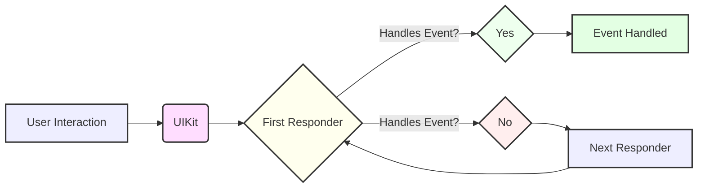
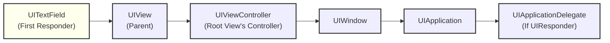
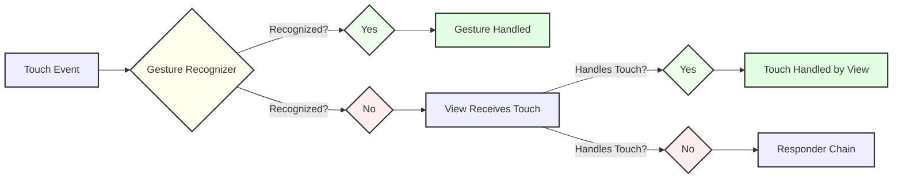
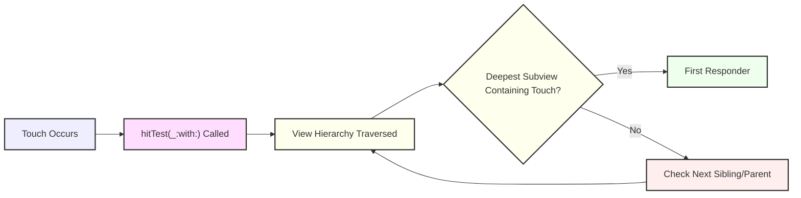
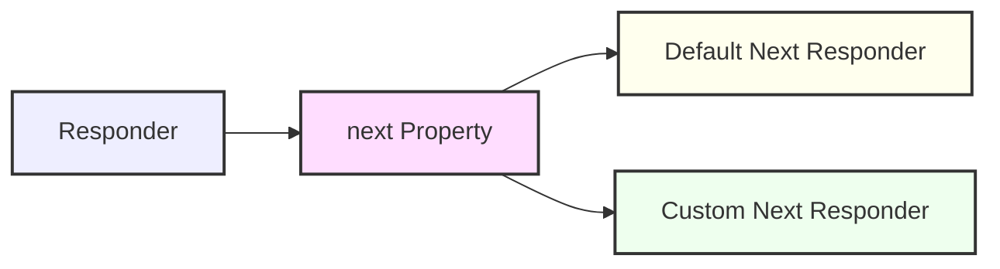
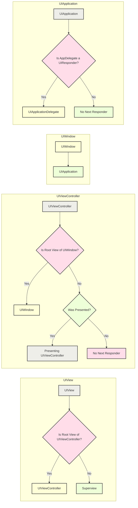

# Using responders and the responder chain to handle events - A Diagrammatical Summary
> **Disclaimer:**
>
> This document contains my personal notes on the topic,
> compiled from publicly available documentation and various cited sources.
> The materials are intended for educational purposes, personal study, and reference.
> The content is dual-licensed:
> 1. **MIT License:** Applies to all code implementations (Swift, Mermaid, and other programming languages).
> 2. **Creative Commons Attribution 4.0 International License (CC BY 4.0):** Applies to all non-code content, including text, explanations, diagrams, and illustrations.
---

## 1. Overview and Responder Chain Basics

The core concept is that UI events (touches, presses, motion, etc.) in iOS are handled by a chain of "responder" objects. Let's visualize this:

**Explanation:**

- **User Interaction:** The user interacts with the UI (taps a button, types in a text field, etc.).
- **UIKit:** The UIKit framework receives this interaction.
- **First Responder:** UIKit determines the "first responder" – the object best suited to handle that event.
- **Handles Event?:** The first responder tries to handle the event.
- **Yes (Event Handled):** If the first responder handles the event, the process stops.
- **No (Next Responder):** If the first responder _doesn't_ handle the event, it's passed to the "next responder" in the chain.
- **Loop:** This process continues until an object handles the event, or the chain is exhausted.

The document provides an illustrative image, which I'll reference here (since I can't recreate the image itself in Markdown, but I _can_ refer to it):

**Reference Image:** See the image in the original documentation, titled "A flow diagram: On the left...". This image shows a visual example of a responder chain. I'll create a textual representation of that specific chain:

**Textual Explanation of the provided image:**

1. **UITextField:** The user interacts with the text field. It's the first responder.
2. **UIView (Parent):** If the text field doesn't handle the event, it goes to its parent view.
3. **UIViewController:** The parent view, if it's the root view of a `UIViewController`, passes the event to the controller.
4. **UIWindow:** If the view controller doesn't handle it, the event goes to the `UIWindow`.
5. **UIApplication:** The window passes the event to the `UIApplication` object.
6. **UIApplicationDelegate:** Finally, if the app object doesn't handle it, the event goes to the app delegate (but _only_ if the delegate is a `UIResponder` and isn't already in the chain).

-----

## 2. Determining the First Responder

The document lists how UIKit determines the first responder based on the event type. I'll represent this as a table (which is Markdown-friendly):

|Event Type|First Responder|
|---|---|
|Touch Events|The view where the touch occurred.|
|Press Events|The object that has focus.|
|Shake-Motion Events|Designated object (by you or UIKit).|
|Remote-Control Events|Designated object (by you or UIKit).|
|Editing Menu Messages|Designated object (by you or UIKit).|

**Additional Notes on Action Messages:**

- Action messages (like those from buttons) aren't events, _but_ they can use the responder chain.
- If a control's target is `nil`, UIKit searches the responder chain for an object that can handle the action.
- This is how the editing menu (Cut, Copy, Paste) works.

**Gesture Recognizers:**

- Gesture recognizers get the _first_ chance to handle touch/press events, _before_ the view.
- Only if the gesture recognizers fail does the view get the event.
- If the view doesn't handle it, the event goes up the responder chain.  
This concept can be shown with a flowchart:

---

## 3. Determining Responder from Touch Event (Hit-Testing)

UIKit uses "hit-testing" to find the view where a touch occurred.

**Explanation:**

1. **Touch Occurs:** A user touches the screen.
2. **`hitTest(_:with:)` Called:** UIKit calls the `hitTest(_:with:)` method of the top-level view.
3. **View Hierarchy Traversed:** This method recursively checks subviews.
4. **Deepest Subview Containing Touch?:** The method searches for the _deepest_ subview in the hierarchy that contains the touch point.
5. **Yes (First Responder):** If found, that subview becomes the first responder.
6. **No (Check Next):** If not found in the current subview, it checks siblings or moves up to the parent view.

**`UITouch` Object:**

- When a touch occurs, UIKit creates a `UITouch` object.
- This object is associated with a specific view.
- As the touch moves, the _same_ `UITouch` object is updated.
- The `view` property of the `UITouch` object _does not change_, even if the touch moves outside the original view.
- When the touch ends, the `UITouch` object is released.

---

## 4. Altering the Responder Chain

You can customize the responder chain by overriding the `next` property in your `UIResponder` subclasses.

**Explanation:**

- **Responder:** Represents an object that inherits from the UIResponder.
- **next Property:** Represents the property that determine the next object to become the responder.
- **Default Next Responder:** Represents the default flow for UIKit responder objects.
- **Custom Next Responder:** Represents the custom implementation of the next responder.

**Default `next` Responders (Important!):**

The document lists the default `next` responder behavior for common UIKit classes. I'll summarize this in a table and a diagram:

|Class|Default `next` Responder|
|---|---|
|`UIView`|- If root view of a `UIViewController`, the controller. - Otherwise, the view's superview.|
|`UIViewController`|- If the view is the root view of a window, the window. - If presented by another controller, the presenting controller.|
|`UIWindow`|The `UIApplication` object.|
|`UIApplication`|The app delegate (if it's a `UIResponder` and not already in the chain).|

**Explanation of the diagram:**

- The diagram shows the default behavior of different responder objects.
- The diagram is divided into different sections for each of the responder objects.
- The default behavior is laid out with yes and no decision points.

---
**Licenses:**

- **MIT License:**   - Full text in [LICENSE](LICENSE) file.
- **Creative Commons Attribution 4.0 International:**  - Legal details in [LICENSE-CC-BY](LICENSE-CC-BY) and at [Creative Commons official site](http://creativecommons.org/licenses/by/4.0/).

---