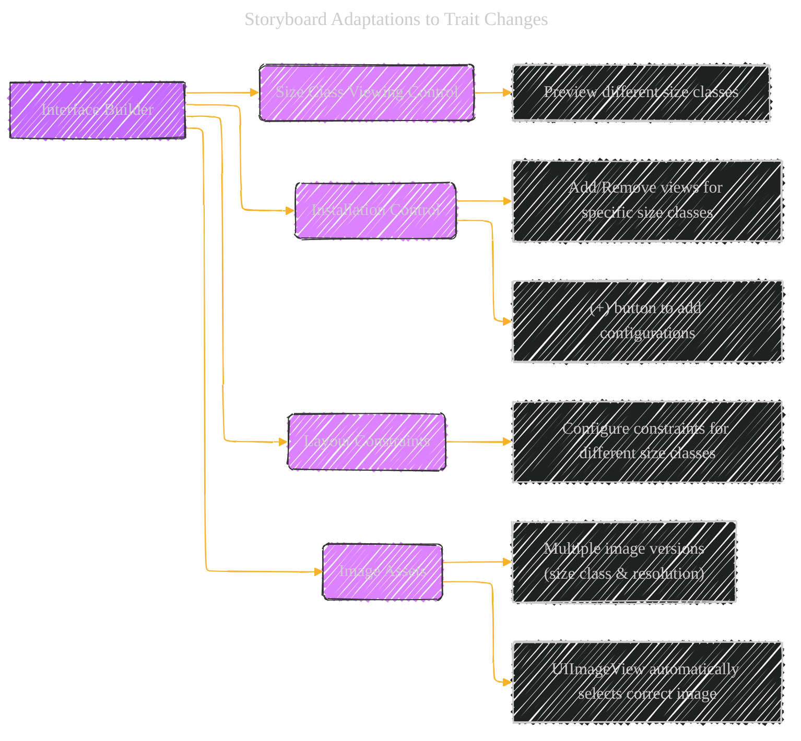
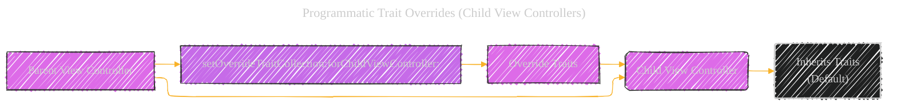
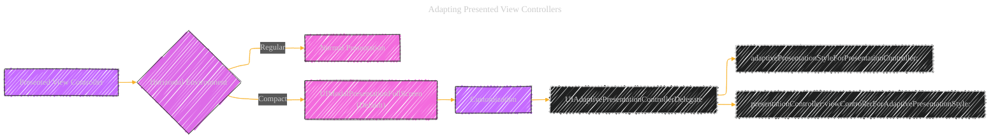
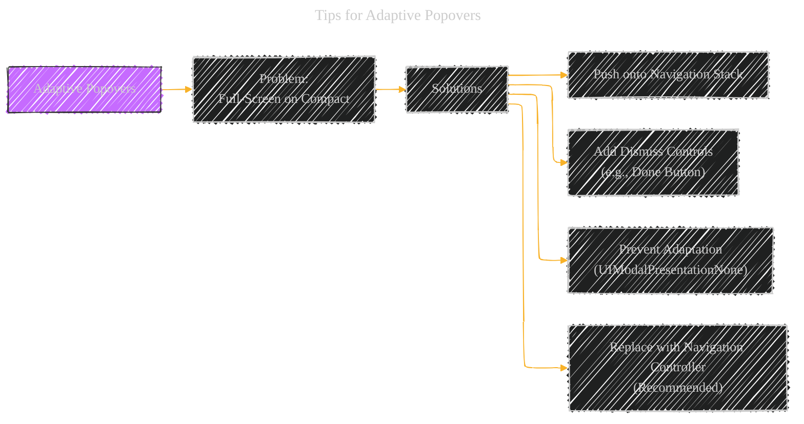

# Building an Adaptive Interface - A Diagrammatical Summary
> This content is dual-licensed under your choice of the following licenses:
> 1.  **MIT License:** For the code implementations in Swift, Mermaid, and any other programming languages provided in this document.
> 2.  **Creative Commons Attribution 4.0 International License (CC BY 4.0):** For all other content, including the text, explanations, and the Mermaid diagrams and illustrations.

---


## 1. Core Concept: Trait and Size Changes

The fundamental idea is that an adaptive interface should gracefully handle changes in both *traits* and *size*.  This is crucial for supporting different devices (iPhone, iPad), orientations (portrait, landscape), and multitasking scenarios (split view, slide over).


**Explanation:**

*   **Adaptive Interface (A):**  The overarching goal.  The interface should adapt to different contexts.
*   **Trait Changes (B):**  Coarse-grained changes affecting the overall environment.  Examples include:
    *   **Size Classes (B1):**  Horizontal (Regular/Compact) and Vertical (Regular/Compact).  These define the *amount* of available space.
    *   **Display Scale (B2):**  The pixel density (Retina vs. non-Retina).
    *    **User Interface Style (B3):** Dark Mode or Light Mode.
*   **Size Changes (C):**  Fine-grained adjustments to the layout *within* a given trait environment. Examples:
    *   **Window Dimensions (C1):**  Changes due to device rotation.
    *   **Parent View Controller Resize (C2):** A container view controller adjusting the size of its children.
    *   **Presentation Controller Resize (C3):**  A presented view controller (like a popover) being resized.

---

## 2. Adapting to Trait Changes: Storyboards and Code

There are two primary ways to handle trait changes:

*   **Interface Builder (Storyboards):** The preferred method for many adjustments.
*   **Programmatically (Swift/Objective-C):**  For more dynamic or complex scenarios.

### 2.1 Storyboard Adaptations

Interface Builder provides built-in tools to configure your UI for different size classes.



**Explanation:**

* **Size Class Viewing Control:** Allows you to preview your layout in different size class combinations (e.g., Regular width, Compact height) *within* Interface Builder.
*   **Installation Control:**  Lets you conditionally install/uninstall views for specific size classes.  A view might be present in a Regular width environment but removed in a Compact width environment.
*   **Layout Constraints:**  You can create different constraints for different size classes.  This is the core of Auto Layout's adaptivity.
*   **Image Assets:**  The best way to manage images.  An image asset can contain multiple versions of an image, each tailored to a specific size class and resolution.  A `UIImageView` will automatically pick the right one.

**Visual Representation (Conceptual Image Asset):**

```
Image Asset: "MyButtonImage"

+-------------------------------------------------+
|  Size Class       |  Resolution  |  Image File     |
|-------------------|--------------|-----------------|
| Regular x Regular |  @1x         |  button_rr_1x.png|
| Regular x Regular |  @2x         |  button_rr_2x.png|
| Regular x Regular |  @3x         |  button_rr_3x.png|
| Compact x Regular |  @1x         |  button_cr_1x.png|
| Compact x Regular |  @2x         |  button_cr_2x.png|
| ...               |  ...          |  ...             |
+-------------------------------------------------+
```

### 2.2 Programmatic Trait Overrides (Child View Controllers)

Sometimes, you need to override the traits inherited by a child view controller. This is common in container view controllers.



**Explanation:**

*   A parent view controller can explicitly set the traits of its children using `setOverrideTraitCollection:forChildViewController:`.
*   This allows, for example, a child view controller to have a Compact size class even if the parent has a Regular size class.

**Code Example (Objective-C):**

```objc
// Create trait collections for specific size classes
UITraitCollection *horizTrait = [UITraitCollection
                  traitCollectionWithHorizontalSizeClass:UIUserInterfaceSizeClassRegular];
UITraitCollection *vertTrait = [UITraitCollection
                  traitCollectionWithVerticalSizeClass:UIUserInterfaceSizeClassCompact];

// Combine the trait collections
UITraitCollection *childTraits = [UITraitCollection
                  traitCollectionWithTraitsFromCollections:@[horizTrait, vertTrait]];

// Override the traits of the child view controller
[self setOverrideTraitCollection:childTraits forChildViewController:self.childViewControllers[0]];
```

**Code Example (Swift):**

```swift
// Create trait collections for specific size classes
let horizTrait = UITraitCollection(horizontalSizeClass: .regular)
let vertTrait = UITraitCollection(verticalSizeClass: .compact)

// Combine the trait collections
let childTraits = UITraitCollection(traitsFrom: [horizTrait, vertTrait])

// Override the traits of the child view controller
setOverrideTraitCollection(childTraits, forChild: childViewControllers[0])

```

**Key Point:**  Overridden traits persist until changed again or the child is removed.  Children inherit *un-overridden* traits from their parent.

---

## 3. Adapting Presented View Controllers

Presented view controllers (e.g., popovers, modal sheets) have special adaptation rules.




**Explanation:**

*   **Default Behavior:** When transitioning from a horizontally *regular* to a horizontally *compact* environment, UIKit automatically changes the presentation style to `UIModalPresentationFullScreen`.  This makes the presented view controller take up the entire screen.
*   **Customization:** This default behavior can be overridden using a `UIAdaptivePresentationControllerDelegate`.
*   **`adaptivePresentationStyleForPresentationController:`:** This delegate method lets you specify a different presentation style.  Crucially, when transitioning to a compact environment, you can only return:
    *   `UIModalPresentationFullScreen` (or another full-screen style)
    *   `UIModalPresentationNone` (to keep the *original* presentation style, e.g., keep a popover as a popover).
*   **`presentationController:viewControllerForAdaptivePresentationStyle:`:**  This method allows you to *completely replace* the presented view controller with a different one, better suited for the new environment.  This is powerful for significant UI changes.

**Example: Popover Adaptation**

```
Regular Environment (iPad):
+---------------------+
|      Popover        |
|  +---------------+  |
|  |  Content      |  |
|  +---------------+  |
|                     |
+---------------------+

Compact Environment (iPhone, default):
+---------------------+
|                     |
|                     |
|  +---------------+  |
|  |  Content      |  |  (Full Screen)
|  +---------------+  |
|                     |
|                     |
+---------------------+

Compact Environment (with UIModalPresentationNone):
+---------------------+
|      Popover        |
|  +---------------+  |
|  |  Content      |  |
|  +---------------+  |
|                     |
+---------------------+
```

**Code Example (Swift):**

```swift
// Delegate method to prevent full-screen adaptation
func adaptivePresentationStyle(for controller: UIPresentationController, traitCollection: UITraitCollection) -> UIModalPresentationStyle {
    return .none // Keep the original presentation style (e.g., popover)
}

// Delegate method to replace the view controller
func presentationController(_ presentationController: UIPresentationController, viewControllerForAdaptivePresentationStyle style: UIModalPresentationStyle) -> UIViewController? {
    // If transitioning to a compact environment, return a navigation controller
    if style == .fullScreen {
        let newVC = MyCustomViewControllerForCompact() // A view controller designed for compact
        let navController = UINavigationController(rootViewController: newVC)
        return navController
    }
    return nil // Use the original view controller
}

```

**Key Takeaways - Presented View Controllers:**

*   Understand the default full-screen adaptation.
*   Use `UIAdaptivePresentationControllerDelegate` to customize this behavior.
*   Consider replacing the view controller entirely for major adaptations.

---

## 4. Responding to Size Changes

Size changes, as opposed to trait changes, are about fine-tuning the layout within a given trait environment.


**Explanation:**

*   **Auto Layout (B):**  If you've set up your Auto Layout constraints correctly, your app will *automatically* adapt to many size changes.  This is the ideal scenario.
*   **`viewWillTransitionToSize:withTransitionCoordinator:` (C):** This view controller method is called when the size of the view controller's view is about to change.  Use this for:
    *   **Manual Layout Adjustments (C1):** If Auto Layout isn't sufficient, you can manually adjust the frames of your views here.
    *   **Custom Animations (C2):**  You can use the provided transition coordinator to create animations that run *alongside* the standard size-change animations.  For example, you could counter-rotate a view during a device rotation.

**Code Example (Swift):**

```swift
override func viewWillTransition(to size: CGSize, with coordinator: UIViewControllerTransitionCoordinator) {
    super.viewWillTransition(to: size, with: coordinator)

    // 1. Manual Layout Adjustments (example)
    if size.width > size.height { // Landscape
        myLabel.frame = CGRect(x: 20, y: 20, width: size.width - 40, height: 50)
    } else { // Portrait
        myLabel.frame = CGRect(x: 20, y: 20, width: size.width - 40, height: 100)
    }

    // 2. Custom Animations (example - counter-rotation)
    coordinator.animate(alongsideTransition: { context in
        let transform = context.targetTransform
        self.myImageView.transform = transform.inverted()
    }, completion: { context in
        // Reset the transform after the animation
        self.myImageView.transform = .identity
    })
}
```

**Key Point:** Prioritize Auto Layout.  Use `viewWillTransitionToSize:` for cases where Auto Layout alone isn't enough or for custom animations.

---

## 5. Tips for Adaptive Popovers (Recap)

The document specifically highlights popovers because they require special consideration:

*   **Problem:**  The default full-screen adaptation on compact devices removes the usual way to dismiss a popover (tapping outside its bounds).

*   **Solutions:**
    1.  **Push onto Navigation Stack:** If a navigation controller is available, dismiss the popover and push its view controller onto the stack.
    2.  **Add Dismiss Controls:** Add a "Done" button or similar control.  Better yet, *replace* the popover with a navigation controller using the delegate method.
    3.  **Prevent Adaptation:** Use `UIModalPresentationNone` in the delegate to keep the popover presentation style.




---

<!-- 


---
**Licenses:**

- **MIT License:**  [](LICENSE) - Full text in [LICENSE](LICENSE) file.
- **Creative Commons Attribution 4.0 International:** [](LICENSE-CC-BY) - Legal details in [LICENSE-CC-BY](LICENSE-CC-BY) and at [Creative Commons official site](http://creativecommons.org/licenses/by/4.0/).

---
