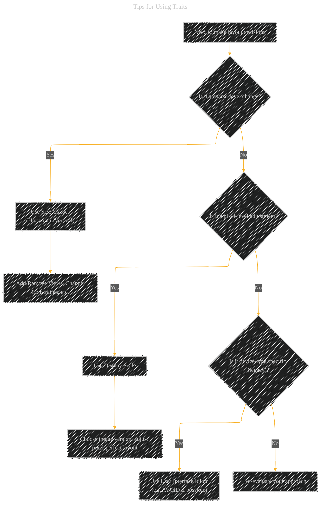
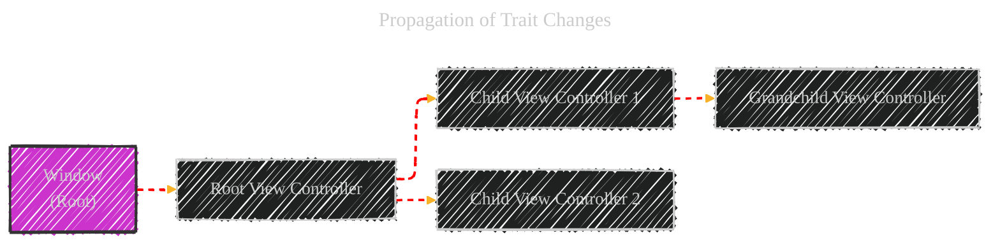

# The Adaptive Model - A Diagrammatical Summary
> This content is dual-licensed under your choice of the following licenses:
> 1.  **MIT License:** For the code implementations in Swift, Mermaid, and any other programming languages provided in this document.
> 2.  **Creative Commons Attribution 4.0 International License (CC BY 4.0):** For all other content, including the text, explanations, and the Mermaid diagrams and illustrations.

---


## 1. Adaptive Interface (Overview)

This introductory section emphasizes the core idea: a single app adapting to different screen sizes. I'll use a simple visual representation (not strictly Mermaid, but Markdown-compatible) to illustrate this concept, mirroring the provided Figure 12-1.

```txt
+---------------------+     +-----------------------------+
|      iPhone (P)     |     |          iPad (L)           |
|                     |     |                             |
|   +-----------+   |     |   +---------------------+   |
|   |  Content  |   |     |   |       Content       |   |
|   +-----------+   |     |   +---------------------+   |
|                     |     |                             |
|  (Same App Code)   |     |     (Same App Code)         |
+---------------------+     +-----------------------------+
```


**Explanation:**

- This isn't a diagramming language, but a simple ASCII art representation.
- It visually shows the _same_ app code adapting to _different_ screen sizes (iPhone Portrait vs. iPad Landscape).
- This sets the stage for the rest of the explanation, illustrating the _goal_ of adaptivity.

## 2. The Role of Traits (Table 12-1)

The document provides a table describing traits. I'll reproduce this table in Markdown, but enhance it with links to the relevant Apple documentation (as found in the original text). This makes the table more useful.


|Trait|Examples|Description|
|---|---|---|
|[`horizontalSizeClass`](https://developer.apple.com/documentation/uikit/uitraitcollection/1623508-horizontalsizeclass)|[`UIUserInterfaceSizeClassCompact`](https://developer.apple.com/documentation/uikit/uiuserinterfacesizeclass/compact)|This trait conveys the general width of your interface. Use it to make coarse-level layout decisions, such as whether views are stacked vertically, displayed side by side, hidden altogether, or displayed by another means.|
|[`verticalSizeClass`](https://developer.apple.com/documentation/uikit/uitraitcollection/1623513-verticalsizeclass)|[`UIUserInterfaceSizeClassRegular`](https://developer.apple.com/documentation/uikit/uiuserinterfacesizeclass/uiuserinterfacesizeclassregular)|This trait conveys the general height of your interface. If your design requires all of your content to fit on the screen without scrolling, use this trait to make layout decisions.|
|[`displayScale`](https://developer.apple.com/documentation/uikit/uitraitcollection/1623519-displayscale)|`2.0`|This trait conveys whether the content is displayed on a Retina display or a standard-resolution display. Use it (as needed) to make pixel-level layout decisions or to choose which version of an image to display.|
|[`userInterfaceIdiom`](https://developer.apple.com/documentation/uikit/uitraitcollection/1623521-userinterfaceidiom)|[`UIUserInterfaceIdiomPhone`](https://developer.apple.com/documentation/uikit/uiuserinterfaceidiom/phone)|This trait is provided for backward compatibility and conveys the type of device on which your app is running. Avoid using this trait as much as possible. For layout decisions, use the horizontal and vertical size classes instead.|

**Explanation:**

- This is a standard Markdown table.
- I've included the hyperlinks directly to Apple's documentation for each trait and example, making this a practical reference.
- This presentation keeps the information organized and accessible.

---

## 3. Tips for Using Traits

This section provides guidelines on when to use different traits. A decision tree (flowchart) will be effective here.





**Explanation:**

- **`graph TD`** : Top-down flowchart.
- **`A[Need to make layout decisions]`** : The starting point.
- **`B{Is it a coarse-level change?}`** , **`E{Is it a pixel-level adjustment?}`** , **`H{Is it device-type specific (legacy)?}`** : Decision points (diamonds).
- **`-- Yes -->` / `-- No -->`** : Branches based on the decisions.
- **`C[Use Size Classes...]`, `F[Use Display Scale...]`, `I[Use User Interface Idiom...]`** : Recommendations based on the decision path.
- **`D[Add/Remove Views...]`, `G[Choose image version...]`** : Examples of actions to take.
- **`J[Re-evaluate your approach]`** : A catch-all for situations not covered by the other traits.

This flowchart visually guides the developer through the decision-making process of choosing the appropriate trait.

-----

## 4. When Do Trait and Size Changes Happen? (Sequence Diagram)

This section explains the _events_ that trigger trait and size changes. A sequence diagram is perfect for illustrating the order of method calls.


----

## 5. Default Size Classes for Different Devices (Table 12-2)

The document includes another table listing default size classes. I'll reproduce this table in Markdown, enhancing readability.

|Device|Portrait|Landscape|
|---|---|---|
|iPad (all), iPad Mini|Vertical: Regular Horizontal: Regular|Vertical: Regular Horizontal: Regular|
|iPhone 6 Plus|Vertical: Regular Horizontal: Compact|Vertical: Compact Horizontal: Regular|
|iPhone 6|Vertical: Regular Horizontal: Compact|Vertical: Compact Horizontal: Compact|
|iPhone 5s/5c/5|Vertical: Regular Horizontal: Compact|Vertical: Compact Horizontal: Compact|
|iPhone 4s|Vertical: Regular Horizontal: Compact|Vertical: Compact Horizontal: Compact|

**Explanation:**

- Standard Markdown table.
- I've improved the formatting slightly for better readability (e.g., "Vertical: Regular" instead of "Vertical size class: Regular").
- This provides a quick reference for understanding default size classes.

---

## 6. Propagation of Trait Changes (Illustrative Diagram)


To further clarify how trait changes propagate (mentioned in the text but not visually represented), I'll create a simple diagram.



**Explanation:**

- **`graph LR`** : Left-to-right flowchart.
- **`A[Window (Root)]`** : The starting point of the hierarchy.
- **`-->`** : Shows the parent-child relationships.
- **`style A ...`** : Highlights the Window as the root.
- **`linkStyle 0,1,2,3 ...`** : Uses a red, dashed line to visually represent the _propagation_ of trait changes down the hierarchy. This is a stylistic choice to emphasize the flow.

This diagram complements the sequence diagram by showing _where_ the changes are propagated, not just _when_.

----

## 7. Trait Selection Decision Tree - Combining Concepts


**Explanation and Rationale:**

1.  **`graph TD`**:  We're still using a top-down flowchart as the overall structure. This maintains the decision-making flow from the original decision tree.

2.  **`subgraph TraitSelection`**: This creates a distinct area for the decision tree itself.
    *   **`direction TB`**:  Explicitly sets the direction within the subgraph to top-to-bottom.
    *   The content of the decision tree is *identical* to the previous version.  We haven't changed the logic, just the presentation.
    *    **`style`**: Apply background color and border style for better organization.

3.  **`subgraph TraitDetails`**: This is the key addition. It houses the information that was previously in the trait table.
    *   **`direction LR`**: We use a left-to-right layout for this subgraph to make it more compact and fit better alongside the decision tree.
    *   **`C --> C1`, `C --> C2`, `F --> F1`, `I --> I1`**:  These connections directly link the *decision points* in the tree (Use Size Classes, Use Display Scale, Use User Interface Idiom) to their corresponding details.  This is the crucial integration.
    *   **`horizontalSizeClass:<br/>- Compact<br/>- Regular`**, etc.: We present the trait information concisely, using line breaks (`<br/>`) to keep it readable within the nodes.  We've omitted the full descriptions from the original table to save space, assuming the user can refer to the separate table if needed.  This is a trade-off between completeness and conciseness.
    *    **`style`**: Apply background color and border style for better organization.

4.  **Visual Grouping**: The use of `subgraph` and different background colors visually separates the decision-making process (TraitSelection) from the detailed trait information (TraitDetails), even though they are now part of the same diagram.


---


---
**Licenses:**

- **MIT License:**  [](LICENSE) - Full text in [LICENSE](LICENSE) file.
- **Creative Commons Attribution 4.0 International:** [](LICENSE-CC-BY) - Legal details in [LICENSE-CC-BY](LICENSE-CC-BY) and at [Creative Commons official site](http://creativecommons.org/licenses/by/4.0/).

---