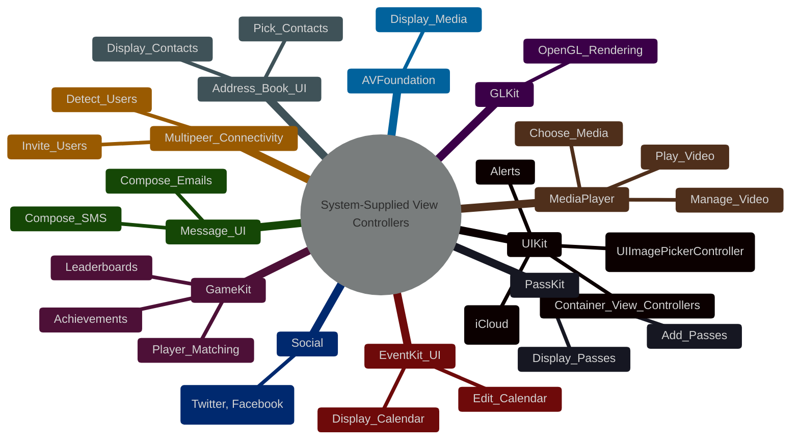
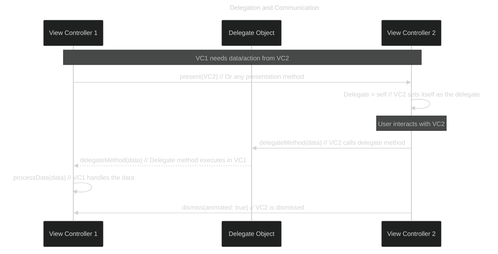
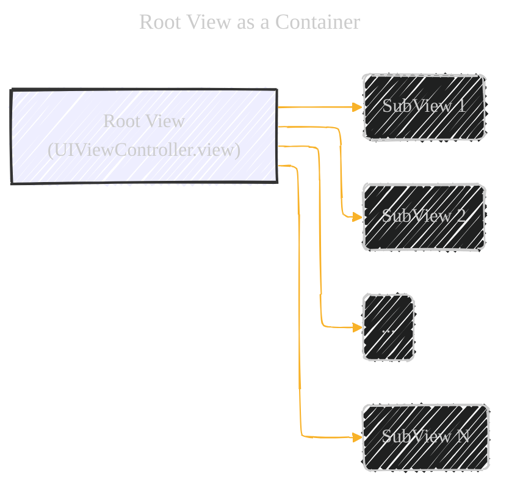
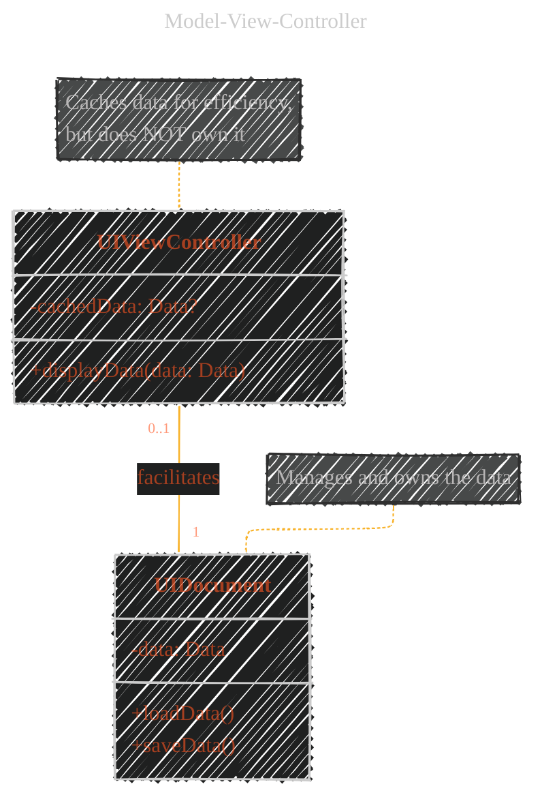
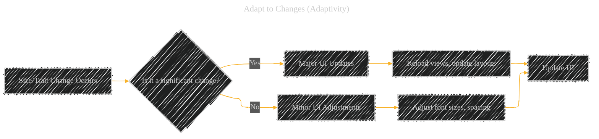

# Design Tips - A Diagrammatical Summary
> This content is dual-licensed under your choice of the following licenses:
> 1.  **MIT License:** For the code implementations in Swift, Mermaid, and any other programming languages provided in this document.
> 2.  **Creative Commons Attribution 4.0 International License (CC BY 4.0):** For all other content, including the text, explanations, and the Mermaid diagrams and illustrations.

---

## 1. System-Supplied View Controllers (Categorization and Examples)

This section emphasizes the importance of using pre-built view controllers.  A mind map is ideal for showing the breadth of options.

**Explanation:**

*   **`root((System-Supplied View Controllers))`**:  This establishes the central topic. The double parentheses create a circular node.
*   **Frameworks as Main Branches:**  `UIKit`, `GameKit`, etc., are the primary categories.
*   **Specific Tasks as Leaves:**  `Alerts`, `Image_Picker`, etc., represent the functionalities provided by the view controllers within each framework.
*    **`(UIImagePickerController)`**: Showing class name for a good reference.

This mind map provides a quick overview of *what* system-supplied view controllers are available and *where* to find them (which framework).

----

## 2. "View Controller as an Island" (Delegation and Communication)

This section highlights the principle of encapsulation and proper communication between view controllers.  A sequence diagram will illustrate the delegation pattern.

**Explanation:**

*   **`sequenceDiagram`**:  Specifies the diagram type.
*   **`participant`**: Defines the actors in the interaction (VC1, Delegate, VC2).  Giving them aliases (`as`) makes the diagram more readable.
*   **`->>`**:  Represents a synchronous message call (VC1 presenting VC2, VC2 calling the delegate).
*   **`-->>`**: Represents an asynchronous message call, showing the delegate execution.
*   **`Note over`**:  Provides contextual information at specific points in the sequence.
*    **`Delegate = self`**: Showing the delegate assignment.
*    **`delegateMethod(data)`**: Showing the delegate method with passing data.

This diagram shows *how* view controllers should communicate: indirectly, through a delegate, rather than directly accessing each other's internal state. It emphasizes the "island" concept by showing no direct access between VC1 and VC2's internals.

---

## 3. Root View as a Container

This is a simple but crucial point. A basic diagram illustrating the view hierarchy will suffice.

**Explanation:**

*   **`graph LR`**:  Creates a left-to-right flowchart.
*   **`A[Root View (UIViewController.view)]`**:  Clearly labels the root view and its origin.
*   **`-->`**:  Indicates the parent-child relationship in the view hierarchy.
*   **`style A ...`**:  Highlights the root view with a different fill color and thicker border.
*    **`(...)`**: Showing that there are other potential Subviews.

This visually reinforces that the root view should *only* be a container, not used for direct content display itself.

----

## 4. "Where Your Data Lives" (Model-View-Controller)

This section addresses the separation of concerns between model, view, and controller. A class diagram, focusing on the relationship between `UIDocument` and `UIViewController`, will be used.

**Explanation:**

*   **`classDiagram`**:  Specifies the diagram type.
*   **`class UIViewController` / `class UIDocument`**:  Defines the two classes.
*   **`-cachedData: Data?`**:  Shows that the view controller *might* cache data (optional, hence the `?`). The `-` indicates private scope.
*   **`+displayData(data: Data)`**:  A public method (`+`) for the view controller to display data.
*   **`-data: Data`**: The `UIDocument` *owns* the data (private).
*   **`+loadData()`, `+saveData()`**:  Methods for data management within `UIDocument`.
*   **`UIViewController "0..1" -- "1" UIDocument : facilitates`**:  Shows the relationship: a `UIViewController` *might* be associated with one `UIDocument` (0 or 1), while a `UIDocument` is associated with *exactly* one `UIViewController` in this context.  The "facilitates" label clarifies the role.
*   **`note for ...`**:  Adds crucial annotations to emphasize the data ownership and caching behavior.

This diagram visually represents the MVC principle and the specific relationship between `UIDocument` and `UIViewController`, highlighting where data should reside and how it should be accessed.

----

## 5. Adapt to Changes (Adaptivity)

This section emphasizes the importance of responsive design. A flowchart can represent the decision-making process during size/trait changes.

**Explanation:**

*   **`graph LR`**:  Left-to-right flowchart.
*   **`A[Size/Trait Change Occurs]`**:  The starting event.
*   **`B{Is it a significant change?}`**:  A decision point (diamond shape).
*   **`-- Yes -->` / `-- No -->`**:  Branches based on the decision.
*   **`C[Major UI Updates]`, `E[Minor UI Adjustments]`**:  Different actions based on the change's magnitude.
*   **`D[Reload views, update layouts]`, `F[Adjust font sizes, spacing]`**:  Specific examples of actions.
*   **`G[Update UI]`**: The final step, common to both branches.

This flowchart shows the *process* of adapting to changes, emphasizing the conditional logic based on the significance of the change.

---
**Licenses:**

- **MIT License:**   - Full text in [LICENSE](LICENSE) file.
- **Creative Commons Attribution 4.0 International:**  - Legal details in [LICENSE-CC-BY](LICENSE-CC-BY) and at [Creative Commons official site](http://creativecommons.org/licenses/by/4.0/).

---