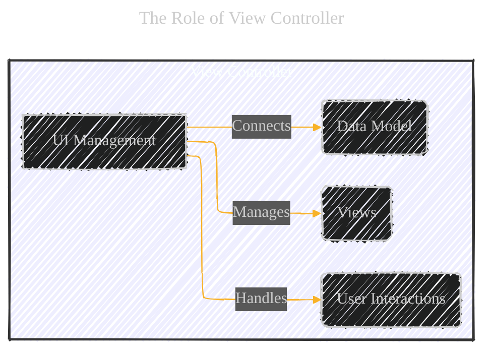
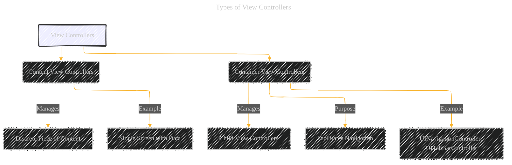
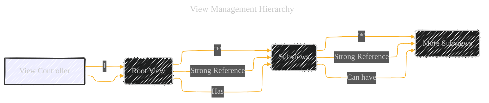
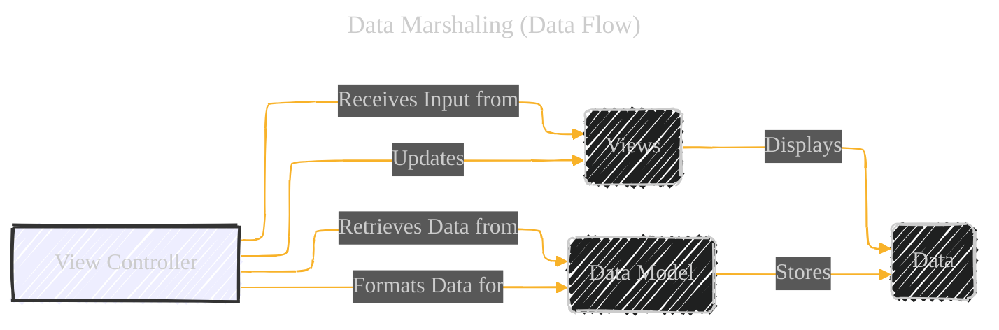
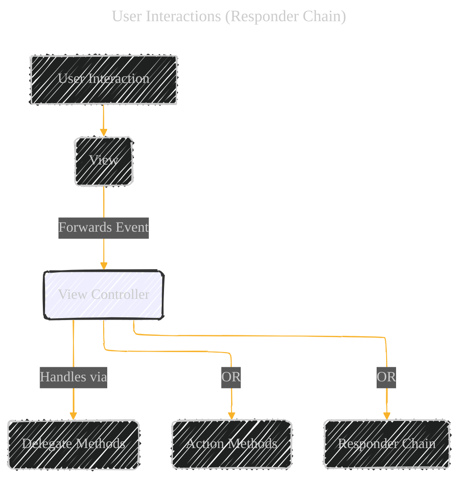
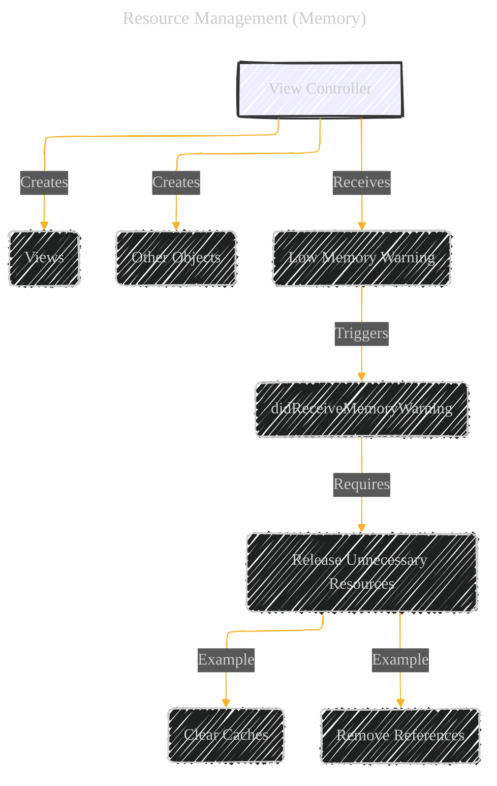
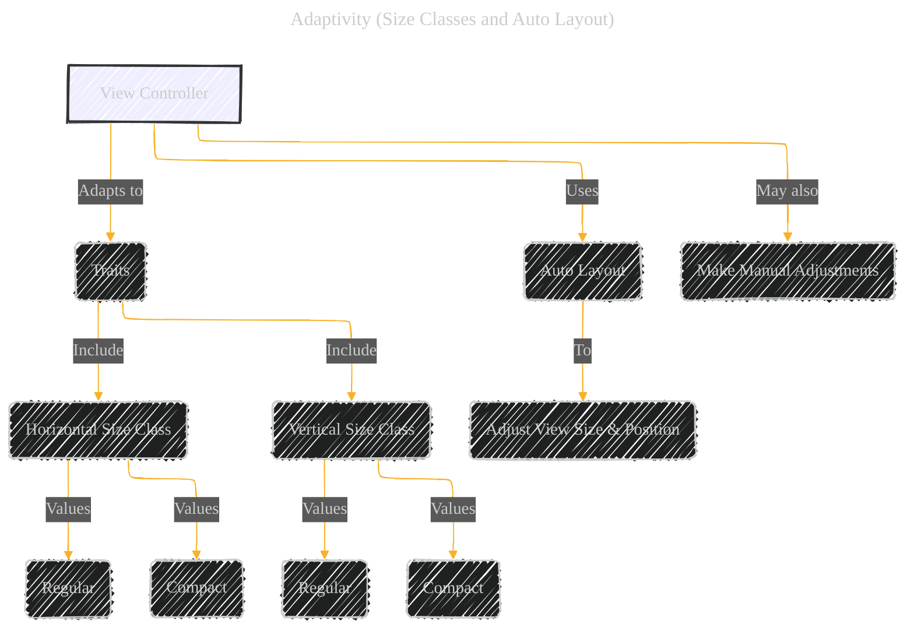
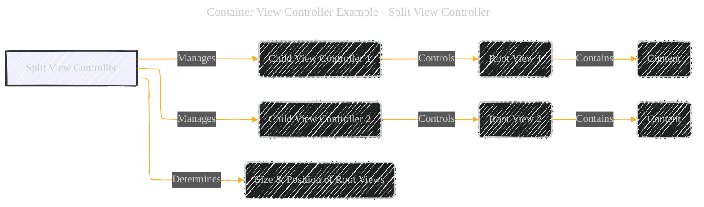
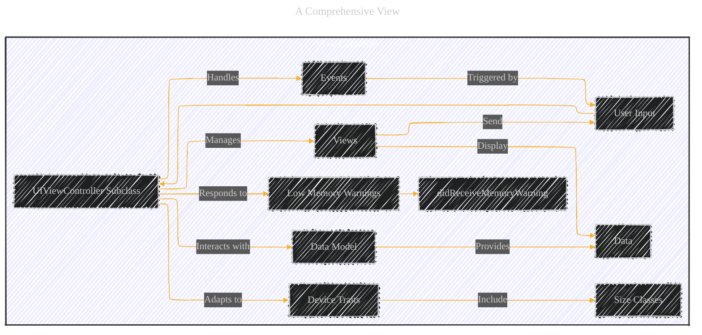

# The Role of View Controllers - A Diagrammatical Summary
> This content is dual-licensed under your choice of the following licenses:
> 1.  **MIT License:** For the code implementations in Swift, Mermaid, and any other programming languages provided in this document.
> 2.  **Creative Commons Attribution 4.0 International License (CC BY 4.0):** For all other content, including the text, explanations, and the Mermaid diagrams and illustrations.

---

## 1. Core Concept: View Controller's Role

First, let's establish the fundamental role of a view controller.  It's the central hub for managing a portion of the UI, handling user interactions, and connecting the UI to the underlying data.

**Explanation:**

*   **View Controller:**  The central node, representing the `UIViewController` or its subclass.
*   **UI Management:**  The view controller's primary responsibility.
*   **Views:** The visual elements the view controller manages (its own root view and subviews).
*   **User Interactions:** Events like taps, swipes, etc., are often handled by the view controller (or delegated from views).
*   **Data Model:** The underlying data that the UI represents. The view controller acts as the intermediary.

---

## 2. Types of View Controllers

The document mentions two main types: content and container view controllers.

**Explanation:**

*   **View Controllers:** The top-level category.
*   **Content View Controllers:**  The most common type, directly managing content on the screen.
*   **Container View Controllers:**  Manage other view controllers, often for navigation purposes.  Examples include navigation controllers (stack of screens) and tab bar controllers.

---

## 3. View Management Hierarchy

This section emphasizes the hierarchical relationship between a view controller, its root view, and subviews.

**Explanation:**

*   **View Controller:**  Has a single root view.
*   **Root View:** The top-level view in the view controller's hierarchy.
*   **Subviews:**  Views contained within the root view (and potentially nested further).
*   **Strong References:**  Indicates the ownership relationship, preventing views from being deallocated prematurely.  This is crucial for memory management.
*   **Cardinality:**  "1" to "many" (*) relationships are shown.

**Alternative Representation (Image Analogy):**

Imagine a set of Russian nesting dolls (Matryoshka dolls).  The view controller is like the outermost doll.  Inside is the root view (the next doll).  Inside the root view are subviews (smaller dolls), and so on.

---

## 4. Data Marshaling (Data Flow)

This is about how data moves between the views and the data model, with the view controller acting as the intermediary.

**Explanation:**

*   **View Controller:**  The central coordinator.
*   **Views:**  Display data and send user input to the view controller.
*   **Data Model:**  Holds the underlying data (e.g., a `struct`, `class`, or a `UIDocument`).
*   **Updates:** The view controller updates views with data from the model.
*   **Receives Input:**  The view controller gets input from views (e.g., text field entries).
*   **Formats Data:**  The view controller may need to convert data between the format used by the views and the format used by the model.

**Key Principle: Separation of Concerns**

The documentation stresses keeping data logic separate from view controller logic.  The data model should be responsible for data integrity, while the view controller focuses on presentation and user interaction.

---

## 5. User Interactions (Responder Chain)

View controllers are part of the responder chain, meaning they can handle events.

**Explanation:**

*   **User Interaction:**  A user taps a button, swipes, etc.
*   **View:**  The view usually receives the initial event.
*   **View Controller:**  The view often forwards the event to the view controller.
*   **Delegate Methods:**  A common way to handle events (e.g., `UITableViewDelegate`).
*   **Action Methods:**  Methods connected to UI elements in Interface Builder (e.g., `@IBAction`).
* **Responder Chain**: The chain of objects that the app uses to respond to events that happen within the app.

---

## 6. Resource Management (Memory)

View controllers are responsible for managing the memory of their views and other objects they create.

**Explanation:**

*   **Low Memory Warning:**  iOS notifies the app when memory is low.
*   **didReceiveMemoryWarning:**  The view controller's method that's called in response.
*   **Release Unnecessary Resources:**  The view controller should release any objects it can easily recreate later.  This is crucial to prevent the app from being terminated.

---

## 7. Adaptivity (Size Classes and Auto Layout)

View controllers must adapt to different screen sizes and orientations.

**Explanation:**

*   **Traits:**  Describe the environment (size classes, display scale, etc.).
*   **Size Classes:**  Categorize the available space (regular or compact) for width and height.
*   **Auto Layout:**  The primary mechanism for adapting views to different sizes.
*   **Manual Adjustments:**  The view controller can also make additional changes if needed.

**Visual Analogy (Responsive Web Design):**

Think of responsive web design, where a website's layout changes based on the screen size.  iOS adaptivity is similar, but it uses size classes and Auto Layout instead of CSS media queries.

---

## 8. Container View Controller Example: Split View Controller

The documentation uses a split view controller as an example of a container view controller.

**Explanation:**

*   **Split View Controller:** The container.
*   **Child View Controllers:**  Manage their own content.
*   **Root Views:**  The top-level views of the child view controllers.
*   **Size & Position:** The split view controller controls the overall layout of the child view controllers' root views.
*   **Content:**  Each child view controller manages its own content within its root view.

---

## 9. Putting It All Together: A Comprehensive View

This final diagram combines the key aspects into a single, holistic view.

**Explanation:**

This summarizes all the key functions and relationships:

*   View management and display of data.
*   Handling of user input and events.
*   Interaction with the data model.
*   Response to low memory warnings.
*   Adaptation to device traits (size classes).
*   The optional role of a container view controller.

---

<!-- 

---
**Licenses:**

- **MIT License:**   - Full text in [LICENSE](LICENSE) file.
- **Creative Commons Attribution 4.0 International:**  - Legal details in [LICENSE-CC-BY](LICENSE-CC-BY) and at [Creative Commons official site](http://creativecommons.org/licenses/by/4.0/).

---
