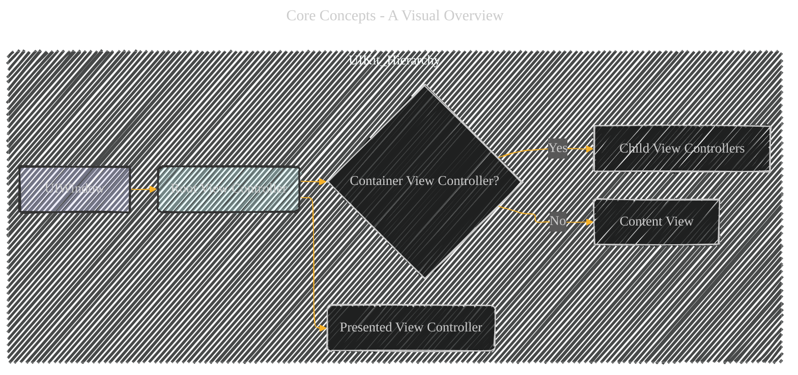
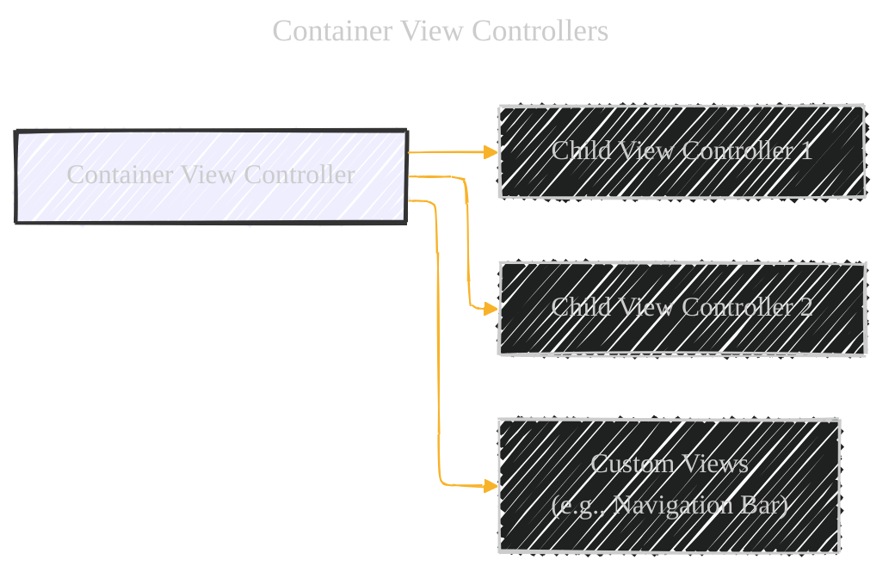
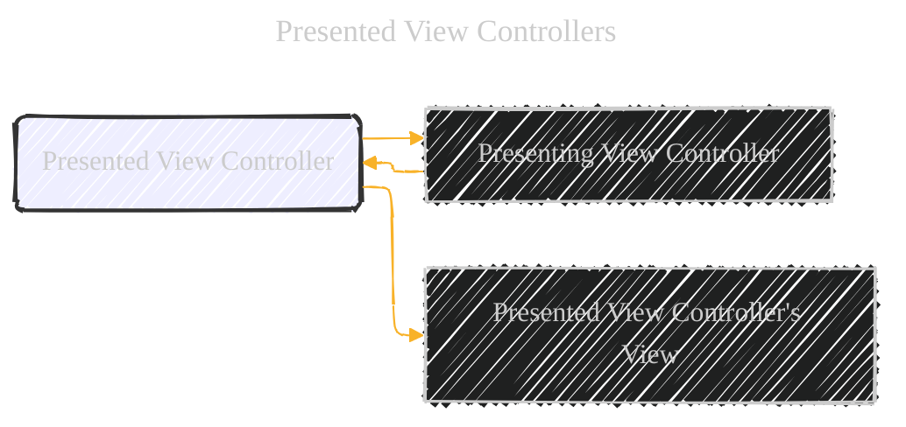
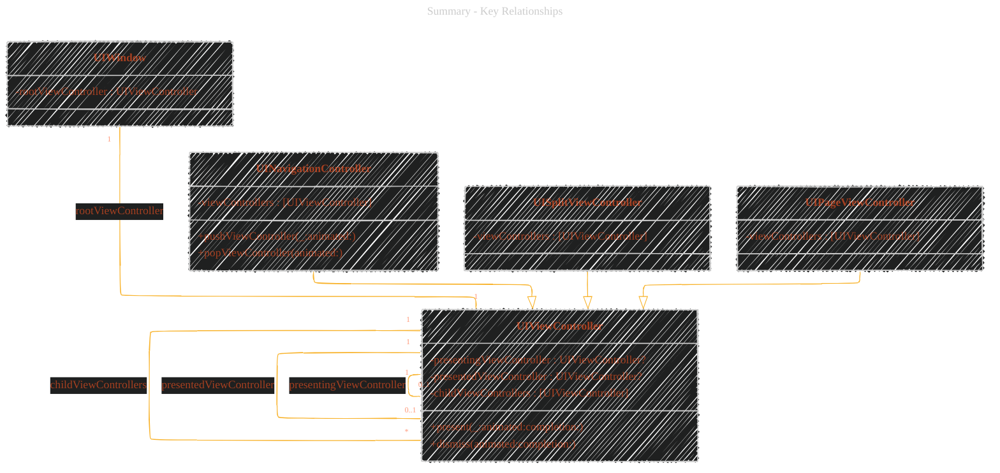

# The View Controller Hierarchy - A Diagrammatical Summary
> This content is dual-licensed under your choice of the following licenses:
> 1.  **MIT License:** For the code implementations in Swift, Mermaid, and any other programming languages provided in this document.
> 2.  **Creative Commons Attribution 4.0 International License (CC BY 4.0):** For all other content, including the text, explanations, and the Mermaid diagrams and illustrations.


---

## 1. Core Concepts - A Visual Overview




**Explanation:**

*   **`UIWindow`**: The top-level container.  Every app has at least one.
*   **Root View Controller**:  The starting point, filling the entire window's content area.
*   **Container View Controller**:  A view controller that manages other view controllers (children).  This is a *key concept*.
*   **Presented View Controller**: A view controller displayed modally or in another presentation style, often temporarily obscuring the previous content.
*    **Content View:** Represents regular view with no child controllers.

---

## 2. The Root View Controller

The root view controller is the foundation of the view controller hierarchy.  It's the first view controller loaded and its view occupies the entire `UIWindow`.


**Key Points:**

*   **Single Root**:  Each `UIWindow` has *exactly one* root view controller.
*   **Content Provider**: The root view controller's *view* provides all the visible content for the window.  The window itself is just a container.
*   **Access**:
    *   **Storyboard**: UIKit sets the root view controller automatically.
    *   **Programmatically**:  You *must* set the `rootViewController` property of the `UIWindow` yourself.

**Code Example (Swift):**

```swift
// In your AppDelegate or SceneDelegate
let window = UIWindow(frame: UIScreen.main.bounds)
let myRootViewController = MyViewController() // Your custom view controller
window.rootViewController = myRootViewController
window.makeKeyAndVisible()
```
**Code Example (Objective-C):**
```objectivec
// In your AppDelegate.m
UIWindow *window = [[UIWindow alloc] initWithFrame:[UIScreen mainScreen].bounds];
MyViewController *myRootViewController = [[MyViewController alloc] init]; // Your custom view controller
window.rootViewController = myRootViewController;
[window makeKeyAndVisible];
```

---

## 3. Container View Controllers

Container view controllers are the workhorses of complex UI layouts.  They manage one or more *child* view controllers, combining their views with custom views (like navigation bars or toolbars).




**Key Points:**

*   **Composition**:  Containers build UIs by composing multiple view controllers.
*   **Examples**: UIKit provides several built-in containers:
    *   `UINavigationController`:  Manages a stack of view controllers, providing navigation.
    *   `UISplitViewController`:  Presents a master-detail interface (common on iPad).
    *   `UIPageViewController`:  Allows swiping between different content pages.
*   **Root or Child**: Containers can be the root view controller *or* be children of other containers.
*   **Layout Responsibility**: The *container* is responsible for the layout and positioning of its child view controllers' views.  Children usually don't need to know about their container or siblings.
* **Custom Containers:** It is possible to implement a custom container.

**Example:  `UINavigationController` (Conceptual)**

```
[Navigation Controller]
   |
   |-- [Navigation Bar (Custom View)]
   |
   |-- [Child View Controller 1 (Content)]
   |
   |-- [Child View Controller 2 (Content)]  (Pushed onto the stack)
   |
   ...
```

---

## 4. Presented View Controllers

Presentation is the mechanism for displaying a new view controller, typically modally, to show new content or gather user input.




**Key Points:**

*   **`presentingViewController`**: The view controller that initiates the presentation.
*   **`presentedViewController`**: The view controller being presented.
*   **Relationships**: UIKit maintains a two-way relationship between the presenting and presented view controllers.  This is important for:
    *   Finding related view controllers at runtime.
    *   Propagating events (like rotation changes).
*   **Presentation Context**: UIKit determines which view controller will handle the presentation (the *presenting* view controller).  This is often:
    *   The nearest container view controller.
    *   The window's root view controller.
    *   A view controller that explicitly defines the presentation context.
*   **Full-Screen Presentations**:  For full-screen presentations, UIKit usually chooses a container that covers the entire screen (like a `UINavigationController` in many cases).

**Example: Presenting a View Controller (Swift):**

```swift
let newViewController = NewViewController()
present(newViewController, animated: true, completion: nil)
```
**Example: Presenting a View Controller (Objective-C):**

```objectivec
NewViewController *newViewController = [[NewViewController alloc] init];
[self presentViewController:newViewController animated:YES completion:nil];
```
**Example: Dismissing a presented View Controller (Swift):**
```swift
dismiss(animated: true, completion: nil)
//Or from within the presented VC:
self.presentingViewController?.dismiss(animated: true)
```
**Example: Dismissing a presented View Controller (Objective-C):**
```objectivec
[self dismissViewControllerAnimated:YES completion:nil];
//Or from within the presented VC:
[self.presentingViewController dismissViewControllerAnimated:YES completion:nil];
```

---

## 5. Presentation Context and Containers (Advanced)

When containers are involved, the presentation process gets more nuanced.  The container often takes over the presentation to ensure the new view controller is displayed correctly (especially for full-screen presentations).


**Explanation:**
* Child View Controller initiates the presentation using UIKit.
* UIKit asks the nearest container view controller if it can handle the presentation.
* Container View Controller checks the required presentation style, such as full screen.
* **If** the presentation style requires a container view controller to handle, then:
    * Container View Controller informs that it will handle.
    * Container View Controller adds the view of Presented View Controller to its own hierarchy.
    * Container View Controller notifies the view controller is now presented.
* **Else**:
    * UIKit handles the presentation.
    * UIKit notifies the view controller is presented.

**Key Idea**: The container acts as an intermediary, ensuring that presentations that need to cover the entire screen (or a specific portion of the screen) are handled correctly.  This simplifies the code in your child view controllers.

---

## 6. Summary - Key Relationships



**Explanation:**

*    **UIWindow:** Contains a single rootViewController of type UIViewController.
*   **UIViewController**:
    *   `presentingViewController`:  Optional reference to the controller that presented *this* controller.
    *   `presentedViewController`: Optional reference to the controller *this* controller presented.
    *   `childViewControllers`:  An array of child view controllers (if this is a container).
    *   `present(...)` and `dismiss(...)`: Methods for presenting and dismissing view controllers.
*   **`UINavigationController`, `UISplitViewController`, `UIPageViewController`**:  These are *subclasses* of `UIViewController` (they *are* view controllers) and act as containers.  They have specific properties (like `viewControllers`) to manage their children.


---
**Licenses:**

- **MIT License:**  [](LICENSE) - Full text in [LICENSE](LICENSE) file.
- **Creative Commons Attribution 4.0 International:** [](LICENSE-CC-BY) - Legal details in [LICENSE-CC-BY](LICENSE-CC-BY) and at [Creative Commons official site](http://creativecommons.org/licenses/by/4.0/).

---