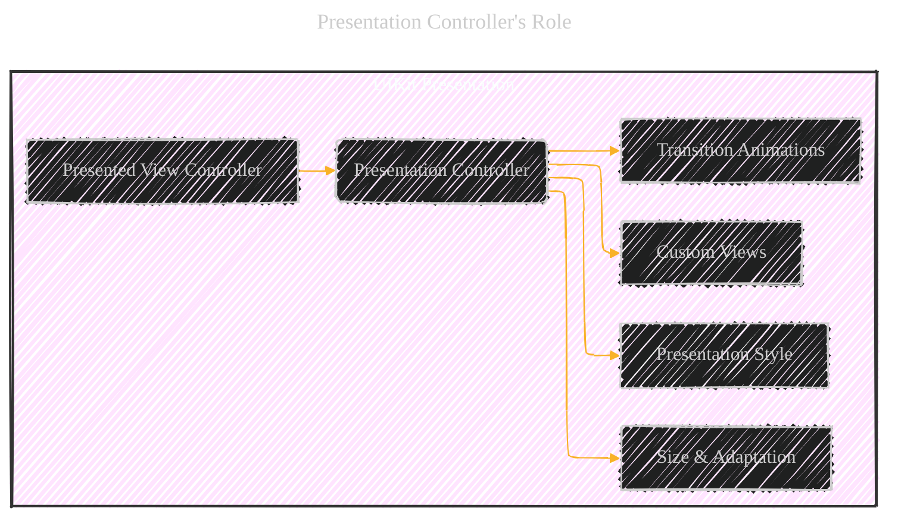
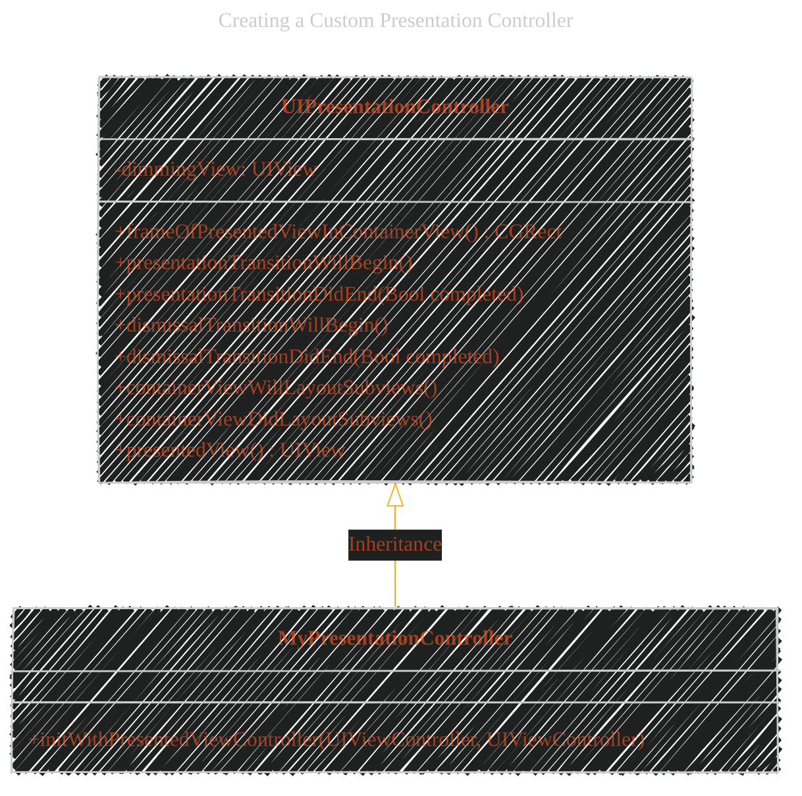

# Creating Custom Presentations - A Diagrammatical Summary
> **Disclaimer:**
>
> This document contains my personal notes on the topic,
> compiled from publicly available documentation and various cited sources.
> The materials are intended for educational purposes, personal study, and reference.
> The content is dual-licensed:
> 1. **MIT License:** Applies to all code implementations (Swift, Mermaid, and other programming languages).
> 2. **Creative Commons Attribution 4.0 International License (CC BY 4.0):** Applies to all non-code content, including text, explanations, diagrams, and illustrations.
---


## 1. Core Concept:  Presentation Controller's Role



**Explanation:**

*   This diagram illustrates the central role of the `UIPresentationController`.  It sits between the presented view controller and how it's displayed.
*   The presentation controller manages custom views, the overall style, transition animations, and how the presentation adapts to size changes.

----

## 2. The Custom Presentation Process (Presentation & Dismissal)

This is the most critical part of the document, detailing the sequence of events.  We'll use a sequence diagram to capture the interaction between UIKit, the Transitioning Delegate, the Presentation Controller, and Animator Objects.


**Explanation:**

*   This sequence diagram meticulously details the interactions.  Each arrow represents a method call.
*   `activate` and `deactivate` visually show when an object is actively processing.
*   Notes explain the purpose of key method calls.
*   The `loop` sections highlight the repeated layout calls during animation.
*   Crucially, it shows *both* the presentation and dismissal processes.

----

## 3.  Creating a Custom Presentation Controller (Key Methods)



**Explanation:**

*   This class diagram shows the key methods you'll override in your custom `UIPresentationController` subclass (`MyPresentationController` in the example).
*   It highlights the inheritance relationship.
*   It also includes the `dimmingView` property, which is common in custom presentations (as seen in the code examples).

----

## 4.  Code Snippets Visualized

The provided code listings are best understood by combining the code with concise explanations.  I'll represent these as "annotated code blocks."

**Listing 11-1:  Changing the Frame**

```objc
// Objective-C
- (CGRect)frameOfPresentedViewInContainerView {
    CGRect presentedViewFrame = CGRectZero;
    CGRect containerBounds = [[self containerView] bounds];

    // 1. Set the size to half the container's width
    presentedViewFrame.size = CGSizeMake(floorf(containerBounds.size.width / 2.0),
                                         containerBounds.size.height);
    // 2. Position on the right side
    presentedViewFrame.origin.x = containerBounds.size.width -
                                    presentedViewFrame.size.width;
    return presentedViewFrame;
}
```

*   **1. Size Calculation:** The presented view's width is set to half the container's width, while the height remains the same.  `floorf` ensures an integer value.
*   **2. Positioning:** The `x` origin is calculated to place the view on the right edge of the container.

**Listing 11-2: Initializing the Presentation Controller**

```objc
// Objective-C
- (instancetype)initWithPresentedViewController:(UIViewController *)presentedViewController
                     presentingViewController:(UIViewController *)presentingViewController {
    self = [super initWithPresentedViewController:presentedViewController
                         presentingViewController:presentingViewController];
    if(self) {
        // 1. Create the dimming view
        self.dimmingView = [[UIView alloc] init];
        // 2. Set background color (semi-transparent black)
        [self.dimmingView setBackgroundColor:[UIColor colorWithWhite:0.0 alpha:0.4]];
        // 3. Initially make it transparent
        [self.dimmingView setAlpha:0.0];
    }
    return self;
}
```

*   **1. Dimming View Creation:** A `UIView` is allocated and initialized.
*   **2. Background Color:**  A semi-transparent black color is set (white level 0.0, alpha 0.4).
*   **3. Initial Transparency:** The `alpha` is set to 0.0, making it initially invisible.

**Listing 11-3: Animating the Dimming View (Presentation)**

```objc
// Objective-C
- (void)presentationTransitionWillBegin {
    UIView* containerView = [self containerView];
    UIViewController* presentedViewController = [self presentedViewController];

    // 1. Size the dimming view to the container's bounds
    [[self dimmingView] setFrame:[containerView bounds]];
    [[self dimmingView] setAlpha:0.0]; // Still initially transparent

    // 2. Insert the dimming view at the bottom of the view hierarchy
    [containerView insertSubview:[self dimmingView] atIndex:0];

    // 3. Animate the alpha change
    if([presentedViewController transitionCoordinator]) {
        [[presentedViewController transitionCoordinator]
               animateAlongsideTransition:^(id<UIViewControllerTransitionCoordinatorContext> context) {
            // Fade in the dimming view
            [[self dimmingView] setAlpha:1.0];
        } completion:nil];
    }
    else {
        [[self dimmingView] setAlpha:1.0]; // Immediate change if no coordinator
    }
}
```

*   **1. Sizing and Positioning:**  The dimming view's frame is set to match the container view's bounds.
*   **2. View Hierarchy:** The dimming view is inserted *below* all other views in the container.
*   **3. Animation:**  The `transitionCoordinator` is used to animate the `alpha` property of the dimming view from 0.0 to 1.0, creating a fade-in effect.  The `animateAlongsideTransition` method ensures this animation runs concurrently with the main presentation animation.

**Listing 11-4: Handling a Cancelled Presentation**

```objc
// Objective-C
- (void)presentationTransitionDidEnd:(BOOL)completed {
    // If the presentation was canceled, remove the dimming view.
    if (!completed)
        [self.dimmingView removeFromSuperview];
}
```

*   **Cancellation Check:** The `completed` parameter indicates whether the presentation finished successfully.  If *not* completed (i.e., canceled), the dimming view is removed.

**Listing 11-5: Dismissing the Presentation's Views**

```objc
// Objective-C
- (void)dismissalTransitionWillBegin {
    // Fade the dimming view back out.
    if([[self presentedViewController] transitionCoordinator]) {
        [[[self presentedViewController] transitionCoordinator]
           animateAlongsideTransition:^(id<UIViewControllerTransitionCoordinatorContext> context) {
            [[self dimmingView] setAlpha:0.0]; // Fade out
        } completion:nil];
    }
    else {
        [[self dimmingView] setAlpha:0.0]; // Immediate change
    }
}

- (void)dismissalTransitionDidEnd:(BOOL)completed {
    // If the dismissal was successful, remove the dimming view.
    if (completed)
        [self.dimmingView removeFromSuperview];
}
```

*   **`dismissalTransitionWillBegin`:**  Similar to the presentation, the dimming view's `alpha` is animated, this time from 1.0 to 0.0 (fading out).
*   **`dismissalTransitionDidEnd`:**  If the dismissal completes successfully (`completed` is true), the dimming view is removed from the view hierarchy.

**Listing 11-6: Vending the Presentation Controller**

```objc
// Objective-C
- (UIPresentationController *)presentationControllerForPresentedViewController:(UIViewController *)presented
                                  presentingViewController:(UIViewController *)presenting
                                      sourceViewController:(UIViewController *)source {

    MyPresentationController* myPresentation = [[MyPresentationController alloc]
       initWithPresentedViewController:presented presentingViewController:presenting];

    return myPresentation;
}
```

*   **Instantiation:**  An instance of your custom presentation controller (`MyPresentationController`) is created.
*   **Return Value:** The newly created presentation controller is returned to UIKit.

-----

## 5.  Adapting to Different Size Classes


**Explanation:**

*   This diagram shows how the presentation controller receives notifications about size and trait changes.
*   You would override `containerViewWillLayoutSubviews`, `containerViewDidLayoutSubviews`, and potentially respond to trait collection changes to adjust your custom views and layout.

----

## 6. Key Steps: Presenting with a Custom Controller

This summarizes the setup required to *use* your custom presentation controller:

1.  **Set `modalPresentationStyle`:**  On the view controller to be presented, set its `modalPresentationStyle` to `UIModalPresentationCustom`.
2.  **Assign `transitioningDelegate`:** Set the `transitioningDelegate` property of the presented view controller to an object that conforms to `UIViewControllerTransitioningDelegate`.
3.  **Implement Delegate Method:** In your transitioning delegate, implement `presentationControllerForPresentedViewController:presentingViewController:sourceViewController:` to create and return an instance of your custom presentation controller.


---

<!-- 


---
**Licenses:**

- **MIT License:**  [](LICENSE) - Full text in [LICENSE](LICENSE) file.
- **Creative Commons Attribution 4.0 International:** [](LICENSE-CC-BY) - Legal details in [LICENSE-CC-BY](LICENSE-CC-BY) and at [Creative Commons official site](http://creativecommons.org/licenses/by/4.0/).

---
