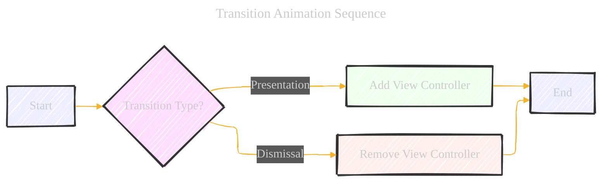
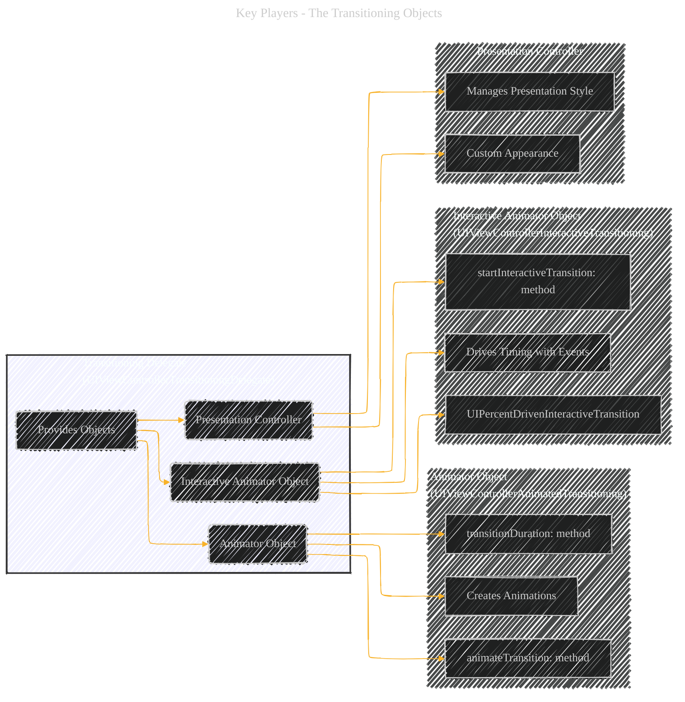
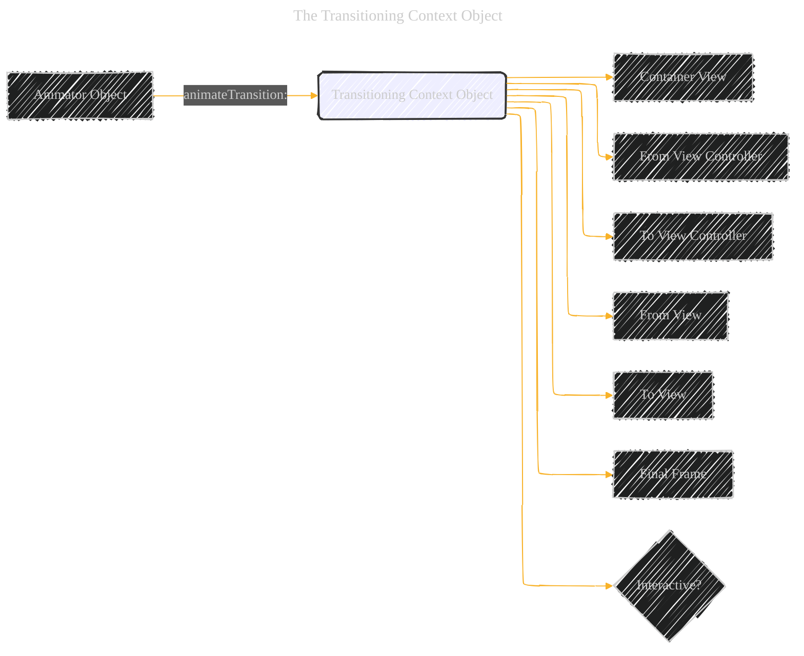
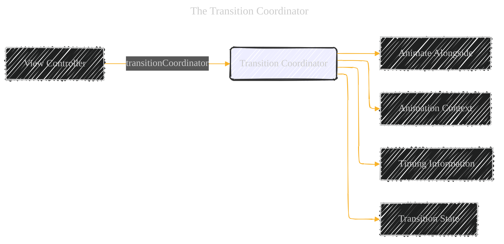
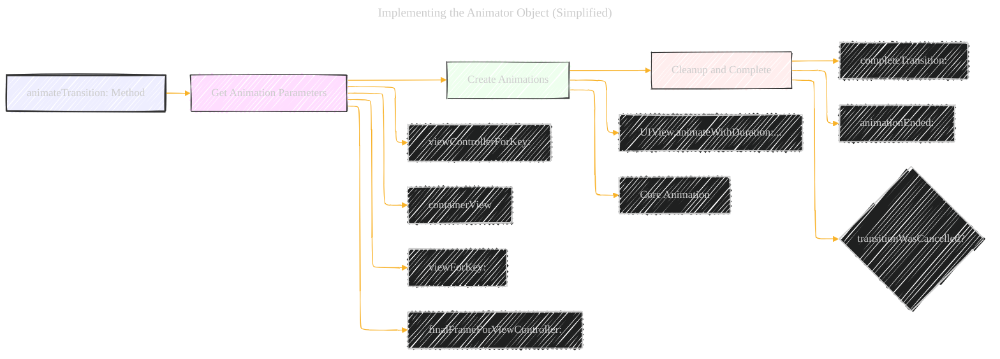
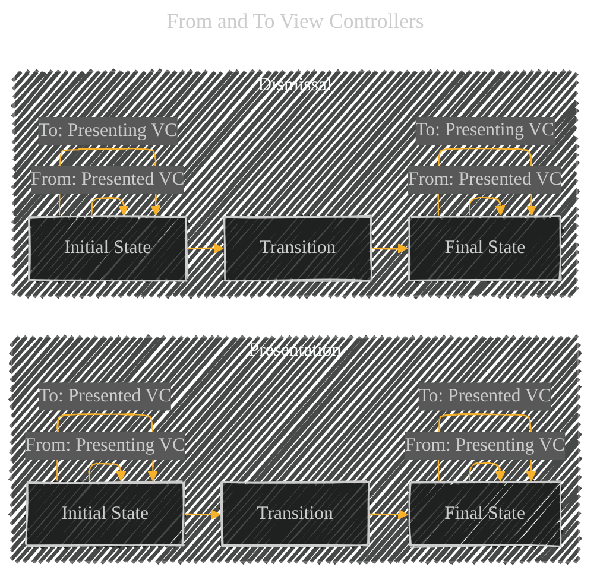
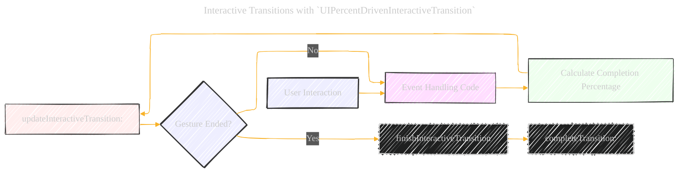

# Customizing the Transition Animations - A Diagrammatical Summary
> **Disclaimer:**
>
> This document contains my personal notes on the topic,
> compiled from publicly available documentation and various cited sources.
> The materials are intended for educational purposes, personal study, and reference.
> The content is dual-licensed:
> 1. **MIT License:** Applies to all code implementations (Swift, Mermaid, and other programming languages).
> 2. **Creative Commons Attribution 4.0 International License (CC BY 4.0):** Applies to all non-code content, including text, explanations, diagrams, and illustrations.
---


## 1. Core Concepts: Transition Animation Sequence




**Explanation:**

*   **Start:**  The transition process begins.
*   **Transition Type?:**  A decision point: Is this a *presentation* (adding a new view controller) or a *dismissal* (removing a view controller)?
*   **Add View Controller:**  If presenting, a new view controller is added to the hierarchy.
*   **Remove View Controller:** If dismissing, a view controller is removed.
*   **End:** The transition process concludes.

This diagram simplifies the top-level concept: transitions either add or remove view controllers.

---

## 2. Key Players: The Transitioning Objects




**Explanation:**

*   **Transitioning Delegate:**  The central coordinator.  It provides the necessary objects to UIKit.  Conforms to `UIViewControllerTransitioningDelegate`.
*   **Animator Object:** Responsible for creating the actual animations (e.g., fading, sliding). Conforms to `UIViewControllerAnimatedTransitioning`.  Key methods: `animateTransition:` (where the animation logic resides) and `transitionDuration:` (specifies animation length).
*   **Interactive Animator Object:**  Controls the *timing* of animations based on user interaction (e.g., swiping). Conforms to `UIViewControllerInteractiveTransitioning`.  Often a subclass of `UIPercentDrivenInteractiveTransition`. Key Method: `startInteractiveTransition:`
*   **Presentation Controller:** Manages the *overall presentation style*, not just the animation itself. Used for custom presentations (`UIModalPresentationCustom`).

This diagram clarifies the roles and relationships of the main objects involved.

---

## 3. The Custom Animation Sequence (Presentation)


**Explanation (Presentation):**

1.  **Get Animator:** UIKit asks the `TransitioningDelegate` for the animator object (`animationControllerForPresentedController:`).
2.  **Get Interactive Animator (Optional):**  UIKit checks for an interactive animator (`interactionControllerForPresentation:`).
3.  **Get Duration:**  If non-interactive, UIKit gets the animation duration from the animator (`transitionDuration:`).
4.  **Start Animation:**
    *   **Non-Interactive:** UIKit calls `animateTransition:` on the animator.
    *   **Interactive:** UIKit calls `startInteractiveTransition:` on the interactive animator.
5.  **Animation Execution:**  The animator performs the animation (in `animateTransition:` for non-interactive, or driven by events for interactive).
6.  **Completion:** The animator (or interactive animator) calls `completeTransition:` on the *transition context object* to signal the end of the transition.
7. **UIKit waits:** The most important point, showing the sequence, interaction, and conditions.

The sequence for dismissal is very similar, using `animationControllerForDismissedController:` and `interactionControllerForDismissal:` instead.

---

## 4. The Transitioning Context Object



**Explanation:**

*   **Transitioning Context Object (`UIViewControllerContextTransitioning`):**  Provides *all* the necessary information for the animator.  It's passed to the `animateTransition:` method.
*   **Container View:**  The view where the animation takes place.  Crucially, new views are added to this container.
*   **From/To View Controllers:** The view controllers involved in the transition.
*   **From/To Views:**  The root views of the view controllers (may include additional views from a presentation controller).
*   **Final Frame:**  The final frame rectangle for the view being added/removed.
*   **Interactive?:**  Indicates whether the transition is interactive.

This emphasizes the importance of the context object as the *single source of truth* for animation parameters.

----

## 5. The Transition Coordinator



**Explanation:**

*   **Transition Coordinator (`UIViewControllerTransitionCoordinator`):**  Allows for *additional* animations to run *concurrently* with the main transition. Accessed via the `transitionCoordinator` property of a view controller.
*   **Animate Alongside:**  Methods like `animateAlongsideTransition:completion:` allow you to add your own animation blocks.
*   **Animation Context (`UIViewControllerTransitionCoordinatorContext`):**  Provides information similar to the transitioning context object, but for the alongside animations.
*   **Timing Information:**  Provides details about the transition's timing.
*   **Transition State:**  Indicates the current state of the transition.

This highlights the coordinator's role in synchronizing extra animations.

----

## 6. Implementing the Animator Object (Simplified)



**Explanation:**

1.  **`animateTransition:` Method:**  The core of the animator object.
2.  **Get Animation Parameters:**  Use the transitioning context object (passed to `animateTransition:`) to get:
    *   `viewControllerForKey:` (get the "from" and "to" view controllers)
    *   `containerView` (the superview for animations)
    *   `viewForKey:` (get the views to be added/removed)
    *   `finalFrameForViewController:` (get the final frame)
3.  **Create Animations:**  Use either:
    *   `UIView.animateWithDuration:...` (block-based animations)
    *   Core Animation (for more complex animations)
4.  **Cleanup and Complete:**
    *   Call `completeTransition:` on the context object to signal completion.
    *   Handle cancellation using `transitionWasCancelled`.
    *   Optionally implement `animationEnded:` for additional cleanup.

----

## 7.  "From" and "To" View Controllers



**Explanation:**

*   This diagram illustrates how the "from" and "to" view controllers change roles during presentation and dismissal.
*   **Presentation:**
    *   **Initial:** "From" is the presenting view controller, "To" is the presented view controller.
    *   **Final:**  Roles remain the same.
*   **Dismissal:**
    *   **Initial:** "From" is the presented view controller (being dismissed), "To" is the presenting view controller.
    *   **Final:** Roles remain the same.

This clarifies the swapping roles, which simplifies animator logic.

-----

## 8. Interactive Transitions with `UIPercentDrivenInteractiveTransition`



**Explanation:**

1.  **User Interaction:**  A gesture (e.g., swipe) begins.
2.  **Event Handling Code:**  Your code (e.g., a gesture recognizer's action method) receives events.
3.  **Calculate Completion Percentage:**  Based on the gesture's progress, calculate a percentage (0.0 to 1.0).
4.  **`updateInteractiveTransition:`:**  Call this method on the `UIPercentDrivenInteractiveTransition` object with the calculated percentage.  This updates the animation's progress.
5.  **Gesture Ended?:**  Check if the gesture has finished.
6.  **`finishInteractiveTransition`:** If the gesture ended, call this method to complete the transition.
7.  **`completeTransition:`:** The interactive transition calls complete transition.

This shows the flow of control for interactive transitions.


----

## 9. Code Snippets (Illustrative - Not Complete)

**9.1 Transitioning Delegate (Swift):**

```swift
class MyTransitioningDelegate: NSObject, UIViewControllerTransitioningDelegate {
    func animationController(forPresented presented: UIViewController, presenting: UIViewController, source: UIViewController) -> UIViewControllerAnimatedTransitioning? {
        let animator = MyAnimator()
        animator.isPresenting = true // Set a custom property
        return animator
    }

    func animationController(forDismissed dismissed: UIViewController) -> UIViewControllerAnimatedTransitioning? {
        let animator = MyAnimator()
        animator.isPresenting = false
        return animator
    }
    
    //optionally provide interactive animator
    func interactionControllerForDismissal(using animator: UIViewControllerAnimatedTransitioning) -> UIViewControllerInteractiveTransitioning? {
        return myInteractiveAnimator
    }
}

```

**9.2 Animator Object (Swift - Simplified):**

```swift
class MyAnimator: NSObject, UIViewControllerAnimatedTransitioning {
    var isPresenting = true // Custom property

    func transitionDuration(using transitionContext: UIViewControllerContextTransitioning?) -> TimeInterval {
        return 0.5 // Duration in seconds
    }

    func animateTransition(using transitionContext: UIViewControllerContextTransitioning) {
        let containerView = transitionContext.containerView
        let toView = transitionContext.view(forKey: .to)!
        let fromView = transitionContext.view(forKey: .from)!

        if isPresenting {
            containerView.addSubview(toView)
            toView.frame = //... Calculate initial frame (offscreen)
            
            UIView.animate(withDuration: transitionDuration(using: transitionContext), animations: {
                toView.frame = transitionContext.finalFrame(for: transitionContext.viewController(forKey: .to)!)
            }, completion: { finished in
                transitionContext.completeTransition(!transitionContext.transitionWasCancelled)
            })
        } else {
             //add the toView to the container
            containerView.addSubview(toView)
            // Dismissal animation...
            UIView.animate(withDuration: transitionDuration(using: transitionContext), animations: {
                           fromView.frame = //... Calculate final frame (offscreen)
                       }, completion: { finished in
                           fromView.removeFromSuperview()
                           transitionContext.completeTransition(!transitionContext.transitionWasCancelled)
                       })
        }
    }
}
```

**9.3 Interactive Animator (Swift - Conceptual):**

```swift
class MyInteractiveAnimator: UIPercentDrivenInteractiveTransition {
    var contextData: UIViewControllerContextTransitioning?
    var panGesture: UIPanGestureRecognizer!

    override func startInteractiveTransition(_ transitionContext: UIViewControllerContextTransitioning) {
        super.startInteractiveTransition(transitionContext)
        self.contextData = transitionContext

        panGesture = UIPanGestureRecognizer(target: self, action: #selector(handleSwipeUpdate(_:)))
        transitionContext.containerView.addGestureRecognizer(panGesture)
    }

    @objc func handleSwipeUpdate(_ gestureRecognizer: UIGestureRecognizer) {
        let container = contextData!.containerView
        // ... Calculate percentage based on gesture ...
        let percentage: CGFloat = //calculate the percentage

        switch gestureRecognizer.state {
            case .began:
                panGesture.setTranslation(.zero, in: container)
            case .changed:
                update(percentage)
            case .ended, .cancelled:
                if percentage > 0.5 {
                    finish()
                } else{
                    cancel()
                }
                container.removeGestureRecognizer(panGesture)
                
            default: break;
        }
    }
}
```


---
**Licenses:**

- **MIT License:**  [](LICENSE) - Full text in [LICENSE](LICENSE) file.
- **Creative Commons Attribution 4.0 International:** [](LICENSE-CC-BY) - Legal details in [LICENSE-CC-BY](LICENSE-CC-BY) and at [Creative Commons official site](http://creativecommons.org/licenses/by/4.0/).

---