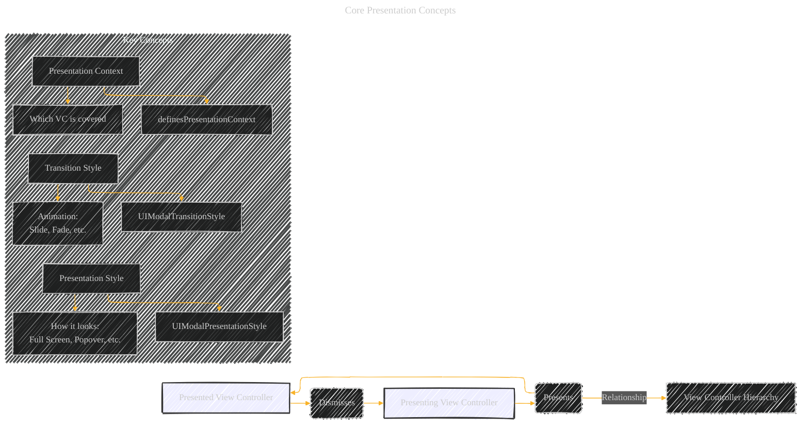
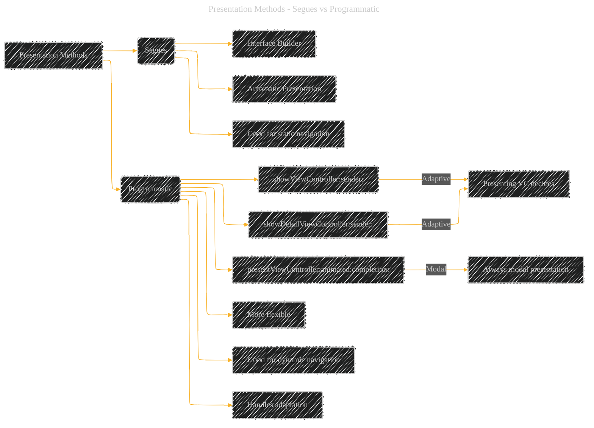
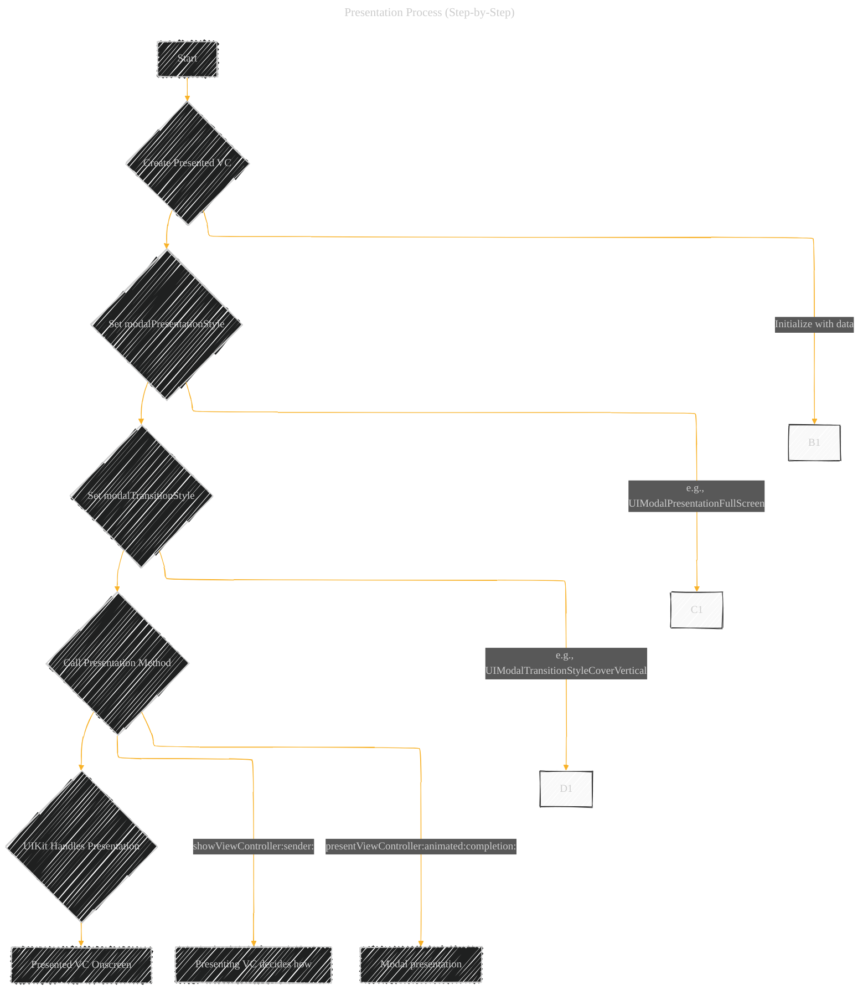
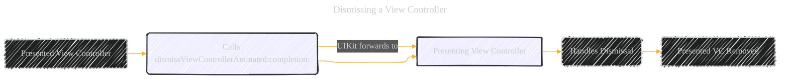
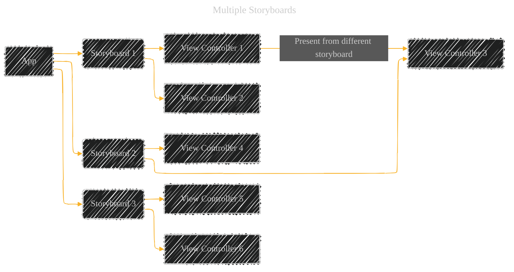
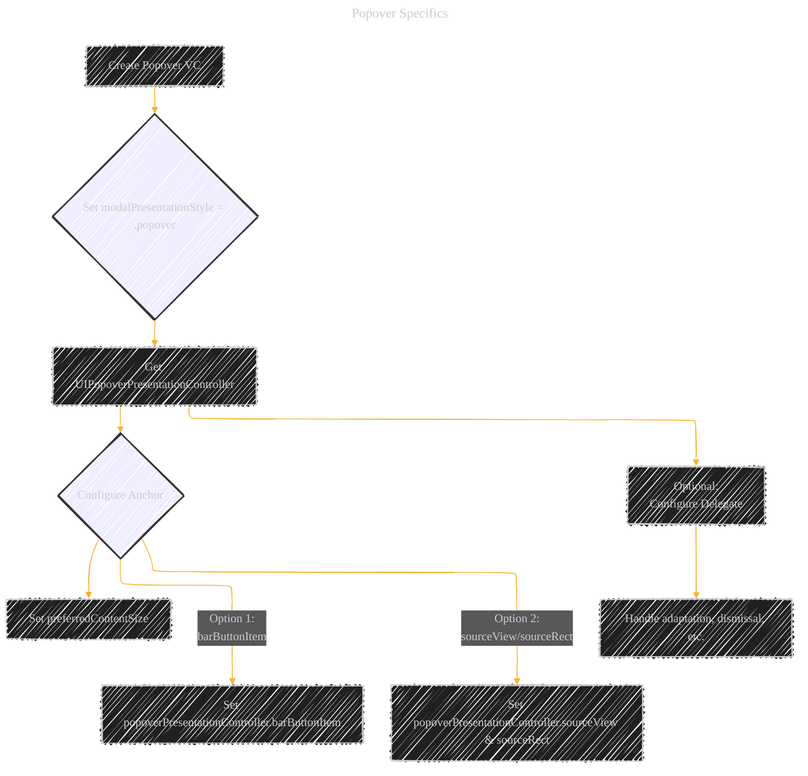

# Presenting a View Controller - A Diagrammatical Summary
> **Disclaimer:**
>
> This document contains my personal notes on the topic,
> compiled from publicly available documentation and various cited sources.
> The materials are intended for educational purposes, personal study, and reference.
> The content is dual-licensed:
> 1. **MIT License:** Applies to all code implementations (Swift, Mermaid, and other programming languages).
> 2. **Creative Commons Attribution 4.0 International License (CC BY 4.0):** Applies to all non-code content, including text, explanations, diagrams, and illustrations.
---


## Overall Structure and Key Concepts

This document explains how to display new view controllers on top of existing ones in iOS, primarily focusing on _presentation_. It covers:

1. **Presentation Styles:** How the new view controller appears (full-screen, popover, etc.).
2. **Transition Styles:** The animation used to bring the new view controller on screen.
3. **Presentation Methods:** Using segues (Interface Builder) or programmatic methods (`showViewController:sender:`, `presentViewController:animated:completion:`).
4. **Dismissal:** How to remove the presented view controller.
5. **Data Passing:** Using delegation to pass data back to the presenting view controller.
6. **Multiple Storyboards:** When and why to use them.

I'll now create visualizations to represent these concepts.

----


## 1. Core Presentation Concepts




**Explanation:**

- This diagram establishes the fundamental relationship between the _presenting_ and _presented_ view controllers.
- It highlights that presentation creates a hierarchy.
- The "Concepts" subgraph introduces key terms like `Presentation Style`, `Transition Style`, and `Presentation Context`. It links these to the relevant UIKit properties.

---

## 2. Presentation Styles (Visual Representation)

Since Mermaid isn't ideal for representing visual layouts directly, I'll use a combination of a table and conceptual drawings (which you could replace with actual screenshots in a real document).

**Table: Presentation Styles**

|Style|Description|Horizontally Regular|Horizontally Compact|
|---|---|---|---|
|`UIModalPresentationFullScreen`|Covers the entire screen.|Covers fully|Covers fully|
|`UIModalPresentationPageSheet`|(Regular) Leaves part of the underlying view visible at the top.|Partial cover|Covers fully|
|`UIModalPresentationFormSheet`|(Regular) Smaller, centered view. Allows some of the underlying content to show.|Partial cover|Covers fully|
|`UIModalPresentationPopover`|Displays content in a popover.|Popover|Full Screen|
|`UIModalPresentationCurrentContext`|Covers a specific view controller (defined by `definesPresentationContext`).|Covers defined VC|Covers fully|
|`UIModalPresentationOverFullScreen`|Covers the entire screen. The content below is visible if the presented view controller has transparency.|Covers fully|Cover fully.|
|`UIModalPresentationCustom`|Allows for completely custom presentations using a `UIPresentationController`.|Custom|Custom|

**Conceptual Drawings (Illustrative - Replace with Images):**


```txt
// UIModalPresentationFullScreen
+---------------------+     +---------------------+
|                     |     |                     |
|  Presenting VC      |  -> |  Presented VC       |
|                     |     |                     |
+---------------------+     +---------------------+

// UIModalPresentationPageSheet (Regular)
+---------------------+     +---------------------+
|                     |     |                     |
|  Presenting VC      |  -> |  Presented VC       |
| (Partially Visible) |     |                     |
+---------------------+     +---------------------+
      (Dimming)

// UIModalPresentationFormSheet (Regular)
+---------------------+     +---------------------+
|                     |     |   +-----------+     |
|  Presenting VC      |  -> |   | Presented |     |
| (Partially Visible) |     |   |    VC     |     |
+---------------------+     +---------------------+
      (Dimming)

// UIModalPresentationPopover (Regular)
+---------------------+     +---------------------+
|                     |     |   +-------+         |
|  Presenting VC      |  -> |   | Popover |         |
|                     |     |   +-------+         |
+---------------------+     +---------------------+
```

**Explanation:**

- The table provides a concise summary of each presentation style and its behavior in different size classes.
- The conceptual drawings give a basic visual idea of how each style appears. In a real document, you would replace these with actual screenshots from an iOS device or simulator.

----

## 3. Transition Styles (Conceptual Animation)

Again, Mermaid isn't built for animation, so I'll describe the animations conceptually, and you could use GIFs or videos in a real document.

**Table: Transition Styles**

|Style|Description|
|---|---|
|`UIModalTransitionStyleCoverVertical`|The presented view controller slides up from the bottom. (Default)|
|`UIModalTransitionStyleFlipHorizontal`|The presenting view controller flips horizontally to reveal the presented view controller.|
|`UIModalTransitionStyleCrossDissolve`|The presented view controller fades in while the presenting view controller fades out.|
|`UIModalTransitionStylePartialCurl`|The presenting view controller's bottom edge curls up to reveal the presented view controller.|
|_Custom_ (using animator object and delegate)|Allows for completely custom transition animations.|

**Conceptual Animation Descriptions (Illustrative):**

- **`UIModalTransitionStyleCoverVertical`:** Imagine a sheet of paper sliding up from the bottom of the screen to cover the existing content.
- **`UIModalTransitionStyleFlipHorizontal`:** Imagine a card flipping over to show its back.
- **`UIModalTransitionStyleCrossDissolve`:** A smooth fade-in/fade-out transition.
- **`UIModalTransitionStylePartialCurl`:** Imagine the bottom corner of a page being peeled up.

----

## 4. Presentation Methods: Segues vs. Programmatic





**Explanation:**

- This diagram differentiates between using segues (defined in Interface Builder) and programmatic presentation.
- It highlights the key advantages of each approach.
- It clarifies the difference between the adaptive `show...` methods and the always-modal `presentViewController...` method.

-----

## 5. Presentation Process (Step-by-Step)




**Explanation:**

- This flowchart outlines the steps involved in presenting a view controller programmatically.
- It emphasizes the responsibilities of the developer (creating and configuring the view controller) and the role of UIKit in handling the actual presentation.
- It shows the branching paths for `showViewController:` and `presentViewController:`.

----

## 6. Dismissing a View Controller




**Explanation:**

- This diagram shows how dismissing a view controller works.
- It clarifies that the call can be made on either the presented _or_ presenting view controller.
- It highlights the role of the presenting view controller in ultimately handling the dismissal.

----

## 7. Data Passing with Delegation


**Explanation:**

- This UML class diagram illustrates the delegation pattern.
- It shows the `PresentingViewController` and `PresentedViewController` classes.
- The `PresentedViewControllerDelegate` protocol defines the method(s) for data transfer (`presentedViewControllerDidFinish` in this example).
- The `PresentingViewController` conforms to the delegate protocol and sets itself as the delegate of the `PresentedViewController`.
- The `PresentedViewController` calls the delegate method to pass data back.

----

## 8. Multiple Storyboards




**Explanation:**

- This diagram visualizes the concept of multiple storyboards within an app.
- It shows how view controllers from one storyboard can present view controllers from another.

**Code Example (Illustrative, Swift):**

```swift
// In PresentingViewController.swift
func presentFromOtherStoryboard() {
    let storyboard = UIStoryboard(name: "SecondStoryboard", bundle: nil)
    if let myVC = storyboard.instantiateViewController(withIdentifier: "MyViewController") as? MyViewController {
        // Configure myVC
        present(myVC, animated: true, completion: nil)
    }
}
```

This code snippet, combined with the diagram, demonstrates how to instantiate and present a view controller from a different storyboard.

----

## 9. Popover Specifics




**Explanation:**

- This flowchart outlines the popover presentation configuration.
- It calls out the popover-specific steps, such as:
    - Setting `.popover` style.
    - Getting the `UIPopoverPresentationController`.
    - Setting the anchor point (either `barButtonItem` or `sourceView`/`sourceRect`).
    - Setting the preferred content size.
    - Optionally setting a delegate for handling events.


---
**Licenses:**

- **MIT License:**  [](LICENSE) - Full text in [LICENSE](LICENSE) file.
- **Creative Commons Attribution 4.0 International:** [](LICENSE-CC-BY) - Legal details in [LICENSE-CC-BY](LICENSE-CC-BY) and at [Creative Commons official site](http://creativecommons.org/licenses/by/4.0/).

---