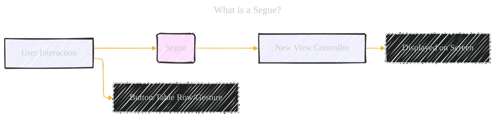
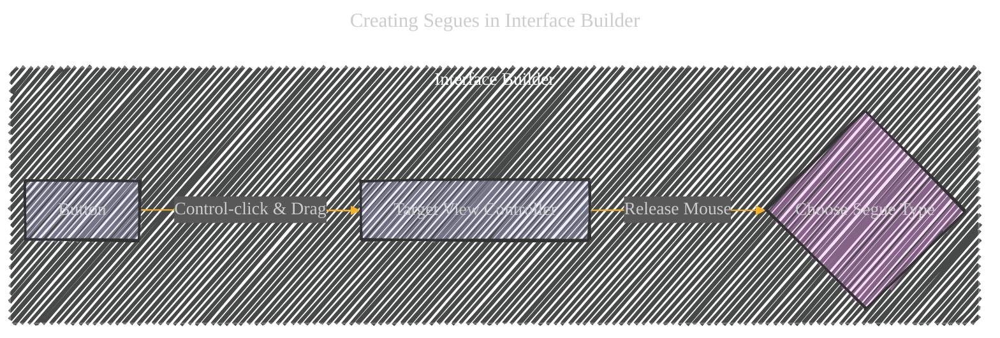
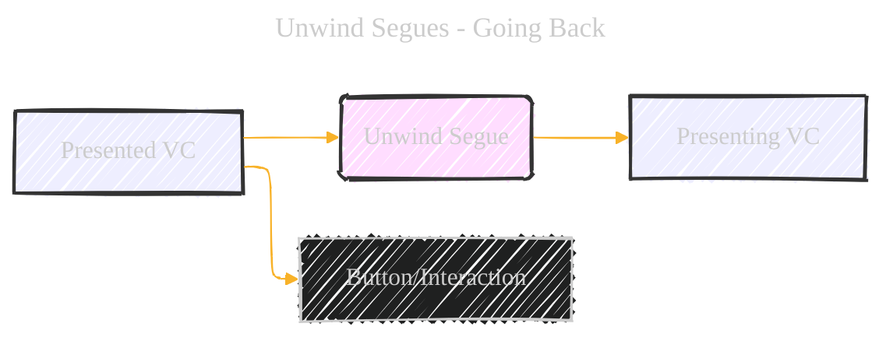
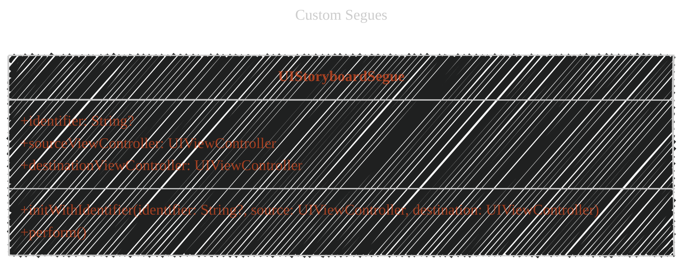

# Using Segues - A Diagrammatical Summary
> **Disclaimer:**
>
> This document contains my personal notes on the topic,
> compiled from publicly available documentation and various cited sources.
> The materials are intended for educational purposes, personal study, and reference.
> The content is dual-licensed:
> 1. **MIT License:** Applies to all code implementations (Swift, Mermaid, and other programming languages).
> 2. **Creative Commons Attribution 4.0 International License (CC BY 4.0):** Applies to all non-code content, including text, explanations, diagrams, and illustrations.
---


This document explains the concept of segues in iOS development, focusing on how they manage transitions between view controllers within a storyboard. We'll cover creating, modifying, and customizing segues, including unwind segues and programmatic triggers.


## 1. What is a Segue?

A segue defines a transition between two view controllers in your app's storyboard. It's a visual way to represent the flow of your user interface.

- **Starting Point:** A UI element (button, table row, gesture recognizer) that initiates the transition.
- **End Point:** The view controller you want to display.
- **Direction:** Always presents a new view controller. Unwind segues dismiss view controllers.



**Analogy:** Think of segues like transitions in a presentation. A click (the trigger) moves you to the next slide (the new view controller).

---

## 2. Creating Segues in Interface Builder

You visually create segues in Interface Builder by Control-clicking and dragging from the initiating element (like a button) to the target view controller.

**Steps:**

1. **Control-click** the initiating UI element (button, table row, etc.).
2. **Drag** to the target view controller.
3. **Release** the mouse button.
4. **Choose** the segue type from the pop-up menu.




**Image Representation (Conceptual):**

```txt
+-----------------+     +---------------------+
|  View Controller |     | Target View         |
|  +-----------+  |     | Controller          |
|  |  Button   |-----|-->|                     |
|  +-----------+  |     |                     |
+-----------------+     +---------------------+
       ^
       | Control-click & Drag
```

---

## 3. Types of Adaptive Segues

It's recommended to use _adaptive_ segues, which automatically adjust their behavior based on the device's screen size and orientation (horizontally regular or compact).


**Table Summary:**

|Segue Type|Behavior|
|---|---|
|Show (Push)|Uses `showViewController:sender:`. Usually presents modally. Navigation controllers push the new VC onto their stack.|
|Show Detail (Replace)|Uses `showDetailViewController:sender:`. For `UISplitViewController`, replaces the detail VC. Otherwise, presents modally.|
|Present Modally|Presents the view controller modally, using specified presentation and transition styles.|
|Present as Popover|In a horizontally regular environment, displays as a popover. In a horizontally compact environment, it's a full-screen modal presentation. (Think iPad vs. iPhone in portrait mode).|

**Important:** After creating a segue, give it an _identifier_ in the Attributes Inspector. This is crucial for programmatic control and handling multiple segues.

---

## 4. Modifying Segue Behavior at Runtime

UIKit provides methods to control and customize segue behavior. This happens _before_ the visual transition occurs.


**Key Methods:**

- **`shouldPerformSegueWithIdentifier:sender:` (Swift/Objective-C):** This method in the _source_ view controller lets you _prevent_ the segue. Return `false` (Swift) or `NO` (Objective-C) to cancel the segue.
- **`prepareForSegue:sender:` (Swift/Objective-C):** This method, also in the _source_ view controller, is your chance to _pass data_ to the _destination_ view controller. The `UIStoryboardSegue` object provides access to the destination.

**Example (Swift - `prepareForSegue:sender:`):**

```swift
override func prepare(for segue: UIStoryboardSegue, sender: Any?) {
    if segue.identifier == "MySegueIdentifier" {
        if let destinationVC = segue.destination as? MyDestinationViewController {
            destinationVC.someData = "Data from source VC"
        }
    }
}

```


**Example (Objective-C - `prepareForSegue:sender:`):**


```objc
- (void)prepareForSegue:(UIStoryboardSegue *)segue sender:(id)sender {
    if ([segue.identifier isEqualToString:@"MySegueIdentifier"]) {
        MyDestinationViewController *destinationVC = (MyDestinationViewController *)segue.destinationViewController;
        destinationVC.someData = @"Data from source VC";
    }
}
```

---

## 5. Unwind Segues: Going Back

Unwind segues are used to _dismiss_ view controllers, effectively "going back" in your navigation flow.




**Creating Unwind Segues (Steps):**

1. **Define the Unwind Action:** In the view controller you want to _return to_ (the "presenting" VC), create an unwind action method.
    
    - **Swift:** `@IBAction func myUnwindAction(unwindSegue: UIStoryboardSegue) { }`
    - **Objective-C:** `- (IBAction)myUnwindAction:(UIStoryboardSegue*)unwindSegue;`
        - The method must take a `UIStoryboardSegue` parameter.
2. **Connect in Interface Builder:** In the view controller you want to _dismiss_ (the "presented" VC):
    
    - Control-click the button (or other UI element) that should trigger the unwind.
    - Drag to the **Exit** object at the top of the view controller scene.
    - Select your unwind action method from the relationship panel.
3. **Implement the Unwind Action (Optional):** In the unwind action method (in the presenting view controller), you can perform tasks _before_ the transition completes. You _don't_ need to manually dismiss the view controller; UIKit handles that.


---

## 6. Programmatic Segues

Sometimes, you can't define segues in Interface Builder (e.g., the destination depends on runtime conditions). In these cases, use `performSegueWithIdentifier:sender:`.


```swift
// Swift
performSegue(withIdentifier: "MySegueIdentifier", sender: self)

// Objective-C
[self performSegueWithIdentifier:@"MySegueIdentifier" sender:self];
```

- **`identifier`:** The string identifier you assigned to the segue in Interface Builder.
- **`sender`:** The object that initiated the segue (often `self`).

**Example (Swift - Orientation Change):**


```swift
func orientationChanged(notification: Notification) {
    let deviceOrientation = UIDevice.current.orientation
    if deviceOrientation.isLandscape && !isShowingLandscapeView {
        performSegue(withIdentifier: "DisplayAlternateView", sender: self)
        isShowingLandscapeView = true
    }
}
```

**Example (Objective-C - Orientation Change):**

```objc
- (void)orientationChanged:(NSNotification *)notification {
     UIDeviceOrientation deviceOrientation = [UIDevice currentDevice].orientation;
     if (UIDeviceOrientationIsLandscape(deviceOrientation) &&
              !isShowingLandscapeView) {
         [self performSegueWithIdentifier:@"DisplayAlternateView" sender:self];
         isShowingLandscapeView = YES;
     }
 }
```

---

## 7. Custom Segues

If the standard segues don't meet your needs, you can create custom transitions by subclassing `UIStoryboardSegue`.

**Key Methods to Override:**

- **`init(identifier:source:destination:)` (Swift) / `initWithIdentifier:source:destination:` (Objective-C):** Initialize your custom segue. Call `super` first.
- **`perform()` (Swift) / `perform` (Objective-C):** Implement your custom transition animation here. You'll typically access the `sourceViewController` and `destinationViewController` properties of the `UIStoryboardSegue` to manipulate the view controllers.

### FIX_ME


**Example (Objective-C - Simple Custom Segue):**


```objc
- (void)perform {
      // Add your own animation code here.
      [[self sourceViewController] presentViewController:[self destinationViewController] animated:NO completion:nil];
  }
```

**Example (Swift - Custom Segue):**

```swift
class CustomSegue: UIStoryboardSegue{
    override func perform() {
        //Add your animation code here
        source.present(destination, animated: false)
    }
}
```

---

## 8. Segue Life Cycle (for Custom Segues)

Understanding the segue life cycle is essential for creating custom segues.


1. **Destination VC Created:** The destination view controller is instantiated and initialized.
2. **Segue Object Created:** A `UIStoryboardSegue` object (or your custom subclass) is created. `initWithIdentifier:source:destination:` is called.
3. **`prepareForSegue:sender:`:** The source view controller's `prepareForSegue:sender:` method is called.
4. **`perform()`:** The segue's `perform()` method is called. This is where your custom animation logic resides.
5. **Segue Object Released:** The segue object is released.

## Conclusion

Segues provide a powerful and visual way to manage view controller transitions in iOS apps. By understanding the different types of segues, how to create and modify them, and even how to create custom transitions, you can build sophisticated and user-friendly navigation flows. Remember to use adaptive segues whenever possible for the best user experience across different devices and orientations. The use of unwind segues and programmatic segues adds further flexibility to your app's navigation. Finally, the ability to create custom segues opens up possibilities for unique and engaging user interface transitions.


---
**Licenses:**

- **MIT License:**  [](LICENSE) - Full text in [LICENSE](LICENSE) file.
- **Creative Commons Attribution 4.0 International:** [](LICENSE-CC-BY) - Legal details in [LICENSE-CC-BY](LICENSE-CC-BY) and at [Creative Commons official site](http://creativecommons.org/licenses/by/4.0/).

---