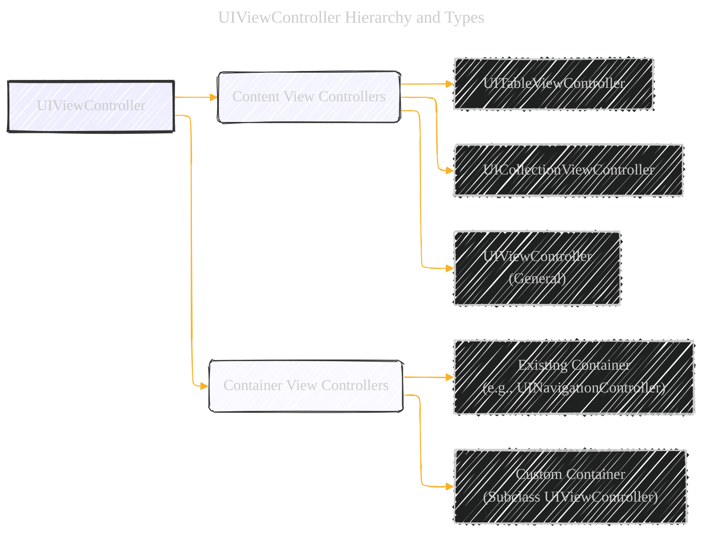
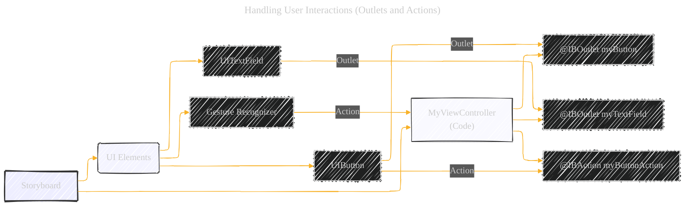

# Defining Your Subclass - A Diagrammatical Summary
> **Disclaimer:**
>
> This document contains my personal notes on the topic,
> compiled from publicly available documentation and various cited sources.
> The materials are intended for educational purposes, personal study, and reference.
> The content is dual-licensed:
> 1. **MIT License:** Applies to all code implementations (Swift, Mermaid, and other programming languages).
> 2. **Creative Commons Attribution 4.0 International License (CC BY 4.0):** Applies to all non-code content, including text, explanations, diagrams, and illustrations.
---


## 1. UIViewController Hierarchy and Types

This diagram illustrates the different types of `UIViewController` and their relationships.


**Explanation:**

- **UIViewController (A):** The base class for all view controllers.
- **Content View Controllers (B):** Manage their own views and data. They are the most common type.
- **UITableViewController (B1):** Specifically for views that are primarily tables.
- **UICollectionViewController (B2):** Specifically for views that are collection views (grids, etc.).
- **UIViewController (General) (B3):** Used for all other content view controllers.
- **Container View Controllers (C):** Manage other view controllers (their "children").
- **Existing Container (C1):** You can modify existing container classes (like `UINavigationController` or `UITabBarController`).
- **Custom Container (C2):** You create a new container by subclassing `UIViewController`.

---

## 2. Storyboard and UI Definition

This section describes how to define your UI. Instead of a diagram, a conceptual illustration is more appropriate here.

**Conceptual Illustration:**

Imagine a storyboard as a visual blueprint of your app's screens and the connections between them.

- **Rectangles:** Each rectangle represents a view controller (a screen or part of a screen).
- **Arrows:** Arrows between rectangles show relationships:
    - **Relationships:** Connect container view controllers to their children.
    - **Segues:** Define transitions between view controllers (e.g., pushing a new screen onto a navigation stack).
- **Inside the rectangle**: represents all the views in the view controller.

**Key Actions in the Storyboard Editor:**

1. **Add View Controllers:** Drag from the library onto the canvas.
2. **Assign Class:** Use the Identity Inspector to link the visual representation to your custom `UIViewController` subclass.
3. **Configure Views:** Add, arrange, and customize views within each view controller's rectangle.
4. **Connect Outlets and Actions:** Link UI elements (buttons, text fields, etc.) to your code (see section 3).
5. **Create Relationships/Segues:** Draw arrows to connect view controllers.
6. **Adaptive Layout:** Customize the UI for different screen sizes (using size classes).
7. **Gesture Recognizers:** Add gestures (taps, swipes, etc.) to handle user interaction.

----

## 3. Handling User Interactions (Outlets and Actions)

This diagram shows the relationship between UI elements, outlets, actions, and the view controller.



**Explanation:**

- **Storyboard (A):** The visual representation of your UI.
- **UI Elements (B):** Buttons, text fields, gesture recognizers, etc.
- **MyViewController (Code) (C):** Your custom `UIViewController` subclass.
- **@IBOutlet (C1, C2):** These are _connections_ to UI elements in the storyboard. They allow you to access and manipulate those elements from your code. They are declared as properties. `weak` is used for memory management (to prevent retain cycles).
- **@IBAction (C3):** This is a _method_ that is called when a specific UI event occurs (e.g., a button tap).
- **Connections:** The dashed lines represent the connections you make in Interface Builder (the storyboard editor) by control-dragging from the UI element to the code.

**Code Example (Swift):**


```swift
class MyViewController: UIViewController {
    @IBOutlet weak var myButton: UIButton!  // Outlet to a button
    @IBOutlet weak var myTextField: UITextField! // Outlet to a text field

    @IBAction func myButtonAction(sender: Any) {
        // This code runs when myButton is tapped.
        print("Button tapped!")
        let text = myTextField.text ?? ""
        print("Text field contains: \(text)")
    }
}
```

**Other Event Handling Mechanisms:**

- **Gesture Recognizers:** You can connect gesture recognizers to action methods to handle swipes, pinches, etc.
- **Notifications:** View controllers can observe notifications (system-wide or custom) to react to changes.
- **Delegates:** View controllers can act as delegates for other objects (e.g., `CLLocationManager`), receiving data and updates.

---

## 4. View Loading and Display Lifecycle

This sequence diagram illustrates the steps involved in loading and displaying views.


**Explanation:**

1. **Instantiation:** UIKit creates instances of your view controller and its views based on the storyboard.
2. **Connections:** Outlets and actions are connected.
3. **`awakeFromNib()`:** Called after objects are loaded from the storyboard. The trait collection is _not_ yet set.
4. **`viewDidLoad()`:** Called after the view controller's view has been loaded into memory. This is where you typically:
    - Add or remove views.
    - Modify layout constraints.
    - Load initial data.
5. **`viewWillAppear()`:** Called just _before_ the views become visible.
6. **Layout Update:** UIKit calculates the layout of the views.
7. **Display:** Views are shown on screen.
8. **`viewDidAppear()`:** Called _after_ the views are visible.

----

## 5. View Layout Lifecycle

This sequence diagram shows the steps UIKit takes when the layout of views needs to be updated.


**Explanation:**

1. **Trait Collection Update:** If needed, UIKit updates the trait collection (which describes the environment, like screen size).
2. **`viewWillLayoutSubviews()`:** Called _before_ layout calculations. This is your chance to:
    - Add or remove views.
    - Update constraints.
    - Change view sizes/positions.
3. **`containerViewWillLayoutSubviews()`:** Called on the presentation controller (if one is active).
4. **`layoutSubviews()`:** Called on the root view. The default implementation uses Auto Layout constraints to calculate the layout and recursively calls `layoutSubviews()` on all subviews.
5. **Apply Layout:** UIKit applies the calculated layout to the views.
6. **`viewDidLayoutSubviews()`:** Called _after_ layout is complete. You can:
    - Reload table data.
    - Update view content.
    - Make final adjustments.
7. **`containerViewDidLayoutSubviews()`:** Called on the presentation controller (if active).

**Layout Tips:**

- **Use Auto Layout:** It's the recommended way to handle different screen sizes.
- **Top/Bottom Layout Guides:** Use these to ensure your content is visible, accounting for status bars, navigation bars, and tab bars.
- **Update Constraints:** If you add/remove views dynamically, update constraints accordingly.
- **Animation and Constraints:** Temporarily remove constraints during animations, then re-add them.

---

## 6. Memory Management
This is best represented as a table, mirroring the original document, but with added clarity.

|Task|Methods|Discussion|
|---|---|---|
|**Allocate Critical Data**|Initialization methods (e.g., `init`, `init?(coder:)`)|Initialize your view controller's essential data structures to ensure it's in a valid state.|
|**Load/Allocate Display Data**|`viewDidLoad()`|Load data that will be displayed in your views. By this point, your views are guaranteed to exist.|
|**Respond to Low Memory**|`didReceiveMemoryWarning()`|Release _non-critical_ objects to free up memory. UIKit may call this when memory is low. You _don't_ need to release outlets connected to views that are part of the current view hierarchy (UIKit manages those).|
|**Release Critical Data (Rarely Needed)**|`dealloc` (Objective-C) / `deinit` (Swift)|**Swift:** You almost _never_ need to implement `deinit` in Swift due to Automatic Reference Counting (ARC). **Objective-C:** You may need `dealloc` for manual resource cleanup, but ARC handles most object releases. Instance variables and properties are released automatically.|

**Key Points:**

- **Strong References:** Be mindful of strong reference cycles, especially with closures and delegates. Use `weak` or `unowned` to break cycles. Outlets to views in the storyboard are typically `weak`.
- **ARC (Automatic Reference Counting):** Swift (and modern Objective-C) uses ARC to manage memory automatically. You generally don't need to manually `retain` and `release` objects.
- **`didReceiveMemoryWarning()`:** Focus on releasing _cached_ data or objects that can be easily recreated. Don't release views that are currently being displayed.


---

<!-- 


---
**Licenses:**

- **MIT License:**  [](LICENSE) - Full text in [LICENSE](LICENSE) file.
- **Creative Commons Attribution 4.0 International:** [](LICENSE-CC-BY) - Legal details in [LICENSE-CC-BY](LICENSE-CC-BY) and at [Creative Commons official site](http://creativecommons.org/licenses/by/4.0/).

---
