# Implementing a Container View Controller - A Diagrammatical Summary
> **Disclaimer:**
>
> This document contains my personal notes on the topic,
> compiled from publicly available documentation and various cited sources.
> The materials are intended for educational purposes, personal study, and reference.
> The content is dual-licensed:
> 1. **MIT License:** Applies to all code implementations (Swift, Mermaid, and other programming languages).
> 2. **Creative Commons Attribution 4.0 International License (CC BY 4.0):** Applies to all non-code content, including text, explanations, diagrams, and illustrations.
---


## 1. Core Concept: Container View Controllers

The fundamental idea is to compose complex UIs by nesting view controllers.  Think of it like Russian nesting dolls (Matryoshka dolls), but for UI elements.  Each "doll" is a `UIViewController`, and a "container" doll holds other dolls.

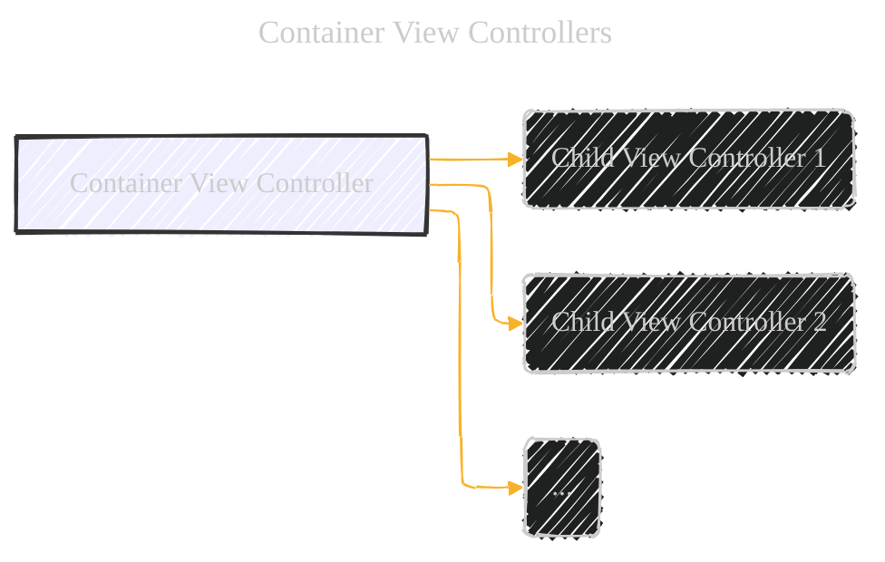


**Explanation:**

*   **Container View Controller (A):**  The parent.  It manages the layout and presentation of its children.  It *doesn't* directly manage the *content* within the children's views.
*   **Child View Controllers (B, C, D):**  These are independent view controllers, responsible for their own internal content and logic.  They are largely unaware of being "contained."

**Key Analogy:**  A conductor (container) doesn't play the instruments (child view controllers), but orchestrates when and how they appear.

---

## 2. UIKit's Built-in Containers

The document highlights three key examples.  Let's visualize them:

### 2.1.  `UINavigationController`

This is like a stack of cards.  You can push (add) a new card on top, or pop (remove) the top card.

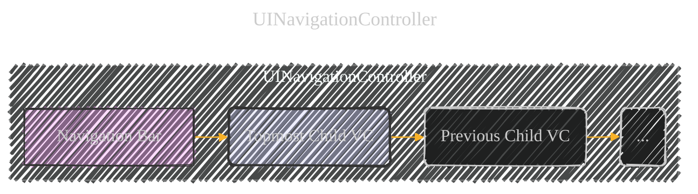


**Explanation:**

*   **Navigation Bar (A):**  Provides the "back" button and title.  Managed by the `UINavigationController`.
*   **Topmost Child VC (B):**  The currently visible view controller.
*   **Previous Child VC (C):**  The view controller that was previously on top.  It's still in memory, ready to be shown again.

**Key Feature:**  Hierarchical navigation.  The user drills down into data, and can easily go back up the hierarchy.

### 2.2. `UITabBarController`

This is like a set of tabs in a web browser.  Each tab shows a different view controller.

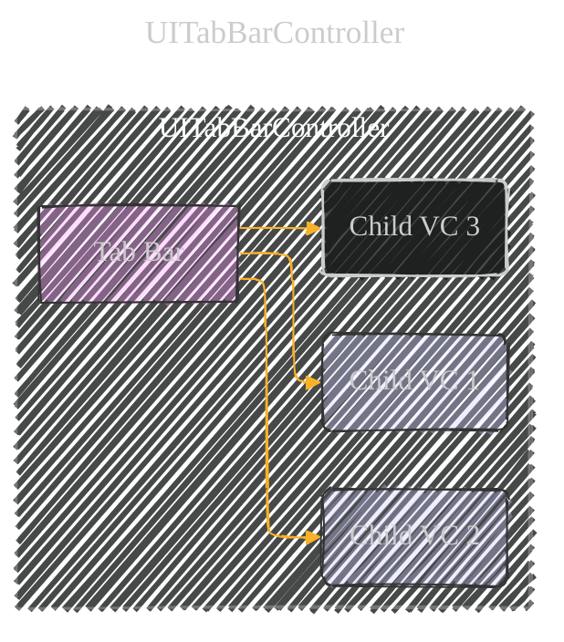


**Explanation:**

*   **Tab Bar (A):**  The row of buttons at the bottom (usually).  Managed by the `UITabBarController`.
*   **Child VCs (B, C, D):**  Each tab corresponds to a different view controller.  Only one is visible at a time.

**Key Feature:**  Parallel navigation.  The user can quickly switch between different sections of the app.

### 2.3. `UISplitViewController`

This is like a master-detail interface, often seen on iPads.  One side shows a list (master), and the other shows details about the selected item.

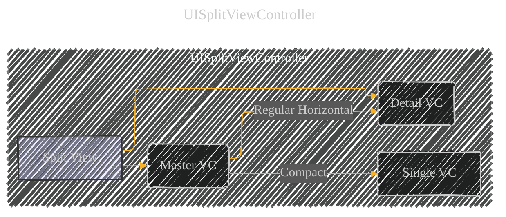


**Explanation:**

*   **Master VC (B):**  Usually a list or table.
*   **Detail VC (C):**  Shows details related to the selected item in the master.
*   **Compact (D):** On smaller screens (like iPhones in portrait), only one view controller is shown at a time.

**Key Feature:**  Adaptive layout.  The presentation changes based on the available screen space.  This is crucial for supporting different device sizes.

---

## 3. Designing a Custom Container

The document provides a series of questions to guide the design process.  Let's turn these into a decision tree:

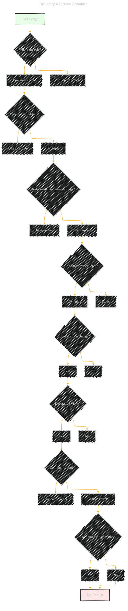


**Explanation:**  This flowchart helps you think through the key design considerations before you start coding.  It forces you to define the relationships and responsibilities clearly.

---

## 4. Implementing a Custom Container (Programmatically)

The core of the implementation is managing the *parent-child relationship*.  This is *essential* for UIKit to function correctly.

### 4.1. Adding a Child (Objective-C)

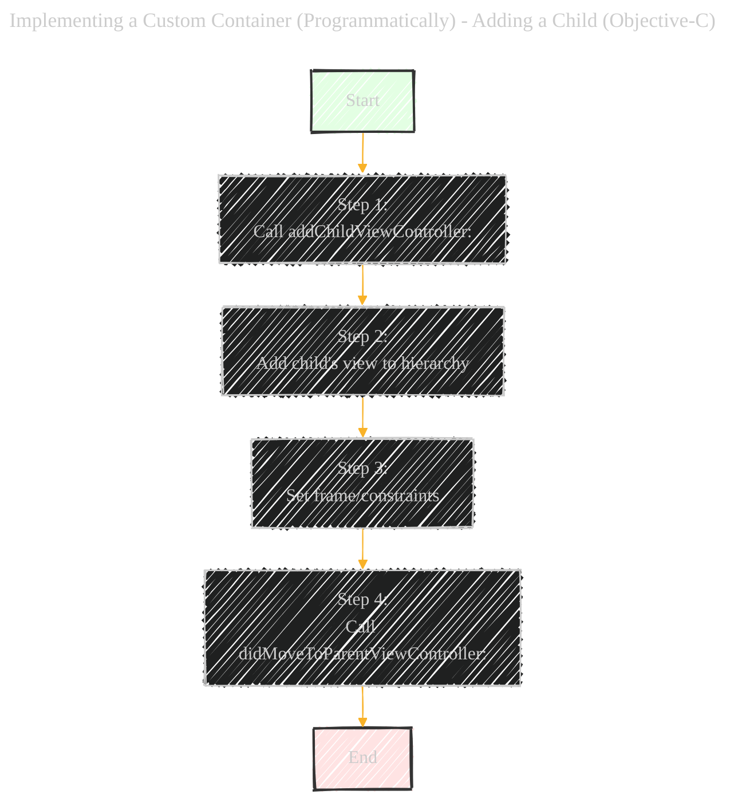
**Objective-C Code (Conceptual):**

```objc
// In the container view controller

// 1. Establish the parent-child relationship
[self addChildViewController:childVC];

// 2. Add the child's view to the container's view hierarchy
childVC.view.frame = /* Calculate the frame */;
[self.view addSubview:childVC.view];

// 3. (Optional, but recommended) Add Auto Layout constraints
// [childVC.view.topAnchor constraintEqualToAnchor:self.view.topAnchor].active = YES;
// ... other constraints ...

// 4. Notify the child that it's been added
[childVC didMoveToParentViewController:self];
```

**Key Points:**

*   `addChildViewController:`:  This is *crucial*.  It tells UIKit that the container is now responsible for the child.
*   `didMoveToParentViewController:`:  Notifies the child that it has a new parent.  You *must* call this after adding the child's view.
* **Order matters:** The calls must be made in the correct order for correct behaviour of `UIViewController`.

### 4.2. Removing a Child (Objective-C)

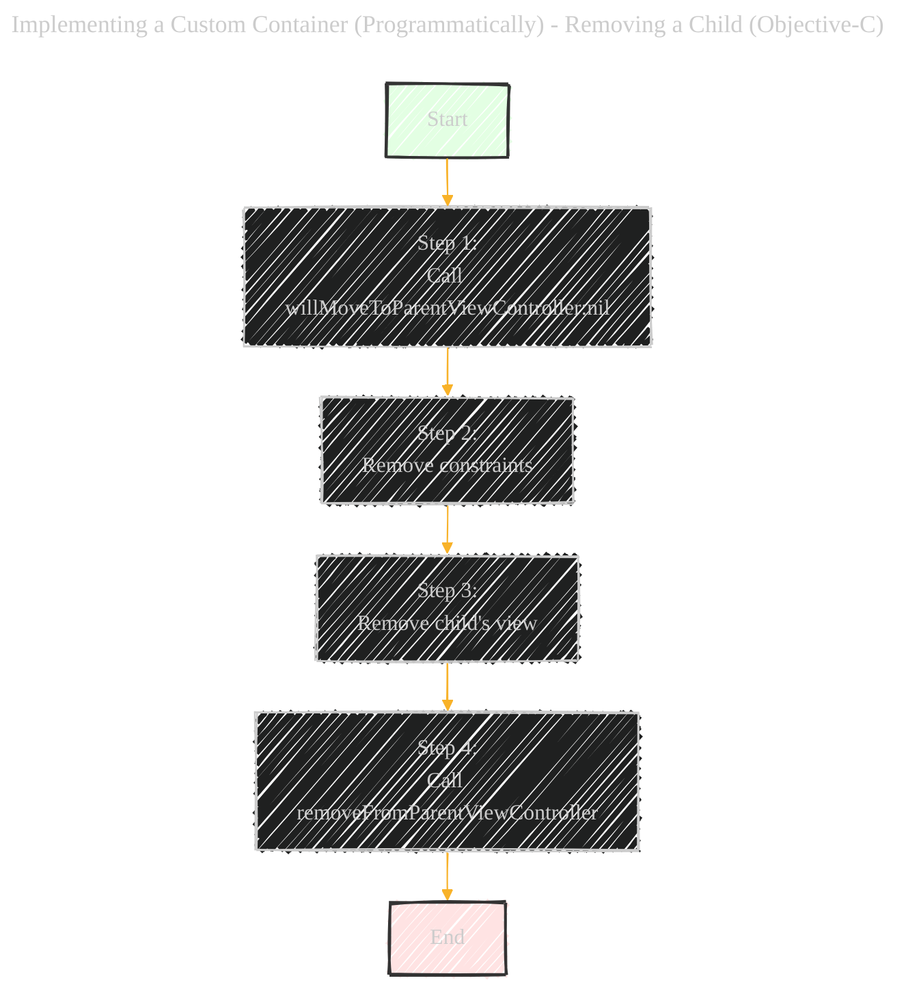


**Objective-C Code (Conceptual):**

```objc
// In the container view controller

// 1. Notify the child that it's about to be removed
[childVC willMoveToParentViewController:nil];

// 2. Remove any Auto Layout constraints related to the child's view
// [childVC.view.topAnchor constraintEqualToAnchor:self.view.topAnchor].active = NO;
// ... other constraints ...

// 3. Remove the child's view from the container's view hierarchy
[childVC.view removeFromSuperview];

// 4. Sever the parent-child relationship
[childVC removeFromParentViewController];
```

**Key Points:**

*   `willMoveToParentViewController:nil`:  Prepares the child for removal.
*   `removeFromParentViewController`:  Cleans up the relationship.  This also calls `didMoveToParentViewController:nil` on the child.
* **Order matters:** The calls must be made in the correct order for correct behavour of `UIViewController`.

### 4.3. Transitioning Between Children (Objective-C)

This combines adding and removing, with animation.

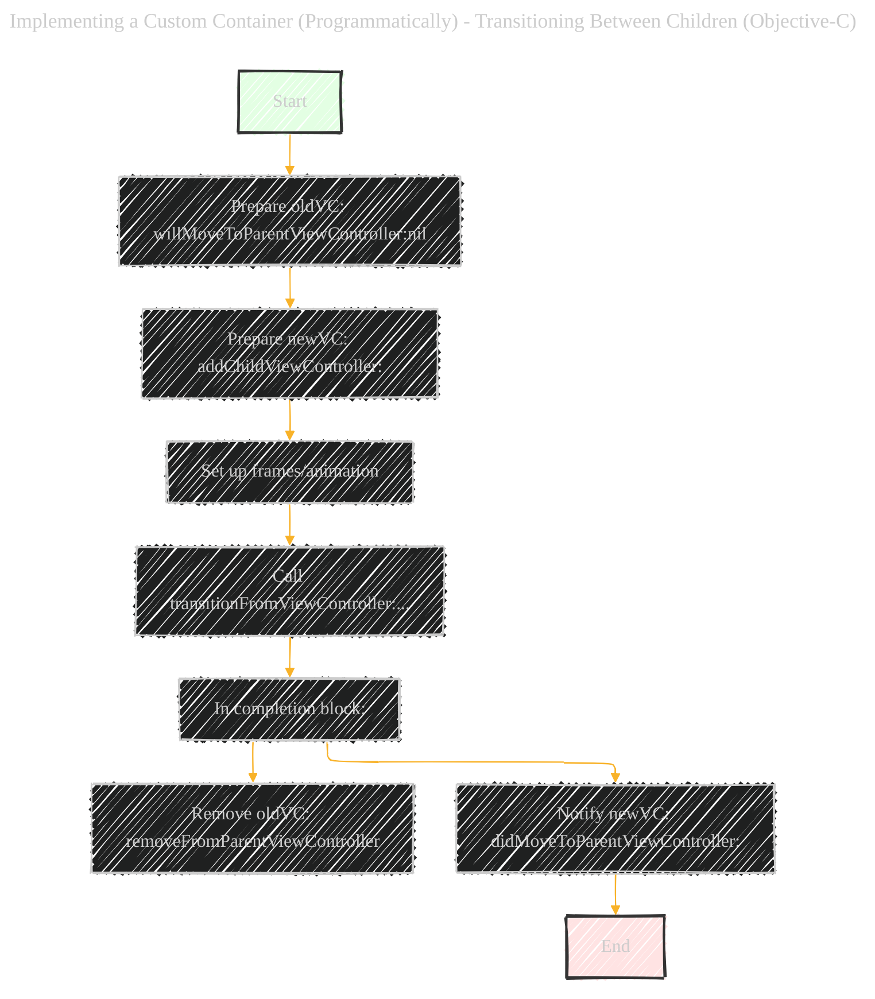
**Objective-C Code (Conceptual):**

```objc
[oldVC willMoveToParentViewController:nil];
[self addChildViewController:newVC];

newVC.view.frame = /* Starting frame (often offscreen) */;
CGRect finalFrame = oldVC.view.frame; // Where the new view will end up

[self transitionFromViewController:oldVC
                  toViewController:newVC
                          duration:0.5
                           options:UIViewAnimationOptionTransitionCrossDissolve
                        animations:^{
                            newVC.view.frame = finalFrame;
                            oldVC.view.frame = /* Offscreen frame */;
                        }
                        completion:^(BOOL finished) {
                            [oldVC removeFromParentViewController];
                            [newVC didMoveToParentViewController:self];
                        }];
```

**Key Points:**

*   `transitionFromViewController:...`:  This UIKit method handles the animation and view hierarchy changes.
*   The completion block is *crucial* for cleaning up the old view controller and notifying the new one.

### 4.4. Managing Appearance Callbacks (Objective-C)

By default, the container forwards appearance methods (`viewWillAppear:`, etc.) to its children.  If you need more control, override `shouldAutomaticallyForwardAppearanceMethods` and return `NO`.

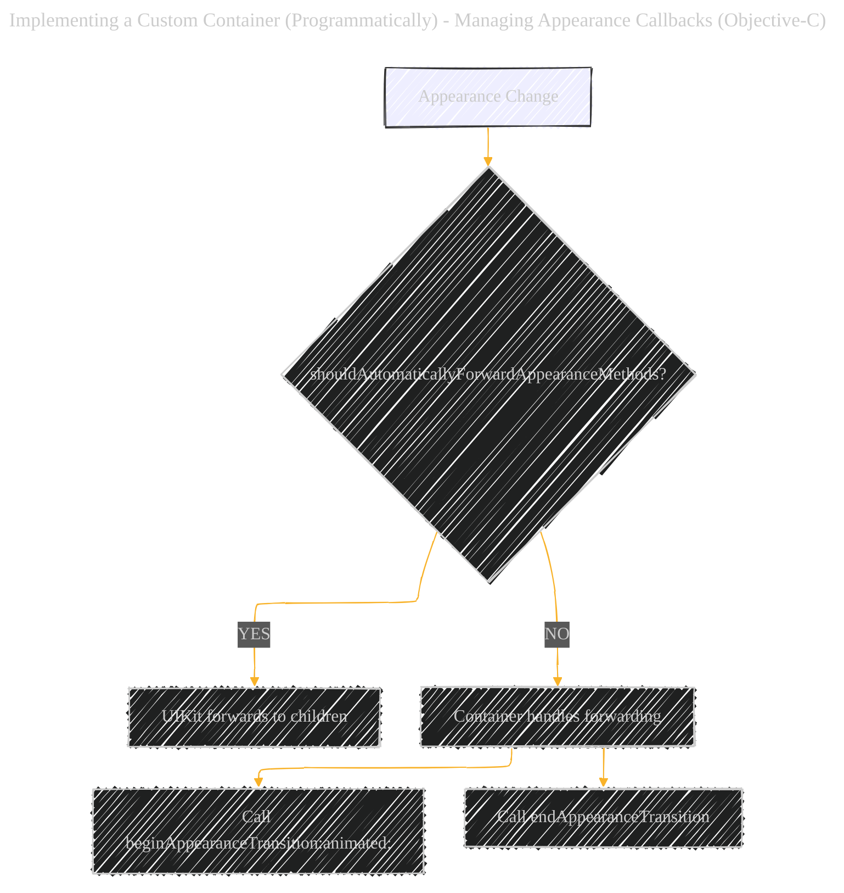

**Objective-C Code (Conceptual):**

```objc
// In the container view controller

- (BOOL)shouldAutomaticallyForwardAppearanceMethods {
    return NO; // Take control
}

- (void)viewWillAppear:(BOOL)animated {
    [super viewWillAppear:animated];
    [self.childVC beginAppearanceTransition:YES animated:animated];
}

- (void)viewDidAppear:(BOOL)animated {
    [super viewDidAppear:animated];
    [self.childVC endAppearanceTransition];
}

// ... similar for viewWillDisappear: and viewDidDisappear:
```

**Key Point:**  This gives you fine-grained control over *when* appearance methods are called on the children.  Useful for coordinating complex transitions.

---

## 5.  Delegating Control to Children

A container can let its children influence its own appearance.

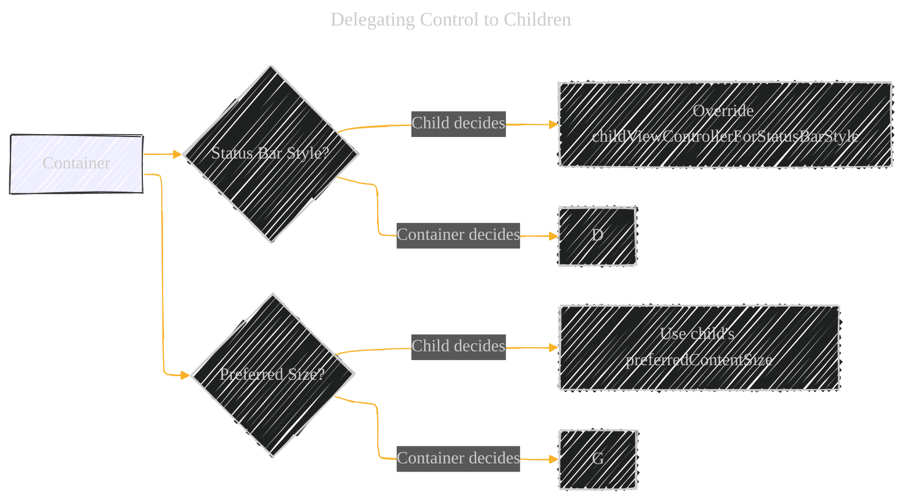


**Explanation:**

*   **Status Bar:**  Override `childViewControllerForStatusBarStyle` (and potentially `childViewControllerForStatusBarHidden`) in the container to return the child that should control the status bar.
*   **Preferred Size:**  The container can read the child's `preferredContentSize` property to help determine the child's size within the container's layout.

---

## 6.  Interface Builder (Storyboard) Setup

You can visually create container relationships in Interface Builder.

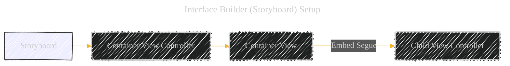


**Explanation:**

*   Drag a "Container View" from the Object Library into your container view controller's scene.
*   This creates an "embed segue," which automatically establishes the parent-child relationship at runtime.
*   Interface Builder loads both the container *and* the child view controller.

---

## 7.  Key Takeaways & Best Practices

*   **Parent-Child Relationship is King:**  The `addChildViewController:`, `removeFromParentViewController:`, and `willMoveToParentViewController:`/`didMoveToParentViewController:` methods are *essential* for proper container behavior.
*   **View Hierarchy Management:**  The container is responsible for adding, removing, and positioning the child view controllers' *root views*.
*   **Encapsulation:**  The container should *not* directly manipulate the internal views of its children.  Only the child should manage its own internal view hierarchy.
*   **Delegation:**  Use delegation to allow children to influence the container's behavior or appearance.
*   **Think Before You Code:**  The design questions are crucial for planning a robust and maintainable container.
* **Testing:** The document recommends designing the container with placeholder view before implementing the children to test the layout and transitions.


---

<!-- 


---
**Licenses:**

- **MIT License:**  [](LICENSE) - Full text in [LICENSE](LICENSE) file.
- **Creative Commons Attribution 4.0 International:** [](LICENSE-CC-BY) - Legal details in [LICENSE-CC-BY](LICENSE-CC-BY) and at [Creative Commons official site](http://creativecommons.org/licenses/by/4.0/).

---
