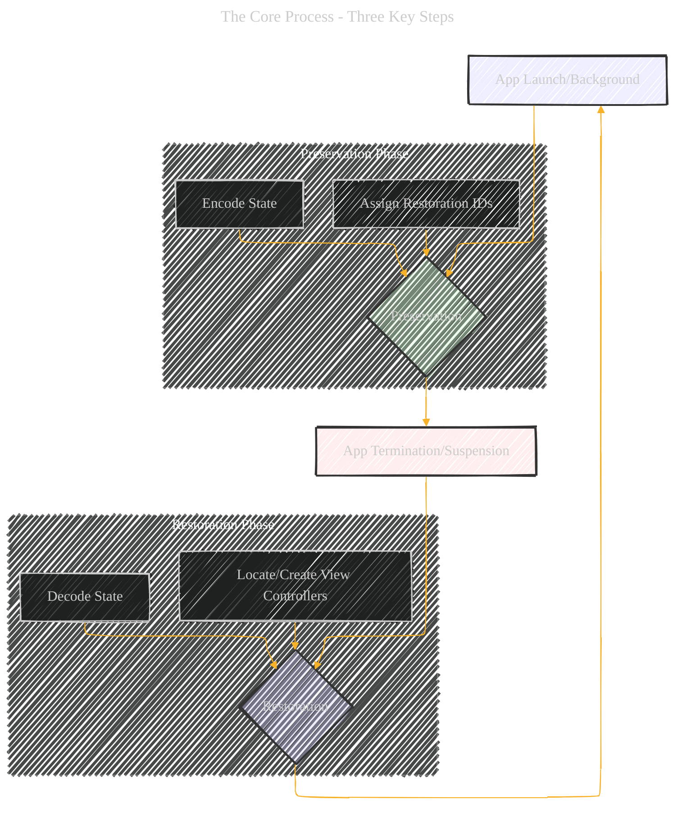
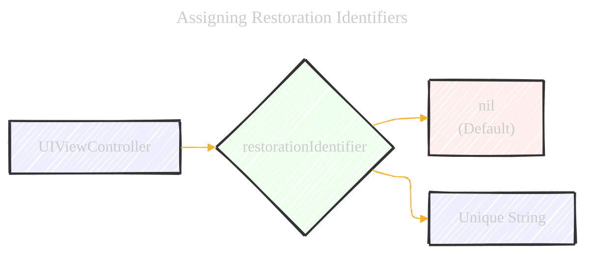
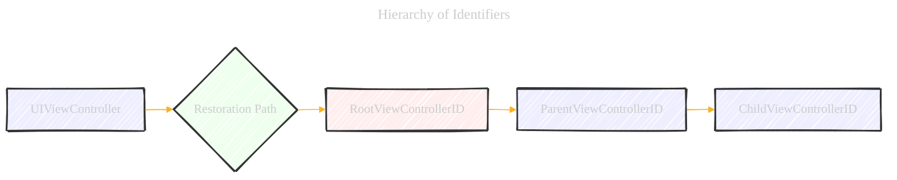
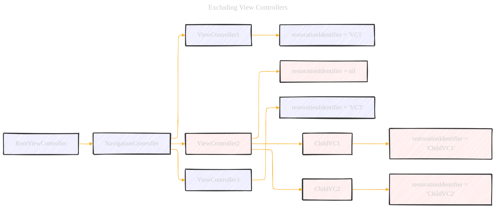
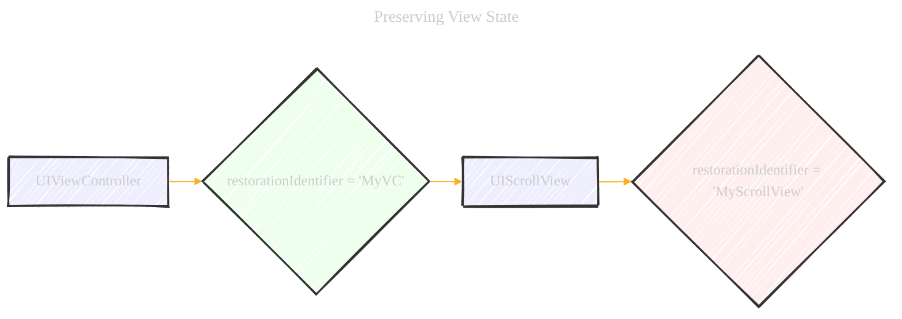
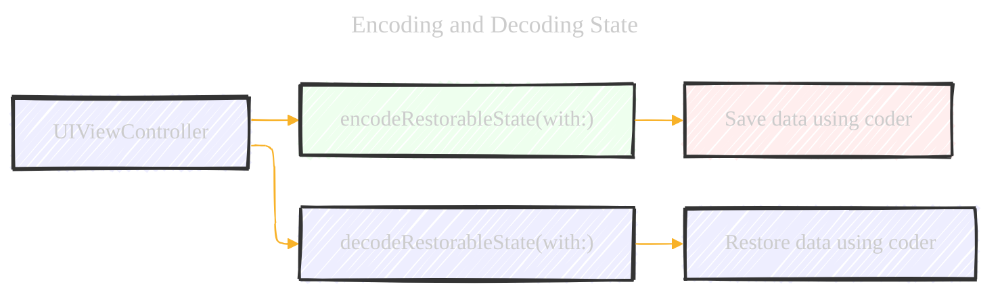

# Preserving and Restoring State - A Diagrammatical Summary
> **Disclaimer:**
>
> This document contains my personal notes on the topic,
> compiled from publicly available documentation and various cited sources.
> The materials are intended for educational purposes, personal study, and reference.
> The content is dual-licensed:
> 1. **MIT License:** Applies to all code implementations (Swift, Mermaid, and other programming languages).
> 2. **Creative Commons Attribution 4.0 International License (CC BY 4.0):** Applies to all non-code content, including text, explanations, diagrams, and illustrations.
---


This document explains how iOS saves and restores the state of your app's view controllers, ensuring a seamless user experience.  We'll cover the key steps, considerations, and best practices, with visual aids to clarify the process.

## 1. The Big Picture: Why State Preservation Matters

When a user switches away from your app (e.g., to answer a call, or due to low memory), iOS might terminate it. State preservation allows your app to "remember" its exact state (which screens were open, what data was being displayed, etc.) so that when the user returns, it's as if they never left.  This avoids frustrating data loss and re-navigation.

**Analogy:** Imagine reading a book and putting a bookmark in it.  State preservation is like that bookmark, allowing the user to pick up right where they left off.

---

## 2. The Core Process: Three Key Steps

The preservation and restoration process involves three main steps, which we can visualize as a cycle:




*   **Preservation Phase:**
    *   **Assign Restoration IDs (Required):**  Like giving each view controller a unique name tag.
    *   **Encode State (Optional but Recommended):**  Saving specific data or configurations for each view controller.
*   **Restoration Phase:**
    *   **Locate/Create View Controllers (Required):**  Finding or rebuilding the view controllers based on their name tags.
    *   **Decode State:**  Loading the saved data and configurations back into the view controllers.

---

## 3. Deep Dive: Assigning Restoration Identifiers

This is the crucial first step.  You *must* tell iOS which view controllers to preserve by assigning them a `restorationIdentifier`.  Think of this as marking the pages you want to bookmark in our book analogy.




*   **`nil` (Default):**  The view controller will *not* be preserved.
*   **"Unique String":**  The view controller *will* be preserved.  This string should be meaningful and unique within your app.  It's often the class name, but can be more descriptive if needed.

**Important Considerations:**

*   **Hierarchy Matters:**  *All* parent view controllers in the hierarchy *must* also have restoration identifiers.  If a parent is missing an ID, its children won't be preserved, even if they have IDs.
*   **Uniqueness:** Each view controller's restoration path (the chain of identifiers from the root view controller down) must be unique.
*    **Restoration Class**: A way to provide finer control, create, and initialize a view controller during the restoration process.



**Example (Swift):**

```swift
// In your view controller's setup (e.g., viewDidLoad)
myViewController.restorationIdentifier = "UserProfileViewController"

//  If you use the same class multiple times
productDetailVC.restorationIdentifier = "ProductDetailVC_\(productID)"
```

---

## 4. Excluding View Controllers

Sometimes, you *don't* want to restore a view controller.  For example, if a user was in the middle of entering a new password, you might want to cancel that process on relaunch.  You can exclude a view controller (and its children) by setting its `restorationIdentifier` to `nil`.



In this example, `ViewController2`, `ChildVC1`, and `ChildVC2` will *not* be preserved, even though the children have restoration identifiers.

---

## 5. Preserving View State

Individual views (like `UIScrollView`, `UITableView`, `UICollectionView`) can also have their own state to preserve.  For example, a scroll view needs to remember its scroll position.

**To preserve a view's state:**

1.  Assign a `restorationIdentifier` to the *view* itself.
2.  Ensure the view's parent view controller *also* has a `restorationIdentifier`.
3.  For `UITableView` and `UICollectionView`, use a data source that conforms to the `UIDataSourceModelAssociation` protocol. This helps restore the visible rows/items.



----


## 6. Restoring View Controllers: The Search Process

When your app relaunches, iOS tries to recreate the preserved view controllers.  It searches in a specific order:


1.  **Restoration Class:** If the view controller has a `restorationClass`, iOS calls its `viewControllerWithRestorationIdentifierPath:coder:` method.  This is your chance to create and return the view controller.  If you return `nil`, iOS stops searching.
2.  **App Delegate:** If there's no restoration class, iOS calls the app delegate's `application:viewControllerWithRestorationIdentifierPath:coder:` method.  Same logic as above.
3.  **Existing Instance:** If a view controller with the correct restoration path already exists (e.g., you created it programmatically at launch), iOS uses it.
4.  **Storyboard:** If the view controller was originally loaded from a storyboard, iOS uses saved information to find and recreate it.

**Example (Swift - Restoration Class):**

```swift
// In your view controller's class
class MyViewController: UIViewController, UIViewControllerRestoration {

    static func viewController(withRestorationIdentifierPath identifierComponents: [String], coder: NSCoder) -> UIViewController? {
        let storyboard = coder.decodeObject(forKey: UIStateRestorationViewControllerStoryboardKey) as? UIStoryboard
        if let storyboard = storyboard {
            let vc = storyboard.instantiateViewController(withIdentifier: "MyViewController") as! MyViewController
            vc.restorationIdentifier = identifierComponents.last
            vc.restorationClass = MyViewController.self // Good practice
            return vc
        }
        return nil
    }
}
```

----

## 7. Encoding and Decoding State

This is where you save and restore the *specific data* associated with your view controller.  You implement two methods:

*   `encodeRestorableState(with coder:)`:  Called during preservation.  You save your data here.
*   `decodeRestorableState(with coder:)`: Called during restoration.  You load your data here.




**What to Save:**

*   References to data (e.g., IDs, not the data itself).
*   Child view controller references (for container view controllers).
*   Selection state (e.g., selected row in a table).
*   UI configuration (e.g., if the user customized the view).

**Example (Swift):**

```swift
class MyViewController: UIViewController {
    var productID: Int = 0 // Example data

    override func encodeRestorableState(with coder: NSCoder) {
        super.encodeRestorableState(with: coder)
        coder.encode(productID, forKey: "productID")
    }

    override func decodeRestorableState(with coder: NSCoder) {
        super.decodeRestorableState(with: coder)
        productID = coder.decodeInteger(forKey: "productID")
    }
}
```

**Important Notes:**

*   Always call `super` in both methods.
*   Each object gets its own `NSCoder` instance, so you don't need to worry about key name collisions (except for the keys UIKit uses internally).
*   Objects (other than views and view controllers) must conform to `NSCoding` to be encoded directly.  Views and view controllers are handled specially – their restoration identifiers are saved.

----

## 8. Best Practices and Tips

*   **Decide Strategically:** Not *every* view controller needs to be preserved.  Consider the user experience.
*   **Don't Change Classes:** During restoration, the restored view controller's class *must* match (or be a subclass of) the original class.
*   **Use Container View Controllers Correctly:** The restoration process relies on the proper containment relationships between view controllers.
* **Test Thoroughly:** Simulate state preservation and restoration using the "Stop" feature during development or testing.

---

## 9.  Code Examples (Illustrative)

**Objective-C:**

```objc
// Assigning a restoration identifier in Objective-C
self.restorationIdentifier = @"MyViewControllerIdentifier";

// Implementing restoration class methods (Objective-C)
+ (UIViewController *)viewControllerWithRestorationIdentifierPath:(NSArray *)identifierComponents
                                                            coder:(NSCoder *)coder {
    UIStoryboard *storyboard = [coder decodeObjectForKey:UIStateRestorationViewControllerStoryboardKey];
    MyViewController *vc = [storyboard instantiateViewControllerWithIdentifier:@"MyViewController"];
    vc.restorationIdentifier = [identifierComponents lastObject];
    vc.restorationClass = [MyViewController class];
    return vc;
}

// Encoding and decoding state (Objective-C)
- (void)encodeRestorableStateWithCoder:(NSCoder *)coder {
    [super encodeRestorableStateWithCoder:coder];
    [coder encodeInt:self.myNumber forKey:@"MyNumberKey"];
}

- (void)decodeRestorableStateWithCoder:(NSCoder *)coder {
    [super decodeRestorableStateWithCoder:coder];
    self.myNumber = [coder decodeIntForKey:@"MyNumberKey"];
}
```

----

## 10. Conclusion

By following these steps and best practices, you can implement state preservation and restoration effectively, creating a smoother and more user-friendly experience for your iOS app users.  The visual diagrams and explanations provided here should help you understand the process and apply it to your own projects. Remember to test your implementation thoroughly to ensure it works as expected.


---

<!-- 


---
**Licenses:**

- **MIT License:**  [](LICENSE) - Full text in [LICENSE](LICENSE) file.
- **Creative Commons Attribution 4.0 International:** [](LICENSE-CC-BY) - Legal details in [LICENSE-CC-BY](LICENSE-CC-BY) and at [Creative Commons official site](http://creativecommons.org/licenses/by/4.0/).

---
