# Supporting Accessibility - A Diagrammatical Summary
> **Disclaimer:**
>
> This document contains my personal notes on the topic,
> compiled from publicly available documentation and various cited sources.
> The materials are intended for educational purposes, personal study, and reference.
> The content is dual-licensed:
> 1. **MIT License:** Applies to all code implementations (Swift, Mermaid, and other programming languages).
> 2. **Creative Commons Attribution 4.0 International License (CC BY 4.0):** Applies to all non-code content, including text, explanations, diagrams, and illustrations.
---


This document focuses on making iOS apps accessible to users with disabilities, particularly those using VoiceOver. UIKit provides built-in accessibility features, but developers need to take specific actions to ensure a fully inclusive experience.

## Core Concepts


**Explanation:**

- **User with Disability:** The target user group.
- **iOS App:** The application being developed.
- **Accessibility Features:** The mechanisms provided by iOS and implemented by developers to make the app usable.
- **VoiceOver:** Apple's screen reader technology.
- **Other Assistive Technologies:** Includes features like Switch Control, AssistiveTouch, etc. (not the focus of this document, but important context).
- **Screen Reader:** A general term for software that reads on-screen content aloud.
- **VoiceOver Cursor/Focus Ring:** The visual indicator showing which element VoiceOver is currently focused on.

---

## 1. Moving the VoiceOver Cursor Programmatically

**Problem:** When a new view appears (e.g., pushing a new view controller), VoiceOver automatically focuses on the first accessible element (usually top-left). This might not be the most logical element for the user.

**Solution:** Use `UIAccessibilityPostNotification` to explicitly set the VoiceOver focus.


**Explanation:**

1. **`viewDidAppear`:** The view controller's `viewDidAppear` method is called after the view becomes visible.
2. **`super.viewDidAppear`:** Call the superclass implementation.
3. **`UIAccessibilityPostNotification`:** This function posts a notification to the accessibility system.
    - **`UIAccessibilityScreenChangedNotification`:** Indicates a significant change in the screen's content.
    - **`self.myFirstElement`:** The specific UI element (e.g., a label, button) that should receive focus. This is an _Objective-C_ example. In Swift, it would be `myFirstElement`.
4. **UIKit & VoiceOver:** UIKit processes the notification and informs VoiceOver.
5. **VoiceOver Updates:** VoiceOver moves its cursor to the specified element.

**Code Example (Objective-C):**

```objc
@implementation MyViewController

- (void)viewDidAppear:(BOOL)animated {
     [super viewDidAppear:animated];

     // The second parameter is the new focus element.
     UIAccessibilityPostNotification(UIAccessibilityScreenChangedNotification,
                                     self.myFirstElement);
}
@end

```

**Code Example (Swift Equivalent):**

```swift
class MyViewController: UIViewController {
    override func viewDidAppear(_ animated: Bool) {
        super.viewDidAppear(animated)

        // Post the notification to change focus.
        UIAccessibility.post(notification: .screenChanged, argument: myFirstElement)
    }
}
```

**Key Differences (Objective-C vs. Swift):**

- **Method Syntax:** Objective-C uses square brackets and colons for method calls. Swift uses dot notation.
- **`UIAccessibilityPostNotification`:** In Swift, this is simplified to `UIAccessibility.post(notification:argument:)`.
- **`UIAccessibilityScreenChangedNotification`:** In Swift, this is accessed as an enum case: `.screenChanged`.
- **`self`** In objective C, you refer to properties by calling self, and in swift, the `self` is implicit.

**Layout Changes and `UIAccessibilityLayoutChangedNotification`:**

Use `UIAccessibilityLayoutChangedNotification` when the _layout_ of the existing view changes (e.g., due to rotation). The usage is the same as `UIAccessibilityScreenChangedNotification`.

---

## 2. Responding to Special VoiceOver Gestures

VoiceOver has special gestures that apps can handle:

- **Escape (Two-finger Z-shape):** Dismiss modals, navigate back.
- **Magic Tap (Two-finger double-tap):** Perform the primary action (e.g., play/pause music).
- **Three-Finger Scroll:** Scroll custom views.
- **Increment/Decrement (One-finger swipe up/down):** Adjust values (e.g., volume slider).


**Explanation:**

- **VoiceOver User:** Initiates a gesture.
- **Gesture:** The type of gesture performed.
- **Methods:** The corresponding Objective-C methods that handle the gestures. UIKit uses the responder chain to find an object that implements the method.
- **Actions:** The typical actions associated with each gesture.

**Responder Chain:**

```mermaid
---
config:
  layout: elk
  look: handDrawn
  theme: dark
---
%%{
  init: {
    'fontFamily': 'verdana',
    'themeVariables': {
      'primaryColor': '#BB2528',
      'primaryTextColor': '#f529',
      'primaryBorderColor': '#7C0000',
      'lineColor': '#F8B229',
      'secondaryColor': '#006100',
      'tertiaryColor': '#fff'
    }
  }
}%%
graph LR
    A[VoiceOver Focus Element] --> B[Next Responder]
    B --> C[...]
    C --> D[View Controller]
    D --> E[Window]
    E --> F[Application]
    F --> G[App Delegate]
    
style A fill:#ccf5,stroke:#333,stroke-width:2px
style G fill:#fcf5,stroke:#333,stroke-width:2px

```





**Explanation:**

- UIKit searches for a method implementation starting with the element that has VoiceOver focus.
- If not found, it moves up the responder chain (view hierarchy) until it finds an implementation or reaches the app delegate.
- If no implementation is found, UIKit performs the default system action.

**Example: Handling Magic Tap in App Delegate (Objective-C):**

```objc
@implementation MyAppDelegate

- (BOOL)accessibilityPerformMagicTap {
    // Perform the app-wide Magic Tap action (e.g., play/pause)
    if (/* music is playing */) {
        // Pause music
        return YES; // Indicate that the gesture was handled
    } else {
        // Play music
        return YES;
    }
    return NO; // Should not reach here
}

@end
```

**Example: Handling Magic Tap in App Delegate (Swift):**

```swift
class MyAppDelegate: UIResponder, UIApplicationDelegate {
    override func accessibilityPerformMagicTap() -> Bool {
        // Perform the app-wide Magic Tap action
        if /* music is playing */ {
            // Pause music
            return true
        } else {
            // Play music
            return true
        }
        return false // Should not reach here
    }
}
```

**Key Differences**

- In swift, override the function from the parent class.
- Boolean values in Objective-C are `YES` and `NO`, whereas in Swift, it's `true` and `false`.

---
## 3. Observing Accessibility Notifications

Apps can observe notifications to react to accessibility events.

- **`UIAccessibilityAnnouncementDidFinishNotification`:** Know when VoiceOver finishes speaking an announcement.
- **`UIAccessibilityVoiceOverStatusChanged`:** Detect when VoiceOver is turned on or off.


**Explanation:**

1. **Register Observer:** The app registers with `NSNotificationCenter` to observe `UIAccessibilityAnnouncementDidFinishNotification`.
2. **VoiceOver Event:** VoiceOver finishes an announcement.
3. **Notification Posted:** `NSNotificationCenter` posts the notification.
4. **Observer Called:** The app's `didFinishAnnouncement` method is called.
5. **Process Notification:** The app extracts information from the notification (e.g., the text that was spoken, whether it was successful).

**Code Example (Objective-C):**

```objc
@implementation MyViewController

- (void)viewDidLoad {
    [super viewDidLoad];

    [[NSNotificationCenter defaultCenter]
        addObserver:self
           selector:@selector(didFinishAnnouncement:)
               name:UIAccessibilityAnnouncementDidFinishNotification
             object:nil];
}

- (void)didFinishAnnouncement:(NSNotification *)notification {
    NSString *valueSpoken = [[notification userInfo] objectForKey:UIAccessibilityAnnouncementKeyStringValue];
    NSString *wasSuccessful = [[notification userInfo] objectForKey:UIAccessibilityAnnouncementKeyWasSuccessful];
    // ... process the information ...
}
@end

```

**Code Example (Swift):**

```swift
class MyViewController: UIViewController {
    override func viewDidLoad() {
        super.viewDidLoad()

        NotificationCenter.default.addObserver(
            self,
            selector: #selector(didFinishAnnouncement(_:)),
            name: UIAccessibility.announcementDidFinishNotification,
            object: nil
        )
    }

    @objc func didFinishAnnouncement(_ notification: Notification) {
        if let userInfo = notification.userInfo,
           let valueSpoken = userInfo[UIAccessibility.announcementStringValueUserInfoKey] as? String,
           let wasSuccessful = userInfo[UIAccessibility.announcementWasSuccessfulUserInfoKey] as? Bool {
            // ... process the information ...
        }
    }
    
    deinit {
        NotificationCenter.default.removeObserver(self)
    }
}
```

**Key Differences:**

- **`NSNotificationCenter`:** In Swift, it's `NotificationCenter.default`.
- **`@selector`:** In Swift, use `#selector` to refer to Objective-C methods. The method must be marked with `@objc`.
- **Notification Names:** In Swift, use the enum cases (e.g., `UIAccessibility.announcementDidFinishNotification`).
- **User Info:** Accessing the `userInfo` dictionary is more type-safe in Swift, using optional binding and type casting.
- **`deinit`:** In swift, use `deinit` to remove the observer for proper cleanup.

---

## Summary Table

| Feature                          | Objective-C                                                                                                             | Swift                                                                                                                |
| -------------------------------- | ----------------------------------------------------------------------------------------------------------------------- | -------------------------------------------------------------------------------------------------------------------- |
| Set VoiceOver Focus              | `UIAccessibilityPostNotification(UIAccessibilityScreenChangedNotification, element);`                                   | `UIAccessibility.post(notification: .screenChanged, argument: element)`                                              |
| Handle Escape Gesture            | `- (BOOL)accessibilityPerformEscape;`                                                                                   | `override func accessibilityPerformEscape() -> Bool`                                                                 |
| Handle Magic Tap Gesture         | `- (BOOL)accessibilityPerformMagicTap;`                                                                                 | `override func accessibilityPerformMagicTap() -> Bool`                                                               |
| Handle Three-Finger Scroll       | `- (BOOL)accessibilityScroll:(UIAccessibilityScrollDirection)direction;`                                                | `override func accessibilityScroll(_ direction: UIAccessibilityScrollDirection) -> Bool`                             |
| Handle Increment/Decrement       | `- (void)accessibilityIncrement;` `- (void)accessibilityDecrement;`                                                     | `override func accessibilityIncrement()` `override func accessibilityDecrement()`                                    |
| Observe Notifications            | `[[NSNotificationCenter defaultCenter] addObserver:self selector:@selector(method:) name:notificationName object:nil];` | `NotificationCenter.default.addObserver(self, selector: #selector(method(_:)), name: notificationName, object: nil)` |
| Notification User Info (Example) | `NSString *value = [[notification userInfo] objectForKey:UIAccessibilityAnnouncementKeyStringValue];`                   | `if let value = notification.userInfo?[UIAccessibility.announcementStringValueUserInfoKey] as? String { ... }`       |
| Boolean Values                   | `YES`,`NO`                                                                                                              | `true`, `false`                                                                                                      |


---

<!-- 


---
**Licenses:**

- **MIT License:**  [](LICENSE) - Full text in [LICENSE](LICENSE) file.
- **Creative Commons Attribution 4.0 International:** [](LICENSE-CC-BY) - Legal details in [LICENSE-CC-BY](LICENSE-CC-BY) and at [Creative Commons official site](http://creativecommons.org/licenses/by/4.0/).

---
