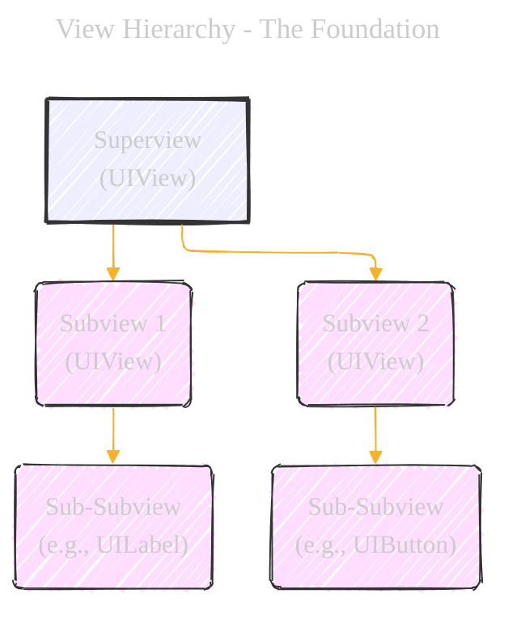
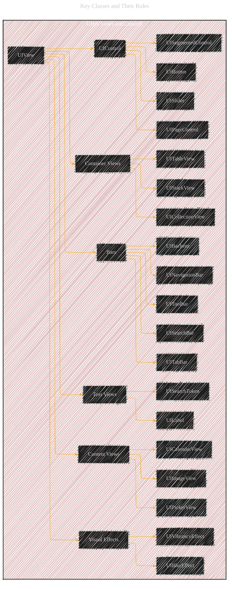

# Views and Controls - A Diagrammatical Summary
> **Disclaimer:**
>
> This document contains my personal notes on the topic,
> compiled from publicly available documentation and various cited sources.
> The materials are intended for educational purposes, personal study, and reference.
> The content is dual-licensed:
> 1. **MIT License:** Applies to all code implementations (Swift, Mermaid, and other programming languages).
> 2. **Creative Commons Attribution 4.0 International License (CC BY 4.0):** Applies to all non-code content, including text, explanations, diagrams, and illustrations.
---


This document provides a visual and structural overview of the "Views and Controls" section of the UIKit framework documentation.  It aims to clarify the hierarchical relationships, key classes, and their purposes.

---

## 1. Overview - The Big Picture

The core concept is that `UIView` and its subclasses form the building blocks of your iOS app's user interface.  They are responsible for:

*   **Displaying Content:**  Rendering what the user sees.
*   **Handling Interaction:** Responding to user input (touches, gestures, etc.).
*   **Organizing Layout:** Arranging elements on the screen.

Here's a simple illustration to represent this:

```
+---------------------+
|     Your App       |
| +-----------------+ |
| |  +-----------+  | |
| |  |   View    |  | |  <-- UIView and subclasses
| |  +-----------+  | |
| |  +-----------+  | |
| |  |  Control  |  | |  <-- UIControl subclasses (Buttons, Sliders, etc.)
| |  +-----------+  | |
| +-----------------+ |
+---------------------+
```

## 2. View Hierarchy - The Foundation

Views can contain other views, creating a parent-child relationship.  This is crucial for organizing complex interfaces.



*   **Superview:** The parent view that contains other views.
*   **Subview:** A view contained within another view.
*   **Root View:** At the top of the hierarchy is a root view (often managed by a `UIViewController`).
*   The example above has a nested relationship from A all the way down to its subviews.


---
## 3. Key Classes and Their Roles

The documentation categorizes views and controls into several groups. Let's visualize this categorization and highlight some of the most important classes.



**Explanation:**

*   **`UIView` (The Foundation):**  The base class for *all* views.  It handles rendering, layout, and basic event handling.  Think of it as the "generic rectangle" that you can customize.
*   **`UIControl` (Interactive Elements):**  A subclass of `UIView` specifically for interactive elements.  It adds the concept of "actions" triggered by user interaction (e.g., a button tap).
*   **Container Views:**  Views designed to hold and manage other views.
    *   `UICollectionView`:  Highly flexible for displaying collections of items in custom layouts (grids, etc.).
    *   `UITableView`:  For displaying scrollable lists of data in rows.
    *   `UIStackView`:  Simplifies layout by automatically arranging subviews in a row or column.
*   **Content Views:**  Views that display specific types of content.
    *   `UIImageView`:  Displays images.
    *   `UIPickerView`:  The "spinning wheel" selector.
    *   `UICalendarView`: Displays a calendar and handles date selection.
*   **Controls (Subclasses of `UIControl`):**
    *   `UIButton`:  A standard button.
    *   `UISlider`:  A slider for selecting a value from a range.
    *   `UISegmentedControl`:  A set of buttons grouped together (like tabs).
    *   `UIPageControl`:  The dots indicating the current page in a multi-page view.
*   **Text Views:**
    *   `UILabel`:  Displays static text.
    *    `UISearchToken`: Represent search criteria with optional icons.
*   **Bars:**  Specialized views for navigation and actions.
    *   `UINavigationBar`:  The bar at the top of many screens, often with a back button.
    *   `UITabBar`:  The bar at the bottom for switching between major sections of an app.
    *   `UIToolbar`:  A bar for displaying action buttons.
    *   `UISearchBar`:  A text field specifically for search input.
    *   `UIBarItem`: Abstract class for items in bars.
*   **Visual Effects:**
    *  `UIBlurEffect`: Applies blurring.
    * `UIVibrancyEffect`: Adjusts color vibrancy.

---

## 4.  `UIView` vs. `UIControl` - A Key Distinction

It's crucial to understand the difference between `UIView` and `UIControl`.


*   **`UIView`:**  Focuses on *appearance* and *layout*.  It can respond to touches, but it doesn't have a built-in mechanism for associating those touches with specific actions in your code.
*   **`UIControl`:**  Extends `UIView` by adding the concept of *targets* and *actions*.  This is the **target-action mechanism**, a fundamental pattern in UIKit.
    *   **Target:**  Usually, the object that will handle the event (often a `UIViewController`).
    *   **Action:**  A method (specified using a `Selector`) on the target object that will be called when the control is interacted with.
    *   **Control Events:**  Things like `.touchUpInside` (for a button tap), `.valueChanged` (for a slider), etc.

---

## 5. Target-Action in Action (Example)

Let's illustrate how a `UIButton` (a `UIControl`) uses the target-action mechanism.  This is *not* a Mermaid diagram, but a code snippet representation:

```swift
// In your UIViewController (the target)
class MyViewController: UIViewController {

    @IBOutlet weak var myButton: UIButton!

    override func viewDidLoad() {
        super.viewDidLoad()

        // Connect the button's "touchUpInside" event to the "buttonTapped" method
        myButton.addTarget(self, action: #selector(buttonTapped), for: .touchUpInside)
    }

    @objc func buttonTapped() {
        // This code will be executed when the button is tapped
        print("Button tapped!")
    }
}
```

*   `addTarget(...)`: This method (part of `UIControl`) establishes the connection.
*   `self`:  The target is the `MyViewController` instance.
*   `#selector(buttonTapped)`:  This creates a `Selector` that refers to the `buttonTapped` method.
*   `.touchUpInside`:  This specifies the event that triggers the action (a tap inside the button).

---

## 6. Container Views: Organizing Complexity

Container views are essential for managing complex layouts.

### a. `UIStackView`


*   `UIStackView` automatically arranges its subviews in either a row or a column.  It simplifies layout, especially when dealing with dynamic content.

### b. `UITableView`

```
+---------------------+
| UITableView         |
| +-----------------+ |
| |  Header View    | |  (Optional)
| +-----------------+ |
| +-----------------+ |
| |  Cell 1         | |  <-- UITableViewCell
| +-----------------+ |
| +-----------------+ |
| |  Cell 2         | |  <-- UITableViewCell
| +-----------------+ |
| |  ...            | |
| +-----------------+ |
| |  Footer View    | |  (Optional)
| +-----------------+ |
+---------------------+
```

*   `UITableView` displays a scrollable list of items.  It uses `UITableViewCell` instances to represent each row.  It's highly optimized for performance, even with large datasets, through cell reuse.

### c. `UICollectionView`

```mermaid
graph LR
    subgraph UICollectionView["UICollectionView<br>(Grid Layout)"]
    style UICollectionView fill:#eef,stroke:#333,stroke-width:1px
        A[Cell 1] -- B[Cell 2] -- C[Cell 3]
        A --> D[Cell 4]
        B --> E[Cell 5]
        C --> F[Cell 6]
        D -- E -- F
    end
```

*   `UICollectionView` is the most flexible container view.  It can display items in grids, custom layouts, and even horizontally scrolling layouts (like image galleries).  It uses `UICollectionViewCell` instances to represent items.

---

## 7. Visual Effects


*   `UIVisualEffectView` is a container that applies visual effects to the content behind it.
*    `UIBlurEffect` and `UIVibrancyEffect` are used to create modern, visually appealing interfaces.

## 8. Deprecated Types

The documentation mentions `NSRectAlignment` and `UIDirectionalRectEdge` as deprecated.  This means they are no longer recommended for use and may be removed in future versions of UIKit.  It's important to be aware of deprecations to avoid using outdated APIs.

---

## 9.  Connections to Other Topics

The "See Also" section links to related concepts:

*   **View Controllers:**  `UIViewController` manages a view hierarchy and is essential for handling user interaction and navigation.
*   **View Layout:**  Covers Auto Layout and stack views in more detail.
*   **Appearance Customization:**  Discusses how to customize the look of your UI, including Dark Mode support.
*   The diagram below should showcase the relation between those topics.


---
**Licenses:**

- **MIT License:**  [](LICENSE) - Full text in [LICENSE](LICENSE) file.
- **Creative Commons Attribution 4.0 International:** [](LICENSE-CC-BY) - Legal details in [LICENSE-CC-BY](LICENSE-CC-BY) and at [Creative Commons official site](http://creativecommons.org/licenses/by/4.0/).

---