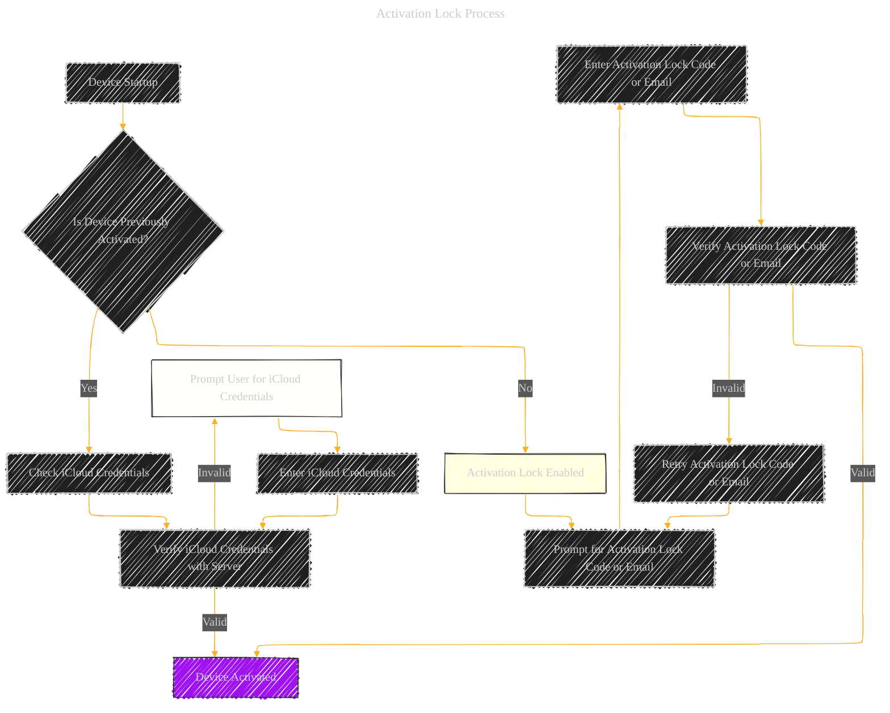

# Activation Lock Process - A Diagrammatical Summary
> **Disclaimer:**
>
> This document contains my personal notes on the topic,
> compiled from publicly available documentation and various cited sources.
> The materials are intended for educational purposes, personal study, and reference.
> The content is dual-licensed:
> 1. **MIT License:** Applies to all code implementations (Swift, Mermaid, and other programming languages).
> 2. **Creative Commons Attribution 4.0 International License (CC BY 4.0):** Applies to all non-code content, including text, explanations, diagrams, and illustrations.
---

## Activation Lock Process (Flowchart)

---

## Explanation of the Activation Lock Process

The Activation Lock process is a crucial security measure implemented on Apple devices to prevent unauthorized use of lost or stolen devices.  It essentially "locks" the device to a particular iCloud account.  The process unfolds as follows:

1. **Device Startup:** When a device is powered on, the initial step is to determine if the device has been previously activated.

2. **Previously Activated (Yes):** If the device was previously activated, it checks if the iCloud credentials associated with the device are valid. If the credentials are valid, the device is deemed activated.

3. **Previously Activated (No):** If the device was not previously activated, Activation Lock is enabled, and the user is prompted to enter an Activation Lock code (or, in certain cases, the email address associated with the iCloud account).

4. **Verification (Valid Code/Email):** The entered Activation Lock code or email is verified against the corresponding record on Apple's servers.  If the verification is successful, the device is activated.

5. **Verification (Invalid Code/Email):** If the entered code or email is invalid, the user is prompted to retry entering the correct code or email.

6. **Activation (Success):**  Once a valid Activation Lock code or email is provided, the device is fully activated.

7. **Activation (Failure):**  If multiple attempts to enter the Activation Lock code or email fail, the device might become disabled to deter brute-force attacks.

----

**Important Considerations (to be included in a more comprehensive diagram):**

* **Activation Process and Device Types:**  The specific methods for activation might vary based on whether it's an iPhone, iPad, Mac with Apple Silicon, or an Intel-based Mac. The process might be integrated differently within each operating system's boot sequence.
* **Remote Activation:**  The Activation Lock process might interact with a user's iCloud account and other devices to ensure the device's activation. This might be relevant to users trying to access their device remotely.
* **Device Restrictions:** The device might have additional restrictions based on the Activation Lock status, including access limitations for data protection classes or certain services.

This flowchart provides a high-level overview of the Activation Lock process.  A more detailed diagram could include specific interactions with hardware (Secure Enclave, etc.), the role of the iCloud server, and potentially the implications of failed authentication attempts.

---
**Licenses:**

- **MIT License:**   - Full text in [LICENSE](LICENSE) file.
- **Creative Commons Attribution 4.0 International:**  - Legal details in [LICENSE-CC-BY](LICENSE-CC-BY) and at [Creative Commons official site](http://creativecommons.org/licenses/by/4.0/).

---