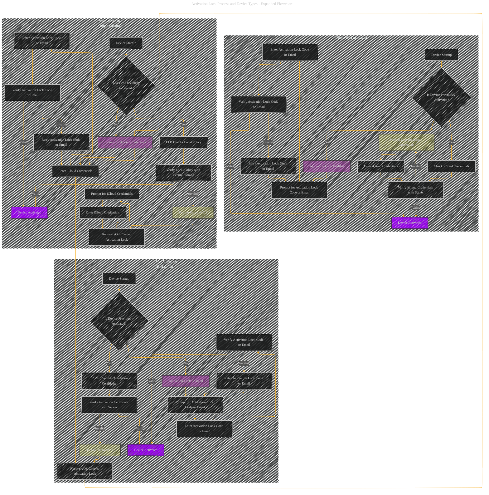

# Apple Activation Lock Process Overview - A Diagrammatical Summary
> **Disclaimer:**
>
> This document contains my personal notes on the topic,
> compiled from publicly available documentation and various cited sources.
> The materials are intended for educational purposes, personal study, and reference.
> The content is dual-licensed:
> 1. **MIT License:** Applies to all code implementations (Swift, Mermaid, and other programming languages).
> 2. **Creative Commons Attribution 4.0 International License (CC BY 4.0):** Applies to all non-code content, including text, explanations, diagrams, and illustrations.
---

## Activation Lock Process and Device Types (Expanded Flowchart)

----

## Explanation of Activation Process Variations

The diagram now distinguishes between activation processes for iPhone/iPad, Mac with Apple Silicon, and Intel-based Macs with the T2 chip.

* **iPhone/iPad:**  The process is largely the same as before, relying on iCloud credentials and verification.  The key differences lie in the specific implementation details.

* **Mac (Apple Silicon):**  The activation process leverages the Low-Level Bootloader (LLB) and the Local Policy (LocalPolicy).  LLB checks the validity of the Local Policy, which is signed by the Secure Enclave. If the Local Policy is invalid or missing, the system boots to recoveryOS, which then attempts to activate the device using iCloud credentials.

* **Mac (Intel with T2):**  The T2 chip firmware plays a key role in verifying the activation certificate.  If the certificate is valid, the system boots normally. If not, it boots to recoveryOS for activation.  This process differs slightly from the Apple Silicon counterpart.

**Crucial Differences and Components:**

* **Local Policy (Mac Apple Silicon):** This file contains security-related settings and cryptographic measurements specific to the Mac. Its integrity is crucial to the activation process.
* **Secure Enclave/T2 Chip:**  These hardware components are critical in securing the activation process by generating and verifying cryptographic signatures.
* **RecoveryOS:** This environment is a fallback mechanism for activating the device or handling errors in the main boot process.

This expanded flowchart provides a more accurate depiction of the activation process across different Apple device types, highlighting the specific components and mechanisms used in each case.  Further detail on the `LocalPolicy` file's contents and the specifics of `LLB` or T2 chip firmware verification can be included as needed to clarify individual aspects of the process.

---
**Licenses:**

- **MIT License:**   - Full text in [LICENSE](LICENSE) file.
- **Creative Commons Attribution 4.0 International:**  - Legal details in [LICENSE-CC-BY](LICENSE-CC-BY) and at [Creative Commons official site](http://creativecommons.org/licenses/by/4.0/).

---