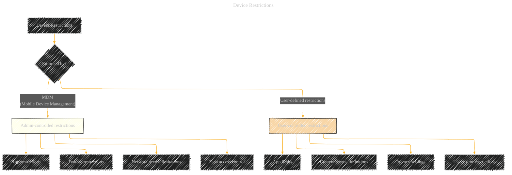

# Device Restrictions - A Diagrammatical Summary
> **Disclaimer:**
>
> This document contains my personal notes on the topic,
> compiled from publicly available documentation and various cited sources.
> The materials are intended for educational purposes, personal study, and reference.
> The content is dual-licensed:
> 1. **MIT License:** Applies to all code implementations (Swift, Mermaid, and other programming languages).
> 2. **Creative Commons Attribution 4.0 International License (CC BY 4.0):** Applies to all non-code content, including text, explanations, diagrams, and illustrations.
---

## Device Restrictions (Diagram)

---

## Explanation of Device Restrictions

Device restrictions are security measures implemented on Apple devices to control various aspects of device usage, either by administrators (through MDM) or by the user themselves.  These restrictions can encompass a broad range of functionalities, affecting both individual user experience and enterprise/institutional security.

## 1. MDM-Enforced Restrictions

*   **Admin-controlled restrictions:**  Administrators using MDM tools can apply policies to restrict or control various features and functionalities.
*   **App restrictions:**  Installation, use, or access to specific apps can be blocked.
*   **Feature restrictions:**  Access to camera, microphone, location services, Wi-Fi, cellular, or other device features can be restricted.
*   **Network access limitations:**  Access to certain websites, networks, or specific IP ranges can be blocked or controlled.
*   **Data access control:**  Data access permissions granted by the user for specific apps and data types can be restricted to prevent unauthorized access.

## 2. User-Defined Restrictions

*   **App limits:**  Users can set limits on app usage time, limiting the amount of time spent on specific apps.
*   **Content access limitations:**  Restrictions on access to certain types of content (e.g., specific file types, categories of files, or websites) can be enforced.
*   **Privacy settings:**  Users can adjust privacy settings for features like location, camera, microphone, contacts, and other data types.
*   **Usage time restrictions:**  Users can set daily or weekly limits on usage time for specific categories of apps or activities (e.g., specific types of content or media.)

## Illustrative Examples of Device Restrictions

*   **MDM Restriction:** An organization might use MDM to block access to specific social media apps and enforce the use of company-approved email clients.
*   **User Restriction:** A user might set a limit on the time they spend on gaming apps each day.
*   **App Restriction:**  An app that requires access to location services can have its access revoked by the user in Privacy settings.

----

## Additional Points to Consider (for a more comprehensive diagram)

* **Enforcement Mechanisms:**  Specify the methods used to enforce restrictions (e.g., through system policies, app entitlements, or API calls.)
* **Enforcement Scope:** Detail the scope of the restrictions, whether they apply to all apps, specific app categories, or only certain users.
* **Interaction with Other Security Features:**  How restrictions interact with other security features like Activation Lock or FileVault.
* **Policy Enforcement Procedures:** Describe the procedures for modifying, removing, or temporarily disabling restrictions.
* **User Interface (UI) elements:** Show the UI components that enable users to set or modify restrictions.
* **Monitoring and Reporting:**  Mention how organizations might monitor compliance with restrictions or report violations.

This diagram and explanation provide a structural understanding of device restrictions. Expanding on these points will make the diagram more comprehensive, showcasing the complexity and interplay of different enforcement mechanisms.

---

<!-- 

---
**Licenses:**

- **MIT License:**   - Full text in [LICENSE](LICENSE) file.
- **Creative Commons Attribution 4.0 International:**  - Legal details in [LICENSE-CC-BY](LICENSE-CC-BY) and at [Creative Commons official site](http://creativecommons.org/licenses/by/4.0/).

---
