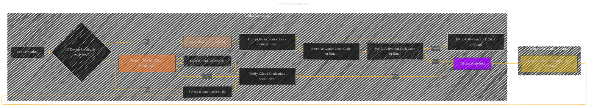

# Remote Activation - A Diagrammatical Summary
> **Disclaimer:**
>
> This document contains my personal notes on the topic,
> compiled from publicly available documentation and various cited sources.
> The materials are intended for educational purposes, personal study, and reference.
> The content is dual-licensed:
> 1. **MIT License:** Applies to all code implementations (Swift, Mermaid, and other programming languages).
> 2. **Creative Commons Attribution 4.0 International License (CC BY 4.0):** Applies to all non-code content, including text, explanations, diagrams, and illustrations.
---

## Remote Activation

Remote activation, in the context of Apple's Activation Lock, isn't a distinct process separate from the initial activation.  Instead, it's a *consequence* of having a device previously activated.  If a device is lost or stolen, it's already linked to an iCloud account and Activation Lock is in effect.  Remote activation is then the process of *attempting to use a device that is already locked to an iCloud account*, but without having the required credentials available on that device.

A user might try to remotely access a device by:

* **Attempting a login:**  This triggers the same verification process as a local activation attempt.  The device, having already been activated, tries to verify the associated iCloud account credentials.

* **Using Find My:**  The Find My app, if the device is discoverable, presents the user with the device's location and, if Activation Lock is enabled, indicates that the device is locked to an iCloud account.  The user is then prompted to log in to that iCloud account in order to regain control of the device.

In both cases, the crucial difference is that the device itself *isn't* locally unlocked, and the user *must* provide their iCloud credentials (or the appropriate recovery contact/key) in order to access the device.  The device acts as a "locked box" requiring the correct key to unlock it.  The user isn't remotely activating the device; they're remotely attempting to unlock it using their credentials.

Here's a basic visual representation of the remote activation concept as part of a broader activation process:

In essence, the "remote activation" is a user-initiated attempt to unlock a device already bound to their iCloud account. There is no independent remote activation process separate from the normal activation flow that's triggered locally or remotely.

---

<!-- 

---
**Licenses:**

- **MIT License:**   - Full text in [LICENSE](LICENSE) file.
- **Creative Commons Attribution 4.0 International:**  - Legal details in [LICENSE-CC-BY](LICENSE-CC-BY) and at [Creative Commons official site](http://creativecommons.org/licenses/by/4.0/).

---
