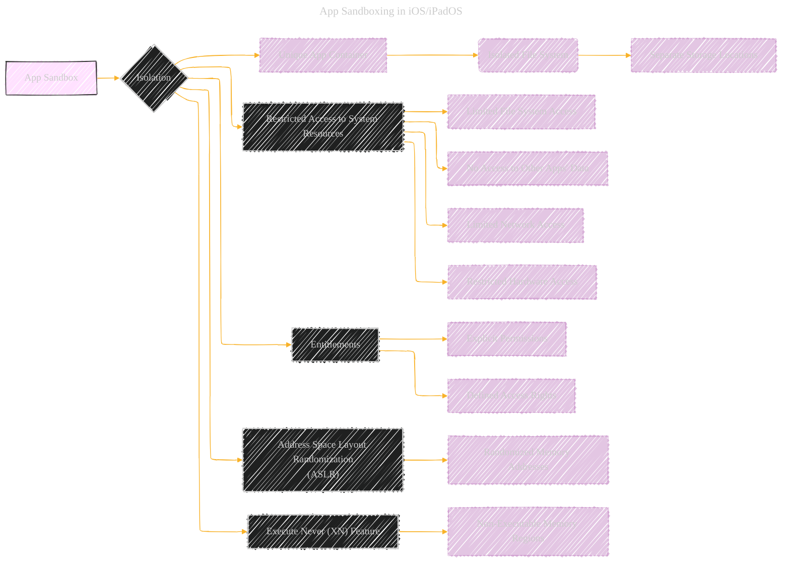
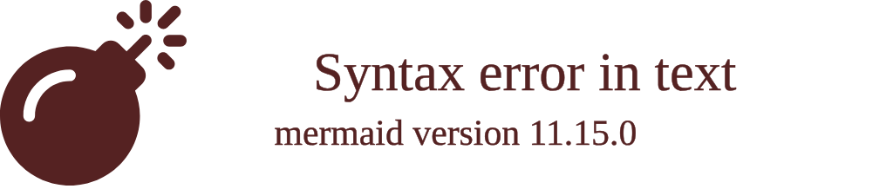

# App Sandboxing in iOS iPadOS - A Diagrammatical Summary
> **Disclaimer:**
>
> This document contains my personal notes on the topic,
> compiled from publicly available documentation and various cited sources.
> The materials are intended for educational purposes, personal study, and reference.
> The content is dual-licensed:
> 1. **MIT License:** Applies to all code implementations (Swift, Mermaid, and other programming languages).
> 2. **Creative Commons Attribution 4.0 International License (CC BY 4.0):** Applies to all non-code content, including text, explanations, diagrams, and illustrations.
---

## App Sandboxing in iOS/iPadOS

App sandboxing in iOS and iPadOS is a crucial security mechanism that isolates each app from the others and the operating system itself.  This prevents one app from accidentally or maliciously accessing or modifying data belonging to another app or system files.

---

## Explanation

* **Unique App Container:** Each app is assigned a unique container within the file system.  This container includes folders for the app's data, cached files, and temporary files.  Crucially, this container is separate from the containers of other apps and system files.

* **Isolated File System:** The app's container has its own, isolated file system.  This means the app cannot directly access or modify files located outside its container.  Any attempt to do so results in a security violation.  Instead, the app needs to use system APIs to interact with the rest of the system.

* **Restricted Access to System Resources:** Apps are not permitted to access or manipulate various system resources, including:
    * **System Files:**  Critical system files, folders, and libraries are protected from app tampering.
    * **Hardware Devices:**  Direct access to the device's camera, microphone, or other hardware is strictly controlled through system APIs.
    * **Network Communication:** Apps have limited network access, controlled by the operating system.  They can't connect to arbitrary networks or services without specific permissions.

* **Entitlements:**  Entitlements are explicit permissions granted to an app.  These are key-value pairs in the app's code signature that define what resources the app is allowed to access.  Entitlements are rigorously verified by the system before an app is allowed to access any resource.

* **Address Space Layout Randomization (ASLR):** This technique randomly rearranges the memory addresses used by an app. This makes it harder for attackers to exploit memory corruption vulnerabilities, since the exploit code will need to know the exact memory addresses used by the targeted app.  ASLR makes the memory map of the app unpredictable and reduces the effectiveness of many exploits that rely on predictable memory layouts.

* **Execute Never (XN) Feature:** This feature marks memory pages as non-executable.  Apps are not allowed to write or execute code in these marked memory areas, preventing many exploits that rely on self-modifying code or manipulating the runtime environment.  This additional protection adds further layers to the app's runtime protection, limiting their actions to prevent harm to the system or other apps.

---

## How it Works

1.  **Installation:** When an app is installed, the operating system creates its unique container and sets up the restricted access rules.

2.  **Runtime:**  Whenever an app needs to access a resource (file, network, hardware), it has to use system APIs.  These APIs are designed to check for entitlements and verify the app's legitimacy.

3.  **Enforcement:** The operating system rigorously enforces these rules, preventing unauthorized access attempts and mitigating the risk of malicious activity.

This sandboxed environment significantly improves the security and stability of the iOS and iPadOS platform by preventing one app from compromising others or the system itself.

---

<!-- 

---
**Licenses:**

- **MIT License:**   - Full text in [LICENSE](LICENSE) file.
- **Creative Commons Attribution 4.0 International:**  - Legal details in [LICENSE-CC-BY](LICENSE-CC-BY) and at [Creative Commons official site](http://creativecommons.org/licenses/by/4.0/).

---
