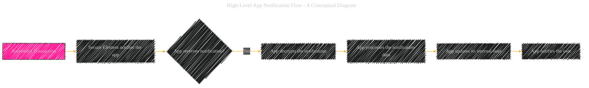

# App Notification - A Diagrammatical Summary
> **Disclaimer:**
>
> This document contains my personal notes on the topic,
> compiled from publicly available documentation and various cited sources.
> The materials are intended for educational purposes, personal study, and reference.
> The content is dual-licensed:
> 1. **MIT License:** Applies to all code implementations (Swift, Mermaid, and other programming languages).
> 2. **Creative Commons Attribution 4.0 International License (CC BY 4.0):** Applies to all non-code content, including text, explanations, diagrams, and illustrations.
---

The "App Notification" process in Apple Pay, following a successful transaction, involves several steps to ensure the user is informed and the system integrity is maintained.

----

## 1. High-Level App Notification Flow (Conceptual Diagram)

----

## 2. Detailed App Notification Process (Specific steps with security emphasis)

```mermaid
---
title: Detailed App Notification Process
config:
  layout: elk
  look: handDrawn
  theme: dark
---
%%{
  init: {
    'fontFamily': 'verdana',
    'themeVariables': {
      'primaryColor': '#BB2528',
      'primaryTextColor': '#f529',
      'primaryBorderColor': '#7C0000',
      'lineColor': '#F8B229',
      'secondaryColor': '#006100',
      'tertiaryColor': '#fff'
    }
  }
}%%
graph LR
    A["Transaction Completion"] --> B["Secure Element signals transaction status"]
    B --> C["Secure Element encrypts a notification payload with the app's unique key"]
    C --> D["Secure Element sends the encrypted payload to the app process"]
    D --> E["App process receives and decrypts the payload using the app's corresponding key"]
    E --> F["App process verifies the integrity of the notification payload"]
    F -- Integrity OK --> G["App extracts relevant transaction details<br>(amount, status, etc.)"]
    G --> H["App updates its internal transaction history and displays status to the user"]

style A fill:#f29f,stroke:#333,stroke-width:1px
    
```

----

## 3. Security Considerations

*   **Encryption:** The notification payload is encrypted using a unique key specifically associated with the app. This prevents any unauthorized access to the transaction details. The key is secured within the app's process and only the app is able to decrypt the notification.
*   **Integrity Verification:** The app verifies the integrity of the notification payload before processing it.  This crucial step prevents malicious modification of the notification data, ensuring the app receives only authentic information.
*   **App-Specific Key:** Using a unique key for each app is essential for preventing one app from gaining access to the transaction details of other apps.  This further limits the impact of potential security breaches.
*   **Secure Channel:** The communication path between the Secure Element and the app process is secured to prevent any unauthorized interception of the notification.
*   **Limited Access:** The app only receives the necessary transaction details (amount, status, etc.) and does not gain access to the raw card information. This further protects user privacy.
*   **App Process Integrity:**  The app process itself is sandboxed to prevent it from affecting other apps or system resources.

----

## 4.  Illustrative Diagram Showing Key Components

----

## 5. User-Facing Aspects

*   **Confirmation:** The user receives a confirmation message within the app, usually with details of the successful transaction.
*   **Receipt:** The app may also provide a way for the user to view a receipt or summary of the purchase.

---

The app notification process in Apple Pay, therefore, is a vital part of the user experience, and crucially, it's designed to protect sensitive information and maintain the integrity of the entire system. The multiple layers of encryption and integrity checks protect user data from unauthorized access and malicious manipulation.

---
**Licenses:**

- **MIT License:**   - Full text in [LICENSE](LICENSE) file.
- **Creative Commons Attribution 4.0 International:**  - Legal details in [LICENSE-CC-BY](LICENSE-CC-BY) and at [Creative Commons official site](http://creativecommons.org/licenses/by/4.0/).

---