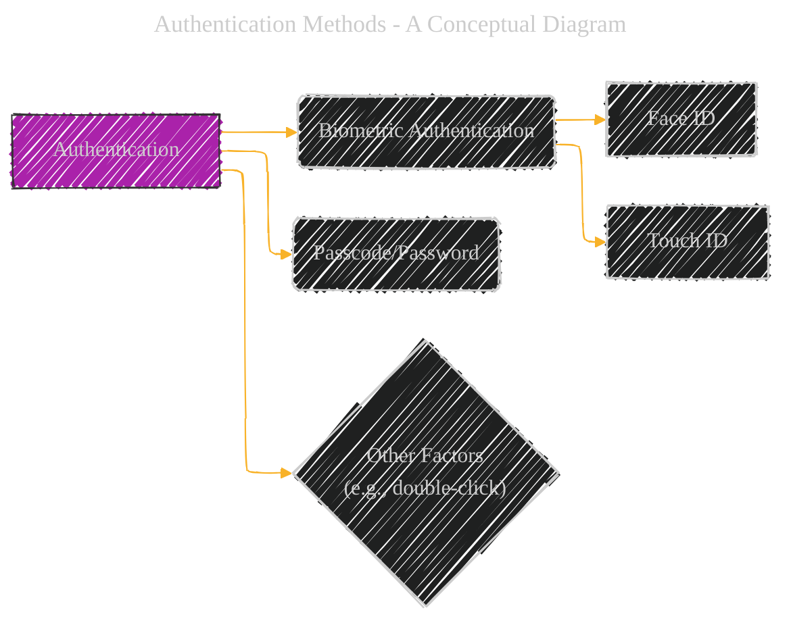
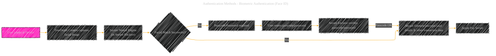
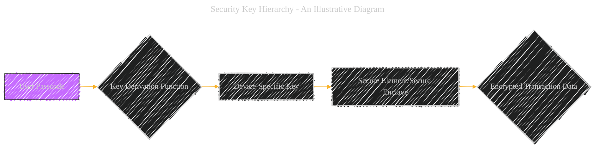

# Apple Pay Authentication Process - A Diagrammatical Summary
> **Disclaimer:**
>
> This document contains my personal notes on the topic,
> compiled from publicly available documentation and various cited sources.
> The materials are intended for educational purposes, personal study, and reference.
> The content is dual-licensed:
> 1. **MIT License:** Applies to all code implementations (Swift, Mermaid, and other programming languages).
> 2. **Creative Commons Attribution 4.0 International License (CC BY 4.0):** Applies to all non-code content, including text, explanations, diagrams, and illustrations.
---

## 1. Authentication Methods - A Conceptual Diagram

----

## 2. Detailed Authentication Flowcharts (with security emphasis)

### a) Biometric Authentication (Face ID)

### b) Biometric Authentication (Touch ID)

### c) Passcode/Password Authentication

----

## 3. Security Considerations for Each Method

*   **Biometric Authentication (Face ID/Touch ID):**
    *   **Secure Enclave Isolation:**  The Secure Enclave performs the facial/fingerprint matching.  This isolation prevents access to the biometric data from other parts of the system.  The result of the match is only a boolean (success/failure) communicated to the Secure Element.
    *   **Anti-spoofing Measures:**  The TrueDepth camera and Secure Neural Engine include anti-spoofing measures to detect fraudulent attempts (e.g., using a photo or mask).
    *   **Data Protection:** Data encrypted by the Secure Element remains protected within the Secure Element until the transaction is complete and validated by the Apple Pay servers.
*   **Passcode/Password Authentication:**
    *   **Secure Enclave Verification:** The Secure Enclave (or equivalent) directly verifies the passcode, preventing the application processor from intercepting or manipulating the input.
    *   **Limited Attempts:**  The system enforces limits on the number of incorrect passcode attempts, adding a layer of protection against brute-force attacks.
    *   **Time Delays:** Escalating time delays after incorrect attempts further discourage brute-force attacks.
*   **Other Factors (Double-click, etc.):**  These factors add an extra layer of security by requiring a physical action (e.g., double-click) in addition to biometric or passcode authentication.  This prevents a malicious application from automatically triggering a transaction without user awareness.

---

## 4. Security Key Hierarchy (Illustrative Diagram)

This detailed breakdown highlights the critical role of the Secure Enclave and Secure Element in safeguarding the authentication process, from biometric matching to passcode verification.  The cascading encryption mechanisms further enhance the security of sensitive transaction data.

---

<!-- 

---
**Licenses:**

- **MIT License:**   - Full text in [LICENSE](LICENSE) file.
- **Creative Commons Attribution 4.0 International:**  - Legal details in [LICENSE-CC-BY](LICENSE-CC-BY) and at [Creative Commons official site](http://creativecommons.org/licenses/by/4.0/).

---
