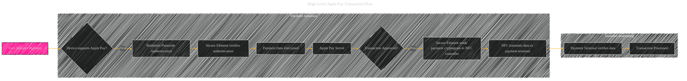
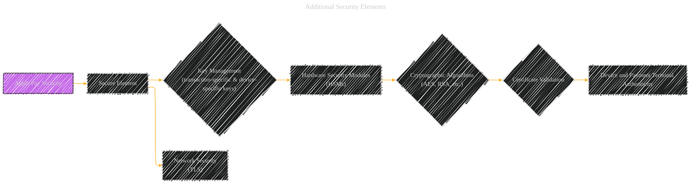

# Apple Pay Transaction Flow - A Diagrammatical Summary
> **Disclaimer:**
>
> This document contains my personal notes on the topic,
> compiled from publicly available documentation and various cited sources.
> The materials are intended for educational purposes, personal study, and reference.
> The content is dual-licensed:
> 1. **MIT License:** Applies to all code implementations (Swift, Mermaid, and other programming languages).
> 2. **Creative Commons Attribution 4.0 International License (CC BY 4.0):** Applies to all non-code content, including text, explanations, diagrams, and illustrations.
---

Below are some diagrams and explanations provide a more comprehensive understanding of the security measures employed within the Apple Pay transaction flow. The multi-layered encryption, use of unique identifiers, and hardware-based security components all contribute to a robust and secure payment experience for users. Remember that the exact implementation details might vary slightly depending on the specific device and iOS version.

----

## 1. High-Level Apple Pay Transaction Flow (Conceptual Diagram)

----

## 2. Detailed Apple Pay Transaction Flow (Specific steps with security emphasis)

```mermaid
---
title: Detailed Apple Pay Transaction Flow (Specific steps with security emphasis)
config:
  layout: elk
  look: handDrawn
  theme: dark
---
%%{
  init: {
    'fontFamily': 'verdana',
    'themeVariables': {
      'primaryColor': '#BB2528',
      'primaryTextColor': '#f529',
      'primaryBorderColor': '#7C0000',
      'lineColor': '#F8B229',
      'secondaryColor': '#006100',
      'tertiaryColor': '#fff'
    }
  }
}%%
graph LR
    A[User touches payment card] --> B{Device supports Apple Pay?}
    B -- Yes --> C[NFC Controller activates]
    C --> D[Device presents relevant card details to NFC]
    D --> E[Secure Element]
    E --> F["Secure Enclave (if applicable) verifies biometric/passcode"]
    F -- Passcode OK --> G[Secure Element encrypts card details using a transaction-specific key]
    G --> H[Secure Element encrypts the cryptogram with a device-specific key, adding a unique Transaction ID]
    H --> I[NFC Controller transmits the cryptogram to payment terminal]
    I --> J[Payment Terminal decrypts the cryptogram with the merchant's key]
    J --> K[Payment Terminal validates Transaction ID and cryptogram]
    K -- Transaction Valid --> L[Payment Terminal processes the transaction]
    L --> M[Payment Terminal responds to Secure Element]
    M --> N[Secure Element notifies the app]
    N --> O[App notifies the user]
    
    style A fill:#f29f,stroke:#333,stroke-width:1px

```

----

## 3. Specific Security Considerations

*   **Authentication:** The flow starts with the user's device verifying their identity through biometrics or passcode. This authentication happens within the Secure Element or Secure Enclave, preventing any unauthorized access to the transaction information.
*   **Data Encryption:** The card details and transaction information are encrypted multiple times using different keys.  First, a transaction-specific key is used. Second, it's encrypted further with a device-specific key within the Secure Element.  The payment terminal decrypts with its key, and Apple Pay servers re-encrypt the validated transaction information with a merchant-specific key before delivering it to the merchant. This multi-layered encryption ensures data confidentiality even if one part of the system is compromised.
*   **Transaction ID:** A unique Transaction ID is generated and included in the transmitted cryptogram. This provides a mechanism for the payment terminal to verify the transaction's integrity and prevent replay attacks.
*   **Secure Element:** The Secure Element is a dedicated, hardware-based secure enclave that manages sensitive payment information. This chip is certified and protected from unauthorized access, ensuring that the sensitive card data is not directly accessible to the application processor. The NFC controller acts as an intermediary, only communicating with the payment terminal and the Secure Element.
*   **Payment Terminal Validation:** The payment terminal receives the encrypted data, decrypts it with its merchant key, and then validates both the cryptogram and the Transaction ID.
*   **App Notification:** Once the transaction is processed, the application on the user's device is notified of the result, providing the user with a confirmation.

------

## 4. Additional Security Elements (Illustrative Diagram)

---
**Licenses:**

- **MIT License:**   - Full text in [LICENSE](LICENSE) file.
- **Creative Commons Attribution 4.0 International:**  - Legal details in [LICENSE-CC-BY](LICENSE-CC-BY) and at [Creative Commons official site](http://creativecommons.org/licenses/by/4.0/).

---