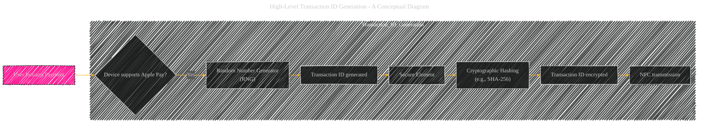
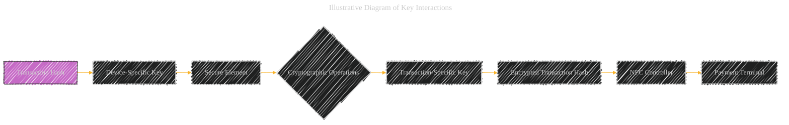

# Apple Pay Transaction ID Process - A Diagrammatical Summary
> **Disclaimer:**
>
> This document contains my personal notes on the topic,
> compiled from publicly available documentation and various cited sources.
> The materials are intended for educational purposes, personal study, and reference.
> The content is dual-licensed:
> 1. **MIT License:** Applies to all code implementations (Swift, Mermaid, and other programming languages).
> 2. **Creative Commons Attribution 4.0 International License (CC BY 4.0):** Applies to all non-code content, including text, explanations, diagrams, and illustrations.
---

## 1. High-Level Transaction ID Generation (Conceptual Diagram)

---

## 2. Detailed Transaction ID Generation and Handling (Diagram with specific steps and security considerations)

----

## 3. Security and Functionality Explanation

*   **Transaction Identifier (TID) Generation:** A unique `Transaction ID` is crucial for preventing replay attacks and ensuring that each transaction is distinct.  The generation involves a random number from an RNG, along with timestamp and UDID components. This combination helps to avoid predictable or easily guessable IDs.
*   **Cryptographic Hashing:** The `Transaction ID` (TID), device timestamp, and UDID are combined and hashed using a cryptographic hash function (e.g., SHA-256).  This hash (TH) provides a unique fingerprint of the transaction that the payment terminal can use for validation.  Hashing is a one-way function, making it virtually impossible to reverse-engineer the original TID.
*   **Encryption Layers:** The transaction hash (TH) is encrypted with multiple layers of keys:
    *   **Device-specific key:** Within the Secure Element, protecting the transaction hash from unauthorized access by the application processor.
    *   **Transaction-specific key:**  Adds a further layer of encryption to the TH, protecting it from replay attacks, even if an attacker obtains access to the device-specific key. This key is tied to the transaction, and only relevant to that one transaction.
*   **NFC Transmission:** The encrypted transaction hash is transmitted via the NFC controller to the payment terminal.
*   **Validation at the Payment Terminal:** The payment terminal receives the encrypted hash, decrypts it using its merchant's key, and validates the `Transaction Hash` (TH) against the information received during the transaction.
*   **App Notification:** If the transaction is validated, the Secure Element notifies the application, which then informs the user.

---

## 4. Illustrative Diagram of Key Interactions

----

This expanded explanation further clarifies the security aspects of `Transaction ID` generation and usage within Apple Pay. The inclusion of a timestamp, unique device identifier, and cryptographic hashing significantly reduces the risk of replay attacks and ensures the integrity of each transaction.  The multiple encryption layers further enhance the confidentiality of the transaction data.

---

<!-- 

---
**Licenses:**

- **MIT License:**   - Full text in [LICENSE](LICENSE) file.
- **Creative Commons Attribution 4.0 International:**  - Legal details in [LICENSE-CC-BY](LICENSE-CC-BY) and at [Creative Commons official site](http://creativecommons.org/licenses/by/4.0/).

---
