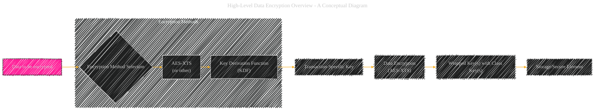
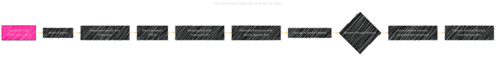

# Data Encryption Process in Apple Pay - A Diagrammatical Summary
> **Disclaimer:**
>
> This document contains my personal notes on the topic,
> compiled from publicly available documentation and various cited sources.
> The materials are intended for educational purposes, personal study, and reference.
> The content is dual-licensed:
> 1. **MIT License:** Applies to all code implementations (Swift, Mermaid, and other programming languages).
> 2. **Creative Commons Attribution 4.0 International License (CC BY 4.0):** Applies to all non-code content, including text, explanations, diagrams, and illustrations.
---

## 1. High-Level Data Encryption Overview (Conceptual Diagram)

This simplified diagram illustrates the core steps. Data starts with encryption method selection and then proceeds through a key derivation process, finally resulting in the encrypted data stored in a secure location.

----

## 2. Data Protection in Apple Pay (with specific steps)

This diagram demonstrates how sensitive card data is handled. The transaction-specific key is derived dynamically, protecting against attacks where an attacker might try to predict the key. The device-specific key adds another layer of security, ensuring that only the authorized device can decrypt the data.

----

## 3. Key Derivation and Wrapping (Elaboration)

*   **Key Derivation Function (KDF):**  A KDF (like HKDF, or PBKDF2) takes a strong, source key (like a random value generated in the Secure Enclave or a user's passcode) and transforms it into multiple derived keys. This derived key is used to encrypt the card information, then the transaction ID, and the result is further wrapped. This process is essential because it prevents an attacker from directly obtaining the original key used to encrypt the data.
*   **Transaction-Specific Keys:** These keys are unique to each transaction.  They're generated dynamically, making them extremely difficult to predict or exploit.
*   **Device-Specific Keys:** These keys are linked to the user's device and are protected within the Secure Enclave.
*   **Wrapping with Class Keys (if applicable):** In some cases, like protecting a file, the per-file key is further wrapped with a class key, which is derived from the user's passcode and device UID. This further restricts access to the data when the device is locked.

----

## 4. Data Protection Classes (Elaboration)

*   **Data Protection Classes:** The various classes (e.g., `NSFileProtectionComplete`, `NSFileProtectionCompleteUnlessOpen`, etc.) determine when and how the data is accessible.  For Apple Pay, the data is likely handled in a manner that provides access only when the device is unlocked or when the user explicitly authorizes access.
*   **Secure Element Storage:** The encrypted data, along with the wrapped keys, is securely stored within the Secure Element, isolated from the rest of the device's memory.

----

## 5. Additional Considerations

*   **Cryptographic Algorithms:**  The exact algorithms used for encryption (AES, RSA, ECDSA) are critical security components.  Apple uses industry-standard algorithms and strong key lengths to ensure the highest level of security.
*   **Key Management Hierarchy:** The encryption keys are managed in a hierarchical fashion. This hierarchy is designed to restrict access and provide multiple layers of protection.
*   **Ephemeral Keys:** In many cases, Apple utilizes ephemeral keys (generated for each session) to enhance security. These keys are discarded after the transaction, reducing the impact of a potential breach.

----

These explanations and diagrams detail the key aspects of data encryption in Apple Pay, emphasizing the various levels of protection and the dynamic nature of key management to safeguard user information.  Remember that this is a simplified explanation; the underlying implementation is complex and involves many more specific details.

---

<!-- 

---
**Licenses:**

- **MIT License:**   - Full text in [LICENSE](LICENSE) file.
- **Creative Commons Attribution 4.0 International:**  - Legal details in [LICENSE-CC-BY](LICENSE-CC-BY) and at [Creative Commons official site](http://creativecommons.org/licenses/by/4.0/).

---
