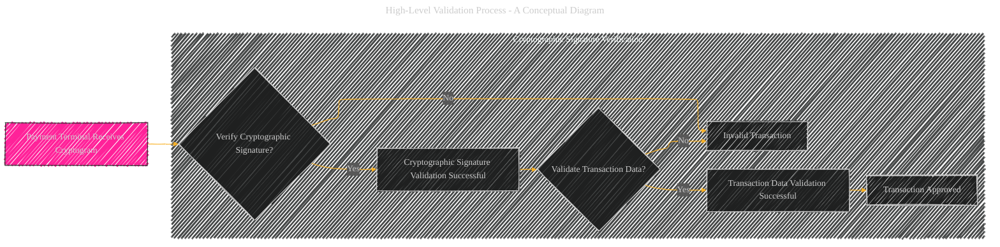
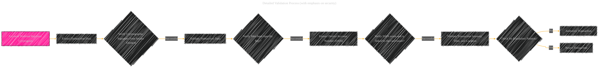

# Payment Terminal Validation - A Diagrammatical Summary
> **Disclaimer:**
>
> This document contains my personal notes on the topic,
> compiled from publicly available documentation and various cited sources.
> The materials are intended for educational purposes, personal study, and reference.
> The content is dual-licensed:
> 1. **MIT License:** Applies to all code implementations (Swift, Mermaid, and other programming languages).
> 2. **Creative Commons Attribution 4.0 International License (CC BY 4.0):** Applies to all non-code content, including text, explanations, diagrams, and illustrations.
---

The "Payment Terminal Validation" process in Apple Pay is crucial for ensuring the security and integrity of transactions.  It involves several steps, each designed to prevent fraud and ensure the transaction is legitimate.  Here's a breakdown of the process, with emphasis on the security measures:

----

## 1. High-Level Validation Process (Conceptual Diagram)

---

## 2. Detailed Validation Process (with emphasis on security)

---

## 3. Security Measures within Validation

### Cryptographic Signature Verification
 The payment terminal first verifies the digital signature attached to the cryptogram.  This signature is created by the Secure Element on the user's device using a device-specific key and is crucial for validating the origin and integrity of the data.  Any mismatch indicates potential tampering or a fraudulent attempt.

### Merchant-Specific Key Validation
The terminal then uses the merchant's public key to decrypt the portion of the cryptogram that contains the transaction details (amount, time, etc.). This verifies the payment terminal is communicating with the correct merchant.  The merchant's key is part of a trusted system, preventing the use of forged keys or impersonation.

### Device Account Number (DAN) Validation
The payment terminal verifies that the Device Account Number is valid and linked to the card issuer. This is a critical step to ensure that the card is authorized and prevent the use of a stolen card or fraudulent DAN.

### Transaction Amount, Time, and Location Validation
The payment terminal verifies the transaction amount, time, and location against predefined thresholds and known patterns of fraudulent activity.  This helps detect suspicious transactions, especially those that involve unusually high amounts or occur outside of normal transaction patterns.

### Fraudulent Pattern Detection
sThe terminal checks for known fraudulent patterns in the transaction.  This could involve checking against a database of previously reported fraudulent transactions or analyzing transaction patterns for unusual anomalies.

----

## 4. Consequences of Validation Failures

### Invalid Transaction
If any of the validation steps fail (e.g., invalid signature, unauthorized merchant key, fraudulent patterns), the transaction is immediately rejected.  This protects both the user and the merchant from fraudulent activity.

### Transaction Approved
 If all validation steps are successful, the transaction is authorized, and the payment process proceeds.

----

## 5. Illustrative Diagram of Data Flow during Validation

----

These steps and security measures within the validation process are essential to the overall security of Apple Pay, ensuring that only legitimate transactions are approved, thereby protecting both the user's and the merchant's funds.

---

<!-- 

---
**Licenses:**

- **MIT License:**   - Full text in [LICENSE](LICENSE) file.
- **Creative Commons Attribution 4.0 International:**  - Legal details in [LICENSE-CC-BY](LICENSE-CC-BY) and at [Creative Commons official site](http://creativecommons.org/licenses/by/4.0/).

---
