# Secure Element Process in Apple Pay - A Diagrammatical Summary
> **Disclaimer:**
>
> This document contains my personal notes on the topic,
> compiled from publicly available documentation and various cited sources.
> The materials are intended for educational purposes, personal study, and reference.
> The content is dual-licensed:
> 1. **MIT License:** Applies to all code implementations (Swift, Mermaid, and other programming languages).
> 2. **Creative Commons Attribution 4.0 International License (CC BY 4.0):** Applies to all non-code content, including text, explanations, diagrams, and illustrations.
---

The Secure Element (SE) is a crucial component in Apple Pay, acting as a dedicated, hardware-based security enclave.  Let's explore its role in the Apple Pay transaction flow with diagrams and detailed explanations.

----

## 1. High-Level Secure Element (SE) Role (Conceptual Diagram)

This simplified diagram shows the SE receiving data related to the authentication, handling card details, encrypting transaction data, and ultimately passing it to the NFC controller for communication with the payment terminal.

----

## 2. Detailed Secure Element (SE) Process in Apple Pay (Illustrative Diagram)

```mermaid
---
title: Detailed Secure Element (SE) Process in Apple Pay - An Illustrative Diagram
config:
  layout: elk
  look: handDrawn
  theme: dark
---
%%{
  init: {
    'fontFamily': 'verdana',
    'themeVariables': {
      'primaryColor': '#BB2528',
      'primaryTextColor': '#f529',
      'primaryBorderColor': '#7C0000',
      'lineColor': '#F8B229',
      'secondaryColor': '#006100',
      'tertiaryColor': '#fff'
    }
  }
}%%
graph LR
    A[User Initiates Payment] --> B{"Device supports Apple Pay?"}
    B -- Yes --> C[NFC Controller activates]
    C --> D[Device presents relevant card details to NFC]
    D --> E["Secure Element (SE)"]
    E --> F[Key Retrieval/Generation]
    F --> G[Transaction-Specific Key]
    G --> H[Card Data Encryption]
    H --> I["Cryptogram Generation<br>(including Transaction ID)"]
    I --> J[Key Wrapping]
    J --> K[Encrypted Cryptogram]
    K --> L[Entitlement Check]
    L -- Entitlement OK --> M[Cryptographic Signature Creation]
    M --> N[Secure Data Delivery to NFC]
    N --> O[NFC transmits data to payment terminal]

style A fill:#f29f,stroke:#333,stroke-width:1px

```

---

## 3. Key Secure Element (SE) Processes in Detail

### Key Management
 The SE holds multiple cryptographic keys, including a transaction-specific key (for the current transaction), and long-term, device-specific keys.  These keys are not accessible by the Application Processor (AP) and are protected by the SE's hardware security mechanisms.

### Card Data Handling
When a payment is initiated, the SE retrieves the appropriate card details from the Secure Element's internal storage (encrypted). This step involves secure access to the card information without compromising the privacy of card data.

### Encryption
The SE encrypts the retrieved card data using a strong cryptographic algorithm (e.g., AES) and the transaction-specific key.  This initial encryption step occurs entirely within the SE's secure environment.

### Cryptogram Generation
The SE combines the encrypted card data with a unique Transaction ID. The Transaction ID serves as a unique identifier for the transaction. The entire cryptogram is further encrypted using a device-specific key for extra security and integrity.

### Key Wrapping
The SE wraps the cryptogram with the device-specific key using appropriate cryptographic methods to ensure that the data can only be decrypted by the payment terminal.

### Entitlement Check
 The SE verifies the entitlements for the requested transaction and the app to ensure the app has the necessary authorization to perform the requested transaction.

### Cryptographic Signature Creation
The SE creates a cryptographic signature to authenticate the transaction data. This step is critical for ensuring the integrity of the transaction and protecting against tampering.

### Secure Data Delivery
The SE ensures that the encrypted cryptogram is delivered securely to the NFC controller. This delivery path is protected by the SE's hardware security and is separate from the main processor.

### Inter-Device Communication
The NFC controller transmits the encrypted cryptogram over the NFC communication channel to the payment terminal. This communication remains encrypted throughout, preventing any malicious entity from eavesdropping or tampering.

---

## 4. Additional Security Considerations within the Secure Element (SE)

### Isolation
The SE operates in a hardware-isolated environment, minimizing the attack surface and preventing malicious software from accessing sensitive data.

### Tamper Resistance
The SE's design is intended to be tamper-resistant, further protecting against physical attacks.

### Cryptographic Strength
The SE utilizes strong cryptographic algorithms and key lengths (e.g., 256-bit AES) to resist cryptanalysis and provide a high level of security.

---

These details illustrate the multifaceted nature of the Secure Element's role in protecting sensitive data during an Apple Pay transaction.  The isolation, encryption, and authentication mechanisms implemented within the SE contribute significantly to the overall security of the Apple Pay system.

---

<!-- 

---
**Licenses:**

- **MIT License:**   - Full text in [LICENSE](LICENSE) file.
- **Creative Commons Attribution 4.0 International:**  - Legal details in [LICENSE-CC-BY](LICENSE-CC-BY) and at [Creative Commons official site](http://creativecommons.org/licenses/by/4.0/).

---
