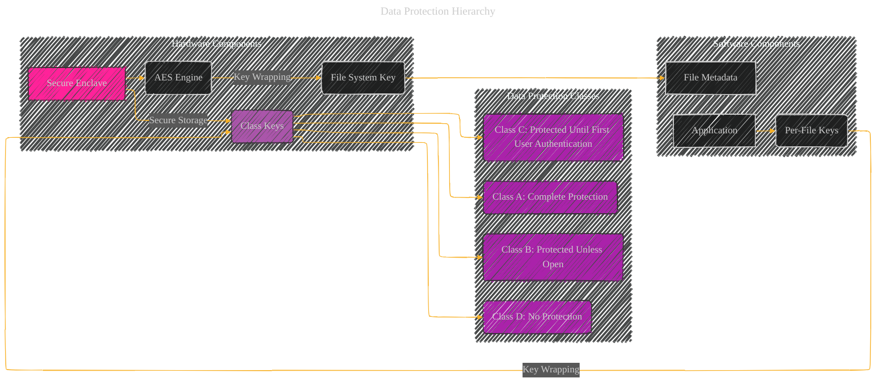

# Data Protection Hierarchy - A Diagrammatical Summary
> **Disclaimer:**
>
> This document contains my personal notes on the topic,
> compiled from publicly available documentation and various cited sources.
> The materials are intended for educational purposes, personal study, and reference.
> The content is dual-licensed:
> 1. **MIT License:** Applies to all code implementations (Swift, Mermaid, and other programming languages).
> 2. **Creative Commons Attribution 4.0 International License (CC BY 4.0):** Applies to all non-code content, including text, explanations, diagrams, and illustrations.
---

**Explanation and Examples:**

The Data Protection hierarchy is a layered system that protects user data stored on Apple devices.  This hierarchy is crucial for ensuring data confidentiality and integrity, even in compromised system states.

*   **Secure Enclave (A):**  This dedicated hardware component is the root of trust for data protection. It manages and protects sensitive keys (e.g., the file system key, class keys).

*   **AES Engine (B):**  This hardware component performs the actual encryption and decryption of data.  It works closely with the Secure Enclave.

*   **File System Key (C):**  A key used to encrypt the metadata of files, crucial for managing access and verification.  Stored in effaceable storage, this key is primarily for rapid erasure rather than long-term confidentiality.

*   **Class Keys (D):**  These keys encrypt per-file (or per-extent) keys.  Different classes have different accessibility rules, affecting when and how the data can be accessed.
    *   **Class A (Complete Protection):**  Data is inaccessible when the device is locked. The class key is tied to the user's passcode.  *Example:*  Sensitive financial data, notes with strong protection.
    *   **Class B (Protected Unless Open):**  Data is accessible while the device is unlocked or the app is open.  *Example:*  Mail attachments that need to be written to while the device is locked.
    *   **Class C (Protected Until First User Authentication):**  Data is accessible after the first unlock, even when the device is subsequently locked.  This is the default class for most user data.  *Example:*  Most user documents and photos.
    *   **Class D (No Protection):**  This class is not supported in macOS; it is simply meant for fast remote wipe. *Example:*  Data that is not meant for long-term protection but needs to be cleared swiftly.

*   **Per-File Keys (F):**  Each file has a unique key for encryption, wrapped by its corresponding class key. This key is part of the file's metadata. *Example:*  A photo file is encrypted with a per-file key, wrapped by the Class C key.

*   **File Metadata (G):** The file's metadata contains the wrapped per-file key and the class key identifier.  This metadata is encrypted using the file system key (C). *Example:*  The photo file's metadata contains the wrapped per-file key (encrypted with a per-file key) and the Class C identifier.

**Example Scenario:**

When a user adds a new note to their Notes app (Class C), the app generates a unique per-file key and encrypts it with the class key for protection until the first unlock. The resulting encrypted per-file key, along with metadata indicating the class, is saved with the note's metadata, which is then encrypted with the file system key.  Only when the device is unlocked (with passcode or biometric) can the class key be unwrapped and used to access the per-file key and decrypt the note's contents.

This layered approach provides several security advantages:  protection against brute-force attacks, ability to quickly and securely erase data (by erasing the file system key), and flexible access controls based on the class.

Remember that this diagram and explanation represent a simplified overview. The actual implementation details are complex and involve numerous cryptographic algorithms and hardware interactions, as outlined in the full documentation.

---
**Licenses:**

- **MIT License:**   - Full text in [LICENSE](LICENSE) file.
- **Creative Commons Attribution 4.0 International:**  - Legal details in [LICENSE-CC-BY](LICENSE-CC-BY) and at [Creative Commons official site](http://creativecommons.org/licenses/by/4.0/).

---