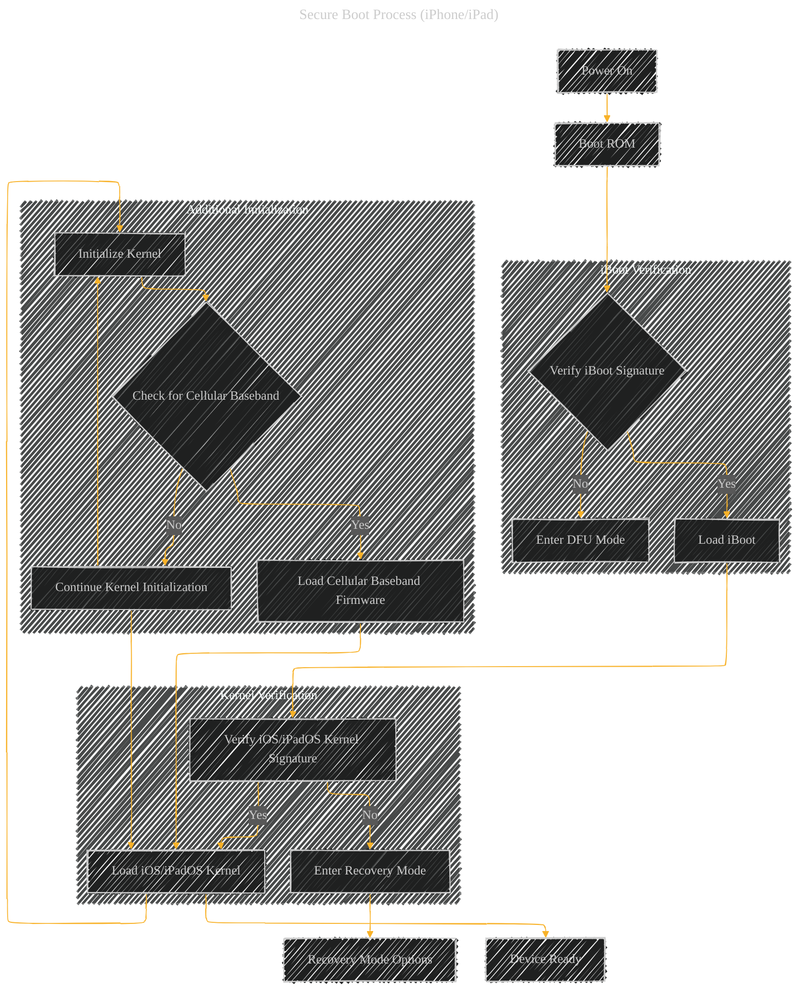

# Secure Boot Process - A Diagrammatical Summary
> **Disclaimer:**
>
> This document contains my personal notes on the topic,
> compiled from publicly available documentation and various cited sources.
> The materials are intended for educational purposes, personal study, and reference.
> The content is dual-licensed:
> 1. **MIT License:** Applies to all code implementations (Swift, Mermaid, and other programming languages).
> 2. **Creative Commons Attribution 4.0 International License (CC BY 4.0):** Applies to all non-code content, including text, explanations, diagrams, and illustrations.
---

## Secure Boot Process (iPhone/iPad)

A flowchart illustrating the secure boot process on iPhone and iPad devices, highlighting the chain of trust and error handling:

## Explanation

*   **Power On (A):** The device's power is switched on.
*   **Boot ROM (B):** The initial, immutable code loaded from the chip's read-only memory. This code is considered the hardware root of trust.
*   **Verify iBoot Signature (C):** The Boot ROM checks if the iBoot bootloader, the next stage in the boot process, is signed by Apple.
    *   **Yes (C --> D):** If verified, iBoot is loaded into memory.
    *   **No (C --> E):** If not verified, the device enters DFU (Device Firmware Upgrade) mode.  This mode is designed for recovery and update processes.
*   **Load iBoot (D):** iBoot is loaded into memory.
*   **Verify iOS/iPadOS Kernel Signature (F):** iBoot checks if the iOS or iPadOS kernel is signed by Apple.
    *   **Yes (F --> G):** If verified, the kernel is loaded.
    *   **No (F --> H):** If not verified, the device enters Recovery mode, a more advanced recovery mode than DFU.
*   **Load iOS/iPadOS Kernel (G):** The iOS or iPadOS kernel is loaded into memory.
*   **Initialize Kernel (I):** The kernel begins its initialization process.
*   **Check for Cellular Baseband (J):** The process checks for cellular functionality.
    *   **Yes (J --> K):** If cellular is present, the cellular baseband firmware is loaded and verified.
    *   **No (J --> L):** If cellular isn't present, the boot process continues with initialization.
*   **Load Cellular Baseband Firmware (K):** The necessary cellular baseband firmware is loaded and verified.
*   **Device Ready (N):** The device is now fully initialized and ready for user interaction.
*   **Recovery Mode Options (M):** If the signature verification fails at any stage, the device enters Recovery mode.  This provides user options to restore the device to a known good state.

This flowchart provides a simplified view of the process.  Each stage involves cryptographic checks to maintain a chain of trust.  Error paths, such as DFU and Recovery modes, are crucial for troubleshooting and restoring devices to a functional state.

---

<!-- 

---
**Licenses:**

- **MIT License:**   - Full text in [LICENSE](LICENSE) file.
- **Creative Commons Attribution 4.0 International:**  - Legal details in [LICENSE-CC-BY](LICENSE-CC-BY) and at [Creative Commons official site](http://creativecommons.org/licenses/by/4.0/).

---
