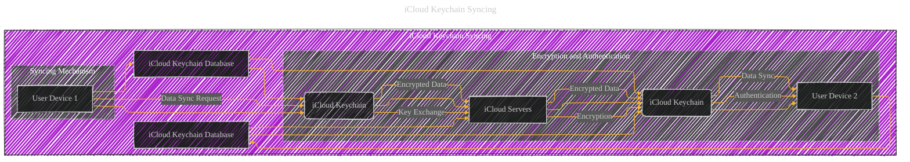

# iCloud Keychain Syncing - A Diagrammatical Summary
> **Disclaimer:**
>
> This document contains my personal notes on the topic,
> compiled from publicly available documentation and various cited sources.
> The materials are intended for educational purposes, personal study, and reference.
> The content is dual-licensed:
> 1. **MIT License:** Applies to all code implementations (Swift, Mermaid, and other programming languages).
> 2. **Creative Commons Attribution 4.0 International License (CC BY 4.0):** Applies to all non-code content, including text, explanations, diagrams, and illustrations.
---

## iCloud Keychain Syncing Process Diagram

---

## Explanation

The diagram above outlines the core elements of the iCloud Keychain syncing process.  Let's break down the steps:

* **User Device 1 & 2:** These represent the user's iOS/iPadOS or macOS devices where they have iCloud Keychain enabled.

* **iCloud Keychain Database:**  This resides on each device and stores the encrypted keychain data locally.

* **iCloud Servers:**  These act as a trusted intermediary, storing a signed syncing circle.

* **Key Exchange:**  Initially, each device establishes a secure communication channel with the iCloud Keychain service.  This key exchange process is often a combination of asymmetric cryptography (e.g., RSA or ECC) and often uses cryptographic primitives like ECDHE and involves exchanging public keys and generating ephemeral session keys. The exchange is secure and validated, preventing eavesdropping and man-in-the-middle attacks.

* **Encryption:**  All data exchanged between devices and iCloud servers is encrypted.  iCloud Keychain uses a hierarchy of keys for security.

* **Authentication:**  During the syncing process, the devices authenticate each other using the previously established cryptographic channels. This ensures that only authorized devices can access and update the keychain data.

* **Data Sync Request:**  A device initiates the syncing process by requesting updated keychain items.

* **Encrypted Data Transfer:**  The encrypted data is transmitted to the iCloud servers and then relayed to the other device.

* **Data Sync:**  Upon receiving the encrypted data from the iCloud servers, the device decrypts and updates its own local keychain database.

**Further Detailing the Cryptographic Aspects:**

The diagram above simplifies the process.  iCloud Keychain often uses more complex cryptographic algorithms and techniques than implied here. The actual key hierarchy could involve a combination of:

* **Device-specific keys:**  Keys unique to each device for authentication and encryption.

* **iCloud account keys:**  Keys linked to the user's iCloud account for syncing between devices.

* **Ephemeral session keys:**  Temporary keys used for secure communication during each synchronization cycle, helping prevent long-term key compromise from impacting the integrity of previously saved data.

* **Asymmetric encryption:**  Used for secure key exchange and authentication.

* **Symmetric encryption:**  Used for encrypting the actual keychain items themselves.

* **Hashing:**  Used to verify the integrity of the data during transfer.

* **Digital signatures:**  Crucial for validating the authenticity of data sent between devices.

**Additional Considerations:**

* **iCloud Keychain Recovery:** This diagram doesn't directly show the recovery process, but the recovery mechanisms rely on strong cryptographic measures for recovering data if a device is lost or if access to the keychain is lost.

* **Security Policies:** iCloud Keychain's behavior is governed by various security policies enforced by Apple's operating system, including device passcodes, time-based lockout mechanisms, and restrictions on access.

This expanded explanation provides a more in-depth view of the complexities within the iCloud Keychain synchronization process, highlighting the cryptographic aspects and interactions with iCloud servers.

---
**Licenses:**

- **MIT License:**   - Full text in [LICENSE](LICENSE) file.
- **Creative Commons Attribution 4.0 International:**  - Legal details in [LICENSE-CC-BY](LICENSE-CC-BY) and at [Creative Commons official site](http://creativecommons.org/licenses/by/4.0/).

---