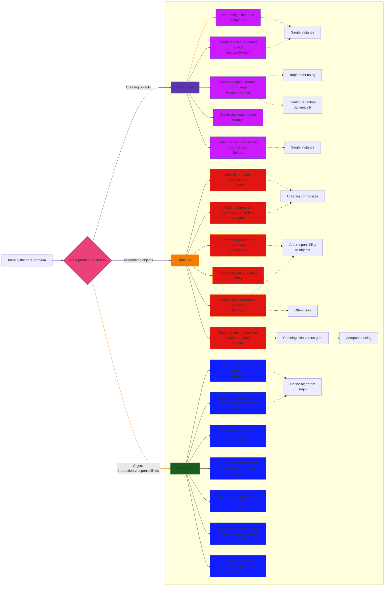

# Connecting Design Patterns in iOS Development

```mermaid
graph LR
    A[Identify the core problem] --> B{Is the problem related to}
    B -- Creating objects --> C[Creational]
    B -- Assembling objects --> D[Structural]
    B -- Object interactions/responsibilities --> E[Behavioral]

    subgraph " "
        C --> F["Need single instance<br>Singleton"]
        C --> G["Decouple object creation from usage<br>Factory Method"]
        C --> H["Create families of related objects<br>Abstract Factory"]
        C --> I["Create duplicate objects<br>Prototype"]
        C --> J["Construct complex objects step by step<br>Builder"]

        F -.-> K["Single instance"]
        G -.-> L["Implement using"]
        G -.-> M["Configure factory<br>dynamically"]
        H -.-> K
        J -.-> N["Single instance"]


        D --> O["Simplify complex subsystems<br>Facade"]
        D --> P["Make incompatible interfaces compatible<br>Adapter"]
        D --> Q["Represent part-whole hierarchies<br>Composite"]
        D --> R["Control access to objects<br>Proxy"]
        D --> S["Dynamically add/remove behavior<br>Decorator"]
        D --> T["Decouple abstraction from implementation<br>Bridge"]

        O -.-> U["Creating composites"]
        P -.-> U
        Q -.-> V["Add responsibility<br>to objects"]
        S -.-> V
        S -.-> W["Often uses"]
        T -.-> X["Chaining skin versus guts"]


        E --> Y["Define a family of algorithms<br>Strategy"]
        E --> Z["Define algorithm skeleton, defer steps to subclasses.<br>Template Method"]
        E --> AA["Encapsulate requests as objects<br>Command"]
        E --> AB["Separate operations from objects they operate on<br>Visitor"]
        E --> AC["Encapsulate state-specific behavior<br>State"]
        E --> AD["Maintain a consistent state by being notified of changes<br>Observer"]
        E --> AE["Traverse collections without exposing internals<br>Iterator"]

        Y -.-> AF["Define algorithm<br> steps"]
        Z -.-> AF
        
        X --> AI["Composed using"]
    end
    
    style F fill:#CC19FF,stroke:#5E35B1
    style G fill:#CC19FF,stroke:#5E35B1
    style H fill:#CC19FF,stroke:#5E35B1
    style I fill:#CC19FF,stroke:#5E35B1
    style J fill:#CC19FF,stroke:#5E35B1
    style O fill:#E11511,stroke:#F57C00
    style P fill:#E11511,stroke:#F57C00
    style Q fill:#E11511,stroke:#F57C00
    style R fill:#E11511,stroke:#F57C00
    style S fill:#E11511,stroke:#F57C00
    style T fill:#E11511,stroke:#F57C00

    style Y fill:#111DFD,stroke:#1B5E20
    style Z fill:#111DFD,stroke:#1B5E20
    style AA fill:#111DFD,stroke:#1B5E20
    style AB fill:#111DFD,stroke:#1B5E20
    style AC fill:#111DFD,stroke:#1B5E20
    style AD fill:#111DFD,stroke:#1B5E20
    style AE fill:#111DFD,stroke:#1B5E20


    linkStyle 0,1,2 stroke:#5E35B1,stroke-width:1px
    linkStyle 3,4,5 stroke:#F57C00,stroke-width:1px
    linkStyle 6,7 stroke:#1B5E20,stroke-width:1px


    style B fill:#EC407A,stroke:#AD1457
    style C fill:#5E35B1,stroke:#5E35B1
    style D fill:#F57C00,stroke:#F57C00
    style E fill:#1B5E20,stroke:#1B5E20

```

---
