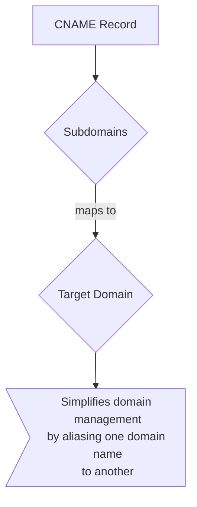

# DNS Record Types
> This content is dual-licensed under your choice of the following licenses:
> 1.  **MIT License:** For the code implementations in Swift and Mermaid provided in this document.
> 2.  **Creative Commons Attribution 4.0 International License (CC BY 4.0):** For all other content, including the text, explanations, and the Mermaid diagrams and illustrations.

---

 Here's a breakdown of the DNS Record Types diagram using Mermaid syntax, capturing the complexities and relationships shown in the image. I'll create multiple diagrams to cover different aspects:

## 1. Main Diagram: DNS Record Types Overview

## 2. A Record Detail

## 3. CNAME Record Detail

## 4. TXT Record Detail

## 5. AAAA Record Detail

## 6. SRV Record Detail

## 7. PTR Record Detail

## 8. NS Record Detail

## 9. MX Record Detail

## Explanation of the Diagrams

*   **Main Diagram:** Shows the relationships between different DNS record types and provides an overview of their purposes.
*   **Detail Diagrams:** Each record type (A, CNAME, TXT, AAAA, SRV, PTR, NS, MX) has its own diagram, providing a more detailed breakdown of its structure and function.
*   **Nodes and Edges:**
    *   Nodes represent entities like "DNS Record Types," "Domain," "IPv4 Address," etc.
    *   Edges (arrows) represent relationships like "maps to," "queries," etc.
    *   Dotted edges with text boxes are used to provide additional information and context.

### Mermaid Features Used:

*   `graph TD`: Defines a top-down flowchart.
*   `-->`: Represents a directed edge (arrow).
*   `-.->`: Represents a dotted directed edge.
*   `|text|`: Adds text to an edge.
*   `classDef`: Defines styles for nodes (not fully utilized in the provided example, but can be added to enhance visualization).
*   `>... ...`: Formats text within a node.
*   `(...)`: Creates rounded rectangle nodes.
*   `{...}`: Creates diamond-shaped nodes.
*   `[...]`: Creates rectangle nodes.

---
