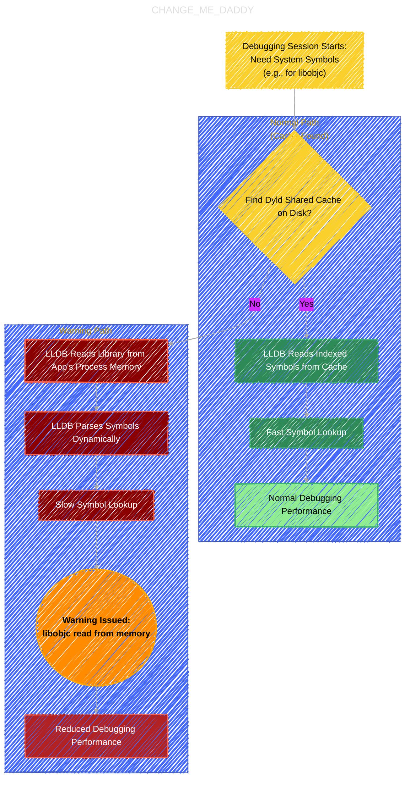
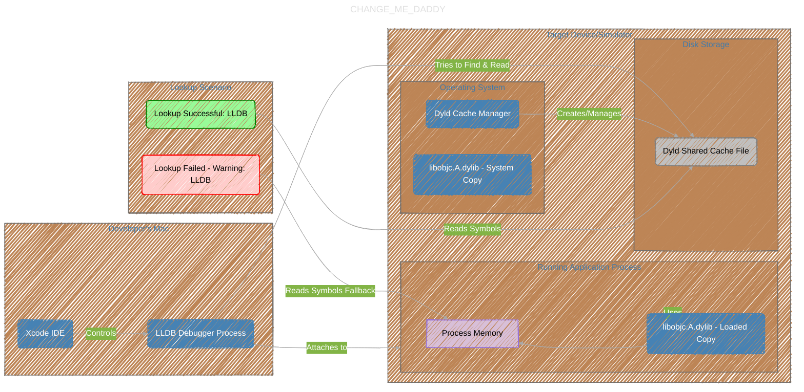

# The LLDB Shared Cache Warning
> **Disclaimer:**
>
> This document contains my personal notes on the topic,
> compiled from publicly available documentation and various cited sources.
> The materials are intended for educational purposes, personal study, and reference.
> The content is dual-licensed:
> 1. **MIT License:** Applies to all code implementations (Swift, Mermaid, and other programming languages).
> 2. **Creative Commons Attribution 4.0 International License (CC BY 4.0):** Applies to all non-code content, including text, explanations, diagrams, and illustrations.
---

## The warning message

```txt
warning: libobjc.A.dylib is being read from process memory. This indicates that LLDB could not find the on-disk shared cache for this device. This will likely reduce debugging performance.
```

## A Diagrammatic Guide 


Below are several Mermaid diagrams designed to illustrate the technical aspects of the LLDB warning about the missing shared cache, covering the process, components, and troubleshooting.

These diagrams should provide a comprehensive visual reference for understanding the cause, context, and potential solutions for the LLDB shared cache warning.


### Diagram 1: LLDB Symbol Lookup Process (Normal vs. Warning State)

This flowchart illustrates the path LLDB takes to find symbol information, highlighting the difference when the shared cache is available versus when it's not found.



**Explanation:**

*   The process starts when the debugger needs information about system libraries.
*   **Normal Path (Green):** LLDB successfully finds the pre-compiled shared cache on disk, leading to fast lookups and good performance.
*   **Warning Path (Red/Orange):** LLDB *fails* to find the cache. It resorts to reading the library directly from the app's memory, dynamically parsing symbols, which is slower, triggers the warning, and reduces debugging responsiveness.

---

### Diagram 2: System Components and Interactions

This diagram shows the relationship between the key components involved in the debugging process and the shared cache mechanism.




**Explanation:**

*   Shows the distinct environments: the developer's Mac (host) and the target device/simulator.
*   Illustrates that the application uses a loaded copy of `libobjc` in its memory space.
*   The OS manages the shared cache file stored on disk.
*   LLDB attempts to use the disk cache first.
*   If the cache lookup fails (the warning scenario), LLDB falls back to reading the symbols directly from the application's memory.

---

### Diagram 3: Troubleshooting Flowchart

This diagram provides a step-by-step process for diagnosing and potentially resolving the LLDB shared cache warning.


**Explanation:**

*   Starts with the warning message.
*   Guides through a sequence of common troubleshooting steps: checking versions, cleaning build artifacts, resetting the simulator, restarting/re-pairing devices, and checking disk space.
*   After each potential fix, it directs back to "Re-test Debugging" and checks if the "Warning Resolved?".
*   If basic steps fail, it suggests further investigation and possibly filing a bug report.


---
**Licenses:**

- **MIT License:**  [](LICENSE) - Full text in [LICENSE](LICENSE) file.
- **Creative Commons Attribution 4.0 International:** [](LICENSE-CC-BY) - Legal details in [LICENSE-CC-BY](LICENSE-CC-BY) and at [Creative Commons official site](http://creativecommons.org/licenses/by/4.0/).

---