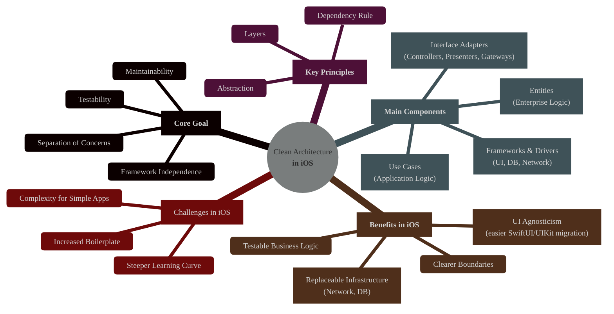
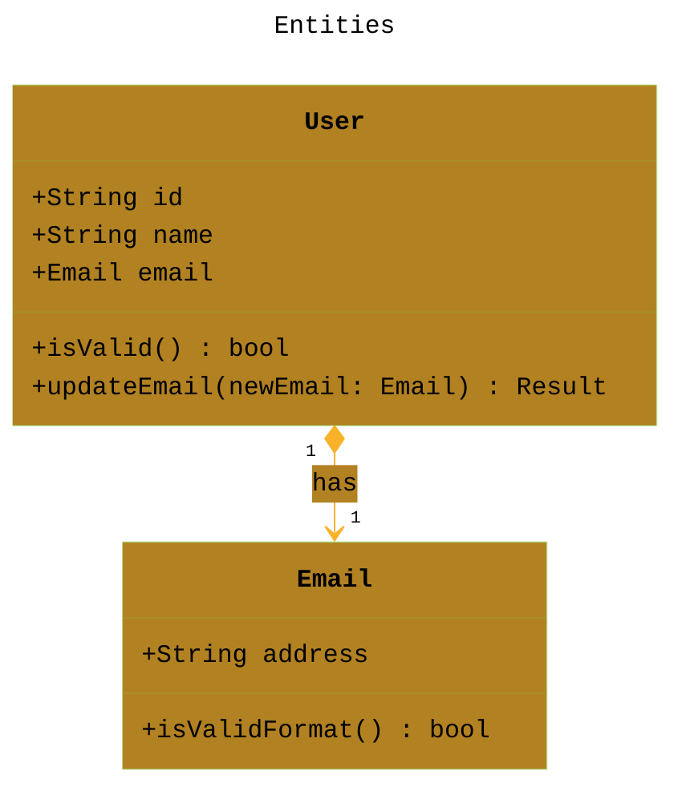
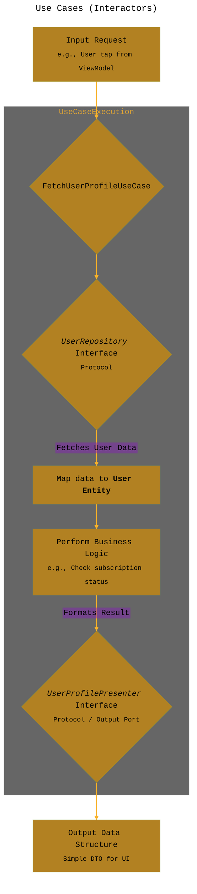
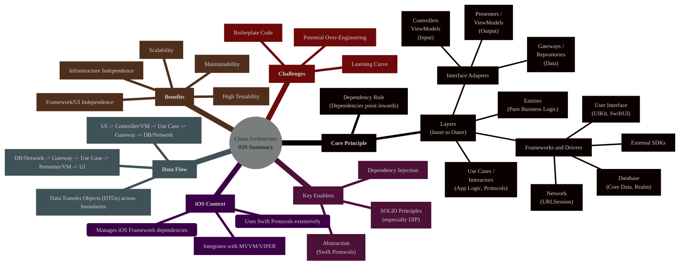

----

# The CLEAN Architecture in iOS Development
---

  <blockquote>
  As a visual learner student, I created these personal study notes from the cited source(s) to aid my understanding. 
  While my firm intention is to provide full credit, the blended format of notes and diagrams may sometimes obscure the original source, for which I apologize. 
  I am committed to making corrections and welcome any feedback. 
  This is a non-commercial project for my humble educational purposes only since the start. 
  My goal is to share my perspective and contribute to the great work already being done.
   
   
  I want to extend my genuine apologies to the creators of the original material. 
  Their work was the direct inspiration for this project, and I adapted it without first reaching out. 
  My intent comes from a place of deep respect, and I hope this is received in the spirit of homage. 
  🙏🏼🙏🏼🙏🏼🙏🏼
  </blockquote>

----

## 1. Introduction: What is Clean Architecture?

Clean Architecture, popularized by Robert C. Martin ("Uncle Bob"), is a set of principles and guidelines for designing software systems. Its primary goal is the **separation of concerns**, achieved by dividing the software into distinct layers. This separation aims to create systems that are:

*   **Independent of Frameworks:** The core business logic shouldn't depend on the delivery mechanism (e.g., UIKit, SwiftUI, web framework).
*   **Testable:** Business rules can be tested without the UI, Database, Web Server, or other external elements.
*   **Independent of UI:** The UI can change easily without changing the rest of the system.
*   **Independent of Database:** You can swap Oracle or SQL Server for Mongo, BigTable, or CouchDB without affecting business rules.
*   **Independent of any external agency:** Business rules don't know anything about the outside world.

In the context of iOS development, Clean Architecture provides a robust structure for building scalable, maintainable, and testable applications beyond the standard MVC/MVVM patterns, although it often incorporates elements of these.

---

## 2. Core Principles

Two fundamental principles underpin Clean Architecture: Layers and the Dependency Rule.

### 2.1 Layers

Clean Architecture organizes software into concentric layers, each representing a different area of concern. While the number of layers can vary, the core idea is a distinction between high-level business rules (inner layers) and low-level details (outer layers).

```mermaid
---
title: "Core Principles - Layers"
author: "Cong Le"
version: "1.0"
license(s): "MIT, CC BY 4.0"
copyright: "Copyright (c) 2025 Cong Le. All Rights Reserved."
config:
  theme: base
---
%%%%%%%% Mermaid version v11.4.1-b.14
%%%%%%%% Available curve styles include the following keywords:
%% basis, bumpX, bumpY, cardinal, catmullRom, linear, monotoneX, monotoneY, natural, step, stepAfter, stepBefore.
%%{
  init: {
    'flowchart': { 'htmlLabels': false, 'curve': 'basis' },
    'fontFamily': 'Monospace',
    'themeVariables': {
      'primaryColor': '#B28122',
      'primaryTextColor': '#000',
      'primaryBorderColor': '#7C33',
      'lineColor': '#F8B229',
      'stroke':'#000',
      'stroke-width': '0.5px'
    }
  }
}%%
graph TD
    subgraph Outer_Layers [Frameworks & Drivers]
    style Outer_Layers fill:#333,stroke:#888
        D(<b>UI</b><br/><SUB>UIKit, SwiftUI</SUB>)
        E(<b>Database</b><br/><SUB>Core Data, Realm, UserDefaults</SUB>)
        F(<b>Network</b><br/><SUB>URLSession, Alamofire</SUB>)
        G(<b>Devices</b><br/><SUB>Sensors, Location</SUB>)
    end

    subgraph Middle_Layer [Interface Adapters]
    style Middle_Layer fill:#555,stroke:#aaa
        C(<b>Controllers / Views</b><br/><SUB>Adapts UI input</SUB>) --- H(<b>Presenters / ViewModels</b><br/><SUB>Formats Use Case output for UI</SUB>)
        I(<b>Gateways / Repositories</b><br/><SUB>Implements Data Interfaces</SUB>) --- C
        H --- I
    end

    subgraph Inner_Layers [Application & Business Logic]
    style Inner_Layers fill:#777,stroke:#ccc
        B(<b>Use Cases / Interactors</b><br/><SUB>Application-Specific Logic</SUB>)
        A(<b>Entities</b><br/><SUB>Enterprise-Wide Business Rules</SUB>)
        B --> A
    end

    Outer_Layers -- Depends On --> Middle_Layer;
    Middle_Layer -- Depends On --> Inner_Layers;


    %% Arrows show dependency direction. Outer depends on Inner.
    %% Inner layers know nothing about outer layers.
```

### 2.2 The Dependency Rule

This is the cornerstone of Clean Architecture: **Source code dependencies must only point inwards.**

*   Nothing in an inner layer can know anything at all about something in an outer layer.
*   Specifically, the name of something declared in an outer layer must not be mentioned by the code in an inner layer. This includes functions, classes, variables, or any other named software entity.
*   Data formats used in an outer layer should not be used by an inner layer if they cross a boundary. Data crossing boundaries should be simple data structures.

This rule is primarily achieved through **Abstraction** and **Dependency Inversion (the 'D' in SOLID)**. Inner layers define interfaces (protocols in Swift) that outer layers implement.

```mermaid
---
title: "Core Principles - The Dependency Rule"
author: "Cong Le"
version: "1.0"
license(s): "MIT, CC BY 4.0"
copyright: "Copyright (c) 2025 Cong Le. All Rights Reserved."
config:
  theme: base
---
%%%%%%%% Mermaid version v11.4.1-b.14
%%%%%%%% Available curve styles include the following keywords:
%% basis, bumpX, bumpY, cardinal, catmullRom, linear, monotoneX, monotoneY, natural, step, stepAfter, stepBefore.
%%{
  init: {
    'flowchart': { 'htmlLabels': false, 'curve': 'basis' },
    'fontFamily': 'Monospace',
    'themeVariables': {
      'primaryColor': '#B28122',
      'primaryTextColor': '#000',
      'primaryBorderColor': '#7C33',
      'lineColor': '#F8B229',
      'stroke':'#000',
      'stroke-width': '0.5px'
    }
  }
}%%
graph LR
    subgraph Outer [Frameworks & Drivers<br><b>Low Level</b>]
        style Outer fill:#333,stroke:#888
        UI(UIKit/SwiftUI View)
        DB(CoreData/Realm Implementation)
        NW(URLSession Client)
    end

    subgraph Adapters [Interface Adapters]
        style Adapters fill:#555,stroke:#aaa
        Controller(Controller/ViewModel)
        Presenter(Presenter)
        Gateway(Gateway/Repository Impl)

        Controller -- Uses --> InputPort(Use Case Input Port <br/><SUB>Protocol</SUB>)
        OutputPort(Use Case Output Port <br/><SUB>Protocol</SUB>) -- Implemented By --> Presenter
        DataInterface(Data Access Interface <br/><SUB>Protocol</SUB>) -- Implemented By --> Gateway
    end

    subgraph Core [Use Cases & Entities<br><b>High Level</b>]
        style Core fill:#777,stroke:#ccc
        UseCase(Use Case / Interactor <br/><SUB>Implements Input Port,<br>Uses Output Port & Data Interface</SUB>)
        Entity(Entity <br/><SUB>Core Business Objects</SUB>)

        UseCase -- Uses --> DataInterface
        UseCase -- Uses --> Entity
        UseCase -- Notifies --> OutputPort
    end

    UI -- Interacts With --> Controller;
    Controller -- Owns/Uses --> Presenter;
    Presenter -- Updates --> UI;
    Gateway -- Interacts With --> DB;
    Gateway -- Interacts With --> NW;

    %% Dependency Arrows (Simplified for Clarity)
    Outer --> Adapters;
    Adapters --> InputPort;
    Adapters --> OutputPort;
    Adapters --> DataInterface;
    InputPort --> Core;
    OutputPort --> Core;
    DataInterface --> Core;

    classDef outer fill:#333,stroke:#ccc;
    classDef adapter fill:#555,stroke:#ddd;
    classDef core fill:#777,stroke:#eee;
    classDef interface fill:#999,stroke:#fff,color:#000,stroke-width:2px,stroke-dasharray: 5 5;

    class UI,DB,NW outer;
    class Controller,Presenter,Gateway adapter;
    class UseCase,Entity core;
    class InputPort,OutputPort,DataInterface interface;

```

*Diagram Note: Arrows show dependency. Adapters depend on Core interfaces (protocols). Outer depends on Adapters. Core depends on nothing outside itself.*

----

## 3. The Layers Explained (iOS Context)

Let's break down the typical layers adapting Clean Architecture for iOS:

### 3.1 Entities

*   **Responsibility:** Core business objects and rules applicable across the entire enterprise (or at least, many applications). They are the least likely to change when external factors change.
*   **iOS Context:** Often plain Swift `struct`s or `class`es with properties and methods containing fundamental business logic. They should have **no dependencies** on any application-specific logic or frameworks (no `Foundation` imports if possible, definitely no `UIKit`/`SwiftUI` imports).
*   **Example:** A `User` struct with validation rules, a `Product` class with pricing logic.

### 3.2 Use Cases (Interactors)

*   **Responsibility:** Contain application-specific business rules. They orchestrate the flow of data to and from Entities and direct the Entities to use their enterprise-wide logic to achieve the application's goals. They implement the application's "story."
*   **iOS Context:** Typically `class`es. They are triggered by the Interface Adapters (e.g., a ViewModel or Controller). They fetch data via repository interfaces and manipulate Entities. They should *not* know about the UI or specific database implementations. They often define Input and Output Ports (protocols).
*   **Example:** `RegisterUserUseCase`, `FetchUserProfileUseCase`, `SubmitOrderUseCase`.

### 3.3 Interface Adapters

*   **Responsibility:** Convert data between the format convenient for Use Cases and Entities, and the format convenient for external agencies like the UI, Database or Network. This layer contains the "glue" code.
*   **iOS Context:** This is where familiar patterns like MVVM, MVP, or VIPER components often reside.
    *   **Controllers/Views (Input Adapters):** `UIViewController` (UIKit) or `View` (SwiftUI) structs accept user input and pass it (often via a ViewModel or Presenter) to a Use Case Input Port. They should be dumb and primarily handle UI presentation and input forwarding.
    *   **Presenters/ViewModels (Output Adapters):** Implement the Use Case Output Port protocol. They receive data from the Use Case, format it into a UI-friendly structure (e.g., strings, formatted dates, primitive types suitable for display), and provide it to the View. ViewModels in MVVM commonly play this role.
    *   **Gateways/Repositories (Data Adapters):** Implement the data access interfaces (protocols) defined by the Use Cases. They interact with specific frameworks (Core Data, URLSession) to fetch/store data, hiding the implementation details from the Use Cases.

```mermaid
---
title: "Interface Adapters"
author: "Cong Le"
version: "1.0"
license(s): "MIT, CC BY 4.0"
copyright: "Copyright (c) 2025 Cong Le. All Rights Reserved."
config:
  theme: base
---
%%%%%%%% Mermaid version v11.4.1-b.14
%%%%%%%% Available curve styles include the following keywords:
%% basis, bumpX, bumpY, cardinal, catmullRom, linear, monotoneX, monotoneY, natural, step, stepAfter, stepBefore.
%%{
  init: {
    'flowchart': { 'htmlLabels': false, 'curve': 'basis' },
    'fontFamily': 'Monospace',
    'themeVariables': {
      'primaryColor': '#B28122',
      'primaryTextColor': '#000',
      'primaryBorderColor': '#7C33',
      'lineColor': '#F8B229',
      'stroke':'#000',
      'stroke-width': '0.5px'
    }
  }
}%%
graph TD
    subgraph UseCaseLayer [Use Cases]
        style UseCaseLayer fill:#777,stroke:#ccc
        InputPort(<B>Input Port</B><br/><SUB>Protocol</SUB>)
        OutputPort(<B>Output Port</B><br/><SUB>Protocol</SUB>)
        DataInterface(<B>Data Access Interface</B><br/><SUB>Protocol</SUB>)
    end

    subgraph AdapterLayer [Interface Adapters]
        style AdapterLayer fill:#555,stroke:#aaa
        Controller(<b>Controller / ViewModel</b><br/><SUB>Invokes Input Port</SUB>)
        Presenter(<b>Presenter / ViewModel</b><br/><SUB>Implements Output Port</SUB>)
        Gateway(<b>Gateway / Repository</b><br/><SUB>Implements Data Interface</SUB>)
    end

    subgraph FrameworkLayer [Frameworks & Drivers]
        style FrameworkLayer fill:#333,stroke:#888
        UI(<b>UI View</b><br/><SUB>UIKit / SwiftUI</SUB>)
        DB(<b>Database</b><br/><SUB>Core Data / Realm</SUB>)
        NW(<b>Network</b><br/><SUB>URLSession</SUB>)
    end

    UI -- User Input --> Controller;
    Controller -- Calls `execute()` --> InputPort;
    OutputPort -- Notifies `present()` --> Presenter;
    Presenter -- Provides Formatted Data --> UI;
    DataInterface -- Called by Use Case --> Gateway;
    Gateway -- Interacts With --> DB;
    Gateway -- Interacts With --> NW;

    classDef interface fill:#999,stroke:#fff,color:#000,stroke-width:2px,stroke-dasharray: 5 5;
    class InputPort,OutputPort,DataInterface interface;
```

### 3.4 Frameworks & Drivers

*   **Responsibility:** The outermost layer, containing frameworks and tools like the Database, the Web Framework, UI framework, Device interfaces, etc. Generally, you don’t write much code in this layer other than glue code to communicate to the next layer inwards.
*   **iOS Context:** This is where `UIKit`, `SwiftUI`, `CoreData`, `Realm`, `URLSession`, `CoreLocation`, third-party SDKs (Firebase, Alamofire), etc., reside. The code here is specific to the chosen platform and tools.

---
 
## 4. Data Flow

Data flow typically follows these steps:

1.  **Input:** The UI (Frameworks & Drivers) captures user input.
2.  **Controller/ViewModel:** The Controller/ViewModel (Interface Adapters) handles the UI event and translates it into a request suitable for a Use Case, invoking the Use Case's Input Port.
3.  **Use Case:** The Use Case (Application Logic) executes the specific business logic, potentially retrieving/modifying Entities via Data Access Interfaces (protocols).
4.  **Gateway/Repository:** The Gateway/Repository (Interface Adapters), implementing the Data Access Interface, interacts with the actual Database or Network Client (Frameworks & Drivers) to perform CRUD operations.
5.  **Presenter/ViewModel:** The Use Case sends its results (simple data structures or Entities) to the Output Port, which is implemented by the Presenter/ViewModel (Interface Adapters). This component formats the data for display.
6.  **Output:** The Presenter/ViewModel updates the UI (Frameworks & Drivers) with the formatted data.

Crucially, data crossing boundaries (especially inwards -> outwards via Output Ports) should generally be simple Data Transfer Objects (DTOs) or basic Swift types, not framework-specific objects or complex Entities (unless the Entities *are* the data structure).

---

## 5. Benefits in iOS

*   **Enhanced Testability:** Use Cases and Entities can be tested independently of the UI, database, or network, leading to faster and more reliable unit tests. Mocking dependencies is straightforward due to protocols.
*   **Framework Independence:** Decoupling from UIKit/SwiftUI makes migrating between them easier or supporting both simultaneously less complex. Core logic remains untouched.
*   **Infrastructure Independence:** Changing networking libraries (URLSession to Alamofire) or persistence frameworks (Core Data to Realm) only affects the Gateway implementations in the outer layers.
*   **Maintainability & Scalability:** Clear boundaries and separation of concerns make the codebase easier to understand, modify, and scale over time. Teams can work on different layers concurrently with fewer conflicts.

---

## 6. Drawbacks & Challenges in iOS

*   **Increased Complexity & Boilerplate:** Setting up layers, protocols, and data mappers involves more initial effort and code compared to simpler patterns like MVC or basic MVVM, especially for small apps.
*   **Learning Curve:** Understanding the principles, Dependency Rule, and data flow requires effort from the development team.
*   **Potential Over-Engineering:** Applying Clean Architecture rigidly to very simple screens or features might be overkill.
*   **Data Mapping Overhead:** Converting data between layers (e.g., Network Model -> Entity -> ViewModel Display Model) can add boilerplate code.

----

## 7. Relationship with iOS Patterns (MVVM, VIPER)

Clean Architecture isn't mutually exclusive with patterns like MVVM or VIPER; it often provides the overarching structure within which these patterns operate, primarily within the Interface Adapters layer:

*   **MVVM:** The ViewModel often acts as the Presenter in Clean Architecture, implementing the Use Case Output Port and preparing data for the View. The View binds to the ViewModel. The Model part is split into Use Cases, Entities, and Gateways.
*   **VIPER:** VIPER aligns quite closely with Clean Architecture.
    *   View <-> Presenter (Interface Adapters)
    *   Presenter <-> Interactor (Use Case)
    *   Interactor <-> Entity (Entities)
    *   Router (handles navigation, potentially part of Interface Adapters or even Frameworks layer depending on implementation)
    *   Data Manager/Repository (Gateways in Interface Adapters)

Clean Architecture provides the *why* and *where* dependencies should point, while MVVM/VIPER provides a more concrete *how* for structuring the UI and presentation logic interaction within the Interface Adapter layer.

---

## 8. Summary

Clean Architecture offers a powerful approach for building robust, testable, and maintainable iOS applications by enforcing strict boundaries and controlling dependencies. While it introduces complexity, its benefits shine in larger projects or applications intended for long-term development and evolution.

----
