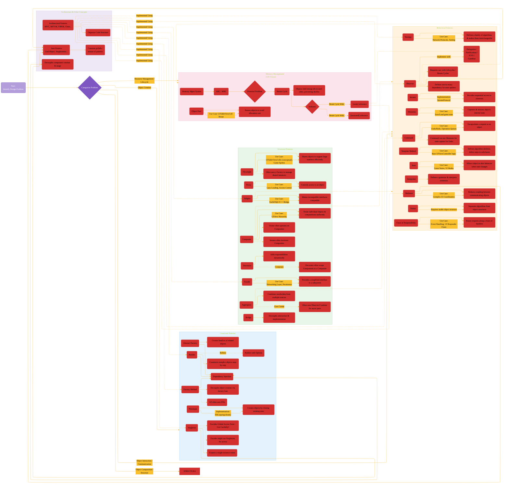

# A Comprehensive Roadmap

---

  <blockquote>
  As a visual learner student, I created these personal study notes from the cited source(s) to aid my understanding. 
  While my firm intention is to provide full credit, the blended format of notes and diagrams may sometimes obscure the original source, for which I apologize. 
  I am committed to making corrections and welcome any feedback. 
  This is a non-commercial project for my humble educational purposes only since the start. 
  My goal is to share my perspective and contribute to the great work already being done.
   
   
  I want to extend my genuine apologies to the creators of the original material. 
  Their work was the direct inspiration for this project, and I adapted it without first reaching out. 
  My intent comes from a place of deep respect, and I hope this is received in the spirit of homage. 
  🙏🏼🙏🏼🙏🏼🙏🏼
  </blockquote>

----

This diagram attempts to provide a holistic view, showing that patterns are not isolated tools but interconnected parts of a larger design vocabulary used to build robust and maintainable software, particularly within the context of iOS development.

This diagram aims to illustrate:

1.  **Categorization:** Grouping patterns by their primary intent (Creational, Structural, Behavioral, Memory).
2.  **Core Relationships:** How patterns commonly interact (e.g., composition, implementation assistance).
3.  **Alternatives/Choices:** Showing where patterns offer different solutions to similar problems.
4.  **Problem/Solution:** Highlighting specific problems (like Retain Cycles) and the patterns/techniques that address them.
5.  **Refinement:** Indicating when one pattern is a specialization of another.
6.  **iOS Context:** Implicitly referencing iOS scenarios where patterns are common (though labels are kept general for broader applicability).

Due to the density of information required in a single diagram, clarity is prioritized over exhaustive detail for every possible nuanced connection. Key relationships highlighted in the previous diagrams are central here.

---

---

**Explanation of the Diagram's Structure and Connections:**

1.  **Starting Point:** Begins with identifying a design problem, leading to categorization.
2.  **Categories (Subgraphs):** Patterns are grouped logically (Creational, Structural, Behavioral, Memory). Architecture and related concepts are in a separate subgraph.
3.  **Pattern Nodes & Descriptions:** Each pattern has a main node (Abbreviation) linked (`-->`) to a node with a brief description or primary use case.
4.  **Intra-Category Links (`-.->`, `--`):**
    *   Shows relationships *within* a category (e.g., Abstract Factory often uses Factory Methods, Builder refined by Builder with Options).
    *   Implementation details are shown (e.g., Prototype uses `NSCopying`/`clone()`, Iterator uses `IteratorProtocol`).
    *   Use cases specific to iOS are noted (e.g., Composite -> UIView, Adapter -> Bridging).
5.  **Inter-Category Links (`-.->`):** These are crucial for showing the roadmap connections:
    *   **Structural supporting Behavioral:** Decorator wraps Components (often Composites); Visitor operates on Composites; Iterator traverses Composites.
    *   **Creational supporting Structural/Behavioral:** Facades/Singletons provide access points; Flyweight uses Factories.
    *   **Behavioral needing Memory Mgmt:** Observer implementations (delegates, closures) often require `weak` references to prevent Retain Cycles.
    *   **Memory Mgmt addressing Issues:** Retain Cycles are a problem arising from ARC/MRC, solved by `weak`/`unowned`.
    *   **Dependency Injection:** Supported by Creational patterns, fundamental to good Architecture.
    *   **Architecture relies on Patterns:** The Architecture subgraph shows that larger architectures are *implemented using* various design patterns from all categories.
    *   **Anti-Patterns:** Linked from patterns prone to misuse (Singleton, Mediator, Observer).
6.  **Line Styles (Conceptual):** While basic Mermaid has limited built-in line style variation, the comments (`%%`) suggest intended meanings: Solid for primary links, Dashed for conceptual/supporting roles, Dotted for refinement/implementation details.
7.  **Styling:** Consistent colors are used for subgraph backgrounds/borders and key node types to aid visual grouping.

---
