# Connecting Design Patterns in iOS Development 
> **Disclaimer:**
>
> This document contains my personal notes on the topic,
> compiled from publicly available documentation and various cited sources.
> The materials are intended for educational purposes, personal study, and reference.
> The content is dual-licensed:
> 1. **MIT License:** Applies to all code implementations (Swift, Mermaid, and other programming languages).
> 2. **Creative Commons Attribution 4.0 International License (CC BY 4.0):** Applies to all non-code content, including text, explanations, diagrams, and illustrations.
---

## Enhanced version 

This is a draft enhanced version from the initial version at [here](./Connecting_Design_Patterns_V1.md).

```mermaid
---
title: Design Patterns in Mixed Languages
config:
  layout: elk
  look: handDrawn
  theme: dark
---
%%{
  init: {
    'fontFamily': 'verdana',
    'themeVariables': {
      'primaryColor': '#BB2528',
      'primaryTextColor': '#f529',
      'primaryBorderColor': '#7C0000',
      'lineColor': '#F8B229',
      'secondaryColor': '#006100',
      'tertiaryColor': '#fff'
    }
  }
}%%
graph LR
    A[Identify the core<br>problem] --> B{Is the<br>problem<br>related to}
    B -- Creating objects --> C(Creational)
    B -- Assembling objects --> D(Structural)
    B -- Object interactions/<br>responsibilities --> E(Behavioral)
    B -- Managing memory/resources --> M(Memory Management)

    subgraph Creational_Patterns["Creational Patterns"]
        direction LR
        C --> CR1[Need single instance<br>per app/module] --> S(Singleton)
        C --> CR2[Decouple object creation<br>from usage] --> FM(Factory Method)
        C --> CR3[Create families of<br>related objects] --> AF(Abstract Factory)
        C --> CR4[Create duplicate objects<br>efficiently] --> P(Prototype)
        C --> CR5[Construct complex objects<br>step by step] --> BLD(Builder)
        C --> CR6[Create objects based on<br> runtime parameters] --> BO(Builder with Options)
    end

    subgraph Structural_Patterns["Structural Patterns"]
        direction LR
        D --> ST1[Simplify complex<br>subsystems] --> F(Facade);
        D --> ST2["Make incompatible interfaces<br>compatible<br>(Swift/ObjC/C++)"] --> AD(Adapter);
        D --> ST3["Represent part-whole<br>hierarchies<br>(Views)"] --> CP(Composite);
        D --> ST4["Control access to objects<br>(Network, Files)"] --> PR(Proxy);
        D --> ST5["Dynamically add/remove<br>behavior<br>(at runtime)"] --> DC(Decorator);
        D --> ST6[Decouple abstraction from<br>implementation] --> BR(Bridge);
        D --> ST7[Efficiently share large numbers<br>of fine-grained objects] --> FW(Flyweight);
        D --> ST8[Combine multiple objects<br>into a single interface] --> AGG(Aggregator);
    end
    
    subgraph Behavioral_Patterns["Behavioral Patterns"]
        direction LR
        E --> BH1["Define a family of<br>algorithms<br>(Networking)"] --> STG(Strategy)
        E --> BH2[Define algorithm skeleton,<br> defer steps to subclasses] --> TM(Template Method)
        E --> BH3["Encapsulate requests as objects<br>(Undo/Redo)"] --> CMD(Command)
        E --> BH4[Separate operations from<br>objects they operate on] --> V(Visitor)
        E --> BH5["Encapsulate state-specific<br>behavior<br>(Game States)"] --> STE(State)
        E --> BH6["Maintain a consistent state by<br>being notified of changes<br>(KVO, Combine, Delegates)"] --> O(Observer)
        E --> BH7[Traverse collections without<br>exposing internals] --> I(Iterator)
        E --> BH8[Reduce coupling between<br>communicating objects] --> MED(Mediator)
        E --> BH9[Capture and restore an<br>object's internal state] --> MEM(Memento)
        E --> BH10[Provide a way to access elements<br>of an aggregate object sequentially] --> CHN(Chain of Responsibility)
        E --> BH11[Convert the interface of a class<br>into another interface clients expect] --> INT(Interpreter);

    end

    subgraph Memory_Management_Patterns["Memory Management Patterns"]
      direction LR
      M --> MM1[Automatic Reference Counting] --> ARC(ARC)
      M --> MM2[Manual Reference Counting] --> MRC(MRC)
      M --> MM3[Retain Cycles] --> RC(Retain Cycles)
      M --> MM4[Object Pooling] --> OP(Object Pool)
    end


    style CR1 fill:#1f1111,stroke:#fed7aa
    style CR2 fill:#1f1111,stroke:#fed7aa
    style CR3 fill:#1f1111,stroke:#fed7aa
    style CR4 fill:#1f1111,stroke:#fed7aa
    style CR5 fill:#1f1111,stroke:#fed7aa
    style CR6 fill:#1f1111,stroke:#fed7aa


    style ST1 fill:#1f1111,stroke:#fed7aa
    style ST2 fill:#1f1111,stroke:#fed7aa
    style ST3 fill:#1f1111,stroke:#fed7aa
    style ST4 fill:#1f1111,stroke:#fed7aa
    style ST5 fill:#1f1111,stroke:#fed7aa
    style ST6 fill:#1f1111,stroke:#fed7aa
    style ST7 fill:#1f1111,stroke:#fed7aa
    style ST8 fill:#1f1111,stroke:#fed7aa



    style BH1 fill:#121f91,stroke:#82b366
    style BH2 fill:#121f91,stroke:#82b366
    style BH3 fill:#121f91,stroke:#82b366
    style BH4 fill:#121f91,stroke:#82b366
    style BH5 fill:#121f91,stroke:#82b366
    style BH6 fill:#121f91,stroke:#82b366
    style BH7 fill:#121f91,stroke:#82b366
    style BH8 fill:#121f91,stroke:#82b366
    style BH9 fill:#121f91,stroke:#82b366
    style BH10 fill:#121f91,stroke:#82b366
    style BH11 fill:#121f91,stroke:#82b366



    style MM1 fill:#1f1111,stroke:#feda11
    style MM2 fill:#1f1111,stroke:#feda11
    style MM3 fill:#1f1111,stroke:#feda11
    style MM4 fill:#1f1111,stroke:#feda11


    style S fill:#e1d5,stroke:#1a73a6
    style FM fill:#e1d5,stroke:#1a73a6
    style AF fill:#e1d5,stroke:#1a73a6
    style P fill:#e1d5,stroke:#1a73a6
    style BLD fill:#e1d5,stroke:#1a73a6
    style BO fill:#e1d5,stroke:#1a73a6

    
    style F fill:#818129,stroke:#9673a6
    style AD fill:#818129,stroke:#9673a6
    style CP fill:#818129,stroke:#9673a6
    style PR fill:#818129,stroke:#9673a6
    style DC fill:#818129,stroke:#9673a6
    style BR fill:#818129,stroke:#9673a6
    style FW fill:#818129,stroke:#9673a6
    style AGG fill:#818129,stroke:#9673a6


    style STG fill:#d51114,stroke:#82b366
    style TM fill:#d51114,stroke:#82b366
    style CMD fill:#d51114,stroke:#82b366
    style V fill:#d51114,stroke:#82b366
    style STE fill:#d51114,stroke:#82b366
    style O fill:#d51114,stroke:#82b366
    style I fill:#d51114,stroke:#82b366
    style MED fill:#d51114,stroke:#82b366
    style MEM fill:#d51114,stroke:#82b366
    style CHN fill:#d51114,stroke:#82b366
    style INT fill:#d51114,stroke:#82b366

    style ARC fill:#c511f3,stroke:#824c68
    style MRC fill:#c511f3,stroke:#824c68
    style RC fill:#c511f3,stroke:#824c68
    style OP fill:#c511f3,stroke:#824c68

    style C fill:#c111f3,stroke:#824c68
    style D fill:#623ddd,stroke:#fbbd20
    style E fill:#911297,stroke:#4d884d
    style M fill:#f199,stroke:#4d884d
    style B fill:#e91f11,stroke:#b85450
    style A fill:#4e899f,stroke:#6c8ebf

    S -.-> SI1(Single instance<br>'static let shared = ...')
    FM -.-> SI2(Single instance<br>of concrete factory)
    FM -.-> IM("Implement<br>using:<br>'protocol Product { ... }'<br>'protocol Factory { ... }'")
    FM -.-> CFD(Configure factory<br>dynamically)
    CFD -.-> SI3(Single instance<br>of factory manager)
    AF -.-> IM2(Implement using:<br>Multiple factories<br>conforming to a protocol)
    P -.-> IM3("Implement using:<br>'NSCopying' (ObjC)<br>Custom 'clone()' (Swift)")
    BLD -.-> IM4(Implement using:<br>Separate 'Builder' class<br>with fluent interface)
    BO -.-> IM4
    BO -.-> USO(Use for:<br>Complex object creation<br>with many options)

    F -.-> USF(Use for:<br>Networking, Database access)
    AD -.-> IM5("Implement using:<br>Protocol extensions (Swift)<br>Category (ObjC)<br>Wrapper class")
    AD -.-> USO2(Use for:<br>Bridging Swift/ObjC/C++)
    CP -.-> CC(Creating composites<br>of 'UIView's)
    CP -.-> IM6(Implement using:<br>Recursive data structure)
    PR -.-> USPR(Use for:<br>Lazy loading, access control)
    DC -.-> AR(Add responsibility<br>to objects dynamically)
    DC -.-> OU(Often uses)
    CP -.-> CU(Composed using)
    CP -.-> CSSVG(Chaining skin versus guts<br>Good for 'UITableViewCell')
    FW -.-> USFW(Use for:<br>Drawing large numbers<br>of similar objects)
    AGG -.-> IMAG(Implement Using<br>Multiple Services and Combine)
    AGG -.-> USAG(Use for<br>Microservices, Data Aggregation)


    STG -.-> DAS(Define algorithm<br>steps as protocols)
    STG -.-> IM7("Implement using:<br>'protocol Algorithm { ... }'")
    STG -.-> USSTG(Use for:<br>Networking protocols,<br>Data processing)
    TM -.-> IM8(Implement using:<br>'open' and 'final' methods)
    TM -.-> USTM(Use for:<br>Customizable 'UIViewController's)
    CMD -.-> IM9("Implement using:<br>'protocol Command { ... }'<br>Invoker, Receiver")
    CMD -.-> USCMD(Use for:<br>Undo/Redo, Operations)
    V -.-> IM10(Implement using:<br>Double dispatch)
    V -.-> USV(Use for:<br>Operating on a hierarchy<br>of objects)
    STE -.-> IM11("Implement using:<br>'enum State { ... }'<br>Context class")
    STE -.-> USSTE(Use for:<br>Game states, UI states)
    O -.-> IMO(Implement using:<br>Delegates, Notifications,<br>Combine, KVO)
    O -.-> USO3(Use for:<br>Reacting to model changes)
    I -.-> IMI("Implement using:<br>'IteratorProtocol' (Swift)")
    I -.-> USI(Use for:<br>Custom collection types)
    MED -.-> IMMED(Implement using:<br>Centralized communication object)
    MED -.-> USMED(Use for:<br>Complex UI interactions)
    MEM -.-> IMMEM(Implement using:<br>Originator, Caretaker, Memento)
    MEM -.-> USMEM(Use for:<br>Saving and restoring game state)
    CHN -.-> IMCHN(Implement using:<br>Chain of handlers)
    CHN -.-> USCHN(Use for:<br>Event handling, Error handling)
    INT -.-> IMINT("Implement using:<br>Abstract Syntax Tree<br>(AST)")
    INT -.-> USINT(Use for:<br>Parsing, DSLs)


    ARC -.-> IMARC(Swift's primary memory management)
    MRC -.-> IMMRC(Objective-C, manual retain/release)
    RC -.-> IMARC
    RC -.-> IMRC
    RC -.-> UMRC(Use Weak/Unowned References)
    OP -.-> IMOP(Reusable objects to avoid allocation)
    OP -.-> USOP(UITableViewCells, UICollectionReusableView)

```

**Detailed Explanation and Improvements:**

*   **Creational Patterns:**
    *   **Builder with Options (BO):** Added.  This is a variation of the Builder pattern where you have many optional parameters for object construction.  Think of configuring a `URLRequest` with various headers, timeouts, etc.
    *   **Singleton (S):**  Clarified "per app/module."  Sometimes you want a singleton *within a specific module*, not necessarily globally. Added a conceptual code hint: `static let shared = ...`.
    *   **Factory Method (FM):** Added conceptual code: `protocol Product { ... }` and `protocol Factory { ... }`.  This shows the core structure.  Also highlighted the use of a single instance of the *concrete* factory.
    *   **Abstract Factory (AF):**  Clarified implementation using multiple factories conforming to a protocol.
    *   **Prototype (P):**  Mentioned `NSCopying` (Objective-C) and a custom `clone()` method (Swift) as implementation strategies.
    *   **Builder (BLD):**  Emphasized the use of a separate `Builder` class and a fluent interface (method chaining).

*   **Structural Patterns:**
    *   **Flyweight (FW):** Added.  This is crucial for performance when dealing with many similar objects (e.g., drawing thousands of trees in a game, where each tree shares much of its data).
    *   **Adapter (AD):**  Explicitly mentioned its importance for bridging Swift, Objective-C, and C++.  Suggested protocol extensions (Swift), categories (Objective-C), and wrapper classes as implementation techniques.
    *   **Facade (F):**  Noted common use cases: simplifying access to networking or database layers.
    *   **Proxy (PR):**  Highlighted uses like lazy loading (e.g., images) and access control.
    *   **Composite (CP):**  Emphasized its use in building `UIView` hierarchies.  Added the "Chaining skin versus guts" concept, which is very relevant to `UITableViewCell` and `UICollectionViewCell` design.
    * **Aggregator (AGG):** Combining results from multiple asynchronous sources.

*   **Behavioral Patterns:**
    *   **Mediator (MED):** Added.  Useful for managing complex interactions between UI elements, reducing direct dependencies.
    *   **Memento (MEM):** Added.  Essential for saving and restoring application state (e.g., in a game).
    *   **Chain of Responsibility (CHN):** Added. Useful for handling events or errors in a flexible way.
    *   **Interpreter (INT):** Added. Less common in everyday iOS development, but important for parsing or creating domain-specific languages (DSLs).
    *   **Strategy (STG):**  Linked it to networking protocols and data processing, where you might have different algorithms for handling requests or data.
    *   **Template Method (TM):**  Showed how `open` and `final` keywords (Swift) are used to control which parts of the algorithm can be overridden by subclasses.  Mentioned its use in creating customizable `UIViewController` subclasses.
    *   **Command (CMD):**  Clarified its role in implementing undo/redo functionality and encapsulating operations.
    *   **Observer (O):**  Listed various implementation mechanisms: delegates, notifications, Combine (reactive programming), and Key-Value Observing (KVO).
    *   **Iterator (I):**  Referenced Swift's `IteratorProtocol`.
    *   **State (STE):**  Suggested using enums for states and a context class to manage the current state.  Mentioned game states and UI states as examples.

* **Memory Management Patterns:**
    * **ARC (Automatic Reference Counting):**  Swift's primary mechanism.
    * **MRC (Manual Reference Counting):**  Objective-C's older system.
    * **Retain Cycles (RC):**  A *problem* to be avoided, not a pattern itself, but crucial to understand.  Linked it to both ARC and MRC, and highlighted the use of `weak` and `unowned` references to break cycles.
    * **Object Pool (OP):** Managing reusable object to avoid allocation.

*   **Inter-Pattern Relationships:**  The `-.->` connections show how patterns are often used together.  For example:
    *   Factory Method is often used *within* an Abstract Factory.
    *   Decorator often uses Composite.
    *   Strategy defines algorithm *steps*, which might be implemented using Template Method.

*   **iOS-Specific Context:**  Throughout the diagram, I've added notes like "(Views)", "(Networking)", "(Game States)" to show where these patterns are commonly applied in iOS development.  I've also mentioned relevant frameworks like `UIView`, `NSCopying`, `Combine`, etc.

*   **Conceptual Code Examples:**  The `IM...` nodes provide hints about the code structure without being full code examples.  This keeps the diagram manageable while still conveying the implementation approach.

* **Tradeoffs:** The added nodes starting with `US...` helps to indicate use case and when to use the pattern.

---

<!-- 

---
**Licenses:**

- **MIT License:**   - Full text in [LICENSE](LICENSE) file.
- **Creative Commons Attribution 4.0 International:**  - Legal details in [LICENSE-CC-BY](LICENSE-CC-BY) and at [Creative Commons official site](http://creativecommons.org/licenses/by/4.0/).

---
