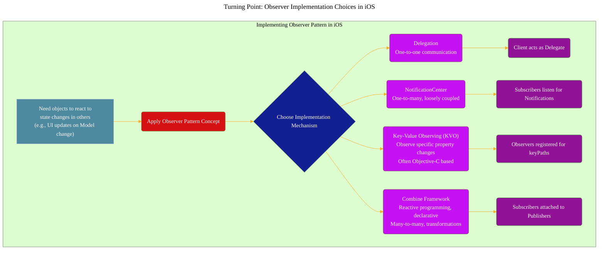
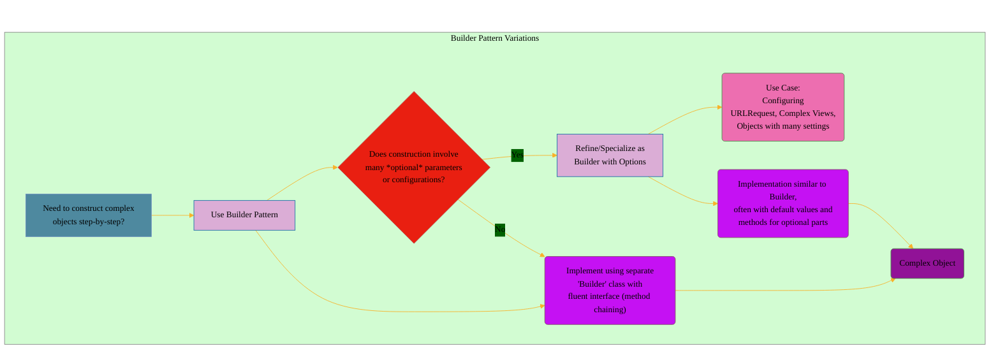
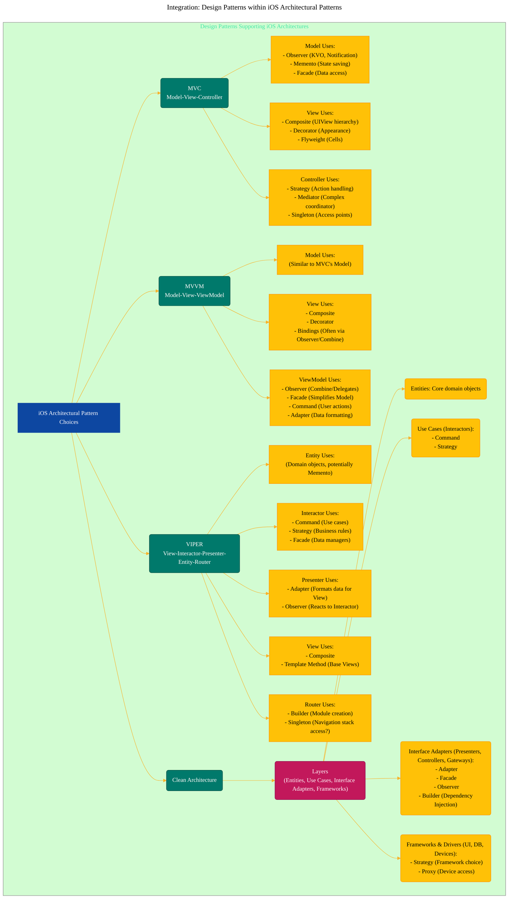
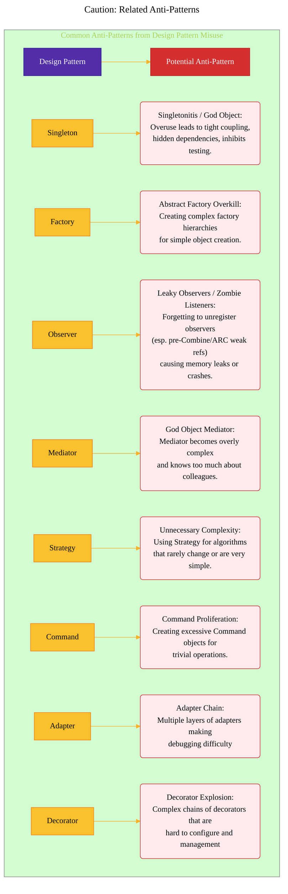

# Connections Among Design Patterns

---

  <blockquote>
  As a visual learner student, I created these personal study notes from the cited source(s) to aid my understanding. 
  While my firm intention is to provide full credit, the blended format of notes and diagrams may sometimes obscure the original source, for which I apologize. 
  I am committed to making corrections and welcome any feedback. 
  This is a non-commercial project for my humble educational purposes only since the start. 
  My goal is to share my perspective and contribute to the great work already being done.
   
   
  I want to extend my genuine apologies to the creators of the original material. 
  Their work was the direct inspiration for this project, and I adapted it without first reaching out. 
  My intent comes from a place of deep respect, and I hope this is received in the spirit of homage. 
  🙏🏼🙏🏼🙏🏼🙏🏼
  </blockquote>

----

## Turning Point: Factory Implementation Strategies (Using Singleton)

This diagram shows how a Factory Method might be implemented, sometimes utilizing a Singleton pattern for the factory itself, or leading to an Abstract Factory for families of objects.

```mermaid
---
title: "Turning Point: Factory Implementation Strategies (Using Singleton)"
author: N/A
version: N/A
license(s): N/A
copyright: N/A
config:
  theme: base
---
%%%%%%%% Mermaid version v11.4.1-b.14
%%%%%%%% Available curve styles include the following keywords:
%% basis, bumpX, bumpY, cardinal, catmullRom, linear, monotoneX, monotoneY, natural, step, stepAfter, stepBefore.
%%{
  init: {
    'flowchart': { 'htmlLabels': false, 'curve': 'basis' },
    'fontFamily': 'Comic Sans MS',
    'themeVariables': {
      'primaryColor': '#B28122',
      'primaryTextColor': '#FFF',
      'primaryBorderColor': '#7C33',
      'lineColor': '#F8B229',
      'stroke':'#000',
      'stroke-width': '0.5px'
    }
  }
}%%
graph TD
    subgraph Factory_Pattern_Decisions["Factory Pattern Decisions"]
    style Factory_Pattern_Decisions fill:#5e13,stroke:#888
        A("Need to Decouple<br>Object Creation?") --> B{"Pattern Choice"}
        B --> FM["Factory Method"]
        B --> AF["Abstract Factory"]

        FM --> FM_IMPL{How to Implement<br/>Factory Method?}
        FM_IMPL --> FM_Proto("Use Protocols:<br/>'protocol Product {}'<br>'protocol Factory {}'")
        FM_IMPL --> FM_Singleton("Provide Single Instance<br>of Concrete Factory?")
        FM_Singleton --> S["Use Singleton Pattern<br>for the Factory"]

        AF --> AF_IMPL("Implement with Multiple<br/>Factories conforming to<br>a common AbstractFactory protocol")
        AF --> AF_USES_FM("Often composed of<br>multiple Factory Methods")

        FM_Proto --> C("Client uses Factory Protocol")
        S --> C
        AF_IMPL --> D("Client uses Abstract Factory Protocol")
    end

    style A fill:#4e899f,stroke:#6c8ebf
    style B fill:#e91f11,stroke:#b85450
    style FM fill:#e1d5,stroke:#1a73a6
    style AF fill:#e1d5,stroke:#1a73a6
    style FM_IMPL fill:#1f1111,stroke:#fed7aa
    style FM_Proto fill:#c511f3,stroke:#824c68
    style FM_Singleton fill:#1f1111,stroke:#fed7aa
    style S fill:#e1d5,stroke:#1a73a6
    style AF_IMPL fill:#c511f3,stroke:#824c68
    style AF_USES_FM fill:#f199,stroke:#4d884d
    style C fill:#911297,stroke:#4d884d
    style D fill:#911297,stroke:#4d884d
    
```

**Explanation:** When choosing Factory Method, a common implementation decision is whether to make the concrete factory itself a Singleton for easy access, bridging Factory Method and Singleton. Abstract Factory often builds upon multiple Factory Methods.

---

## 2. Bridge: Adapter for Interoperability (Swift/Objective-C/C++)

This diagram highlights the Adapter pattern's crucial role in making incompatible interfaces work together, a common scenario in mixed-language iOS projects.

```mermaid
---
title: "Bridge: Adapter for Interoperability (Swift/Objective-C/C++)"
author: N/A
version: N/A
license(s): N/A
copyright: N/A
config:
  theme: base
---
%%%%%%%% Mermaid version v11.4.1-b.14
%%%%%%%% Toggle theme value to `base` to activate the initilization below for the customized theme version.
%%%%%%%% Available curve styles include the following keywords:
%% basis, bumpX, bumpY, cardinal, catmullRom, linear, monotoneX, monotoneY, natural, step, stepAfter, stepBefore.
%%{
  init: {
    'fontFamily': 'Comic Sans MS',
    'themeVariables': {
      'primaryColor': '#BB2528',
      'primaryTextColor': '#FFF',
      'primaryBorderColor': '#7C0000',
      'lineColor': '#F8B229',
      'secondaryColor': '#006100',
      'tertiaryColor': '#fff'
    }
  }
}%%
graph TD
    subgraph Adapter_for_Bridging_Interfaces["Adapter for Bridging Interfaces"]
    style Adapter_for_Bridging_Interfaces fill:#5e13,stroke:#888
        A["Problem:<br/>Incompatible Interfaces<br/>(e.g., Swift code needs to use<br>Objective-C/C++ library, or vice-versa)"]
        A --> AD("Solution:<br/>Apply Adapter Pattern")
        AD --> AD_IMPL{"Implementation Technique?"}
        AD_IMPL -- Swift --> AD_ProtoExt["Protocol Extension"]
        AD_IMPL -- ObjC --> AD_Category["Category"]
        AD_IMPL -- General --> AD_Wrapper["Wrapper Class"]
        AD_ProtoExt --> T("Target Interface<br>used by Client")
        AD_Category --> T
        AD_Wrapper --> T
        T --> Adaptee("Adaptee<br>Original Incompatible<br/>Class/Library")
    end

    style A fill:#e91f11,stroke:#b85450
    style AD fill:#818129,stroke:#9673a6
    style AD_IMPL fill:#1f1111,stroke:#fed7aa
    style AD_ProtoExt fill:#c511f3,stroke:#824c68
    style AD_Category fill:#c511f3,stroke:#824c68
    style AD_Wrapper fill:#c511f3,stroke:#824c68
    style T fill:#911297,stroke:#4d884d
    style Adaptee fill:#f199,stroke:#4d884d
    
```

**Explanation:** When faced with incompatible interfaces, particularly between Swift, Objective-C, and C++, the Adapter pattern is the primary bridge. The diagram shows the problem, the pattern choice, and common implementation methods in iOS.

---

## 3. Bridge: Composite and Decorator in iOS UI (Views & Cells)

Illustrates how the Composite pattern structures view hierarchies and how the Decorator pattern can dynamically add responsibilities, often applied together, especially in complex cell designs.

```mermaid
---
title: "Bridge: Composite and Decorator in iOS UI (Views & Cells)"
author: "Cong Le"
version: "1.0"
license(s): "MIT, CC BY 4.0"
copyright: "Copyright (c) 2025 Cong Le. All Rights Reserved."
config:
  theme: base
---
%%%%%%%% Mermaid version v11.4.1-b.14
%%%%%%%% Toggle theme value to `base` to activate the initilization below for the customized theme version.
%%%%%%%% Available curve styles include the following keywords:
%% basis, bumpX, bumpY, cardinal, catmullRom, linear, monotoneX, monotoneY, natural, step, stepAfter, stepBefore.
%%{
  init: {
    'fontFamily': 'Comic Sans MS',
    'themeVariables': {
      'primaryColor': '#BB2528',
      'primaryTextColor': '#FFF',
      'primaryBorderColor': '#7C0000',
      'lineColor': '#F8B229',
      'textColor': '#000',
      'fontSize': '15px',
      'secondaryColor': '#006100',
      'tertiaryColor': '#fff'
    }
  }
}%%
graph LR
    subgraph UI_Composition_and_Decoration["UI Composition and Decoration"]
    style UI_Composition_and_Decoration fill:#5e13,stroke:#888
        A["Need to represent<br>part-whole hierarchies<br/>(e.g., UIView layouts)"] --> CP("Use Composite Pattern")
        CP --> CP_IMPL("Implement using<br>Tree/Recursive Structure<br/>'UIView.subviews'")

        B["Need to add responsibilities<br>dynamically at runtime<br/>(e.g., borders, shadows,<br>special behaviors to views)"] --> DC("Use Decorator Pattern")
        DC --> DC_IMPL("Implement by Wrapping<br/>the component")

        CP_IMPL --> H("Complex UI Hierarchy")
        DC_IMPL -- Wraps --> H

        DC -.-> DC_USES_CP("Decorator often decorates<br/>Components within a<br/>Composite structure")
        CP -.-> CP_DECORATED("Composites can be<br>Targets for Decorators")

        subgraph Example["Example:<br/>UITableViewCell/UICollectionViewCell"]
        style Example fill:#c513,stroke:#888
          direction TB
          CELL["Complex Cell Design"] --> SKIN_GUTS("Separate 'Skin' (Appearance)<br/>from 'Guts' (Content/Logic)")
          SKIN_GUTS --> SG_COMP("Content/Guts often<br>a Composite structure")
          SKIN_GUTS --> SG_DEC("Skin/Appearance applied<br/>using Decorator-like pattern")
        end

        H --> CELL
    end

    style A fill:#4e899f,stroke:#6c8ebf
    style B fill:#4e899f,stroke:#6c8ebf
    style CP fill:#818129,stroke:#9673a6
    style DC fill:#818129,stroke:#9673a6
    style CP_IMPL fill:#c511f3,stroke:#824c68
    style DC_IMPL fill:#c511f3,stroke:#824c68
    style H fill:#911297,stroke:#4d884d
    style DC_USES_CP fill:#f199,stroke:#4d884d
    style CP_DECORATED fill:#f199,stroke:#4d884d
    style CELL fill:#e91f11,stroke:#b85450
    style SKIN_GUTS fill:#1f1111,stroke:#fed7aa
    style SG_COMP fill:#c511f3,stroke:#824c68
    style SG_DEC fill:#c511f3,stroke:#824c68
    
```

**Explanation:** Composite is fundamental for `UIView`. Decorator allows enhancing views without subclassing. They frequently work together. The "Skin vs. Guts" approach in cells often uses Composite for the internal structure and Decorator-like concepts for the visual presentation.

---

## 4. Turning Point: Observer Implementation Choices in iOS

The Observer pattern is central to reactive UI updates in iOS. This diagram shows the various native frameworks and techniques used to implement it.

**Explanation:** This diagram acts as a decision helper. Once you identify the need for the Observer pattern, you face a turning point: choosing the *best* iOS mechanism (Delegation, NotificationCenter, KVO, Combine) based on coupling, number of observers, and desired reactivity.

---

## 5. Bridge: Memory Management - ARC/MRC and Retain Cycles

This highlights that Retain Cycles are a *problem* within memory management systems (ARC/MRC), and `weak`/`unowned` references are the *solution* (a specific technique, bridging the problem to the solution).

```mermaid
---
title: "Bridge: Memory Management - ARC/MRC and Retain Cycles"
author: "Cong Le"
version: "1.0"
license(s): "MIT, CC BY 4.0"
copyright: "Copyright (c) 2025 Cong Le. All Rights Reserved."
config:
  theme: base
---
%%%%%%%% Mermaid version v11.4.1-b.14
%%%%%%%% Toggle theme value to `base` to activate the initilization below for the customized theme version.
%%%%%%%% Available curve styles include the following keywords:
%% basis, bumpX, bumpY, cardinal, catmullRom, linear, monotoneX, monotoneY, natural, step, stepAfter, stepBefore.
%%{
  init: {
    'fontFamily': 'Comic Sans MS',
    'themeVariables': {
      'primaryColor': '#BB2528',
      'primaryTextColor': '#FFF',
      'primaryBorderColor': '#7C0000',
      'lineColor': '#F8B229',
      'textColor': '#000',
      'fontSize': '15px',
      'secondaryColor': '#006100',
      'tertiaryColor': '#fff'
    }
  }
}%%
graph TD
    subgraph Memory_Management_and_Retain_Cycles["Memory Management & Retain Cycles"]
    style Memory_Management_and_Retain_Cycles fill:#2e23,stroke:#888
        A["Memory Management System"]
        A -- Swift --> ARC["Automatic Reference Counting"]
        A -- Legacy ObjC --> MRC["Manual Reference Counting<br/>(Manual retain/release)"]

        ARC --> P1{"Potential Problem"}
        MRC --> P1

        P1 --> RC["Retain Cycle<br/>(Objects hold strong references<br/>to each other, preventing deallocation)"]

        RC --> S1{"Solution"}
        S1 --> WEAK("[weak] reference<br/>Doesn't keep object alive.<br/>Becomes nil automatically.")
        S1 --> UNOWNED("[unowned] reference<br/>Doesn't keep object alive.<br/>Assumes object exists<br/>(crashes if not).")

        WEAK --> FIX("Breaks the cycle")
        UNOWNED --> FIX
    end

    style A fill:#4e899f,stroke:#6c8ebf
    style ARC fill:#c511f3,stroke:#824c68
    style MRC fill:#c511f3,stroke:#824c68
    style P1 fill:#e91f11,stroke:#b85450
    style RC fill:#c511f3,stroke:#824c68
    style S1 fill:#1f1111,stroke:#fed7aa
    style WEAK fill:#911297,stroke:#4d884d
    style UNOWNED fill:#911297,stroke:#4d884d
    style FIX fill:#006100,stroke:#fff
    
```

**Explanation:** Both ARC and MRC can suffer from Retain Cycles. This diagram shows the cycle as a problem stemming from the management system and `weak`/`unowned` as the specific techniques bridging the gap to a solution.

---

## 6. Turning Point: Builder vs. Builder with Options

Clarifies that "Builder with Options" is a specific application or refinement of the general Builder pattern, used when object construction involves many optional or configurable parameters.

**Explanation:** If you choose the Builder pattern, a further turning point arises based on the complexity and optionality of parameters. If there are many optional elements, you'd specifically employ the "Builder with Options" variation.

---

## 7. Integration: Design Patterns within iOS Architectural Patterns

Design patterns don't exist in isolation; they are the building blocks used within larger architectural patterns like MVC, MVVM, VIPER, etc. This diagram shows common ways specific design patterns support these architectures.

**Explanation:** This shows how different architectural patterns rely heavily on specific design patterns to fulfill the responsibilities of their components (e.g., ViewModels in MVVM often use Observer and Facade; Interactors in VIPER often use Command).

---

## 8. Caution: Related Anti-Patterns

While design patterns are useful, their misuse can lead to anti-patterns. Understanding these helps in applying patterns correctly.

**Explanation:** This diagram serves as a warning, linking common design patterns to potential pitfalls if they are not applied thoughtfully or in the correct context.

---

<!-- 

---
**Licenses:**

- **MIT License:**   - Full text in [LICENSE](LICENSE) file.
- **Creative Commons Attribution 4.0 International:**  - Legal details in [LICENSE-CC-BY](LICENSE-CC-BY) and at [Creative Commons official site](http://creativecommons.org/licenses/by/4.0/).

---
