# Dependency Injection - An Updated version
> **Disclaimer:**
>
> This document contains my personal notes on the topic,
> compiled from publicly available documentation and various cited sources.
> The materials are intended for educational purposes, personal study, and reference.
> The content is dual-licensed:
> 1. **MIT License:** Applies to all code implementations (Swift, Mermaid, and other programming languages).
> 2. **Creative Commons Attribution 4.0 International License (CC BY 4.0):** Applies to all non-code content, including text, explanations, diagrams, and illustrations.
---

## Enhanced version - WIP

This is a draft enhanced version from the initial version at [here](./Dependency_Injection_V1.md).

```mermaid
---
title: Dependency Injection
author: NA
version: NA
license(s): NA
copyright: NA
config:
  look: handDrawn
  theme: base
---
%%%%%%%% Mermaid version v11.4.1-b.14
%%{
  init: {
    'classDiagram': { 'htmlLabels': false},
    'fontFamily': 'Monospace',
    'themeVariables': {
      'primaryColor': '#BB28',
      'primaryTextColor': '#000',
      'lineColor': '#F8B229',
      'primaryBorderColor': '#7C3',
      'secondaryColor': '#DD15'
    }
  }
}%%
classDiagram
    %% Protocol Definitions
    class NetworkServiceProtocol {
        <<interface>>
        +fetchData(from url: URL, completion: @escaping (Result<Data, Error>) -> Void)
    }

    class UserServiceProtocol {
        <<interface>>
        +getUser(by id: String, completion: @escaping (Result<User, Error>) -> Void)
    }

    %% Concrete Implementations
    class NetworkService {
        +fetchData(from url: URL, completion: @escaping (Result<Data, Error>) -> Void)
        -session: URLSession
        +init(session: URLSession = .shared)
    }
    NetworkService --|> NetworkServiceProtocol

    class UserService {
        +getUser(by id: String, completion: @escaping (Result<User, Error>) -> Void)
        -networkService: NetworkServiceProtocol
        +init(networkService: NetworkServiceProtocol)
    }
    UserService --|> UserServiceProtocol

    %% Mock Services for Testing
    class MockNetworkService {
        +fetchData(from url: URL, completion: @escaping (Result<Data, Error>) -> Void)
        -mockData: Data?
        -mockError: Error?
        +setMockData(data: Data?, error: Error?)
    }
    MockNetworkService --|> NetworkServiceProtocol

    %% View Controller
    class DataViewController {
        -networkService: NetworkServiceProtocol
        +init(networkService: NetworkServiceProtocol)
        +viewDidLoad()
        -updateUI(with data: Data)
    }

    %% View Model Example
    class UserViewModel {
        -userService: UserServiceProtocol
        +init(userService: UserServiceProtocol)
        +loadUser(id: String)
        +user: User?
        +errorMessage: String?
    }

    %% Dependency Injection Container (e.g., Swinject)
    class DIContainer {
        +register<T>(_ serviceType: T.Type, _ factory: @escaping (DIContainer) -> T)
        +resolve<T>(_ serviceType: T.Type) -> T?
        +build()
    }

    DIContainer --> NetworkServiceProtocol : registers
    DIContainer --> UserServiceProtocol : registers
    DIContainer --> DataViewController : resolves
    DIContainer --> UserViewModel : resolves

    %% Asynchronous Context
    class AsyncOperationQueue {
        +addOperation(_ operation: AsyncOperation)
    }

    class AsyncOperation {
        +start()
        +cancel()
        <<abstract>>
    }

    %% Relationships
    DataViewController --> NetworkServiceProtocol : depends on
    DataViewController ..> DIContainer : retrieves dependencies from
    UserViewModel --> UserServiceProtocol : depends on
    UserViewModel ..> DIContainer : retrieves dependencies from
    UserService --> NetworkServiceProtocol : depends on

    %% Advanced Concepts

    note for DIContainer "Registration Scopes (Singleton, Transient, Prototype)<br>Lifecycle Management"

    note for AsyncOperationQueue "Custom Operation Queues<br>Thread Management"

    note for NetworkService "URLSession Configuration<br>Error Handling Strategies"

    note for UserViewModel "State Management (Combine, RxSwift)<br>Asynchronous Data Loading"
    
```

### Expanded Explanation with Advanced Concepts

1.  **Asynchronous Result Handling:**
    *   The `fetchData` and `getUser` methods now use `Result<Success, Failure>` types in their completion handlers. This enforces explicit error handling and provides a cleaner way to manage asynchronous operations.

2.  **URLSession Dependency:**
    *   `NetworkService` now has a `URLSession` dependency. This allows for more flexible configuration of the networking layer (e.g., custom timeouts, caching policies). The default value `.shared` provides a sensible default.

3.  **Mocking Enhancements:**
    *   `MockNetworkService` includes `mockData` and `mockError` properties, allowing you to simulate both successful and failed network requests in your tests.  The `setMockData` function provides a convenient way to configure the mock service before each test.

4.  **ViewModel Properties for UI State:**
    *   `UserViewModel` includes `user` and `errorMessage` properties. This allows the `DataViewController` to observe changes to the user data and any error messages, and update the UI accordingly.

5.  **DI Container Enhancements:**
    *   `DIContainer` now has `register<T>`, `resolve<T>`, and `build` methods.  The `register` method allows you to register services with different scopes (e.g., singleton, transient, prototype).  The `resolve` method retrieves a service instance from the container.  The `build` method finalizes the container configuration and prepares it for use.

6. **Lifecycle Management:**
    *   Dependency Injection Containers (like Swinject) support various registration scopes (Singleton, Transient, Prototype). Understanding when to use each scope is vital for performance and correctness. For example, a shared resource like a database connection manager should be registered as a Singleton.

7.  **Asynchronous Context & Custom Operation Queues:**
    *   Added `AsyncOperationQueue` and `AsyncOperation` classes to demonstrate how dependency injection can be used in asynchronous contexts. This highlights the importance of managing dependencies in concurrent environments.
8.  **State Management:**
    *  The ViewModel uses a state management approach, which can be implemented using frameworks like Combine or RxSwift, or custom implementations. This enhances reactivity and simplifies UI updates.

### Additional Notes:
*   **Registration Scopes:**
    *   **Singleton:** Only one instance of the dependency is created and shared throughout the application's lifetime.
    *   **Transient:** A new instance of the dependency is created each time it is resolved.
    *   **Prototype:** A new instance of the dependency is created each time it is requested, but the container does not hold a reference to it.

*   **Thread Safety:**
    *   When working with dependency injection in multithreaded environments, ensure that your container and registered dependencies are thread-safe.

*   **Circular Dependencies:**
    *   Be cautious of circular dependencies, where two or more classes depend on each other.  DI containers may have difficulty resolving these dependencies, leading to runtime errors. Use techniques like property injection or lazy injection to break the cycles.

*   **Property Injection:**
    *   In addition to constructor injection, you can also use property injection, where dependencies are set on properties after the object has been created.

*   **Factory Pattern:**
    *   Use the factory pattern in conjunction with dependency injection to create complex objects with multiple dependencies.

By incorporating these enhancements, the dependency injection diagram becomes a more comprehensive guide for implementing DI in real-world iOS projects.

---
