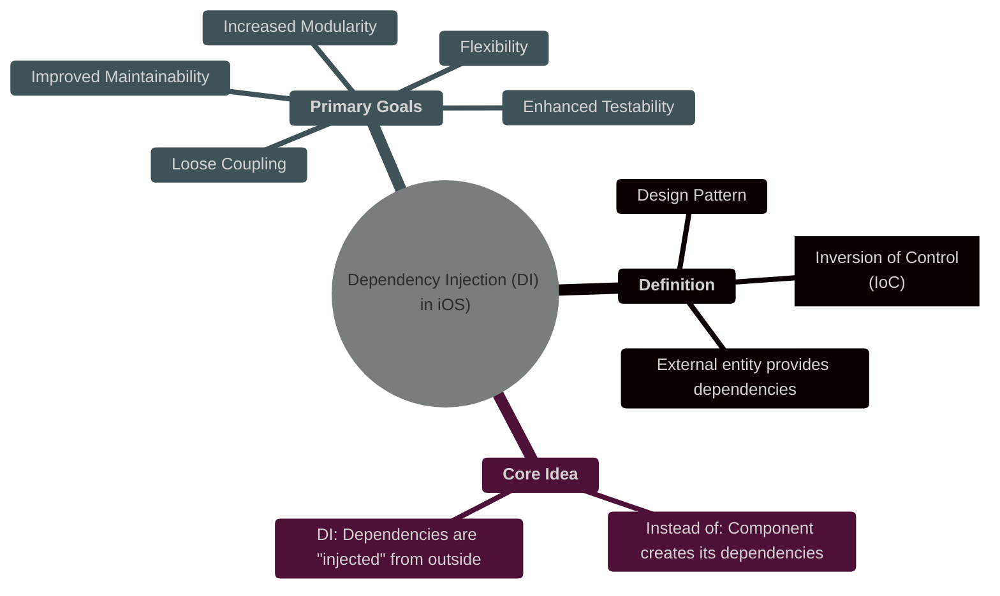
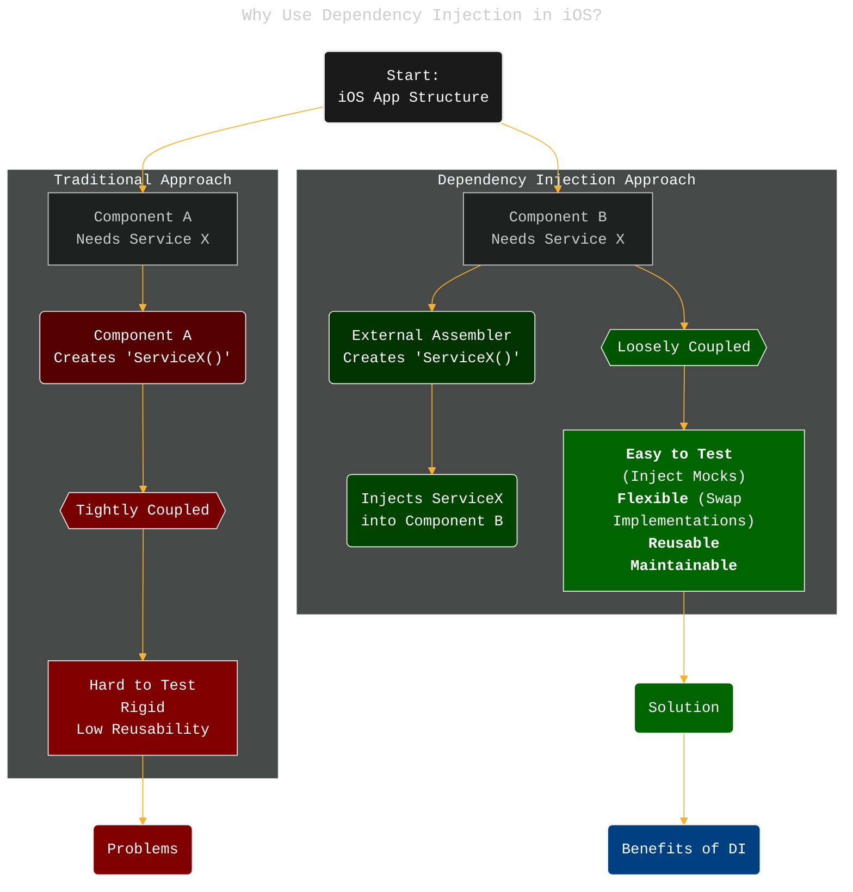
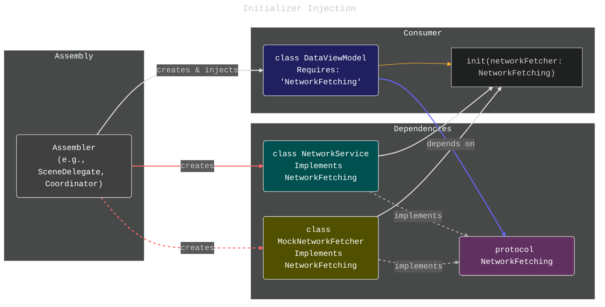
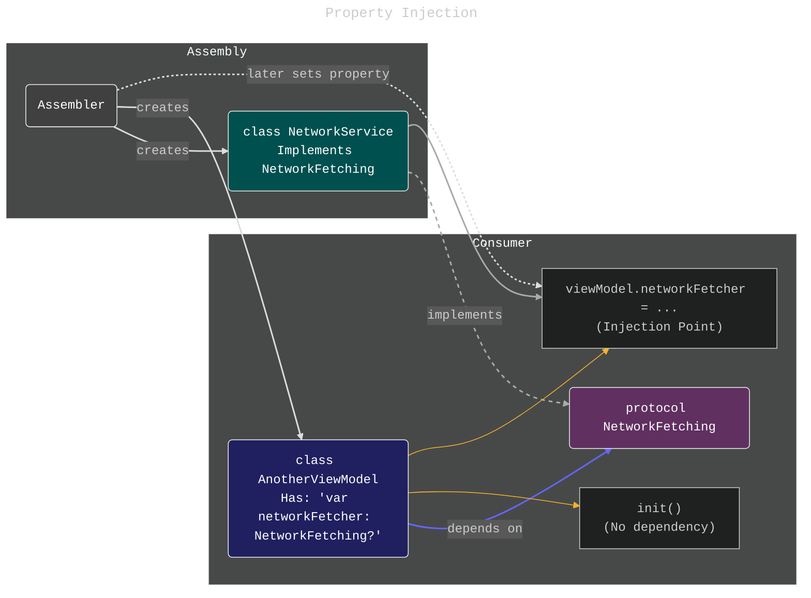
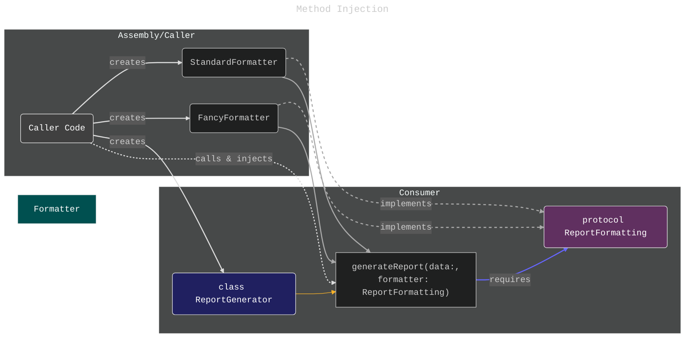
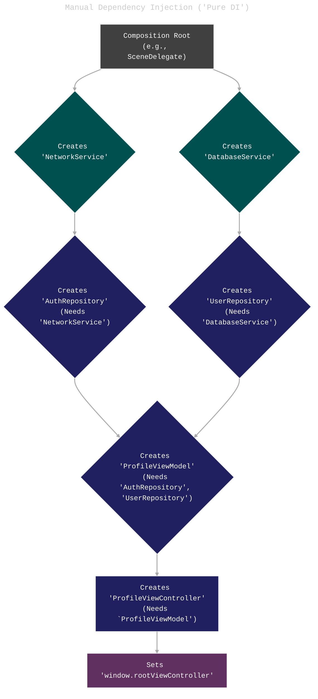
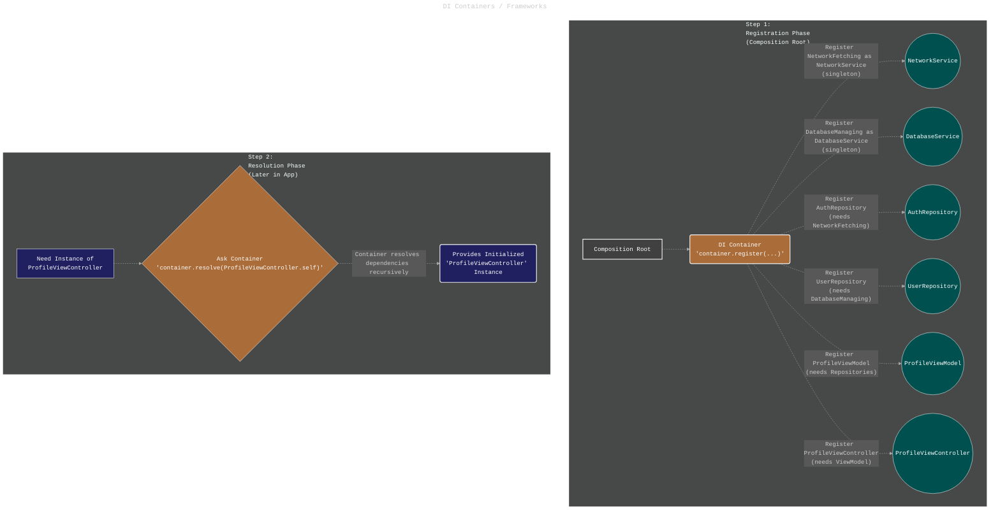
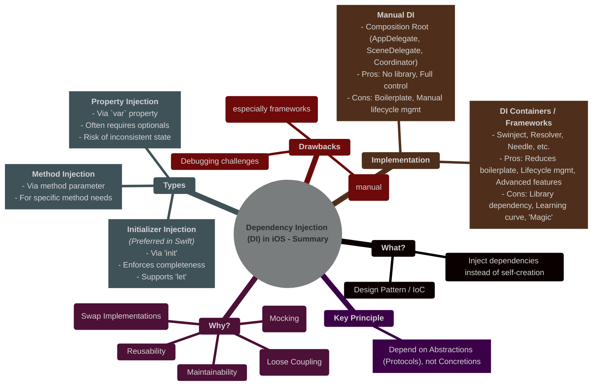

# Dependency Injection in iOS Development: Building Modular and Testable Apps
> **Disclaimer:**
>
> This document contains my personal notes on the topic,
> compiled from publicly available documentation and various cited sources.
> The materials are intended for educational purposes, personal study, and reference.
> The content is dual-licensed:
> 1. **MIT License:** Applies to all code implementations (Swift, Mermaid, and other programming languages).
> 2. **Creative Commons Attribution 4.0 International License (CC BY 4.0):** Applies to all non-code content, including text, explanations, diagrams, and illustrations.
---


## 1. Introduction: What is Dependency Injection?

Dependency Injection (DI) is a fundamental design pattern used extensively in software development, including iOS app creation. It's a specific form of Inversion of Control (IoC), where the responsibility of creating and providing dependencies (objects or services that another object needs to perform its function) is transferred from the object itself to an external entity.

Instead of a component creating its own dependencies internally (like `let service = MyNetworkService()`), these dependencies are "injected" from the outside. This promotes **loose coupling**, making components more independent, easier to test in isolation, and simpler to maintain and modify.



---

## 2. Why Use Dependency Injection in iOS?

Tight coupling, where components directly create or reference concrete implementations of their dependencies, leads to several problems in iOS development:

*   **Difficult Testing:** Mocking or replacing dependencies for unit tests becomes cumbersome or impossible. If `ViewControllerA` directly creates `RealNetworkService`, you can't easily test `ViewControllerA` with a `MockNetworkService`.
*   **Reduced Reusability:** Components tied to specific dependencies are harder to reuse in different contexts.
*   **Rigidity:** Changing a dependency often requires modifying the components that use it, leading to ripple effects across the codebase.
*   **Maintenance Challenges:** Understanding and modifying tightly coupled code is complex and error-prone.

DI addresses these issues directly:




**Key Benefits:**

1.  **Testability:** Dependencies can be easily replaced with mock objects during unit testing, allowing components to be tested in isolation.
2.  **Modularity & Loose Coupling:** Components don't depend on concrete implementations, only on abstractions (protocols/interfaces).
3.  **Flexibility & Reconfigurability:** Different implementations of a dependency can be swapped easily (e.g., switching from a real network service to a cached one) without changing the dependent component.
4.  **Maintainability:** Code becomes easier to understand, modify, and refactor due to clearer separation of concerns.
5.  **Parallel Development:** Teams can work on different components concurrently as long as the interfaces (protocols) are defined.

---

## 3. Common Types of Dependency Injection in Swift/iOS

There are several ways to inject dependencies into an object in Swift:

### a) Initializer Injection

This is the **most common and generally preferred** method in Swift. Dependencies are provided through the object's initializer (`init`).

*   **Mechanism:** Dependencies are passed as parameters to the `init` method.
*   **Advantages:**
    *   Ensures the object has all required dependencies upon creation (no partially initialized state).
    *   Dependencies can be declared as non-optional constants (`let`), enforcing immutability.
    *   Clear declaration of requirements.
*   **Disadvantages:**
    *   Can lead to initializers with many parameters if an object has numerous dependencies.

----

```swift
// Protocol defining the dependency
protocol NetworkFetching {
    func fetchData() -> Data?
}

// Concrete implementation
class NetworkService: NetworkFetching {
    func fetchData() -> Data? {
        print("Fetching data from network...")
        // ... actual network call ...
        return Data()
    }
}

// Dependent class using Initializer Injection
class DataViewModel {
    private let networkFetcher: NetworkFetching // Dependency declared using protocol

    // Dependency injected via initializer
    init(networkFetcher: NetworkFetching) {
        self.networkFetcher = networkFetcher
    }

    func loadData() {
        let data = networkFetcher.fetchData()
        // ... process data ...
        print("Data loaded using \(type(of: networkFetcher))")
    }
}

// Usage: Injecting the dependency
let realService = NetworkService()
let viewModel = DataViewModel(networkFetcher: realService)
viewModel.loadData()

// For Testing: Injecting a mock
class MockNetworkFetcher: NetworkFetching {
    func fetchData() -> Data? {
        print("Returning mock data...")
        return Data("Mock".utf8)
    }
}
let mockService = MockNetworkFetcher()
let testViewModel = DataViewModel(networkFetcher: mockService)
testViewModel.loadData()

```


Link to GitHub repo implementation: [GitHub - CongLeSolutionX/MyApp at DESIGN\_PATTERNS\_Dependency\_Injections](https://github.com/CongLeSolutionX/MyApp/tree/DESIGN_PATTERNS_Dependency_Injections)




---


### b) Property Injection

Dependencies are provided by setting public `var` properties after the object has been initialized.

*   **Mechanism:** Dependencies are assigned to mutable properties (often optional or implicitly unwrapped optionals).
*   **Advantages:**
    *   Can break up dependency resolution over time (though often discouraged).
    *   Sometimes used to break initializer circular dependencies (an indicator of potential design issues).
*   **Disadvantages:**
    *   The object might be in an inconsistent state between initialization and dependency injection.
    *   Dependencies must be mutable (`var`) and often optional (`?` or `!`), hiding the requirement.
    *   Less common and generally less safe than initializer injection in Swift.
    *   Can make tracking down where a dependency is set more difficult.

---


```swift
class AnotherViewModel {
    // Dependency declared as an optional var
    var networkFetcher: NetworkFetching?

    // No dependency in init
    init() {}

    func loadData() {
        guard let fetcher = networkFetcher else {
            print("Error: NetworkFetcher not set!")
            return
        }
        let data = fetcher.fetchData()
        // ... process data ...
        print("Data loaded using \(type(of: fetcher))")
    }
}

// Usage: Injecting after initialization
let viewModel = AnotherViewModel()
// Potential issue: viewModel is usable here, but `loadData` would fail
viewModel.networkFetcher = NetworkService() // Injection via property
viewModel.loadData()

```


Link to GitHub repo implementation: [GitHub - CongLeSolutionX/MyApp at DESIGN\_PATTERNS\_Dependency\_Injections](https://github.com/CongLeSolutionX/MyApp/tree/DESIGN_PATTERNS_Dependency_Injections)




---

### c) Method Injection

Dependencies are provided via parameters to specific methods that require them.

*   **Mechanism:** The dependency is passed only to the method(s) that need it, not stored as a property for the object's lifetime.
*   **Advantages:**
    *   Useful when only a single method needs the dependency.
    *   Clearly shows which methods rely on which dependencies.
*   **Disadvantages:**
    *   Can lead to methods with many parameters.
    *   Dependency needs to be passed repeatedly if multiple methods require it.
    *   Not suitable if the dependency is needed throughout the object's lifecycle or by multiple methods.


---

```swift
class ReportGenerator {
    func generateReport(data: Data, formatter: ReportFormatting) -> String {
        // Dependency 'formatter' injected directly into the method
        let formattedReport = formatter.format(data: data)
        print("Generating report using \(type(of: formatter))")
        return formattedReport
    }
}

// Protocol and implementations
protocol ReportFormatting { func format(data: Data) -> String }
class StandardFormatter: ReportFormatting { func format(data: Data) -> String { "Standard: \(data.count) bytes" } }
class FancyFormatter: ReportFormatting { func format(data: Data) -> String { "** Fancy: \(data.count) bytes **" } }

// Usage
let generator = ReportGenerator()
let reportData = Data("Report Content".utf8)

let standardFormatter = StandardFormatter()
let standardReport = generator.generateReport(data: reportData, formatter: standardFormatter) // Inject StandardFormatter

let fancyFormatter = FancyFormatter()
let fancyReport = generator.generateReport(data: reportData, formatter: fancyFormatter) // Inject FancyFormatter

```


Link to GitHub repo implementation: [GitHub - CongLeSolutionX/MyApp at DESIGN\_PATTERNS\_Dependency\_Injections](https://github.com/CongLeSolutionX/MyApp/tree/DESIGN_PATTERNS_Dependency_Injections)




----

## 4. Manual DI vs. DI Containers/Frameworks

You can implement DI in two main ways:

### a) Manual Dependency Injection ("Pure DI")

You manually create and connect ("wire") your objects and their dependencies. This is often done in a dedicated composition root – a single place in your application (like the `AppDelegate` or `SceneDelegate`, or a dedicated `AppCoordinator`) where the object graph is constructed.

*   **Pros:**
    *   No external library dependency.
    *   Full control over object creation and lifecycle.
    *   Easier to understand the flow initially for smaller projects.
*   **Cons:**
    *   Can become verbose and complex ("boilerplate") in large applications.
    *   Managing object lifecycles (singleton, transient) requires manual effort.
    *   Refactoring can be tedious if dependencies change frequently.



### b) DI Containers / Frameworks

These are third-party libraries that automate the process of dependency registration and resolution. You register your types and how they should be created (their dependencies, lifecycle), and then ask the container to provide instances when needed.

*   **Popular iOS DI Frameworks:** Swinject, Resolver, Needle, Dip.
*   **Pros:**
    *   Reduces boilerplate code for wiring dependencies.
    *   Manages object lifecycles (singleton, transient, weak, etc.).
    *   Often provides advanced features like auto-wiring, circular dependency detection (sometimes), and modular configuration.
*   **Cons:**
    *   Adds an external dependency to your project.
    *   Requires learning the framework's API and concepts ("magic").
    *   Can sometimes make debugging dependency resolution issues harder.
    *   Some frameworks use reflection or runtime tricks which might feel less "Swifty".



---

## 5. Potential Drawbacks of Dependency Injection

While powerful, DI is not without potential downsides:

*   **Increased Complexity:** Especially when using frameworks, understanding the setup and how dependencies are resolved can add initial complexity.
*   **Boilerplate (Manual DI):** Manually wiring large object graphs can be tedious.
*   **Debugging:** Tracing dependency resolution, especially with complex container setups or auto-wiring, can sometimes be challenging.
*   **Framework Overhead:** DI containers add a dependency and might introduce a small runtime overhead (usually negligible).

---

## 6. Conclusion: Embracing DI for Better iOS Apps

Dependency Injection is a cornerstone of modern iOS development, enabling the creation of applications that are modular, flexible, and, crucially, testable. By inverting the control of dependency creation, developers gain significant advantages in managing complexity and maintaining code quality over the long term.

Whether implemented manually for simpler projects or using sophisticated DI containers for larger applications, understanding and applying DI principles leads to more robust and adaptable iOS software. The preferred method in Swift is typically **Initializer Injection** due to its explicitness and support for immutability.




---

<!-- 


---
**Licenses:**

- **MIT License:**  [](LICENSE) - Full text in [LICENSE](LICENSE) file.
- **Creative Commons Attribution 4.0 International:** [](LICENSE-CC-BY) - Legal details in [LICENSE-CC-BY](LICENSE-CC-BY) and at [Creative Commons official site](http://creativecommons.org/licenses/by/4.0/).

---
