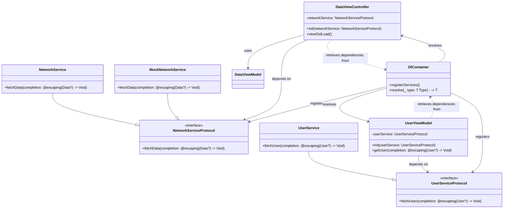

# Dependency Injection

Below is a Mermaid **Class Diagram** that visually represents the **Dependency Injection (DI) architecture**. This diagram illustrates how different components interact through DI, highlighting protocols, concrete implementations, view controllers, and how dependencies are injected. Additionally, it includes mock services for testing purposes.

### Explanation of the Diagram

1. **Protocols and Implementations:**
    - `NetworkServiceProtocol` and `UserServiceProtocol` are protocols that define the required methods for networking and user services, respectively.
    - `NetworkService` and `UserService` are concrete classes that conform to their respective protocols, providing actual implementations.
2. **Mock Services:**
    - `MockNetworkService` is a mock implementation of `NetworkServiceProtocol` used for testing purposes. It allows `DataViewController` to be tested without relying on real network calls.
3. **View Controllers and View Models:**
    - `DataViewController` depends on `NetworkServiceProtocol` to fetch data. Instead of instantiating `NetworkService` directly, it receives a `NetworkServiceProtocol` instance through its initializer, adhering to the DI principle.
    - `UserViewModel` depends on `UserServiceProtocol`, allowing it to fetch user data without being tightly coupled to a specific service implementation.
4. **Dependency Injection Container:**
    - `DIContainer` represents a DI container (e.g., **Swinject**, **Resolver**) responsible for registering and resolving dependencies. It handles the creation and injection of dependencies like `NetworkServiceProtocol`, `UserServiceProtocol`, `DataViewController`, and `UserViewModel`.
5. **Dependency Relationships:**
    - `DataViewController` and `UserViewModel` retrieve their dependencies from `DIContainer`, ensuring that they are provided with the appropriate service implementations.
    - This setup promotes loose coupling, making the components more modular, testable, and maintainable.

### Additional Notes

- **Constructor Injection:** Both `DataViewController` and `UserViewModel` receive their dependencies via their initializers, which is the preferred method of dependency injection as it ensures that dependencies are provided at the time of object creation.
- **Testing Advantages:** By depending on protocols rather than concrete implementations, it's easy to substitute real services with mock services during testing, enhancing the testability of your components.
- **Flexibility and Maintainability:** If you need to change the implementation of a service (e.g., switch from `NetworkService` to another networking library), you can do so without modifying the classes that depend on the service, provided they rely on the protocol.

---
