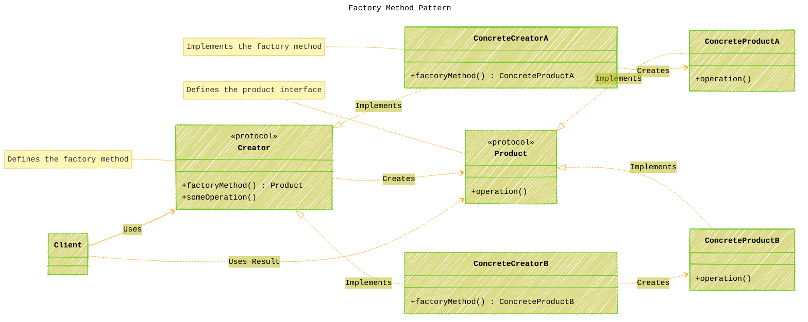
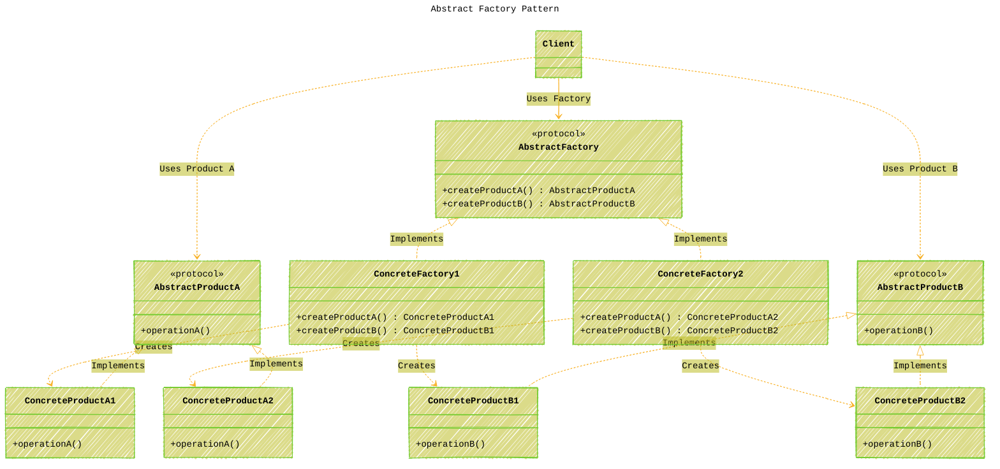

# The Factory Pattern in iOS Development
> **Disclaimer:**
>
> This document contains my personal notes on the topic,
> compiled from publicly available documentation and various cited sources.
> The materials are intended for educational purposes, personal study, and reference.
> The content is dual-licensed:
> 1. **MIT License:** Applies to all code implementations (Swift, Mermaid, and other programming languages).
> 2. **Creative Commons Attribution 4.0 International License (CC BY 4.0):** Applies to all non-code content, including text, explanations, diagrams, and illustrations.
---


## 1. Introduction: Decoupling Object Creation

The **Factory Pattern** is a fundamental **creational design pattern** used extensively in software development, including iOS app development with Swift. Its primary goal is to **decouple the process of object creation** from the client code that uses those objects. Instead of creating objects directly using their initializers (`ClassName()`), the client asks a "factory" object to create instances on its behalf. This delegation provides flexibility, enhances maintainability, and promotes adherence to principles like the Single Responsibility Principle (SRP) and the Open/Closed Principle (OCP).

This explanation explores the common variations of the Factory Pattern (Simple Factory, Factory Method, Abstract Factory), their implementation in Swift, benefits, drawbacks, and typical use cases within the iOS ecosystem.


---

## 2. Logical Sections & Breakdown

This document is structured as follows:

1.  **Introduction:** Core concept and initial mind map.
2.  **The "Simple Factory"**: A common starting point, though not a formal GoF pattern.
3.  **Factory Method Pattern**: Deferring instantiation to subclasses/conformers.
4.  **Abstract Factory Pattern**: Creating families of related objects.
5.  **Benefits and Drawbacks**: Weighing the pros and cons.
6.  **Use Cases in iOS Development**: Practical examples within the Apple ecosystem.
7.  **Conclusion & Summary Mind Map**: Synthesizing the key takeaways.

----

## 3. The "Simple Factory"

Often encountered, the **Simple Factory** isn't one of the original Gang of Four (GoF) design patterns but serves as a common, simpler approach or stepping stone. It typically involves a single class with a method (the "factory method") that returns instances of different object types based on input parameters (e.g., an enum, string, or other data).

The client interacts directly with this factory class to get the product it needs, without knowing the specific concrete class being instantiated.


**Swift Implementation Example:**

Imagine creating different types of UI alert views based on context:

```swift
// Product Protocol
protocol AlertView {
    func show(title: String, message: String)
}

// Concrete Products
struct SuccessAlert: AlertView {
    func show(title: String, message: String) {
        print("✅ SUCCESS: \(title) - \(message)")
        // In reality, present a styled success alert
    }
}

struct ErrorAlert: AlertView {
    func show(title: String, message: String) {
        print("❌ ERROR: \(title) - \(message)")
        // In reality, present a styled error alert
    }
}

// Alert Type Enum
enum AlertType {
    case success
    case error
}

// Simple Factory
struct AlertFactory {
    static func createAlert(type: AlertType) -> AlertView {
        switch type {
        case .success:
            return SuccessAlert()
        case .error:
            return ErrorAlert()
        }
    }
}

// Client Code
let success = AlertFactory.createAlert(type: .success)
success.show(title: "Operation Complete", message: "Data saved successfully.")

let error = AlertFactory.createAlert(type: .error)
error.show(title: "Operation Failed", message: "Network connection lost.")
```

**Key Idea:** The `AlertFactory` centralizes the creation logic. The client only needs to know about the `AlertFactory` and the `AlertView` protocol, not the specific `SuccessAlert` or `ErrorAlert` structs.

---

## 4. Factory Method Pattern

The **Factory Method Pattern** defines an interface (protocol or base class) for creating an object but lets subclasses (or conforming types) decide which class to instantiate. It involves a "Creator" type defining a `factoryMethod` and "Concrete Creators" implementing this method to produce specific "Products".

This pattern is particularly useful when a class cannot anticipate the class of objects it must create or when a class wants its subclasses to specify the objects it creates.



**Swift Implementation Example:**

Let's model creating different types of data loggers.

```swift
// Product Protocol
protocol Logger {
    func log(message: String)
}

// Concrete Products
struct ConsoleLogger: Logger {
    func log(message: String) {
        print("[Console] \(message)")
    }
}

struct FileLogger: Logger {
    let filePath: String
    func log(message: String) {
        // In reality, append message to file at filePath
        print("[File:\(filePath)] \(message)")
    }
}

// Creator Protocol (with the factory method)
protocol LoggerFactory {
    // The Factory Method
    func createLogger() -> Logger

    // Other operations that might use the logger
    func logProcess(action: String)
}

// Default implementation using the created logger
extension LoggerFactory {
     func logProcess(action: String) {
        let logger = createLogger() // Use the factory method
        logger.log(message: "Performing action: \(action)")
    }
}

// Concrete Creators
struct ConsoleLoggerFactory: LoggerFactory {
    func createLogger() -> Logger {
        return ConsoleLogger() // Creates ConsoleLogger
    }
}

struct FileLoggerFactory: LoggerFactory {
    let logFilePath: String
    init(logFilePath: String = "app.log") {
        self.logFilePath = logFilePath
    }

    func createLogger() -> Logger {
        return FileLogger(filePath: logFilePath) // Creates FileLogger
    }
}

// Client Code
let consoleCreator: LoggerFactory = ConsoleLoggerFactory()
consoleCreator.logProcess(action: "User Login") // Uses ConsoleLogger

let fileCreator: LoggerFactory = FileLoggerFactory(logFilePath: "debug.log")
fileCreator.logProcess(action: "Data Sync") // Uses FileLogger
```

**Key Idea:** The `LoggerFactory` protocol defines the *contract* for creating a logger, but the concrete types (`ConsoleLoggerFactory`, `FileLoggerFactory`) decide *which* specific logger to instantiate. The client interacts with the `LoggerFactory` protocol.

---

## 5. Abstract Factory Pattern

The **Abstract Factory Pattern** provides an interface for creating **families of related or dependent objects** without specifying their concrete classes. It deals with creating *sets* of objects that are designed to work together.

This pattern involves:
*   `AbstractFactory`: Protocol defining methods for creating each type of related product.
*   `ConcreteFactory`: Classes implementing the `AbstractFactory` protocol to produce a specific family of products.
*   `AbstractProduct`: Protocols defining the interface for each type of product in the family.
*   `ConcreteProduct`: Classes implementing the `AbstractProduct` protocols.




**Swift Implementation Example:**

Creating UI elements for different themes (e.g., Light vs. Dark).

```swift
// Abstract Product Protocols
protocol Button {
    var color: String { get }
    func render()
}

protocol Label {
    var textColor: String { get }
    func display(text: String)
}

// Concrete Products - Light Theme
struct LightButton: Button {
    let color = "LightGray"
    func render() { print("Rendering Button with color: \(color)") }
}

struct LightLabel: Label {
    let textColor = "Black"
    func display(text: String) { print("Displaying Label with text '\(text)' in color: \(textColor)") }
}

// Concrete Products - Dark Theme
struct DarkButton: Button {
    let color = "DarkGray"
    func render() { print("Rendering Button with color: \(color)") }
}

struct DarkLabel: Label {
    let textColor = "White"
    func display(text: String) { print("Displaying Label with text '\(text)' in color: \(textColor)") }
}

// Abstract Factory Protocol
protocol UIFactory {
    func createButton() -> Button
    func createLabel() -> Label
}

// Concrete Factories
struct LightThemeFactory: UIFactory {
    func createButton() -> Button { return LightButton() }
    func createLabel() -> Label { return LightLabel() }
}

struct DarkThemeFactory: UIFactory {
    func createButton() -> Button { return DarkButton() }
    func createLabel() -> Label { return DarkLabel() }
}

// Client Code - Represents a View or ViewController
struct SettingsScreen {
    let factory: UIFactory // Injected factory

    func displayUI() {
        let saveButton = factory.createButton()
        let titleLabel = factory.createLabel()

        titleLabel.display(text: "User Preferences")
        saveButton.render()
    }
}

// Usage
print("--- Using Light Theme ---")
let lightFactory = LightThemeFactory()
let lightSettings = SettingsScreen(factory: lightFactory)
lightSettings.displayUI()

print("\n--- Using Dark Theme ---")
let darkFactory = DarkThemeFactory()
let darkSettings = SettingsScreen(factory: darkFactory)
darkSettings.displayUI()
```

**Key Idea:** The `UIFactory` protocol defines how to create a *set* of UI elements (Button, Label). Concrete factories (`LightThemeFactory`, `DarkThemeFactory`) provide consistent families of these elements. The `SettingsScreen` uses the abstract `UIFactory` and doesn't need to know if it's dealing with light or dark components specifically.

----

## 6. Benefits and Drawbacks

Using Factory patterns brings several advantages but also introduces some trade-offs.


----

## 7. Use Cases in iOS Development

The Factory pattern and its variations appear frequently in iOS development, sometimes explicitly and sometimes implicitly:

1.  **Dependency Injection:** Factories are commonly used to create and provide dependencies (like services, managers, view models) to other objects, often managed by a Dependency Injection container. Abstract Factory can configure dependencies for different environments (dev, staging, prod).
2.  **Creating View Controllers:** A factory can instantiate different `UIViewController` subclasses based on navigation actions or data, hiding the specific initialization logic (e.g., `Storyboard.instantiateViewController`).
3.  **Configurable Components:** Creating complex UI components (like charts, custom views) with different configurations or data sources. A factory can handle the setup logic.
4.  **Cross-Platform Abstraction (Less common in pure iOS):** If sharing logic with other platforms, an Abstract Factory could create platform-specific implementations (e.g., network clients, storage adapters).
5.  **Data Source/Delegate Creation:** Factories can create specific data source or delegate objects based on the context (e.g., different `UITableViewDataSource` implementations for different table view sections).
6.  **Mocking for Tests:** Replacing production factories with mock factories that return test doubles (stubs, mocks) during unit or integration testing.
7.  **Theme Management:** As shown in the Abstract Factory example, managing different visual themes (light/dark, different brandings).
8.  **Network Request Building:** Creating different types of `URLRequest` objects based on endpoint definitions or parameters.


---

## 8. Conclusion & Summary Mind Map

The Factory patterns (Simple Factory, Factory Method, Abstract Factory) are powerful tools in an iOS developer's arsenal for managing object creation. They promote loose coupling, enhance flexibility, and improve the testability and maintainability of codebases by abstracting away the specifics of how objects are instantiated. While they introduce some complexity, the benefits often outweigh the drawbacks, especially in larger or evolving applications. Choosing the right factory variation depends on the specific problem: use Simple Factory for basic centralized creation, Factory Method for deferring instantiation to subtypes, and Abstract Factory for creating families of related objects.


---
**Licenses:**

- **MIT License:**  [](LICENSE) - Full text in [LICENSE](LICENSE) file.
- **Creative Commons Attribution 4.0 International:** [](LICENSE-CC-BY) - Legal details in [LICENSE-CC-BY](LICENSE-CC-BY) and at [Creative Commons official site](http://creativecommons.org/licenses/by/4.0/).

---