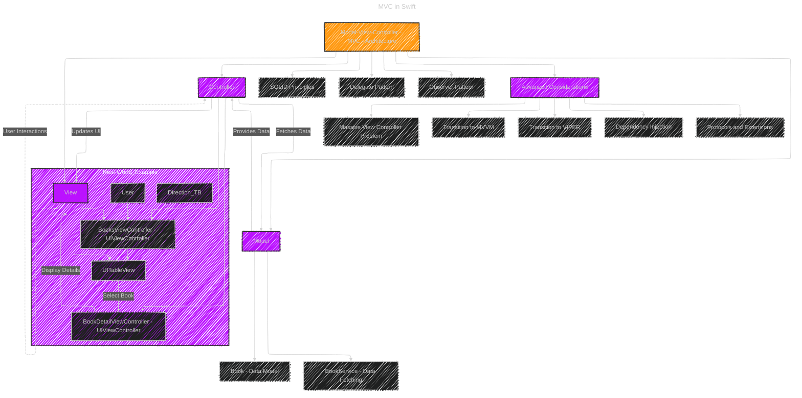

# MVC in Swift

> This content is dual-licensed under your choice of the following licenses:
> 1.  **MIT License:** For the code implementations in Swift and Mermaid provided in this document.
> 2.  **Creative Commons Attribution 4.0 International License (CC BY 4.0):** For all other content, including the text, explanations, and the Mermaid diagrams and illustrations.

---

Below is a **Mermaid** diagram that visually represents the **Model-View-Controller (MVC)** architecture. This illustration captures the core components of MVC, their interactions, and how they collaborate within an iOS application developed using Swift.

### Explanation of the Diagram

1. **Core MVC Components**:
    - **Model**: Manages the data and business logic.
        - **Book**: Represents the data structure for a book.
        - **BookService**: Handles data fetching from a remote server or database.
    - **View**: Manages the user interface and presentation.
        - **BooksViewController**: The main view controller displaying the list of books.
        - **UITableView**: Displays the list of books in a table format.
    - **Controller**: Acts as an intermediary between the Model and View.
        - **BooksViewController**: Also serves as the Controller handling user interactions and data updates.
        - **BookDetailViewController**: Handles the presentation of detailed information about a selected book.
2. **Interactions**:
    - **User Interactions**: Users interact with the **View** (e.g., tapping on a table cell).
    - **Controller Fetches Data**: The **Controller** requests data from the **Model** through the **BookService**.
    - **Model Provides Data**: The **Model** returns the requested data to the **Controller**.
    - **Controller Updates UI**: The **Controller** updates the **View** with the new data.
3. **Real-World Example Flow**:
    - **User** interacts with the **BooksViewController**, which displays a list of books in a **UITableView**.
    - When a user selects a book from the **UITableView**, the **BooksViewController** (acting as Controller) navigates to the **BookDetailViewController** to display detailed information about the selected book.
4. **Connections to Design Principles and Patterns**:
    - **SOLID Principles**: Ensures that the MVC architecture adheres to fundamental object-oriented design principles.
    - **Delegate Pattern**: Facilitates communication between the **View** and **Controller**, especially for handling user interactions.
    - **Observer Pattern**: Allows the **View** to observe changes in the **Model** and update the UI accordingly.
5. **Advanced Considerations**:
    - **Massive View Controller Problem**: Addresses the issue of overly bloated Controllers in complex applications.
    - **Transition to MVVM or VIPER**: Suggests alternative architectural patterns for better scalability and maintainability.
    - **Dependency Injection (DI)**: Promotes decoupling by injecting dependencies rather than instantiating them directly.
    - **Protocols and Extensions**: Enhances flexibility and reusability by defining clear contracts and extending functionality without modifying existing classes.

---
**Licenses:**

- **MIT License:**   - Full text in [LICENSE](LICENSE) file.
- **Creative Commons Attribution 4.0 International:**  - Legal details in [LICENSE-CC-BY](LICENSE-CC-BY) and at [Creative Commons official site](http://creativecommons.org/licenses/by/4.0/).

---