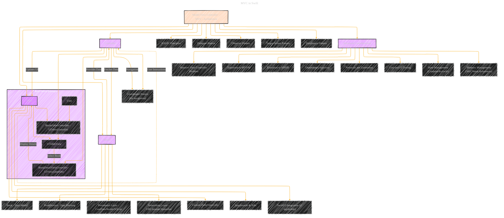

# MVC - V2
> **Disclaimer:**
>
> This document contains my personal notes on the topic,
> compiled from publicly available documentation and various cited sources.
> The materials are intended for educational purposes, personal study, and reference.
> The content is dual-licensed:
> 1. **MIT License:** Applies to all code implementations (Swift, Mermaid, and other programming languages).
> 2. **Creative Commons Attribution 4.0 International License (CC BY 4.0):** Applies to all non-code content, including text, explanations, diagrams, and illustrations.
---

## Enhanced version - WIP

This is a draft enhanced version from the initial version at [here](./MVC_V1.md).

### Enhanced Explanation of the Diagram

1.  **Core MVC Components**:
    *   **Model**: Manages the data, business logic, and **data persistence**.
        *   **Book**: Represents the data structure for a book.
        *   **BookService**: Handles data fetching from a remote server or API.
        *   **Persistence Layer**: Manages local data storage using frameworks like CoreData, Realm, or SQLite.  This handles caching and offline access.
        *   **Networking Layer**: Abstracts network communication using `URLSession` directly or a library like `Alamofire`. This layer handles requests, responses, and error handling.
    *   **View**: Manages the user interface and presentation.
        *   **BooksViewController**: The main view controller displaying the list of books.
        *   **UITableView**: Displays the list of books in a table format.
        *   **Custom TableViewCells**: Reusable components to display individual book information.
        *   **Storyboards & Xibs**: Visual tools to define UI layouts and components.
        *   **SwiftUI Integration (if applicable)**: How SwiftUI views can be integrated into a UIKit-based MVC architecture, potentially for new features or specific UI elements.
    *   **Controller**: Acts as an intermediary between the Model and View, handling user input and updating the UI.
        *   **BooksViewController**: Serves as the Controller, handling user interactions and data updates.
        *   **BookDetailViewController**: Handles the presentation of detailed information about a selected book.
        *   **Coordinator Pattern**: Manages navigation flows between different parts of the application, decoupling navigation logic from view controllers.

2.  **Interactions**:
    *   **User Interactions**: Users interact with the **View** (e.g., tapping on a table cell, scrolling).
    *   **Controller Fetches Data**: The **Controller** requests data from the **Model** through the **BookService** or directly from the **Persistence Layer**.
    *   **Model Provides Data**: The **Model** returns the requested data to the **Controller**.  This might involve data transformation or formatting.
    *   **Controller Updates UI**: The **Controller** updates the **View** with the new data.  This includes setting properties on UI elements, reloading table views, etc.
    *   **Navigation**: The **Controller** uses the **Coordinator Pattern** to handle navigation events, such as pushing a new view controller onto the navigation stack.

3.  **Real-World Example Flow**:
    *   **User** interacts with the **BooksViewController**, which displays a list of books in a **UITableView**.
    *   When a user selects a book from the **UITableView**, the **BooksViewController** (via the **Coordinator**) navigates to the **BookDetailViewController** to display detailed information about the selected book.
    *   The **BookDetailViewController** retrieves detailed information about the selected book from the **Model** (potentially using the **Persistence Layer** if the data is cached locally).

4.  **Connections to Design Principles and Patterns**:
    *   **SOLID Principles**: Ensures that the MVC architecture adheres to fundamental object-oriented design principles, promoting maintainability and scalability.
    *   **Delegate Pattern**: Facilitates communication between the **View** and **Controller**, especially for handling user interactions and data updates.
    *   **Observer Pattern**: Allows the **View** to observe changes in the **Model** and update the UI accordingly (though often replaced by Combine or RxSwift in modern Swift).
    *   **Target-Action Pattern**: A mechanism for UI controls to communicate user actions to the controller.
    *   **DataSource Pattern**: Used by `UITableView` and `UICollectionView` to fetch and configure the data displayed in the view.

5.  **Advanced Considerations**:
    *   **Massive View Controller Problem**: Addresses the issue of overly bloated Controllers in complex applications. This is a major drawback of naive MVC implementations. Strategies include:
        *   **Refactoring**: Breaking down large view controllers into smaller, more manageable components.
        *   **Custom Views**: Encapsulating UI logic into reusable custom views.
        *   **Helper Objects**: Moving non-UI logic into separate helper objects.
    *   **Transition to MVVM or VIPER**: Suggests alternative architectural patterns for better scalability, testability, and maintainability.
    *   **Dependency Injection (DI)**: Promotes decoupling by injecting dependencies into components rather than instantiating them directly. Frameworks like Swinject or Resolver can facilitate DI.
    *   **Protocols and Extensions**: Enhances flexibility and reusability by defining clear contracts and extending functionality without modifying existing classes.  Essential for creating testable and modular code.
    *   **Testing**: Includes unit and UI testing to ensure code quality and prevent regressions. XCTest is the primary framework for testing in iOS.
    *   **State Management (Combine/RxSwift)**: Managing complex application state using reactive programming frameworks like Combine or RxSwift, especially in apps with asynchronous data flows and UI updates.
    *   **Memory Management (ARC/Weak References)**: Understanding and managing memory using Automatic Reference Counting (ARC) and weak references to prevent retain cycles, particularly important when dealing with delegates and closures.

### Key Improvements and Rationale:

*   **Persistence Layer**:  Added to reflect the reality of most iOS apps needing local data storage.
*   **Networking Layer**: Explicitly mentions the need for a networking component.
*   **Custom TableViewCells, Storyboards/Xibs, SwiftUI Integration**: More details on the View layer.
*   **Coordinator Pattern**: Highlights a common approach to navigation in larger apps.
*   **Target-Action and DataSource Patterns**: Important patterns used extensively in UIKit.
*   **Testing, State Management, Memory Management**: Crucial considerations for modern iOS development.
*   **Expanded descriptions**: Each section now has more in-depth explanations of the challenges and solutions associated with MVC.
*   **Modern Frameworks**: Mentions modern frameworks like Combine, RxSwift, Swinject, and Resolver.

---
