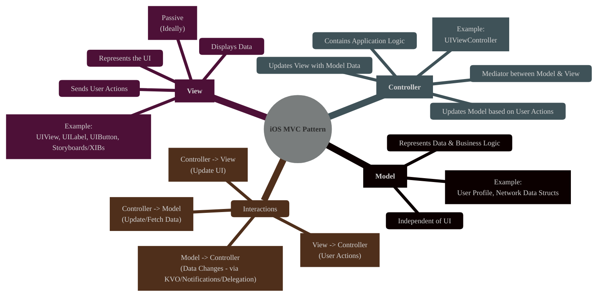
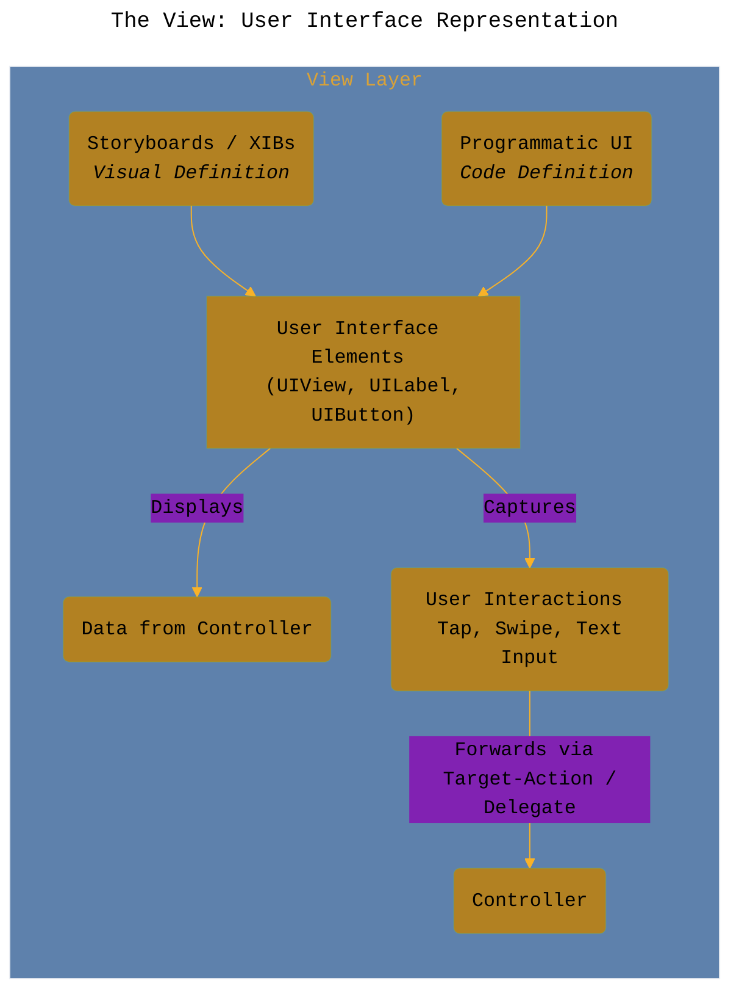
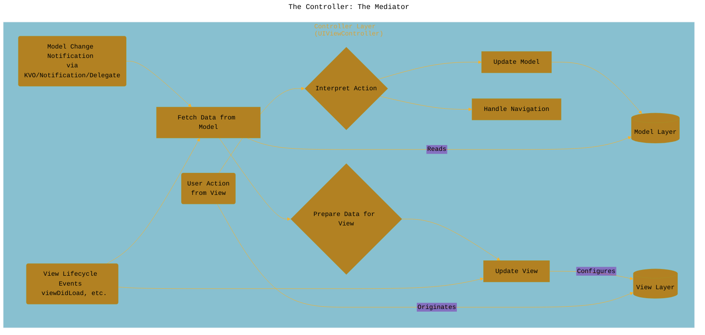
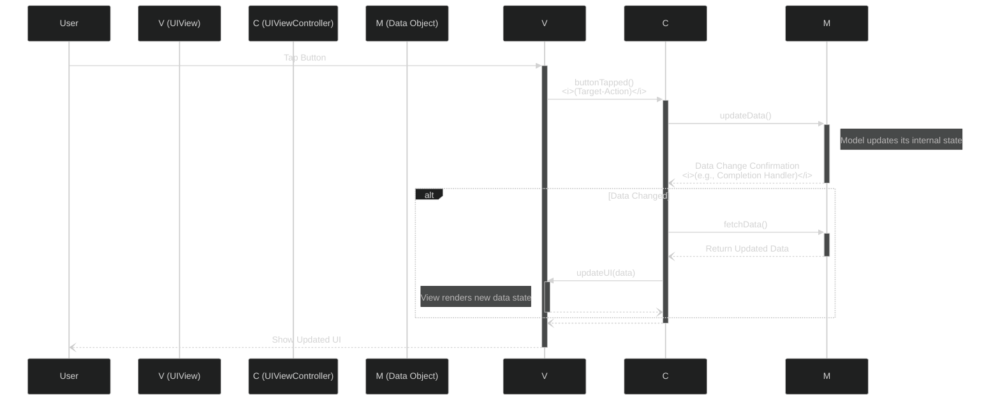
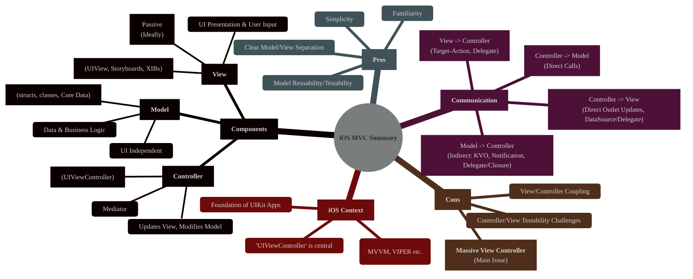

# Understanding the Model-View-Controller (MVC) Pattern in iOS Development
> **Disclaimer:**
>
> This document contains my personal notes on the topic,
> compiled from publicly available documentation and various cited sources.
> The materials are intended for educational purposes, personal study, and reference.
> The content is dual-licensed:
> 1. **MIT License:** Applies to all code implementations (Swift, Mermaid, and other programming languages).
> 2. **Creative Commons Attribution 4.0 International License (CC BY 4.0):** Applies to all non-code content, including text, explanations, diagrams, and illustrations.
---

## 1. Introduction: The Foundation of iOS App Structure

Model-View-Controller (MVC) is a fundamental architectural design pattern widely used in software development, particularly prominent in Apple's frameworks like UIKit (and historically AppKit). It promotes **separation of concerns** by dividing an application's logic into three distinct, interconnected components: Model, View, and Controller. This separation aims to make applications more organized, maintainable, and testable.

In the context of iOS development, MVC provides a structured way to manage data, user interface elements, and the logic that connects them.

---

## 2. The Model: Data and Business Logic

**Definition:** The Model layer encapsulates the application's data and the core business logic required to manipulate that data. It's the "brain" behind the data operations. Crucially, the Model should be completely independent of the View and Controller layers; it shouldn't know anything about how the data is displayed or managed by the UI.

**Responsibilities:**
*   Holding application data (e.g., user settings, fetched content, database records).
*   Defining the structure of the data (e.g., Swift `struct` or `class` definitions).
*   Implementing business logic (e.g., validation rules, data processing, calculations).
*   Interacting with persistence layers (e.g., Core Data, Realm, UserDefaults) or networking services.
*   Notifying controllers (usually indirectly) about changes to its data (e.g., using Key-Value Observing (KVO), NotificationCenter, or completion handlers/delegates).

**iOS Context:**
*   Often represented by Swift `struct`s or `class`es (sometimes inheriting from `NSObject` for KVO).
*   May involve interacting with frameworks like Core Data (`NSManagedObject`), `URLSession` (for networking), or Codable (for data serialization).

```mermaid
---
title: "The Model: Data and Business Logic"
author: "Cong Le"
version: "1.0"
license(s): "MIT, CC BY 4.0"
copyright: "Copyright (c) 2025 Cong Le. All Rights Reserved."
config:
  theme: base
---
%%%%%%%% Mermaid version v11.4.1-b.14
%%%%%%%% Available curve styles include the following keywords:
%% basis, bumpX, bumpY, cardinal, catmullRom, linear, monotoneX, monotoneY, natural, step, stepAfter, stepBefore.
%%{
  init: {
    'graph': { 'htmlLabels': false, 'curve': 'basis' },
    'fontFamily': 'Monospace',
    'themeVariables': {
      'primaryColor': '#B28122',
      'primaryTextColor': '#000',
      'primaryBorderColor': '#7C33',
      'lineColor': '#F8B229',
      'stroke':'#000',
      'stroke-width': '0.5px'
    }
  }
}%%
graph TD
    subgraph Model_Layer["Model Layer"]
    direction LR
        M1["Data Structures <br/> (structs, classes)"]
        M2["Business Logic <br/> (Validation, Processing)"]
        M3{{"Persistence <br/> (Core Data, Realm, Files)"}}
        M4{{"Networking <br/> (API Clients, URLSession)"}}
        M5("Notification Mechanism <br/> KVO / NotificationCenter / Delegates")

        M1 --> M2
        M2 -- Manages --> M1
        M2 -- Uses --> M3
        M2 -- Uses --> M4
        M2 -- Triggers --> M5
    end

    style Model_Layer fill:#434c5e,stroke:#eceff4,stroke-width:1px
    
```

---

## 3. The View: User Interface Representation

**Definition:** The View layer is responsible for presenting data to the user and capturing user input. It's what the user sees and interacts with. Ideally, the View should be as "dumb" as possible, meaning it shouldn't contain application logic. Its primary job is display and interaction forwarding.

**Responsibilities:**
*   Displaying data provided by the Controller.
*   Rendering UI elements (labels, buttons, tables, etc.).
*   Handling basic layout and appearance.
*   Forwarding user interactions (taps, swipes, text input) to the Controller for processing (often via Target-Action, Delegates, or Closures).
*   Should not directly access the Model.

**iOS Context:**
*   Represented by `UIView` subclasses (`UILabel`, `UIButton`, `UITableView`, `UICollectionView`, custom views).
*   Often designed visually using Interface Builder (Storyboards or XIB files) or programmatically.
*   Communication back to the Controller typically uses:
    *   **Target-Action:** For controls like `UIButton`.
    *   **Delegate Pattern:** For complex views like `UITableView` (`UITableViewDelegate`) or `UITextField` (`UITextFieldDelegate`).
    *   **DataSource Pattern:** For providing data to views like `UITableView` (`UITableViewDataSource`). (Note: The Controller usually acts as the delegate/data source).

---

## 4. The Controller: The Mediator

**Definition:** The Controller acts as the intermediary between the Model and the View. It orchestrates the flow of data and responds to user actions. It fetches data from the Model, processes it if necessary, and then updates the View to display it. It also receives user actions from the View, interprets them, and updates the Model accordingly.

**Responsibilities:**
*   Accessing data from the Model.
*   Updating the View with the data retrieved from the Model.
*   Receiving user actions forwarded by the View.
*   Interpreting user actions and updating the Model.
*   Handling navigation logic (e.g., presenting new view controllers).
*   Often contains the bulk of the application logic that glues the Model and View together.

**iOS Context:**
*   Typically implemented as a subclass of `UIViewController`.
*   Manages a view hierarchy (its root `view` property and subviews).
*   Often acts as the delegate and/or data source for `UITableView`, `UICollectionView`, etc.
*   Handles lifecycle events (`viewDidLoad`, `viewWillAppear`, etc.).
*   Responds to Target-Action messages from controls.

---

## 5. Interactions and Communication Flow

The power and potential pitfalls of MVC lie in how the three components communicate. Here's a typical flow for a user interaction:

1.  **User Interaction:** The user interacts with a `View` element (e.g., taps a `UIButton`).
2.  **View to Controller:** The `View` notifies the `Controller` of this action (e.g., via Target-Action). It does *not* interpret the action, just reports it.
3.  **Controller Logic:** The `Controller` receives the action notification. It interprets the action and decides what to do. This might involve:
    *   Updating the `Model` (e.g., incrementing a counter, saving data).
    *   Fetching new data *from* the `Model`.
4.  **Controller Updates Model (Optional):** If the action requires changing data, the `Controller` interacts with the `Model`'s API to make the change.
5.  **Model Notification (Indirect):** If the `Model`'s data changes (either due to the Controller or some background process), it needs to inform interested parties. It *doesn't* directly talk to the Controller. Instead, it might:
    *   Post a `Notification` via `NotificationCenter`.
    *   Trigger a KVO notification if properties are observed.
    *   Call a delegate method or completion handler provided by the Controller during the initial data request.
6.  **Controller Reacts to Model:** The `Controller` observes/listens for these notifications/callbacks from the `Model`.
7.  **Controller Updates View:** Upon receiving new data or confirmation of a change from the `Model`, the `Controller` formats the data appropriately and updates the relevant `View` elements to reflect the new state.
8.  **View Displays:** The `View` simply displays the updated information provided by the `Controller`.

TODO

---

## 6. Pros and Cons in iOS Development

**Pros:**
*   **Simplicity & Familiarity:** It's a relatively straightforward pattern, widely understood by iOS developers, and was the default encouraged by Apple's early documentation and templates.
*   **Separation of Concerns:** Clearly separates data (Model) from presentation (View), reducing complexity in individual components.
*   **Reusability (Model):** The Model layer is independent and can often be reused across different parts of the app or even different platforms.
*   **Testability (Model):** Models are easier to unit test as they have no UI dependencies.

**Cons:**
*   **Massive View Controller (MVC):** This is the most significant criticism in iOS. Controllers often become bloated, taking on too many responsibilities (network calls, data formatting, complex view logic, navigation, delegate implementations). This makes them hard to test, maintain, and understand.
*   **Tight Coupling (View & Controller):** The View and Controller are often tightly coupled. The Controller frequently needs detailed knowledge of the View's structure to update it, and the View often relies on the Controller (e.g., as a delegate).
*   **Testability (Controller & View):** Due to the tight coupling and UI dependencies (`UIKit`), Controllers and Views can be difficult to unit test effectively. UI testing is often required, which is slower and more brittle.
*   **Limited Reusability (Controller & View):** Controllers are often specific to a particular screen or flow, and Views are tied to their Controllers.

---

## 7. When to Use MVC in Modern iOS

While newer patterns like MVVM, MVP, VIPER, or Composable Architecture address some of MVC's shortcomings (especially the Massive View Controller problem), MVC remains a viable option, particularly for:

*   **Simple Screens:** For screens with minimal logic and straightforward data display/interaction, MVC can be sufficient and quick to implement.
*   **Prototyping:** Its simplicity makes it suitable for rapidly building prototypes.
*   **Learning:** It's often the first architectural pattern iOS developers learn due to its historical significance and relative simplicity.
*   **Small Projects:** In smaller applications where the overhead of more complex patterns might not be justified.

However, for complex screens or large applications, developers often adopt variations or alternative patterns to mitigate the "Massive View Controller" issue and improve testability.

---

## 8. Summary: MVC in iOS at a Glance

MVC provides a foundational structure for organizing iOS applications by separating responsibilities into Model, View, and Controller. While simple and familiar, its tendency towards "Massive View Controllers" in complex scenarios has led many developers to explore refinements or alternative architectures like MVVM or VIPER for better testability and maintainability in larger projects. Understanding MVC is crucial, however, as it forms the basis from which many other iOS patterns evolved.

---
**Licenses:**

- **MIT License:**   - Full text in [LICENSE](LICENSE) file.
- **Creative Commons Attribution 4.0 International:**  - Legal details in [LICENSE-CC-BY](LICENSE-CC-BY) and at [Creative Commons official site](http://creativecommons.org/licenses/by/4.0/).

---