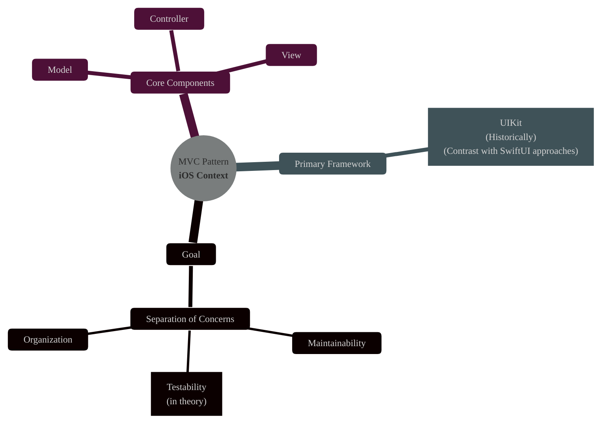
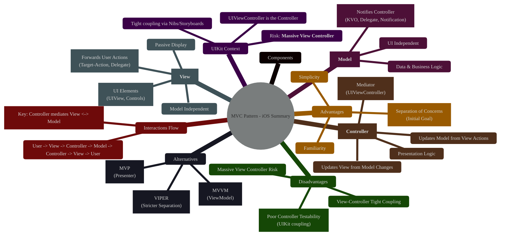

# Understanding the Model-View-Controller (MVC) Pattern in iOS Development
> **Disclaimer:**
>
> This document contains my personal notes on the topic,
> compiled from publicly available documentation and various cited sources.
> The materials are intended for educational purposes, personal study, and reference.
> The content is dual-licensed:
> 1. **MIT License:** Applies to all code implementations (Swift, Mermaid, and other programming languages).
> 2. **Creative Commons Attribution 4.0 International License (CC BY 4.0):** Applies to all non-code content, including text, explanations, diagrams, and illustrations.
---

## 1. Introduction: What is MVC?

The Model-View-Controller (MVC) pattern is a foundational architectural pattern used extensively in software development, particularly in building user interfaces. Its primary goal is to **separate concerns** within an application, dividing the codebase into three distinct, interconnected components: Model, View, and Controller. This separation aims to make the application more organized, maintainable, testable, and easier to develop by distinct teams or individuals focusing on specific layers.

In the context of iOS development, particularly with UIKit, MVC has historically been the default pattern encouraged by Apple's frameworks.

---

## 2. Core Components Explained

MVC divides the application's objects into three interconnected roles. Understanding each role is key to implementing the pattern correctly.

```mermaid
---
title: "Core Components"
author: NA
version: NA
license(s): NA
copyright: NA
config:
  theme: base
---
%%%%%%%% Mermaid version v11.4.1-b.14
%%%%%%%% Available curve styles include the following keywords:
%% basis, bumpX, bumpY, cardinal, catmullRom, linear, monotoneX, monotoneY, natural, step, stepAfter, stepBefore.
%%{
  init: {
    'graph': { 'htmlLabels': false, 'curve': 'basis' },
    'fontFamily': 'Monospace',
    'themeVariables': {
      'primaryColor': '#B28122',
      'primaryTextColor': '#000',
      'primaryBorderColor': '#7C33',
      'lineColor': '#F8B229',
      'stroke':'#000',
      'stroke-width': '0.5px'
    }
  }
}%%
graph TD
    subgraph MVC_Core_Components["MVC Core Components"]
        M["<b>Model</b><br><i>Data & Logic</i><br>e.g., User struct,<br>NetworkClient,<br>DataManager"]
        V["<b>View</b><br><i>UI Representation</i><br>e.g., UIView, UILabel,<br>UIButton, UITableViewCell"]
        C["<b>Controller</b><br><i>Mediator/Coordinator</i><br>e.g., UIViewController"]
    end

    style M fill:#264653,stroke:#fff,stroke-width:1px
    style V fill:#e76f51,stroke:#fff,stroke-width:1px
    style C fill:#f4a261,stroke:#000,stroke-width:1px

```

### a. Model

*   **Responsibility:** Represents the application's data and the business logic that manipulates it. It's the 'what' of the application – what data it deals with and what rules govern that data.
*   **Characteristics:**
    *   Platform-agnostic: Should ideally have no knowledge of the UI (UIKit/SwiftUI).
    *   Manages data state (fetching, saving, updating).
    *   Contains business rules and data validation logic.
    *   Notifies the Controller about changes to its data (e.g., using NotificationCenter, Key-Value Observing (KVO), delegation, or closures).
*   **iOS Examples:** `struct User`, `class Product`, `CoreData` managed objects, network service classes, data managers.

### b. View

*   **Responsibility:** Represents the visual presentation of the data (the UI). It's the 'how' the user sees and interacts with the application.
*   **Characteristics:**
    *   Passive: Displays data provided by the Controller. Should *not* contain business logic.
    *   Sends user actions (taps, swipes, text input) to the Controller for handling (e.g., using Target-Action, Delegation, or closures).
    *   Should be reusable and configurable by the Controller.
    *   Ideally, has no direct knowledge of the Model.
*   **iOS Examples:** `UIView` and its subclasses (`UILabel`, `UIButton`, `UITableView`, `UIImageView`), custom `UIView` subclasses, `CALayer`.

### c. Controller

*   **Responsibility:** Acts as the intermediary or 'glue' between the Model and the View. It coordinates the interactions between them.
*   **Characteristics:**
    *   Accesses the Model to fetch or update data based on user actions received from the View.
    *   Updates the View to reflect changes in the Model's data.
    *   Contains the application's presentation logic (how data is formatted or prepared for display).
    *   Responds to user inputs forwarded by the View.
    *   Often handles navigation flow (though this can be extracted).
*   **iOS Examples:** `UIViewController` and its subclasses are the most common implementation of the Controller role in UIKit.

---

## 3. Relationships and Interactions

The power (and constraints) of MVC lie in how the components interact. The communication flow is crucial.

```mermaid
---
title: "Relationships and Interactions"
author: NA
version: NA
license(s): NA
copyright: NA
config:
  theme: base
---
%%%%%%%% Mermaid version v11.4.1-b.14
%%%%%%%% Available curve styles include the following keywords:
%% basis, bumpX, bumpY, cardinal, catmullRom, linear, monotoneX, monotoneY, natural, step, stepAfter, stepBefore.
%%{
  init: {
    'flowchart': { 'htmlLabels': false, 'curve': 'basis' },
    'fontFamily': 'Monospace',
    'themeVariables': {
      'primaryColor': '#B28122',
      'primaryTextColor': '#000',
      'primaryBorderColor': '#7C33',
      'lineColor': '#F8B229',
      'stroke':'#000',
      'stroke-width': '0.5px'
    }
  }
}%%
flowchart TD
    subgraph MVC_Interaction_Flow["MVC Interaction Flow"]
    direction LR
        UserAction(["User Action<br>e.g., Button Tap"]) -- "Step 1:<br/> Event" --> V("<b>View</b><br>UIButton")
        V -- "Step 2:<br/>Notify Controller<br>(Target-Action / Delegate)" --> C("<b>Controller</b><br>UIViewController")
        C -- "Step 3:<br/>Update Model<br>(Call Method)" --> M("<b>Model</b><br>DataManager / User Struct")
        M -- "Step 4:<br/> Notify Controller<br>(e.g., KVO/Notification/Delegate)" --> C
        C -- "Step 5:<br/>Read Updated Data<br>(Access Properties)" --> M
        C -- "Step 6:<br/>Update View<br>(Configure UIView Properties)" --> V
        V -- "Step 7:<br/>Display Update" --> UserDisplay(["User<br>Sees Change"])
    end

    style M fill:#264653,stroke:#fff,stroke-width:1px
    style V fill:#e76f51,stroke:#fff,stroke-width:1px
    style C fill:#f4a261,stroke:#000,stroke-width:1px
    
```

*   **View -> Controller:** The View notifies the Controller about user events. It doesn't know *what* will happen, just that an event occurred. Common mechanisms in UIKit:
    *   **Target-Action:** `UIControl` subclasses (like `UIButton`) send actions to a target (usually the Controller).
    *   **Delegate Pattern:** The View defines a delegate protocol, and the Controller adopts it to respond to more complex events (e.g., `UITableViewDelegate`, `UITextFieldDelegate`).
    *   **Data Source Pattern:** Similar to delegation, but specifically for providing data (e.g., `UITableViewDataSource`). The Controller often serves as the data source.
*   **Controller -> View:** The Controller updates the View's appearance or content. It holds references (often `IBOutlets`) to the Views it manages and calls their methods or sets their properties.
*   **Controller -> Model:** The Controller interacts with the Model to fetch data for display or to update the Model based on user input. This is usually done via direct method calls.
*   **Model -> Controller:** When the Model's data changes (potentially due to background processes or business logic), it needs to inform the Controller so the View can be updated. Common mechanisms:
    *   **Notifications (NotificationCenter):** Model posts a notification; Controller observes it. Decoupled but can be hard to track.
    *   **Key-Value Observing (KVO):** Controller observes specific properties on the Model. Powerful but syntax can be cumbersome (less common in pure Swift).
    *   **Delegation:** Model defines a protocol; Controller implements it. Clearer contract.
    *   **Closures/Callbacks:** Model takes closures from Controller to execute upon change. Common in asynchronous operations.

*   **Key Constraint:** The View and Model should **not** communicate directly. The Controller mediates all interactions between them.

---

## 4. MVC in UIKit: The Apple Way

Apple's UIKit framework was designed with MVC in mind, leading to some specific conventions and challenges.

```mermaid
---
title: "MVC in UIKit: The Apple Way"
author: NA
version: NA
license(s): NA
copyright: NA
config:
  theme: base
---
%%%%%%%% Mermaid version v11.4.1-b.14
%%%%%%%% Available curve styles include the following keywords:
%% basis, bumpX, bumpY, cardinal, catmullRom, linear, monotoneX, monotoneY, natural, step, stepAfter, stepBefore.
%%{
  init: {
    'graph': { 'htmlLabels': false, 'curve': 'basis' },
    'fontFamily': 'Monospace',
    'themeVariables': {
      'primaryColor': '#B28122',
      'primaryTextColor': '#000',
      'primaryBorderColor': '#7C33',
      'lineColor': '#F8B229',
      'stroke':'#000',
      'stroke-width': '0.5px'
    }
  }
}%%
graph TD
    subgraph UIKit_MVC_Implementation["UIKit MVC Implementation"]
        VC["<b>UIViewController</b><br>(Controller)"]
        UV["<b>UIView / IBOutlets</b><br>(View)"]
        DM["<b>Data Model</b><br>(Model)<br>struct/class/CoreData"]

        VC -- Manages Lifecycle --> UV
        VC -- Updates via Outlets --> UV
        VC -- Responds to Actions --> UV
        UV -- "Sends Actions<br/>(Target-Action)" --> VC
        UV -- "Reports Events<br/>(Delegate)" --> VC
        VC -- "Sets Delegate/DataSource" --> UV

        VC -- "Reads/Writes Data" --> DM
        DM -- "Notifies<br/>(KVO/Notification/Delegate)" --> VC
    end

    style VC fill:#f4a261,stroke:#000,stroke-width:1px
    style UV fill:#e76f51,stroke:#fff,stroke-width:1px
    style DM fill:#264653,stroke:#fff,stroke-width:1px

    subgraph Massive_View_Controller["Common Issue:<br/>Massive View Controller"]
    direction TB
        MVC_Problem("Massive<br>UIViewController") --> Resp1["View Lifecycle Management"]
        MVC_Problem --> Resp2["IBActions / IBOutlets"]
        MVC_Problem --> Resp3["Delegate Implementations<br>(UITableViewDelegate, etc.)"]
        MVC_Problem --> Resp4["DataSource Implementations<br>(UITableViewDataSource, etc.)"]
        MVC_Problem --> Resp5["Network Call Initiation"]
        MVC_Problem --> Resp6["Data Transformation Logic"]
        MVC_Problem --> Resp7["Navigation Logic"]
        MVC_Problem --> Outcome(("Leads to:<br>- Poor Testability<br>- Low Cohesion<br>- High Coupling<br>- Difficult Maintenance"))
    end
    style MVC_Problem fill:#e76f51,stroke:#000,stroke-width:1px
    style Outcome fill:#2a9d8f, stroke:#fff, stroke-width:1px

```

*   **UIViewController as Controller:** In UIKit, `UIViewController` is the natural place for Controller logic. It manages a view hierarchy (`self.view`), handles view lifecycle events (`viewDidLoad`, `viewWillAppear`, etc.), and receives user actions via `IBActions`.
*   **Interface Builder (IB):** Nibs/Storyboards define Views and allow connecting `IBOutlets` (references to Views) and `IBActions` (methods to call on user interaction) directly to the `UIViewController`. This tightens the coupling between the View and Controller.
*   **The "Massive View Controller" Problem:** Because `UIViewController` is involved in so many aspects (view lifecycle, user interaction handling, data formatting, navigation, delegate conformance), it often grows very large and takes on responsibilities that ideally belong elsewhere. This violates the Single Responsibility Principle and makes the Controller hard to test, reuse, and maintain. Techniques to mitigate this include:
    *   Creating separate Data Source/Delegate objects.
    *   Moving business logic to the Model layer.
    *   Extracting navigation logic (e.g., using Coordinators, though this moves beyond pure MVC).
    *   Using child View Controllers.
    *   Creating helper classes/structs for specific tasks like data formatting.

---

## 5. Advantages of MVC

*   **Simplicity:** Relatively easy to understand and implement, especially for smaller projects.
*   **Familiarity:** Widely known pattern, especially within the Apple developer community due to UIKit's design.
*   **Separation of Concerns:** Clearly divides responsibilities between data, presentation, and coordination logic (at least in theory).
*   **Reusability (Views):** Views are generally passive and can be reused if designed correctly, driven by different Controllers/data.

---

## 6. Disadvantages and Challenges of MVC (especially in UIKit)

*   **Massive View Controller:** As discussed, Controllers often become bloated accumulation points for various responsibilities.
*   **Poor Testability:** Controller logic is often tightly coupled to UIKit (View lifecycle, `IBOutlets`), making unit testing difficult without complex mocking or UI testing. The Model layer *can* be tested easily if kept UI-independent.
*   **Tight View-Controller Coupling:** In UIKit's implementation (especially with Storyboards/Nibs), the View and Controller are often closely linked, reducing the flexibility and reusability intended by the pattern.
*   **Model Notification Complexity:** Managing notifications from the Model to the Controller can become complex (e.g., managing observers, handling multiple notification types).

----

## 7. MVC vs. Other Patterns (Briefly)

While MVC is foundational, other patterns address its limitations, particularly the Massive View Controller and testability issues:

*   **MVVM (Model-View-ViewModel):** Introduces a `ViewModel` that prepares data from the Model for the View. The View binds to the ViewModel. This improves testability of presentation logic (ViewModel is UI-independent) and further decouples the View and Controller (which becomes simpler, often just handling lifecycle and navigation). Popular with SwiftUI and Combine/RxSwift.
*   **MVP (Model-View-Presenter):** Similar to MVC, but the `Presenter` has a more direct, two-way communication contract with the View (often via a protocol). The Presenter typically holds no direct reference to UIKit Views, making it more testable than a typical MVC Controller.
*   **VIPER (View-Interactor-Presenter-Entity-Router):** A more complex pattern enforcing stricter separation of concerns, often used in large applications demanding high testability and modularity.

---

## 8. Summary

MVC remains a relevant pattern in iOS, especially when working with UIKit or on simpler projects. Its strength lies in its conceptual separation of data (Model), UI (View), and coordination (Controller). However, developers must be vigilant against the common pitfall of the Massive View Controller and be aware of its limitations regarding testability, especially when compared to more modern patterns like MVVM.

---
